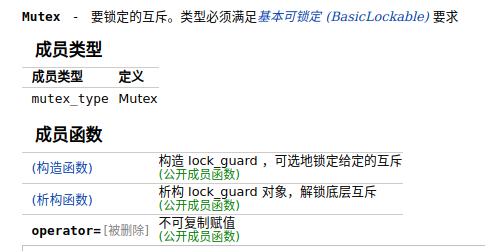
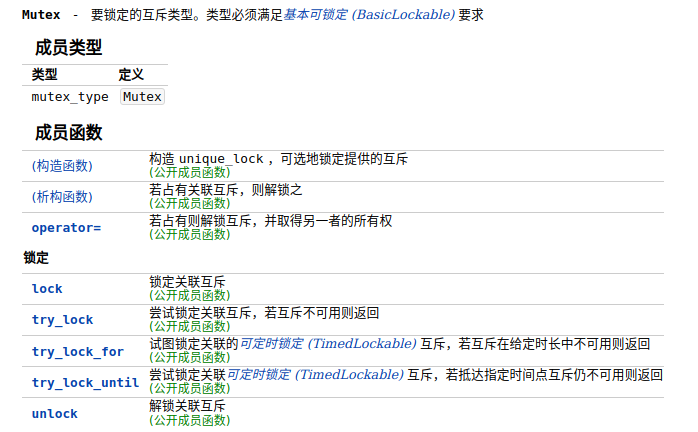

[TOC]

# Multithreading

C++11 之前，在 C/C++ 中程序中使用线程，主要使用 POSIX 线程（pthread），POSIX 线程是 POSIX 标准中关于线程的部分，程序员可以通过 pthread 线程的 api 完成线程的创建、数据的共享、同步等功能。

C++11 引入了多线程的支持，使得 C/C++ 语言在进行线程编程时，不必依赖第三方库和标准。

## C++98 和 C++11 对比

- C++98 实现的多线程

```cpp
#include <pthread.h>
#include <iostream>

using namespace std;
static long long total = 0;
pthread_mutex_t m = PTHREAD_MUTEX_INITIALIZER;

void* func(void*) {
  long long i;
  for (i = 0; i < 100000000L; ++i) {
    pthread_mutex_lock(&m);
    total += i;
    pthread_mutex_unlock(&m);
  }
  return NULL;
}

int main() {
  pthread_t thread1, thread2;
  if (pthread_create(&thread1, NULL, &func, NULL)) {
    throw;
  }
  if (pthread_create(&thread2, NULL, &func, NULL)) {
    throw;
  }

  pthread_join(thread1, NULL);
  pthread_join(thread2, NULL);

  cout << total << endl;
  return 0;
}
```

- C++11 实现的多线程

```cpp
#include <atomic>
#include <iostream>
#include <thread>

using namespace std;

atomic_llong total{0};

void func(int) {
  for (long long i = 0; i < 100000000LL; ++i) {
    total += i;
  }
}

int main() {
  thread t1(func, 0);
  thread t2(func, 0);
  t1.join();
  t2.join();
  cout << total << endl;
  return 0;
}
```

C++11 的 `std::thread` 是基于 `pthread` 实现的。编译 `g++ main.cpp -lpthread`，需要链接 pthread 库。

## 创建线程

```cpp
#include <iostream>
#include <thread>

void threadfunc() { std::cout << "thread func" << std::endl; }

int main() {
  std::thread t1(threadfunc);
  t1.join();  // 等待 threadfunc 运行结束

  return 0;
}

```

首先定义线程对象 `t1`，线程函数 `threadfunc` 运行在线程对象 `t1` 中，当线程（这里是主线程）创建成功并执行线程函数后，一定要保证线程函数运行结束才能退出，这里调用了 `join()` 函数阻塞线程，直到 `threadfunc()` 运行结束，回收对应创建线程的资源。如果不阻塞线程，就不能保证线程对象 `t1` 在 `threadfunc()` 运行期间有效，程序就会崩溃。

## 同步和互斥

互斥量（锁）的使用，这是一种线程同步机制，在 C++11 中提供了 4 中互斥量。

```cpp
std::mutex;                                       //非递归的互斥量
std::timed_mutex;                        //带超时的非递归互斥量
std::recursive_mutex;                 // 递归互斥量
std::recursive_timed_mutex;  // 带超时的递归互斥量
```

最常用的就是 `std::mutex`。

### std::mutex

```c++
#include <chrono>
#include <iostream>
#include <mutex>
#include <thread>

std::mutex g_mutex;

void func() {
  g_mutex.lock();

  std::cout << "entry func test thread ID is : " << std::this_thread::get_id()
            << std::endl;

  std::this_thread::sleep_for(std::chrono::microseconds(1000));

  std::cout << "leave func test thread ID is : " << std::this_thread::get_id()
            << std::endl;

  g_mutex.unlock();
}

int main() {
  std::thread t1(func);
  std::thread t2(func);
  std::thread t3(func);
  std::thread t4(func);
  std::thread t5(func);
  t1.join();
  t2.join();
  t3.join();
  t4.join();
  t5.join();
  return 0;
}

```

如果不加锁，多个线程会同时竞争同一个标准输出，导致结果混乱。只要线程进入 `func()` 函数就进行加锁处理，当线程执行完毕后进行解锁，保证每个线程都能按顺序执行。

### std::lock_guard

虽然通过 std::mutex 的 `lock()` 与 `unlock()` 可以解决线程之间的资源竞争问题，但是这里也存在不足。

```cpp
func() {
  // 加锁
  执行逻辑处理;  // 如果该过程抛出异常导致程序退出了，就没法 unlock
  // 解锁
}

int main() { ...... }
```

`func()` 中在执行逻辑处理中程序因为某些原因退出了，此时就无法 `unlock()` 了，这样其他线程也就无法获取 `std::mutex`，造成死锁现象。我们可以采用 `lock_guard` 来控制 `std::mutex`。

```cpp
template <class _Mutex>
class lock_guard {
 public:
  using mutex_type = _Mutex;
  explicit lock_guard(_Mutex& _Mtx) : _MyMutex(_Mtx) {
    _MyMutex.lock();  // 构造函数加锁
  }
  lock_guard(_Mutex& _Mtx, adopt_lock_t) : _MyMutex(_Mtx) {}
  ~lock_guard() noexcept {
    _MyMutex.unlock();  // 析构函数解锁
  }
  lock_guard(const lock_guard&) = delete;
  lock_guard& operator=(const lock_guard&) = delete;

 private:
  _Mutex& _MyMutex;
};

```

`lock_guard` 是类模板，在其构造函数中自动给 `std::mutex` 加锁，在退出作用域的时候自动解锁，这样就可以保证 `std::mutex `的正确操作，这也是 RAII（获取资源便初始化）技术的体现。

我们把之前手动加锁解锁的代码用 `lock_guard` 来重新实现：

```cpp
std::mutex g_mutex;

void func() {
  std::lock_guard<std::mutex> lock(g_mutex);  //加锁
  std::cout << "entry func test thread ID is : " << std::this_thread::get_id()
            << std::endl;

  std::this_thread::sleep_for(std::chrono::microseconds(1000));

  std::cout << "leave func test thread ID is : " << std::this_thread::get_id()
            << std::endl;

  // 退出作用域后，lock_guard 对象析构就自动解锁
}

```

### std::condition_variable

条件变量是 C++11 提供的另外一种线程同步机制，通过判断条件是否满足（Predicate 为 true，稍后会详细说明），决定是否阻塞线程，当线程执行条件满足的时候就会唤醒阻塞的线程。

比如：线程 A 等待某个条件并挂起，直到线程 B 设置了这个条件，并通知条件变量，然后线程 A 被唤醒。经典的「生产者-消费者」问题就可以用条件变量来解决。条件变量常与 `std::mutex` 配合使用，C++11 提供了两种条件变量。

- `std::condition_variable`，配合 `std::unique_lock<std::mutex>` 使用，通过 `wait()` 函数阻塞线程；
- `std::condition_variable_any`，可以和任意带有 `lock()`、`unlock()` 语义的 `std::mutex` 搭配使用，比较灵活，但是其效率不及 `std::condition_variable`；

#### std::unique_lock

unique_lock 和 lock_guard 都是管理锁的辅助类工具，都是 RAII 风格；它们是在定义时获得锁，在析构时释放锁。它们的主要区别在于 unique_lock 锁机制更加灵活，**可以在需要的时候进行 lock 或者 unlock 调用，不非得是析构或者构造时。**

- lock_guard



- unique_lock



#### wait/wait_for

线程的阻塞是通过成员函数 `wait/wait_for/wait_until` 函数实现的。

- wait 导致当前线程阻塞直至条件变量被**通知**，或**虚假唤醒发生**。设置了 Predicate 时，只有当 p 条件为 **false** 时调用 `wait()` 才会阻塞当前线程，并且在收到其他线程的通知后只有当 p 为 **true** 时才会被解除阻塞。

  这里理解起来可能有点绕，举个例子，实现如果 `queue` 为空，那么我们要阻塞的代码为：`cdt_.wait(lock, [=] { return !queue.empty() });`。代码说明：如果一个队列为空，那么 `queue.empty()` 为 true，如果我们要阻塞，那么旧要设置条件为 false，所以这里的条件为 `!queue.empty()`。

```cpp
void wait(unique_lock<mutex>& __lock) noexcept;

// Predicate 可以普通函数或者 lambda 表达式
template <typename _Predicate>
void wait(unique_lock<mutex>& __lock, _Predicate __p) {
  while (!__p()) wait(__lock);
}
```

- `wait_for` 导致当前线程阻塞直至条件变量被**通知**，或**虚假唤醒发生**，或者**超时返回**。wait_for 和 wait 相比，其实就多了个超时返回，并且 `wait_for` 是有 `bool` 返回值的。

```c++
template< class Rep, class Period, class Predicate >
bool wait_for( std::unique_lock<std::mutex>& lock,
               const std::chrono::duration<Rep, Period>& rel_time,
               Predicate pred);
```

参数 `rel_time` 表示等待所耗的最大时间的 `std::chrono::duration` 类型对象。

返回值，若经过 `rel_time` 时限后谓词 pred 仍求值为 false 则为 false ，否则为 true。说白了就是条件满足就返回 true，否则返回 false。

以上两个类型的 **wait 函数都在会阻塞时，自动释放锁权限**，即调用 unique_lock 的成员函数 `unlock()`，以便其他线程能有机会获得锁。这就是条件变量只能和 unique_lock 一起使用的原因，否则当前线程一直占有锁，线程被阻塞。

#### notify

- notify_one：随机唤醒一个等待的线程
- notify_all：唤醒所有等待的线程

#### condition_variable 实现一个简单的 BlockingQueue

[C++ Equivalent to Java's BlockingQueue](https://stackoverflow.com/questions/12805041/c-equivalent-to-javas-blockingqueue)

```c++
#include <condition_variable>
#include <mutex>
#include <queue>

template <typename T>
class MyQueue {
 public:
  void Push(T const &value) {
    std::unique_lock<std::mutex> lock(mtx_);
    queue_.push(value);
    cdt_.notify_one(); // 唤醒 wait 等待线程
  }

  T Pop() {
    std::unique_lock<std::mutex> lock(mtx_);
    // 条件变量 wait，如果满足条件 !queue_.empty() 程序就往下执行，否则阻塞
    cdt_.wait(lock, [=] { return !queue_.empty(); });
    T ret = queue_.front();
    queue_.pop();
    return ret;
  }

  bool TryPop(T &ret, int64_t wait_millis) {
    std::unique_lock<std::mutex> lock(mtx_);
    // wait_for 表示等待所耗的最大时间 wait_millis，如果还没满足条件，就返回 false
    // 如果条件满足，返回 true
    if (!cdt_.wait_for(lock, std::chrono::milliseconds(wait_millis), [=] { return !queue_.empty(); })) {
      return false;
    }
    ret = queue_.front();
    queue_.pop();
    return true;
  }

 private:
  std::mutex mtx_;
  std::condition_variable cdt_;
  std::queue<T> queue_;
};

```

#### condition_variable 解决生产者-消费者问题

在这里，我们使用条件变量，解决生产者-消费者问题，该问题主要描述如下：

生产者的主要作用是生成一定量的数据放到缓冲区中，然后重复此过程。与此同时，消费者也在缓冲区消耗这些数据。该问题的关键就是要保证生产者不会在缓冲区满时加入数据，消费者也不会在缓冲区中空时消耗数据。并且同一时间只能有一个线程（生产者 or 消费者）操作缓冲区。

要解决该问题，就必须让生产者在缓冲区满时休眠（要么干脆就放弃数据），等到下次消费者消耗缓冲区中的数据的时候，生产者才能被唤醒，开始往缓冲区添加数据。同样，也可以让消费者在缓冲区空时进入休眠，等到生产者往缓冲区添加数据之后，再唤醒消费者。

生产者-消费者代码如下（**下面的这一版代码有问题**）：

```cpp
#include <chrono>
#include <condition_variable>
#include <iostream>
#include <mutex>
#include <queue>
#include <thread>

// 缓冲区锁，保证同一时间只有一个线程操作缓冲区
std::mutex g_cvMutex;
std::condition_variable g_cv;

// 缓存区
std::deque<int> g_data_deque;
// 缓存区最大数目
const int MAX_NUM = 30;
// 数据
int g_next_index = 0;

// 生产者，消费者线程个数
const int PRODUCER_THREAD_NUM = 3;
const int CONSUMER_THREAD_NUM = 3;

void producer_thread(int thread_id) {
  while (true) {
    std::this_thread::sleep_for(std::chrono::milliseconds(500));
    // 加锁
    std::unique_lock<std::mutex> lk(g_cvMutex);
    // 当队列未满时，继续添加数据
    g_cv.wait(lk, []() { return g_data_deque.size() <= MAX_NUM; });
    // 上面的 wait 代码也可以写为
    // while (g_data_deque.size() > MAX_NUM) {
    //   g_cv.wait(lk);
    // }
    g_next_index++;
    g_data_deque.push_back(g_next_index);
    std::cout << "producer_thread: " << thread_id
              << " producer data: " << g_next_index;
    std::cout << " queue size: " << g_data_deque.size() << std::endl;
    // 唤醒其他线程
    g_cv.notify_all();
    // 自动释放锁
  }
}

void consumer_thread(int thread_id) {
  while (true) {
    std::this_thread::sleep_for(std::chrono::milliseconds(550));
    // 操作缓存区前加锁
    std::unique_lock<std::mutex> lk(g_cvMutex);
    // 判断缓冲区是否为空（是否有数据）
    g_cv.wait(lk, [] { return !g_data_deque.empty(); });
    // 上面的代码也可以写为
    // 即使被唤醒还要循环判断一次，防止虚假唤醒
    // while (g_data_deque.empty()) {
    //   g_cv.wait(lk);
    // }
    // 互斥操作，消息数据
    int data = g_data_deque.front();
    g_data_deque.pop_front();
    std::cout << "\tconsumer_thread: " << thread_id << " consumer data: ";
    std::cout << data << " deque size: " << g_data_deque.size() << std::endl;
    // 唤醒其他线程
    g_cv.notify_all();
    // 自动释放锁
  }
}

int main() {
  std::thread arrRroducerThread[PRODUCER_THREAD_NUM];
  std::thread arrConsumerThread[CONSUMER_THREAD_NUM];

  for (int i = 0; i < PRODUCER_THREAD_NUM; i++) {
    arrRroducerThread[i] = std::thread(producer_thread, i);
  }

  for (int i = 0; i < CONSUMER_THREAD_NUM; i++) {
    arrConsumerThread[i] = std::thread(consumer_thread, i);
  }

  for (int i = 0; i < PRODUCER_THREAD_NUM; i++) {
    arrRroducerThread[i].join();
  }

  for (int i = 0; i < CONSUMER_THREAD_NUM; i++) {
    arrConsumerThread[i].join();
  }

  return 0;
}
```

**上面的代码有问题**。生产者消费者使用同一个条件变量 `std::condition_variable g_cv;`，这个问题可能会导致一个线程在唤醒其他等待线程的时候，唤醒了不符合自己所需条件的线程，从而导致线程饥饿或者死锁等问题。比如，我有多个生产者和消费者，执行 `g_cv.notify_all()` 可能每次被唤醒的都是生产者，导致消费者一直拿不到锁。

这个问题可以通过使用不同的条件变量来分别等待队列非空和队列未满来解决。

```c++
#include <chrono>
#include <condition_variable>
#include <functional>
#include <iostream>
#include <mutex>
#include <queue>
#include <thread>

template <typename T>
class Queue {
 public:
  explicit Queue(int capacity) : capacity(capacity) {}

  // 生产消息
  void Push(const T& value) {
    std::unique_lock<std::mutex> lock(mtx_);
    // 如果缓冲区已满，则阻塞
    cdt_produce_.wait(lock, [=] { return queue_.size() < capacity; });
    queue_.push(value);
    cdt_consume_.notify_one();  // 通知消费者消费
  }

  // 消费消息
  T Pop() {
    std::unique_lock<std::mutex> lock(mtx_);
    cdt_consume_.wait(lock, [=] { return !queue_.empty(); });
    T ret = queue_.front();
    queue_.pop();
    cdt_produce_.notify_one();  // 通知生产者生产消息
    return ret;
  }

  int Size() {
    std::lock_guard<std::mutex> lock(mtx_);
    return queue_.size();
  }

 private:
  std::mutex mtx_;
  std::condition_variable cdt_consume_;
  std::condition_variable cdt_produce_;
  std::queue<T> queue_;  // 数据缓冲区
  const int capacity;
};

// 生产者，消费者线程个数
const int kProducerNum = 5;
const int kConsumerNum = 2;
std::mutex g_stdout_mtx;  // 标准输出锁

void Producer(Queue<int>& buffer, int thread_id) {
  int cnt = 0;
  while (1) {
    buffer.Push(cnt);
    cnt++;
    // std::this_thread::sleep_for(std::chrono::seconds(1));
  }
}

void Consumer(Queue<int>& buffer, int thread_id) {
  while (1) {
    auto ret = buffer.Pop();
    g_stdout_mtx.lock();
    std::cout << "consumer thread: " << thread_id << ", read data: " << ret
              << ", buffer size: " << buffer.Size() << std::endl;
    g_stdout_mtx.unlock();
    std::this_thread::sleep_for(std::chrono::seconds(1));
  }
}

int main() {
  Queue<int> buffer(10);  // 缓冲区

  std::thread producer_threads[kProducerNum];
  std::thread consumer_threads[kConsumerNum];

  for (int i = 0; i < kProducerNum; i++) {
    producer_threads[i] = std::thread(Producer, std::ref(buffer), i);
  }

  for (int i = 0; i < kConsumerNum; i++) {
    consumer_threads[i] = std::thread(Consumer, std::ref(buffer), i);
  }

  for (int i = 0; i < kProducerNum; i++) {
    producer_threads[i].join();
  }

  for (int i = 0; i < kConsumerNum; i++) {
    consumer_threads[i].join();
  }

  return 0;
}

```

## 参考文章

- [C++11 新特性总结（相比 C++98）](https://zhuanlan.zhihu.com/p/103258069)

- [C++11 条件变量使用详解](http://t.csdn.cn/U3M7S)
- [C++11 多线程](https://zhuanlan.zhihu.com/p/157171731)