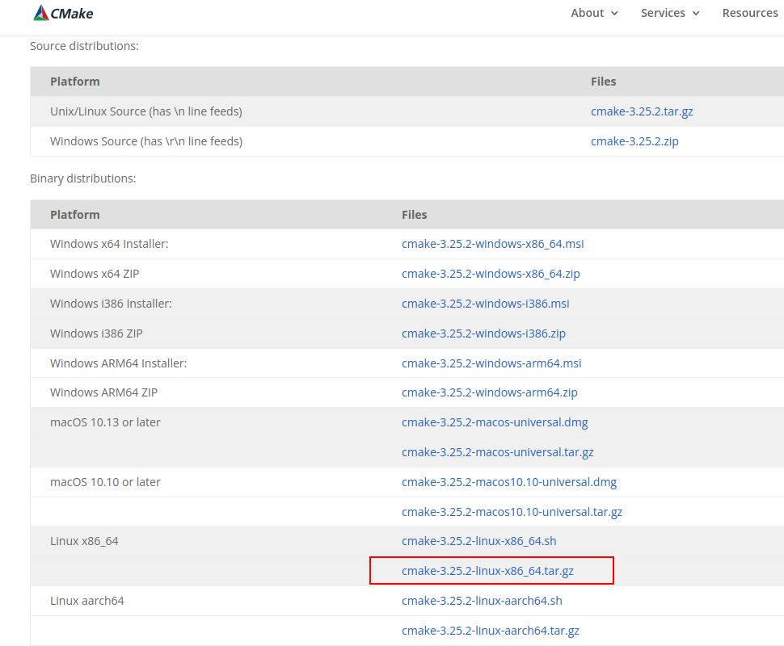

[TOC]

# CMake

// TODO

生成动态库和静态库

```cmake
# 默认生成静态库
ADD_LIBRARY(hello ${LIBHELLO_SRC})
# 上面的代码可以写为
ADD_LIBRARY(hello STATIC ${LIBHELLO_SRC})
# SHARED 表示生成动态库
ADD_LIBRARY(hello SHARED ${LIBHELLO_SRC})
```

## CMake 升级

下载地址：https://cmake.org/download/



下载最新版本的 [cmake-3.25.2-linux-x86_64.tar.gz](https://github.com/Kitware/CMake/releases/download/v3.25.2/cmake-3.25.2-linux-x86_64.tar.gz)

```bash
# 解压
tar -xzvf cmake-3.25.2-linux-x86_64.tar.gz
# 解压出来的包，将其放在 /opt 目录下，其他目录也可以，主要别以后不小心删了
sudo mv cmake-3.25.2-linux-x86_64 /opt/
# 建立软链接
sudo ln -sf /opt/cmake-3.25.2-linux-x86_64/bin/*  /usr/bin/
# 查看 cmake 版本
cmake --version
```

## 参考文章

- [CMake 入门实战](https://www.hahack.com/codes/cmake/)