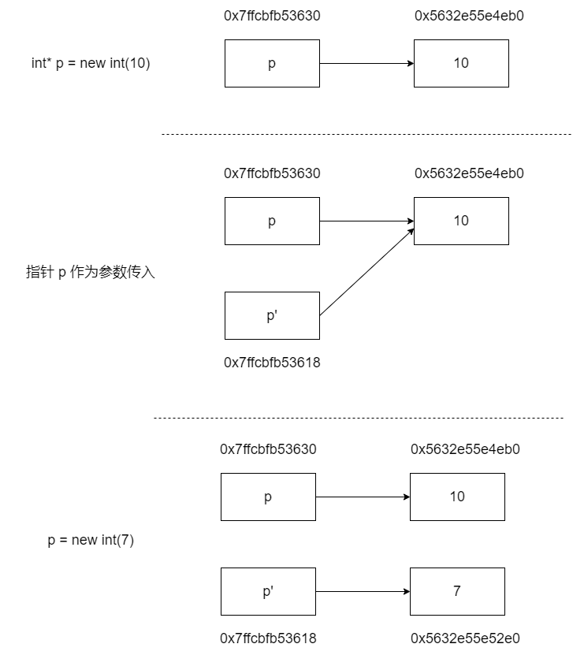

[TOC]

# C/C++

## 结构体对齐

- 为什么要字节对齐？

例如，假设计算机总是从内存中取 8 个字节，如果一个 double 数据的地址对齐成 8 的倍数，那么一个内存操作就可以读或者写，但是如果这个 double 数据的地址没有对齐，数据就可能被放在两个 8 字节块中，那么我们可能需要执行两次内存访问，才能读写完成。显然在这样的情况下，是低效的。所以需要字节对齐来**提高内存系统性能**。

```c++
// 默认 4 字节对齐
// sizeof(A) = 12
struct A
{
    char a;
    int c;
    char b;
};
// sizeof(B) = 8
struct B
{
    char a;
    char b;
    int c;
};
// sizeof(C) = 16
struct C
{
    char a;
    char b;
    double c; // double 为 8 字节。字节对齐是根据最大的成员 size 来对齐
};
```

- 嵌套结构体

```c++
struct D
{
    int a;
    double b;
};
// sizeof(E) = 24
struct E
{
    char a;
    char b;
    D d;
    // 注意嵌套结构体不是直接将结构体 D 的成员直接移动到结构体 E 中。
    // 字节对齐根据最大结构体成员的最大 size（包括嵌套结构体里的成员）。
};
// sizeof(F) = 16
struct F
{
    char a;
    char b;
    int a;
    double b;
};
```

## 指针传递变量为什么无法修改变量值

```c++
void change(int* p)
{
    printf("指针 p' 的地址: %p\n", &p); // p' 表示指针 p 的副本
    printf("指针 p' 指向的地址: %p 的值为: %d\n", &(*p), *p);

    p = new int(7);

    cout << "=============================" << endl;
    printf("指针 p' 的地址: %p\n", &p);
    printf("指针 p' 指向的地址: %p 的值为: %d\n", &(*p), *p);
}

void Test()
{
    int* p = new int(10);
    printf("指针 p 的地址: %p\n", &p);
    printf("指针 p 指向的地址: %p 的值为: %d\n", &(*p), *p);

    change(p);

    printf("指针 p 的地址: %p\n", &p);
    printf("指针 p 指向的地址: %p 的值为: %d\n", &(*p), *p);
}


/* 结果打印
指针 p 的地址: 0x7ffcbfb53630
指针 p 指向的地址: 0x5632e55e4eb0 的值为: 10
指针 p' 的地址: 0x7ffcbfb53618
指针 p' 指向的地址: 0x5632e55e4eb0 的值为: 10
=============================
指针 p' 的地址: 0x7ffcbfb53618
指针 p' 指向的地址: 0x5632e55e52e0 的值为: 7
指针 p 的地址: 0x7ffcbfb53630
指针 p 指向的地址: 0x5632e55e4eb0 的值为: 10
*/
```

这里为啥最终得结果输出是 10，而不是 7。

**先说结论**

1. 函数的形参都是原数据的【副本】，因此在函数内无法改变原数据。
2. 函数中参数都是传值，传指针本质上也是传值（指针有自己的内存地址，也就是说指针本身是占用内存的）。
3. 如果想要改变入参内容，则需要传该入参的地址（指针和引用都是类似的作用），通过解引用修改其指向的内容。

> 一图胜千言



## 智能指针

使用 new 与 delete 直接管理动态内存存在三个隐患：

1、忘记使用 delete 释放内存；

2、使用已经释放掉的对象；

3、同一块内存释放多次。为了更加安全且便捷地使用动态内存。

C++ 新标准提供了两种智能指针并提出了引用计数的概念，所谓引用计数就是指某个堆区内存上的对象被多少个智能指针所共享，每个 shared_ptr 有一个关联的计数器，当一个 shared_ptr 的引用计数为 0 时，它会自动释放所管理的对象。

### shared_ptr

允许多个指针指向同一个对象。每个 shared_ptr 对象在内部维护着两个变量：

1、指向对象的指针。

2、用于控制引用计数数据的指针。

所谓引用计数就是指某个堆区内存上的对象被多少个智能指针所共享，每个 shared_ptr 有一个关联的计数器，当一个 shared_ptr 的引用计数为 0 时，它会自动释放所管理的对象。

当一个 shared_ptr 被拷贝或赋值而指向某个动态内存对象时，该对象的引用计数递增。

当一个 shared_pt 被赋予一个新值（指向别的对象）或被销毁（释放）时，该对象的引用计数递减。

```c++
// 在动态内存空间中分配一个 int 对象，初始化为 10，并用共享指针 p1 指向该块内存
shared_ptr<int> p1 = make_shared<int>(10);
// 或者 shared_ptr<int> p1 = shared_ptr<int>(new int(10));
auto p2(p1); // p2 是 p1 的拷贝，指向相同的对象，p2（p1）指向对象的引用计数递增
cout << p1.use_count() << endl; // 2
// 将 p2 指向一个新分配的对象，p2 指向对象引用计数递增，p1 指向对象引用计数递减
p2 = make_shared<int>(20);
cout << p1.use_count() << endl; // 1
p1 = p2; //p1 指向 p2 的对象，此时 p1 原对象（值为10）的引用计数为 0，无引用者，会被自动释放
```

### unique_ptr

只允许有一个指针 ”独占“ 所指的对象。

unique_ptr **独占**所指向的对象。与 shared_ptr 不同，某个时刻只能有一个 unique_ptr 指向一个给定对象，所以unique_ptr是不允许拷贝构造和赋值的。

### weak_ptr

weak_ptr 叫弱引用指针。是一种不控制对象生命周期的智能指针，它指向一个 shared_ptr 管理的对象。

weak_ptr 设计的目的是为了协助 shared_ptr 而引入的一种智能指针，它可以解决 shared_ptr **循环引用**的问题。

weak_ptr 只可以从一个 shared_ptr 或另一个 weak_ptr 对象来构造，它的构造和析构不会引起引用记数的增加或减少。

什么是循环引用？具体参考：https://blog.csdn.net/m0_70418130/article/details/125980596

## 指针和引用的区别

待补充

## 参考文章

- https://www.zhihu.com/question/41476387