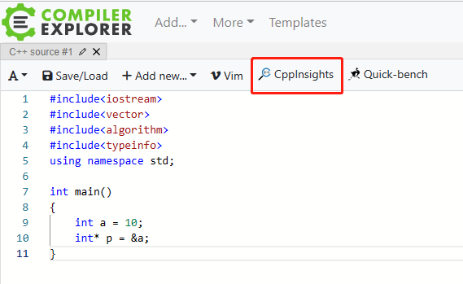
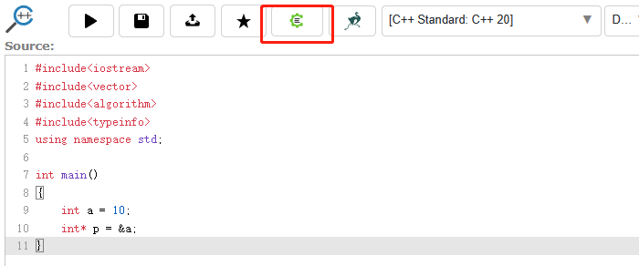
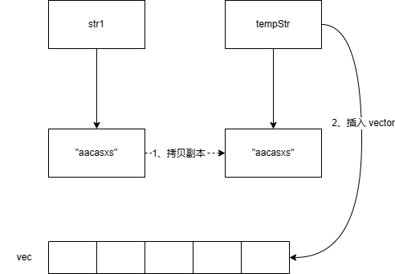

[TOC]

# C/C++

## 结构体对齐

- 为什么要字节对齐？

例如，假设计算机总是从内存中取 8 个字节，如果一个 double 数据的地址对齐成 8 的倍数，那么一个内存操作就可以读或者写，但是如果这个 double 数据的地址没有对齐，数据就可能被放在两个 8 字节块中，那么我们可能需要执行两次内存访问，才能读写完成。显然在这样的情况下，是低效的。所以需要字节对齐来**提高内存系统性能**。

```c++
// 默认 4 字节对齐
// sizeof(A) = 12
struct A
{
    char a;
    int c;
    char b;
};
// sizeof(B) = 8
struct B
{
    char a;
    char b;
    int c;
};
// sizeof(C) = 16
struct C
{
    char a;
    char b;
    double c; // double 为 8 字节。字节对齐是根据最大的成员 size 来对齐
};
```

- 嵌套结构体

```c++
struct D
{
    int a;
    double b;
};
// sizeof(E) = 24
struct E
{
    char a;
    char b;
    D d;
    // 注意嵌套结构体不是直接将结构体 D 的成员直接移动到结构体 E 中。
    // 字节对齐根据最大结构体成员的最大 size（包括嵌套结构体里的成员）。
};
// sizeof(F) = 16
struct F
{
    char a;
    char b;
    int a;
    double b;
};
```

## 指针传递变量为什么无法修改变量值

```c++
void change(int* p)
{
    printf("指针 p' 的地址: %p\n", &p); // p' 表示指针 p 的副本
    printf("指针 p' 指向的地址: %p 的值为: %d\n", &(*p), *p);

    p = new int(7);

    cout << "=============================" << endl;
    printf("指针 p' 的地址: %p\n", &p);
    printf("指针 p' 指向的地址: %p 的值为: %d\n", &(*p), *p);
}

void Test()
{
    int* p = new int(10);
    printf("指针 p 的地址: %p\n", &p);
    printf("指针 p 指向的地址: %p 的值为: %d\n", &(*p), *p);

    change(p);

    printf("指针 p 的地址: %p\n", &p);
    printf("指针 p 指向的地址: %p 的值为: %d\n", &(*p), *p);
}


/* 结果打印
指针 p 的地址: 0x7ffcbfb53630
指针 p 指向的地址: 0x5632e55e4eb0 的值为: 10
指针 p' 的地址: 0x7ffcbfb53618
指针 p' 指向的地址: 0x5632e55e4eb0 的值为: 10
=============================
指针 p' 的地址: 0x7ffcbfb53618
指针 p' 指向的地址: 0x5632e55e52e0 的值为: 7
指针 p 的地址: 0x7ffcbfb53630
指针 p 指向的地址: 0x5632e55e4eb0 的值为: 10
*/
```

这里为啥最终得结果输出是 10，而不是 7。

**先说结论**

1. 函数的形参都是原数据的【副本】，因此在函数内无法改变原数据。
2. 函数中参数都是传值，传指针本质上也是传值（指针有自己的内存地址，也就是说指针本身是占用内存的）。
3. 如果想要改变入参内容，则需要传该入参的地址（指针和引用都是类似的作用），通过解引用修改其指向的内容。

> 一图胜千言


## 智能指针

使用 new 与 delete 直接管理动态内存存在三个隐患：

1、忘记使用 delete 释放内存；

2、使用已经释放掉的对象；

3、同一块内存释放多次。为了更加安全且便捷地使用动态内存。

C++ 新标准提供了两种智能指针并提出了引用计数的概念，所谓引用计数就是指某个堆区内存上的对象被多少个智能指针所共享，每个 shared_ptr 有一个关联的计数器，当一个 shared_ptr 的引用计数为 0 时，它会自动释放所管理的对象。

### shared_ptr

允许多个指针指向同一个对象。每个 shared_ptr 对象在内部维护着两个变量：

1、指向对象的指针。

2、用于控制引用计数数据的指针。

所谓引用计数就是指某个堆区内存上的对象被多少个智能指针所共享，每个 shared_ptr 有一个关联的计数器，当一个 shared_ptr 的引用计数为 0 时，它会自动释放所管理的对象。

当一个 shared_ptr 被拷贝或赋值而指向某个动态内存对象时，该对象的引用计数递增。

当一个 shared_pt 被赋予一个新值（指向别的对象）或被销毁（释放）时，该对象的引用计数递减。

```c++
// 在动态内存空间中分配一个 int 对象，初始化为 10，并用共享指针 p1 指向该块内存
shared_ptr<int> p1 = make_shared<int>(10);
// 或者 shared_ptr<int> p1 = shared_ptr<int>(new int(10));
auto p2(p1); // p2 是 p1 的拷贝，指向相同的对象，p2（p1）指向对象的引用计数递增
cout << p1.use_count() << endl; // 2
// 将 p2 指向一个新分配的对象，p2 指向对象引用计数递增，p1 指向对象引用计数递减
p2 = make_shared<int>(20);
cout << p1.use_count() << endl; // 1
p1 = p2; //p1 指向 p2 的对象，此时 p1 原对象（值为10）的引用计数为 0，无引用者，会被自动释放
```

### unique_ptr

只允许有一个指针 ”独占“ 所指的对象。

unique_ptr **独占**所指向的对象。与 shared_ptr 不同，某个时刻只能有一个 unique_ptr 指向一个给定对象，所以unique_ptr是不允许拷贝构造和赋值的。

### weak_ptr

weak_ptr 叫弱引用指针。是一种不控制对象生命周期的智能指针，它指向一个 shared_ptr 管理的对象。

weak_ptr 设计的目的是为了协助 shared_ptr 而引入的一种智能指针，它可以解决 shared_ptr **循环引用**的问题。

weak_ptr 只可以从一个 shared_ptr 或另一个 weak_ptr 对象来构造，它的构造和析构不会引起引用记数的增加或减少。

什么是循环引用？具体参考：https://blog.csdn.net/m0_70418130/article/details/125980596

## 指针和引用的区别

指针是一个变量，存储的是一个地址，指向内存的一个存储单元；可以为空；sizeof 是指针大小。

引用是原变量的一个别名，与对象绑定后，就不可改变；定义的时候必须初始化；sizeof 是所引用的对象大小

本质上，指针和引用其实是同一个东西，因为它们汇编后的代码是一样的。

- 指针 C++ 代码

```c++
int main()
{
    int a = 10;
    int* p = &a;
}
```

- 指针代码汇编后

```assembly
main:
        push    rbp
        mov     rbp, rsp
        mov     DWORD PTR [rbp-12], 10
        lea     rax, [rbp-12]
        mov     QWORD PTR [rbp-8], rax
        mov     eax, 0
        pop     rbp
        ret
```

- 引用 C++ 代码

```
int main()
{
    int a = 10;
    int& b = a;
}
```

- 引用代码汇编后

```assembly
main:
        push    rbp
        mov     rbp, rsp
        mov     DWORD PTR [rbp-12], 10
        lea     rax, [rbp-12]
        mov     QWORD PTR [rbp-8], rax
        mov     eax, 0
        pop     rbp
        ret
```

这里推荐在线工具：https://godbolt.org/，可以方便查看 C++ 汇编后的代码。

使用方法：依次点击红色框框按钮，调出汇编代码界面

- 步骤一



- 步骤二



- 步骤三


## 左值引用和右值引用

### 什么是左值和右值

首先可以从 2 个角度判断：左值**可以取地址、位于等号左边**；而右值**没法取地址，位于等号右边**。

```cpp
int a = 5;
```

- a 可以通过 & 取地址，位于等号左边，所以 a 是左值。
- 5 位于等号右边，5 没法通过 & 取地址，所以 5 是个右值。

再举个例子：

```cpp
struct A {
    A(int a = 0) {
        a_ = a;
    }

    int a_;
};

A a = A();
```

- 同样的，a 可以通过 & 取地址，位于等号左边，所以 a 是左值。
- `A()` 是个临时值，没法通过 & 取地址，位于等号右边，所以 `A()` 是个右值。

可见左右值的概念很清晰，有地址的变量就是左值，没有地址的字面值、临时值就是右值。

### 左值引用

左值引用大家都很熟悉，**能指向左值，不能指向右值的就是左值引用**。

```cpp
int a = 5;
int &ref_a = a; // 左值引用指向左值，编译通过
int &ref_a = 5; // 左值引用指向了右值，会编译失败
```

**引用是变量的别名，由于右值没有地址，没法被修改，所以左值引用无法指向右值。**

但是，const 左值引用是可以指向右值的：

```cpp
const int &ref_a = 5;  // 编译通过
```

const 左值引用不会修改指向值，因此可以指向右值，这也是为什么要使用 `const &` 作为函数参数的原因之一，如 `std::vector` 的 `push_back`：

```cpp
void push_back (const value_type& val);
```

如果没有 `const`，`vec.push_back(5)` 这样的代码就无法编译通过了。

### 右值引用

再看下右值引用，右值引用的标志是 `&&`，顾名思义，右值引用专门为右值而生，**可以指向右值，不能指向左值**：

```cpp
int &&ref_a_right = 5; // ok

int a = 5;
int &&ref_a_left = a; // 编译不过，右值引用不可以指向左值

ref_a_right = 6; // 右值引用的用途：可以指向并修改右值
```

### std::move

右值引用有办法指向左值吗？有办法，使用 `std::move`。

```cpp
int a = 5; // a 是个左值
int &ref_a_left = a; // 左值引用指向左值
int &&ref_a_right = std::move(a); // 通过 std::move 将左值转化为右值，可以被右值引用指向

cout << a; // 打印结果：5
```

`std::move `是一个非常有迷惑性的函数，不理解左右值概念的人们往往以为它能把一个变量里的内容移动到另一个变量，**但事实上 `std::move` 移动不了什么，唯一的功能是把左值强制转化为右值**，让右值引用可以指向左值。其实现等同于一个类型转换：`static_cast<T&&>(lvalue)`。 所以，**单纯的 `std::move` 不会有性能提升**，`std::move` 的使用场景在下面我们会讲到。

同样的，右值引用能指向右值，本质上也是把右值提升为一个左值，并定义一个右值引用通过 `std::move` 指向该左值。

```cpp
int &&ref_a = 5;
ref_a = 6;

//等同于以下代码：
int temp = 5;
int &&ref_a = std::move(temp);
ref_a = 6;
```

### 左值引用、右值引用本身是左值还是右值

**被声明出来的左、右值引用都是左值**。 因为被声明出的左右值引用是有地址的，也位于等号左边。

```cpp
// 形参是个右值引用
void change(int&& right_value) {
    right_value = 8;
}

int main() {
    int a = 5; // a 是个左值
    int &ref_a_left = a; // ref_a_left 是个左值引用
    int &&ref_a_right = std::move(a); // ref_a_right 是个右值引用

    change(a); // 编译不过，a 是左值，change 参数要求右值
    change(ref_a_left); // 编译不过，左值引用 ref_a_left 本身也是个左值
    change(ref_a_right); // 编译不过，右值引用 ref_a_right 本身也是个左值

    change(std::move(a)); // 编译通过
    change(std::move(ref_a_right)); // 编译通过
    change(std::move(ref_a_left)); // 编译通过

    change(5); // 当然可以直接接右值，编译通过

    cout << &a << ' ';
    cout << &ref_a_left << ' ';
    cout << &ref_a_right;
    // 打印这三个左值的地址，都是一样的
}
```

看完后你可能有个问题，`std::move` 会返回一个右值引用 `int &&`，它是左值还是右值呢？ 从表达式 `int &&ref = std::move(a)` 来看，右值引用 `ref` 指向的必须是右值，所以 `std::move` 返回的 `int &&` 是个右值。所以右值引用既可能是左值，又可能是右值吗？ 确实如此：**右值引用既可以是左值也可以是右值，如果有名称则为左值，否则是右值**。

又或者说，**作为函数返回值的 && 是右值，直接声明出来的 && 是左值**。 这同样也符合开始我们对左值，右值的判定方式：其实引用和普通变量是一样的，`int &&ref = std::move(a)` 和 `int a = 5` 没有什么区别，等号左边就是左值，右边就是右值。

最后，从上述分析中我们得到如下结论：

1. **从性能上讲，左右值引用没有区别，传参使用左右值引用都可以避免拷贝。**
2. **右值引用可以直接指向右值，也可以通过 `std::move` 指向左值；而左值引用只能指向左值（const 左值引用也能指向右值）。**
3. **作为函数形参时，右值引用更灵活。虽然 const 左值引用也可以做到左右值都接受，但它无法修改，有一定局限性。**

```cpp
void f(const int& n) {
    n += 1; // 编译失败，const 左值引用不能修改指向变量
}

void f2(int && n) {
    n += 1; // ok
}

int main() {
    f(5);
    f2(5);
}
```

### 右值引用和 std::move 的应用场景

按上文分析，`std::move` 只是类型转换工具，不会对性能有好处；右值引用在作为函数形参时更具灵活性，看上去还是挺鸡肋的。他们有什么实际应用场景吗？

#### 实现移动语义

在实际场景中，右值引用和 `std::move` 被广泛用于在 STL 和自定义类中**实现移动语义，避免拷贝，从而提升程序性能**。 在没有右值引用之前，一个简单的数组类通常实现如下，有构造函数、拷贝构造函数、赋值运算符重载、析构函数等。

```cpp
class Array {
public:
    Array(int size) : size_(size) {
        data_ = new int[size_];
    }

    // 深拷贝构造
    Array(const Array& temp_array) {
        size_ = temp_array.size_;
        data_ = new int[size_];
        for (int i = 0; i < size_; i ++) {
            data_[i] = temp_array.data_[i];
        }
    }

    // 深拷贝赋值
    Array& operator=(const Array& temp_array) {
        delete[] data_;

        size_ = temp_array.size_;
        data_ = new int[size_];
        for (int i = 0; i < size_; i ++) {
            data_[i] = temp_array.data_[i];
        }
    }

    ~Array() {
        delete[] data_;
    }

public:
    int *data_;
    int size_;
};
```

该类的拷贝构造函数、赋值运算符重载函数已经通过使用左值引用传参来避免一次多余拷贝了，但是内部实现要深拷贝，无法避免。 这时，有人提出一个想法：是不是可以提供一个**移动构造函数**，把被拷贝者的数据移动过来，**被拷贝者后边就不要了**，这样就可以避免深拷贝了，如：

```cpp
class Array {
public:
    Array(int size) : size_(size) {
        data_ = new int[size_];
    }

    // 深拷贝构造
    Array(const Array& temp_array) {
        // ...
    }

    // 深拷贝赋值
    Array& operator=(const Array& temp_array) {
        // ...
    }

    // 移动构造函数，可以浅拷贝
    Array(const Array& temp_array, bool move) {
        data_ = temp_array.data_;
        size_ = temp_array.size_;
        // 为防止 temp_array 析构时 delete data，提前置空其 data_
        temp_array.data_ = nullptr;
    }

    ~Array() {
        delete [] data_;
    }

public:
    int *data_;
    int size_;
};
```

这么做有 2 个问题：

- 不优雅，表示移动语义还需要一个额外的参数。
- 无法实现，temp_array 是个 const 左值引用，无法被修改，所以 `temp_array.data_ = nullptr;` 这行会编译不过。当然函数参数可以改成非 const：`Array(Array& temp_array, bool move){...}`，这样也有问题，由于左值引用不能接右值，`Array a = Array(Array(), true);` 这种调用方式就没法用了。

可以发现左值引用真是用的很不爽，**右值引用的出现解决了这个问题**，在 STL 的很多容器中，都实现了以**右值引用为参数**的移动构造函数和移动赋值重载函数，或者其他函数，最常见的如 `std::vector` 的 `push_back` 和 `emplace_back`。参数为左值引用意味着拷贝，为右值引用意味着移动。

> `push_back` 向容器尾部添加元素时，首先会创建这个元素，然后再将这个元素拷贝或者移动到容器中（如果是拷贝的话，事后会自行销毁先前创建的这个元素）；而 `emplace_back` 在实现时，则是直接在容器尾部创建这个元素，省去了拷贝或移动元素的过程。

```cpp
class Array {
public:
    Array(int size) : size_(size) {
        data_ = new int[size_];
    }
    
    // 一般的深拷贝构造函数
    Array(const Array& temp_array) {
        size_ = temp_array.size_;
        data_ = new int[size_];
        for (int i = 0; i < size_; i ++) {
            data_[i] = temp_array.data_[i];
        }
    }

    // 优雅，实现了移动语义函数
    Array(Array&& temp_array) {
        data_ = temp_array.data_;
        size_ = temp_array.size_;
        // 为防止 temp_array 析构时 delete data，提前置空其 data_
        temp_array.data_ = nullptr;
    }

public:
    int *data_;
    int size_;
};
```

如何使用：

```cpp
// 例：Array 用法
int main(){
    Array a(10);

    // 左值 a，用 std::move 转化为右值
    Array b(std::move(a));
}
```

#### 实例：vector::push_back 使用 std::move 提高性能

```cpp
// std::vector 方法定义
// void push_back (const value_type& val);
// void push_back (value_type&& val);
// void emplace_back (Args&&... args);

// 例：std::vector 和 std::string 的实际例子
int main() {
    std::string str1 = "aacasxs";
    std::vector<std::string> vec;

    vec.push_back(str1); // 传统方法 copy
    vec.push_back(std::move(str1)); // 调用移动语义的 push_back 方法，避免拷贝，str1 会失去原有值，变成空字符串。参数为右值意味着移动，原来的 str1 的值的 data 被移动到的 vector 中，str1 的 data 被置为空。
    vec.emplace_back(std::move(str1)); // emplace_back 效果相同，str1 会失去原有值
    vec.emplace_back("axcsddcas"); // 当然可以直接接右值
}
```

在 vector 和 string 这个场景，加个 `std::move` 会调用到移动语义函数（先使用 `move` 转成右值引用，再调用右值引用的相关移动语义函数），避免了深拷贝。

- 深拷贝



- 移动语义函数


除非设计不允许移动，STL 类大都支持移动语义函数，即**可移动的**。 另外，编译器会默认在用户自定义的 class 和 struct 中生成移动语义函数（当然前提是用户没有主动定义该类的移动语义的拷贝构造等函数）。 

```cpp
class Object {};

int main()
{
    Object a;
    Object b(a);             // 默认拷贝构造函数
    Object c(std::move(a));  // 默认移动语义拷贝构造函数
    Object d = a;            // 默认赋值函数
    Object e = std::move(a); // 默认移动语义赋值函数
    return 0;
}
```

因此，可移动对象在**需要拷贝且被拷贝者之后不再被需要**的场景，建议使用 `std::move` 触发移动语义，提升性能。

`std::move` 本身只做类型转换，对性能无影响。我们可以在自己的类中实现移动语义，避免深拷贝，充分利用右值引用和 `std::move` 的语言特性。

## 构造函数能不能用虚函数

答案：不能。

如果构造函数是虚函数，那么一定有一个已经存在的类对象 obj，obj 中的虚指针来指向虚表的构造函数地址（通过 obj 的虚指针来调用）。可是构造函数又是用来创建并初始化对象的，虚指针也是存储在对象的内存空间的。所以构造函数是虚函数的前提是它要有类的对象存在，但在这之前又没有其他可以创建并初始化类对象的函数，所以矛盾。

## 参考文章

- C 指针传递变量为什么无法修改变量值？ - 蓝色的回答 - 知乎 https://www.zhihu.com/question/41476387/answer/91566794

- [一文读懂 C++ 右值引用和 std::move](https://zhuanlan.zhihu.com/p/335994370)