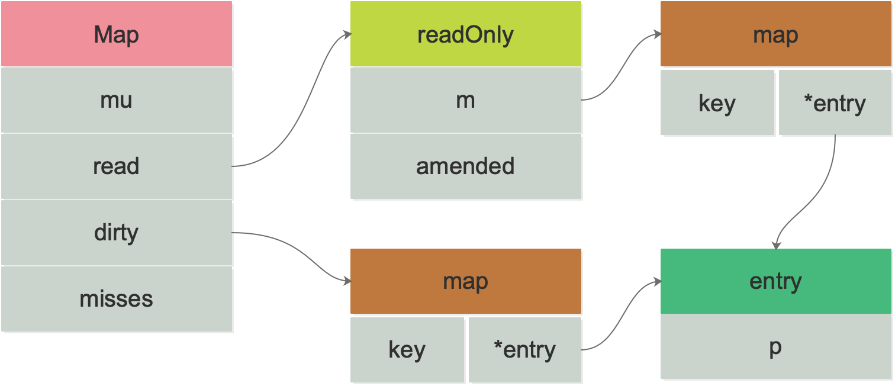

# Go sync.Map

go map 不是线程安全。我们可以通过加锁去实现并发安全，但是对整个 map 加锁粒度太大。所以 Go 1.9 引入了 `sync.Map`。

## sync.Map 的结构

```go
// sync/map.go
type Map struct {
   // 当写read map 或读写dirty map时 需要上锁
   mu Mutex

   // read map的 k v(entry) 是不变的，删除只是打标记，插入新key会加锁写到dirty中
   // 因此对read map的读取无需加锁
   read atomic.Value // 保存readOnly结构体

   // dirty map 对dirty map的操作需要持有mu锁
   dirty map[interface{}]*entry

   // 当Load操作在read map中未找到，尝试从dirty中进行加载时(不管是否存在)，misses+1
   // 当misses达到diry map len时，dirty被提升为read 并且重新分配dirty
   misses int
}

// read map数据结构
type readOnly struct {
   m       map[interface{}]*entry
   // 为true时代表dirty map中含有m中没有的元素
   amended bool
}

type entry struct {
   // 指向实际的interface{}
   // p有三种状态:
   // p == nil: 键值已经被删除，此时，m.dirty==nil 或 m.dirty[k]指向该entry
   // p == expunged: 键值已经被删除， 此时, m.dirty!=nil 且 m.dirty不存在该键值
   // 其它情况代表实际interface{}地址 如果m.dirty!=nil 则 m.read[key] 和 m.dirty[key] 指向同一个entry
   // 当删除key时，并不实际删除，先CAS entry.p为nil 等到每次dirty map创建时(dirty提升后的第一次新建Key)，会将entry.p由nil CAS为expunged
   p unsafe.Pointer // *interface{}
}
```



## sync.Map 实现的原理

1、过 read 和 dirty 两个字段将读写分离，读的数据存在只读字段 read 上，将最新写入的数据则存在 dirty 字段上。

2、读取时会先查询 read，不存在再查询 dirty，写入时则只写入 dirty。

3、读取 read 并不需要加锁，而读或写 dirty 都需要加锁。

4、另外有 misses 字段来统计 read 被穿透的次数（被穿透指需要读 dirty 的情况），超过一定次数则将 dirty 数据同步到 read 上。

5、对于删除数据则直接通过标记来延迟删除。

## 参考文章

- [深度解密 Go 语言之 sync.map](https://qcrao.com/post/dive-into-go-sync-map/)
- [Go sync.Map 实现](https://wudaijun.com/2018/02/go-sync-map-implement/)