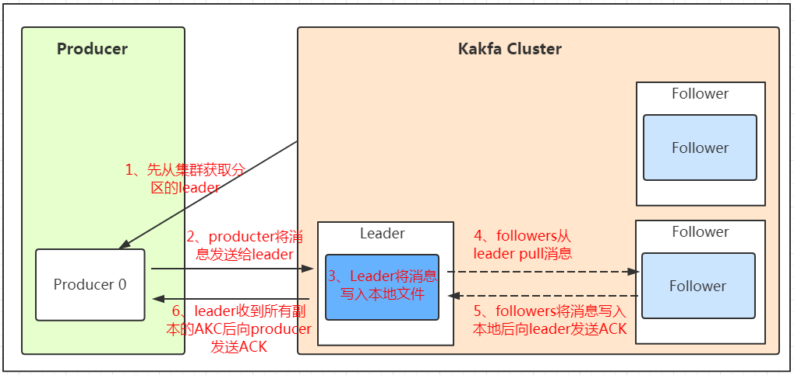
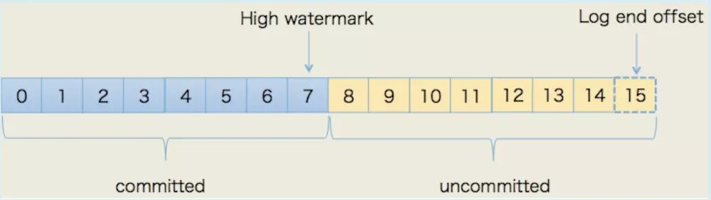
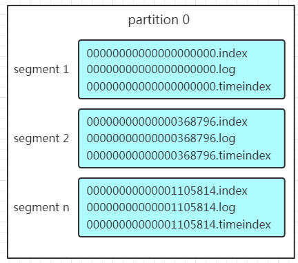

[TOC]

# Kafka 高可用机制

Kafka 一个消息系统，最重要的就是保证消息不丢失，Kafka 通过**备份机制**、**故障转移**和**消息持久化**来做容错。

## 备份机制（replication）

在 Kafka 在 0.8 以前的版本中，是没有 Replication 的，在没有 Replication 的情况下，一旦某机器宕机或者某个 Broker 停止工作则会造成整个系统的可用性降低

Kafka 的高可用保障来源于其健壮的副本（replication）策略。

每一个 partition 都有多个副本，副本的作用是做备份。当主分区（Leader）故障的时候会选择一个备份（Follower）上位，成为 Leader。follower 和 leader 绝对是在不同的机器，同一机器对同一个分区也只可能存放一个副本（包括自己）。如下图：


其中，Leader 负责响应客户端的读写请求，follower 只负责从 Leader 同步消息，不面向客户端。

### ISR

分区中的所有副本统称为 AR（Assigned Repllicas）存储在 zookeeper 中，所有与 leader 副本保持一定程度同步的副本（包括 Leader）组成 ISR（In-Sync Replicas），ISR 集合是 AR 集合中的一个子集，只要 ISR 里有至少一个副本，即认为消息不会丢失。

如果 follower 副本和 leader 副本数据

- 同步速度过慢（消息差值超过 `replica.lag.max.messages` 阈值，其默认值是 4000）

- 心跳超时（心跳丢失超过 `replica.lag.time.max.ms` 阈值，其默认值是10000）

该 follower 将会被踢出 ISR 集合表。

当一台服务器被踢出 ISR 列表后，它会请求 Leader 的数据，直到数据量没有比 Leader 落后太多，就会被重新加入到 ISR 列表中。

只有在 ISR 集合中的副本才有资格被选举为 leader。

### 如何将所有 Replica 均匀分布到整个集群

如果所有的 Replica 都在同一个 Broker 上，那一旦该 Broker 宕机，该 Partition 的所有 Replica 都无法工作，所以需要保证它上面的负载可以被均匀的分配到其它的所有 Broker上。

> 默认情况下，Kafka 的 replica 数量为 1。

Kafka 分配 Replica 的算法如下：

1. 将所有 Broker（假设共 n 个 Broker）和待分配的 Partition 排序。

2. 将第 i 个 Partition 分配到第 `i mod n` 个 Broker 上。

3. 将第 i 个 Partition 的第 j 个 Replica 分配到第 `(i + j) mode n` 个 Broker 上。

### ACK 应答机制

kafka 通过 ACK 应答机制保证消息不丢失。在生产者向队列写入数据的时候可以设置参数来确定是否确认 kafka 接收到数据，这个参数可设置的值为 **0**、**1**、**all**。

- `0`  代表 producer 往集群发送数据不需要等到集群的返回，不确保消息发送成功。安全性最低但是效率最高。
- `1`  代表 producer 往集群发送数据只要 leader 应答就可以发送下一条，只确保 leader 发送成功。
- `all`  代表 producer 往集群发送数据需要所有的 follower 都完成从 leader 的同步才会发送下一条，确保 leader 发送成功和所有的副本都完成备份。安全性最高，但是效率最低。

golang 使用 kafka 的 sarama 包 ack 参数定义如下（该参数是 new 一个 producer 实例的时候去配置）：

```go
const (
    // NoResponse doesn't send any response, the TCP ACK is all you get.
    NoResponse RequiredAcks = 0
    // WaitForLocal waits for only the local commit to succeed before responding.
    WaitForLocal RequiredAcks = 1
    // WaitForAll waits for all in-sync replicas to commit before responding.
    // The minimum number of in-sync replicas is configured on the broker via
    // the `min.insync.replicas` configuration key.
    WaitForAll RequiredAcks = -1
)
```

Kafka 可以通过参数来限制 ISR 的数量的：`min.insync.replicas = n`，代表的语义是，如果生产者 acks=all，而在发送消息时，Broker 的 ISR 数量没有达到 n，Broker 不能处理这条消息，需要直接给生产者报错。



## 故障转移（failover）

### broker 故障

当某个 Broker 节点由于故障离开 Kafka 群集时，则存在于该 Broker 的 leader 分区将不可用。为了最大程度地减少停机时间，需要快速找到替代的 leader 分区。

每个 Broker 启动后，会在 zookeeper 的 /Brokers/ids 下创建一个临时 znode。当 Broker 宕机或主动关闭后，该 Broker 与 ZooKeeper 的会话结束，这个 znode 会被自动删除。同理，ZooKeeper 的 Watch 机制将这一变更推送给 Controller，这样 Controller 就能知道有 Broker 关闭或宕机了，从而进行后续的协调操作。

Controller 将收到通知并对此采取行动，决定哪些 Broker 上的分区成为 leader 分区，然后它会通知每个相关的 Broker：

1、要么将 Broker上的主题分区变成 leader。

2、要么通过 `LeaderAndISR` 请求从新的 leader 分区中复制数据。

> 当然如果该故障的 broker 恢复了，controller 就会把它加进来。

#### committed offset

我们知道 consumer 维护已读取消息的 offset，当发生 Leader 切换之后，如何保证在新的 leader 上这个 offset 仍然有效？换句话来说，就是要解决 follower 同步 leader 消息滞后带来的问题。

- read message by offset


Kafka 用一种机制，即 `committed offset`，来保证这种一致性，如下图所示：



committed offset 只有在所有 replica 都同步完该 offset 的 message 后，该 offset 才会被置为 committed。这时，uncommitted 的 message 对 consumer 是不可见的。

上图中 consumer 最多只能读到 offset 7。

如果此时，leader dead，无论哪个 follower 重新选举成 leader，都不会影响数据的一致性，因为 consumer 可见的 offset 最多为 7，而这个 offset 在所有的 replica 上都是一致的。

**Leader 切换示意图**

<u>需要注意的是如果 Leader 选不出来，那么该 Partition offline。</u>


### Controller 故障

Kafka 会从 Broker 中选出一个作为 Controller。说白了就是抢占 zk 的分布式锁。

Controller 的 failover 过程如下：

- 试图去在 /controller 目录抢占创建 node；
- 如果已经有其他的 broker node 先创建成功，那么说明新的 controller 已经诞生，更新当前的元数据即可；
- 如果自己创建成功，说明我已经成为新的 controller，下面就要开始做初始化工作；

> 初始化主要就是创建和初始化 partition 和 replicas 的状态机，并对 partitions 和 brokers 的目录的变化设置 watcher。

可以看到，单纯 Controller 发生 failover，是不会影响正常数据读写的，只是 partition 的 leader 无法被重新选举，如果此时有 partition 的 leader fail，会导致 partition offline。但是 Controller 的 dead，往往是伴随着 broker 的 dead，所以在 Controller 发生 failover 的过程中，往往会出现 partition offline，导致数据暂时不可用。

### All Replica Fail

假设某个 Partition 的所有副本都宕机，这时候 Kafka 有以下两种降级处理：

- 等待 ISR 中任一 Replica 恢复，并选它为 Leader。

 优缺点：等待时间较长，降低可用性，但是消息不丢失（强一致性）。

- 选择第一个恢复的 Replica 为新的 Leader，无论它是否在 ISR 中，称为脏选举。

 优缺点：并未包含所有已被之前 Leader Commit 过的消息，因此会造成数据丢失，但可用性较高（高可用性：减少停工时间，而保持其服务的高度可用性）。

需要根据不同的使用场景选择**高可用性**还是**强一致性**。

### Zookeeper Failover

Kafka 底层是强依赖 Zookeeper 的**（注意：Apache Kafka2.8 版本之后可以不需要使用 ZooKeeper）**，如果 Zookeeper 发生故障，势必会对 Kafka 造成影响。

Zookeeper 故障大致分为：Zookeeper Dead、Zookeeper Hang 两种。

#### Zookeeper Dead

这种情况下 Broker 是无法启动的，因为连不上 Zookeeper，Kafka 完全无法工作直到 Zookeeper 恢复正常服务为止。

#### Zookeeper Hang

zookeeper hang 的原因有很多，主要是 zk 负载过重，zk 所在主机 cpu，memeory 或网络资源不够等，hang 造成的影响就是 Session Timeout。

Session Timeout 就引发如下问题：

- Controller fail，触发 Controller 重新选举
- Broker fail，触发 Partition 的 Leader 切换 or Partition offline

## 消息持久化

Producer 将数据写入 kafka 后，集群就需要对数据进行保存了，kafka 将数据保存在磁盘，可能在我们的一般的认知里，写入磁盘是比较耗时的操作，不适合这种高并发的组件。Kafka 初始会单独开辟一块磁盘空间，顺序写入数据（效率比随机写入高）。

### Partition 结构

Partition 在服务器上的表现形式就是一个一个的文件夹，每个 partition 的文件夹下面会有多组 segment 文件，每组 segment 文件又包含 .index 文件、.log 文件、.timeindex 文件（早期版本中没有）三个文件，log 文件就实际是存储 message 的地方，而 index 和 timeindex 文件为索引文件，用于检索消息。



如上图，这个 partition 有三组 segment 文件，每个 log 文件的大小是一样的，但是存储的 message 数量是不一定相等的（每条的 message 大小不一致）。

文件的命名是以该 segment 最小 offset 来命名的，如 000.index 存储 offset 为 0~368795 的消息。

kafka 就是利用**分段+索引**的方式来解决查找效率的问题。

### Message 结构

上面说到 log 文件就实际是存储 message 的地方，我们在 producer 往 kafka 写入的也是一条一条的 message，那存储在 log 中的 message 是什么样子的呢？消息主要包含消息体、消息大小、offset、压缩类型……等等！我们重点需要知道的是下面三个：

1、 offset：offset 是一个占 8byte 的有序 id 号，它可以唯一确定每条消息在 partition 内的位置！

2、 消息大小：消息大小占用 4byte，用于描述消息的大小。

3、 消息体：消息体存放的是实际的消息数据（被压缩过），占用的空间根据具体的消息而不一样。

### 存储策略

无论消息是否被消费，kafka 都会保存所有的消息。那对于旧数据有什么删除策略呢？

1、 基于时间，默认配置是 168 小时（7 天）。

2、 基于大小，默认配置是 1073741824。

需要注意的是，kafka 读取特定消息的时间复杂度是 O(1)，所以这里删除过期的文件并不会提高 kafka 的性能。

### 消费数据

消息存储在 log 文件后，消费者就可以进行消费了。与生产消息相同的是，消费者在拉取消息的时候也是**找 leader** 去拉取。

多个消费者可以组成一个消费者组（consumer group），每个消费者组都有一个组 id。同一个消费组者的消费者可以消费同一 topic 下不同分区的数据，但是不会组内多个消费者消费同一分区的数据。如看下图：


1. **消费者组的消费者小于 partition 数量**：如上图，会出现某个消费者消费多个 partition 数据的情况，消费的速度也就不及只处理一个 partition 的消费者的处理速度。

2. **消费者组的消费者多于partition的数量**：多出来的消费者不消费任何 partition 的数据，也就是说不会出现多个消费者消费同一个 partition 的数据呢。所以在实际的应用中，建议**消费者组的 consumer 的数量与 partition 的数量一致。**

## 参考文章

- [再过半小时，你就能明白 kafka 的工作原理了](https://www.cnblogs.com/sujing/p/10960832.html)

