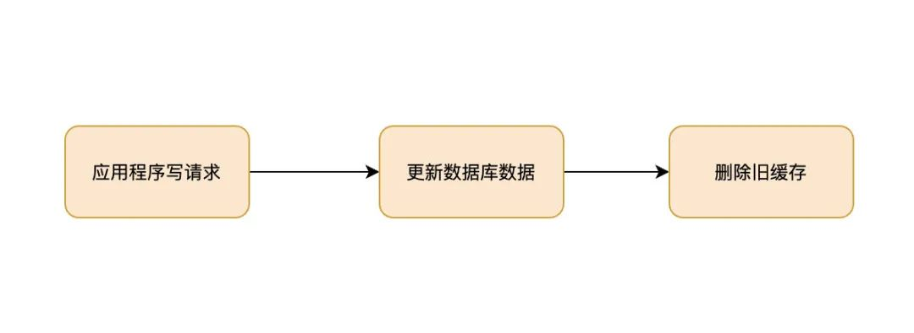

[TOC]

# 缓存模式

>这里，我们先不讨论更新缓存和更新数据这两个事是一个事务的事，或是会有失败的可能，我们先假设更新数据库和更新缓存都可以成功的情况（我们先把成功的代码逻辑先写对）。

## Cache Aside Pattern

### 读操作流程图

### 写操作流程图

上面的读写流程这应该是目前应用最广的缓存查询流程。这个流程的名字叫做：Cache Aside Pattern，这是缓存设计模式的一种。

### 并发问题

但 Cache Aside 会存在并发问题。比如，一个是读操作，但是没有命中缓存，然后就到数据库中取数据，此时来了一个写操作，写完数据库后，让缓存失效，然后，之前的那个读操作再把老的数据放进 cache 去。所以会造成脏数据。

但这个 case 理论上会出现，不过，实际上出现的概率可能非常低。因为这个条件需要发生在读缓存时缓存失效，而且并发着有一个写操作。而实际上数据库的写操作会比读操作慢得多，而且还要锁表，而读操作必需在写操作前进入数据库操作，而又要晚于写操作更新缓存，所有的这些条件都具备的概率基本并不大。

同时 Cache Aside 这写流程也引出下面两个问题：

1、为什么是先操作数据库，可以先操作缓存吗？

2、为什么是失效（删除）缓存，可以更新缓存吗？

## 先操作数据库 or 先操作缓存

其实，无论是先操作数据库，还是先操作缓存，在并发情况下都会有脏数据的情况，但是脏数据的时间和影响面会有所不同，让我们来看下具体的例子。

**先操作数据库**

脏数据案例如下，有两个并发的请求，一个写请求，一个读请求，流程如下：

脏数据时间范围：更新数据库后，失效缓存前。这个时间范围很小，通常不会超过几毫秒。

**先操作缓存**

脏数据案例如下，有两个并发的请求，一个写请求，一个读请求，流程如下：

脏数据时间范围：更新数据库后，下一次对该数据的更新前。这个时间范围不确定性很大，情况如下：

如果下一次对该数据的更新马上就到来，那么会失效缓存，脏数据的时间就很短。

2、如果下一次对该数据的更新要很久才到来，那这期间缓存保存的一直是脏数据，时间范围很长。

结论：通过上述案例可以看出，先操作数据库和先操作缓存都会存在脏数据的情况。但是相比之下，先操作数据库，再操作缓存是更优的方式，即使在并发极端情况下，也只会出现很小量的脏数据。

## 失效缓存 or 更新缓存

**更新缓存**

案例如下，有两个并发的写请求，流程如下：

分析：数据库中的数据是请求 B 的，缓存中的数据是请求 A 的，数据库和缓存存在数据不一致。

**失效缓存**

案例如下，有两个并发的写请求，流程如下：

分析：由于是删除缓存，所以不存在数据不一致的情况。

结论：通过上述案例，可以很明显的看出，失效缓存是更优的方式。

## 其他缓存模式

### Read/Write Through Pattern

我们可以看到，在上面的 Cache Aside 套路中，我们的应用代码需要维护两个数据存储，一个是缓存（Cache），一个是数据库（Repository）。所以，应用程序比较啰嗦。而 Read/Write Through 套路是把更新数据库（Repository）的操作由缓存自己代理了，所以，对于应用层来说，就简单很多了。**可以理解为，应用认为后端就是一个单一的存储，而存储自己维护自己的 Cache。**

#### Read Through

Read Through 套路就是在查询操作中更新缓存，也就是说，当缓存失效的时候（过期或LRU换出），Cache Aside 是由调用方负责把数据加载入缓存，而 Read Through 则用缓存服务自己来加载，从而对应用方是透明的。

#### Write Through

Write Through 套路和Read Through相仿，不过是在更新数据时发生。当有数据更新的时候，如果没有命中缓存，直接更新数据库，然后返回。如果命中了缓存，则更新缓存，然后再由 Cache 自己更新数据库。

下图自来 Wikipedia 的 [Cache词条](https://en.wikipedia.org/wiki/Cache_(computing))。其中的 Memory 你可以理解为就是我们例子里的数据库。

### Write Behind Caching Pattern

>异步缓存写入模式

Write Behind 又叫 Write Back。Write Back 套路，一句说就是，在更新数据的时候，只更新缓存，不更新数据库，而我们的缓存会异步地批量更新数据库。这个设计的好处就是让数据的 I/O 操作飞快无比（因为直接操作内存嘛 ），因为异步，write back 还可以合并对同一个数据的多次操作，所以性能的提高是相当可观的。

但是，其带来的问题是，数据不是强一致性的，而且可能会丢失（我们知道 Unix/Linux 非正常关机会导致数据丢失，就是因为这个事）。在软件设计上，我们基本上不可能做出一个没有缺陷的设计，就像算法设计中的时间换空间，空间换时间一个道理，有时候，强一致性和高性能，高可用和高性性是有冲突的。软件设计从来都是取舍 Trade-Off。

## 写在最后

我们没有考虑缓存（Cache）和持久层（Repository）的整体事务的问题。比如，更新 Cache 成功，更新数据库失败了怎么吗？或是反过来。关于这个事，如果你需要强一致性，你需要使用『两阶段提交协议』——prepare, commit/rollback

## 参考链接

- [缓存更新的套路](https://coolshell.cn/articles/17416.html/comment-page-1)
- [如何保证数据一致性、缓存设计模式](https://mp.weixin.qq.com/s/P3w13_s9Pngj-GW57AnV4g)