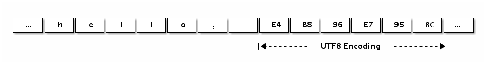
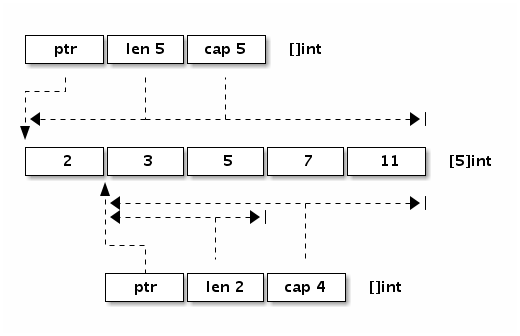

# Golang 高级编程

## 语言基础

### 数组、字符串和切片

#### 数组

数组是一个由固定长度的特定类型元素组成的序列，一个数组可以由零个或多个元素组成。数组的长度是数组类型的组成部分。因为数组的长度是数组类型的一个部分，**不同长度或不同类型的数据组成的数组都是不同的类型。**

#### 字符串

Go语言字符串的底层结构在 `reflect.StringHeader` 中定义：

```go
type StringHeader struct {
    Data uintptr
    Len  int
}
```

> 字符串的元素不可修改，是一个只读的字节数组

字符串结构由两个信息组成：第一个是字符串指向的底层字节数组，第二个是字符串的字节的长度。字符串其实是一个结构体，因此字符串的赋值操作也就是 `reflect.StringHeader` 结构体的复制过程，并不会涉及底层字节数组的复制。

我们可以看看字符串 “Hello, world” 本身对应的内存结构：


分析可以发现，“Hello, world” 字符串底层数据和以下数组是完全一致的：

```go
var data = [...]byte{
    'h', 'e', 'l', 'l', 'o', ',', ' ', 'w', 'o', 'r', 'l', 'd',
}
```

字符串虽然不是切片，但是支持切片操作，不同位置的切片底层也访问的同一块内存数据（因为字符串是只读的，相同的字符串面值常量通常是对应同一个字符串常量）：

```go
s := "hello, world"
hello := s[:5]
world := s[7:]

s1 := "hello, world"[:5]
s2 := "hello, world"[7:]
```

字符串和数组类似，内置的 `len` 函数返回字符串的长度。也可以通过 `reflect.StringHeader` 结构访问字符串的长度（这里只是为了演示字符串的结构，并不是推荐的做法）：

```go
fmt.Println("len(s):", (*reflect.StringHeader)(unsafe.Pointer(&s)).Len)   // 12
fmt.Println("len(s1):", (*reflect.StringHeader)(unsafe.Pointer(&s1)).Len) // 5
fmt.Println("len(s2):", (*reflect.StringHeader)(unsafe.Pointer(&s2)).Len) // 5
```

下面的“Hello, 世界”字符串中包含了中文字符，可以通过打印转型为字节类型来查看字符底层对应的数据：

```go
fmt.Printf("%#v\n", []byte("Hello, 世界"))
```

输出的结果是：

```go
[]byte{0x48, 0x65, 0x6c, 0x6c, 0x6f, 0x2c, 0x20, 0xe4, 0xb8, 0x96, 0xe7, \
0x95, 0x8c}
```

分析可以发现 `0xe4, 0xb8, 0x96` 对应中文“世”，`0xe7, 0x95, 0x8c` 对应中文“界”。我们也可以在字符串面值中直指定 UTF8 编码后的值。

```go
fmt.Println("\xe4\xb8\x96") // 打印: 世
fmt.Println("\xe7\x95\x8c") // 打印: 界
```

下图展示了“Hello, 世界”字符串的内存结构布局:

是采用传统的下标方式遍历字符串的字节数组(非 UT8 解码)：

```go
const s = "Hello, 世界"
for i := 0; i < len(s); i++ {
    fmt.Printf("%d %x\n", i, s[i])
}

/*
0 48
1 65
2 6c
3 6c
4 6f
5 2c
6 20
7 e4 // e4 b8 96 世
8 b8
9 96
10 e7 // e7 95 8c 界
11 95
12 8c
*/
```

也可以用 `for range` 循环直接遍历 **UTF8 解码后**的 Unicode 码点值。

```go
const s = "Hello, 世界"
for i, v := range s { // v 是 rune 类型
	fmt.Printf("%d %x\n", i, v)
}

/* 结果输出
0 48
1 65
2 6c
3 6c
4 6f
5 2c
6 20
7 4e16
10 754c
*/
```

从上面代码的输出结果来看，我们可以发现 `[]rune` 其实是 `[]int32` 类型，这里的 `rune` 只是 `int32` 类型的别名，并不是重新定义的类型。`rune` 用于表示每个 Unicode 码点，目前只使用了 21 个 bit 位。

#### 切片

我们先看看切片的结构定义，`reflect.SliceHeader`：

```go
type SliceHeader struct {
    Data uintptr // 元素指针
    Len  int
    Cap  int
}
```

可以看出切片的开头部分和 Go 字符串是一样的，但是切片多了一个 `Cap` 成员表示切片指向的内存空间的最大容量（对应元素的个数，而不是字节数）。下图是 `x := []int{2,3,5,7,11}` 和 `y := x[1:3]` 两个切片对应的内存结构。



内置的 `len` 函数返回切片中有效元素的长度，内置的 `cap` 函数返回切片容量大小，容量必须大于或等于切片的长度。也可以通过 `reflect.SliceHeader` 结构访问切片的信息:

```go
var (
	h = make([]int, 2, 3) // 有2个元素的切片, len为2, cap为3
)

func main() {
	fmt.Printf("len(h): %v, cap(h): %v\n",
		(*reflect.SliceHeader)(unsafe.Pointer(&h)).Len,
		(*reflect.SliceHeader)(unsafe.Pointer(&h)).Cap)
}

```

**添加切片元素**

- 内置的泛型函数 `append` 可以在切片的尾部追加 `N` 个元素：

```go
var a []int
a = append(a, 1)               // 追加1个元素
a = append(a, 1, 2, 3)         // 追加多个元素, 手写解包方式
a = append(a, []int{1,2,3}...) // 追加一个切片, 切片需要解包
```

不过要注意的是，在容量不足的情况下，`append` 的操作会导致重新分配内存，可能导致巨大的内存分配和复制数据代价。即使容量足够，依然需要用 `append` 函数的返回值来更新切片本身，因为新切片的长度已经发生了变化。

- append 后 slice 重新分配内存 & 长度发生变化

```go
package main

import (
	"fmt"
)

func doAppend(arr []int) {
	fmt.Printf("doAppend befor: %p, %v\n", arr, arr)
	arr = append(arr, 10)
	fmt.Printf("doAppend after: %p, %v\n", arr, arr)
}

func doAppendGrow(arr []int) {
	fmt.Printf("doAppendGrow befor: %p, %v\n", arr, arr)
	arr = append(arr, 10)
	fmt.Printf("doAppendGrow after: %p, %v\n", arr, arr)
}

func test0() {
	arr := make([]int, 0, 4)
	arr = append(arr, 1, 2, 3)
	doAppend(arr)
	fmt.Printf("test0 arr: %p, %v\n", arr, arr)
}

func test1() {
	arr := make([]int, 0, 4)
	arr = append(arr, 1, 2, 3, 4) // cap 已经被填满
	doAppendGrow(arr)
	fmt.Printf("test1 arr: %p, %v\n", arr, arr)
}

func main() {
	test0()
	test1()
}

/* 输出结果
doAppend befor: 0xc0000b4020, [1 2 3]
doAppend after: 0xc0000b4020, [1 2 3 10]
test0 arr: 0xc0000b4020, [1 2 3]
doAppendGrow befor: 0xc0000b4060, [1 2 3 4]
doAppendGrow after: 0xc0000b8040, [1 2 3 4 10]
test1 arr: 0xc0000b4060, [1 2 3 4]
*/
```

通过代码 doAppendGrow 后我们可以发现，slice 会重新分配了内存，并把旧的 slice 的内容 copy 到新的 slice 中。所以函数外面的 slice 的地址和函数里面的 slice 地址会不同。打印的内容也会不同。但是为什么没有重新分配内存的 doAppend 打印的内容也不一样呢？明明是指向同一个地址，引用的是同一个数组。

Go 的 slice 实际上是把三个参数传到函数内部了，这就类似于我们写一段 c 代码:

```go
void doAppend(int * arr, int len, int cap) {
	// code
}
```

前面我们说过即使容量足够，依然需要用 `append` 函数的返回值来更新切片本身，因为新切片的长度已经发生了变化。这里的 slice 在函数内的 len 已经发生了变化，但是因为是值传递，所以并不会影响函数外的 slice 的 len。而 Printf 函数是根据 len 的长度来打印值，所以就会出现上面的打印结果。


- 除了在切片的尾部追加，我们还可以在切片的开头添加元素：

```go
var a = []int{1,2,3}
a = append([]int{0}, a...)        // 在开头添加1个元素
a = append([]int{-3,-2,-1}, a...) // 在开头添加1个切片
```

在开头一般都会导致内存的重新分配，而且会导致已有的元素全部复制 1 次。因此，从切片的开头添加元素的性能一般要比从尾部追加元素的性能差很多。

**避免切片内存泄漏**

如前面所说，切片操作并不会复制底层的数据。底层的数组会被保存在内存中，直到它不再被引用。但是有时候可能会因为一个小的内存引用而导致底层整个数组处于被使用的状态，这会延迟自动内存回收器对底层数组的回收。

### 函数、方法和接口

Go 程序函数启动顺序的示意图


#### 函数

Go 语言中的函数有具名和匿名之分：具名函数一般对应于包级的函数，是匿名函数的一种特例，**当匿名函数引用了外部作用域中的变量时就成了闭包函数**。

**闭包对捕获的外部变量并不是传值方式访问，而是以引用的方式访问。**

不用关心 Go 语言中函数栈和堆的问题，编译器和运行时会帮我们搞定；同样不要假设变量在内存中的位置是固定不变的，指针随时可能会变化，特别是在你不期望它变化的时候。

#### 方法

Go 语言不支持传统面向对象中的继承特性，而是以自己特有的组合方式支持了方法的继承。Go 语言中，**通过在结构体内置匿名的成员来实现继承**：

```go
import "image/color"

type Point struct{ X, Y float64 }

type ColoredPoint struct {
    Point
    Color color.RGBA
}
```

虽然我们可以将 `ColoredPoint` 定义为一个有三个字段的扁平结构的结构体，但是我们这里将 `Point` 嵌入到 `ColoredPoint` 来提供 `X` 和 `Y` 这两个字段。

```go
var cp ColoredPoint
cp.X = 1
fmt.Println(cp.Point.X) // "1"
cp.Point.Y = 2
fmt.Println(cp.Y)       // "2"
```

通过嵌入匿名的成员，我们不仅可以继承匿名成员的内部成员，而且可以继承匿名成员类型所对应的方法。我们一般会将 Point 看作基类，把 ColoredPoint 看作是它的继承类或子类。不过这种方式继承的方法并不能实现 C++ 中虚函数的多态特性。所有继承来的方法的接收者参数依然是那个匿名成员本身，而不是当前的变量。

```go
type Cache struct {
    m map[string]string
    sync.Mutex
}

func (p *Cache) Lookup(key string) string {
    p.Lock()
    defer p.Unlock()

    return p.m[key]
}
```

`Cache` 结构体类型通过嵌入一个匿名的 `sync.Mutex` 来继承它的 `Lock` 和 `Unlock` 方法。但是在调用 `p.Lock()` 和 `p.Unlock()` 时， `p` 并不是 `Lock` 和 `Unlock` 方法的真正接收者, 而是会将它们展开为 `p.Mutex.Lock()` 和 `p.Mutex.Unlock()` 调用。这种展开是编译期完成的，并没有运行时代价。

在传统的面向对象语言(eg.C++ 或 Java)的继承中，子类的方法是在运行时动态绑定到对象的，因此基类实现的某些方法看到的 `this` 可能不是基类类型对应的对象，这个特性会导致基类方法运行的不确定性。而在 Go 语言通过嵌入匿名的成员来“继承”的基类方法，`this` 就是实现该方法的类型的对象，Go 语言中方法是编译时静态绑定的。如果需要虚函数的多态特性，我们需要借助 Go 语言接口来实现。

#### 接口

所谓鸭子类型说的是：只要走起路来像鸭子、叫起来也像鸭子，那么就可以把它当作鸭子。Go 语言中的面向对象就是如此，如果一个对象只要看起来像是某种接口类型的实现，那么它就可以作为该接口类型使用。这种设计可以让你创建一个新的接口类型满足已经存在的具体类型却不用去破坏这些类型原有的定义；当我们使用的类型来自于不受我们控制的包时这种设计尤其灵活有用。Go 语言的接口类型是延迟绑定，可以实现类似虚函数的多态功能。

### 并发

我们可以根据控制 Channel 的缓存大小来控制并发执行的 Goroutine 的最大数目, 例如:

```go
var limit = make(chan int, 3)

func main() {
    for _, w := range work {
        go func() {
            limit <- 1
            w()
            <-limit
        }()
    }
    select{}
}
```

最后一句 `select{}` 是一个空的管道选择语句，该语句会导致 `main` 线程阻塞，从而避免程序过早退出。还有 `for{}`、`<-make(chan int)` 等诸多方法可以达到类似的效果。因为 `main `线程被阻塞了，如果需要程序正常退出的话可以通过调用 `os.Exit(0)` 实现。

- select

select 是 golang 的一个关键字，常常与 channal 一起使用，主要的作用类似 switch 等选择语句，但在使用时有几点特性：
1、case 后的表达式**必须是通信**。
2、所有 channal 表达式都会被求值。
3、当一个或多个 case 满足条件时，会随机选一个执行。
4、如果有 default，则当无 case 满足条件时执行；若没有 defualt 语句，则 select 将阻塞，直到某个 case 满足条件。

#### 并发的安全退出

但是管道的发送操作和接收操作是一一对应的，如果要停止多个 Goroutine 那么可能需要创建同样数量的管道，这个代价太大了。其实我们可以通过 `close` 关闭一个管道来实现广播的效果，所有从关闭管道接收的操作均会收到一个零值和一个可选的失败标志。

```go
func worker(cannel chan bool) {
    for {
        select {
        default:
            fmt.Println("hello")
            // 正常工作
        case <-cannel:
            // 退出
        }
    }
}

func main() {
    cancel := make(chan bool)

    for i := 0; i < 10; i++ {
        go worker(cancel)
    }

    time.Sleep(time.Second)
    close(cancel)
}
```

我们通过 `close` 来关闭 `cancel` 管道向多个 Goroutine 广播退出的指令。不过这个程序依然不够稳健：当每个 Goroutine 收到退出指令退出时一般会进行一定的清理工作，但是退出的清理工作并不能保证被完成，因为 `main` 线程并没有等待各个工作 Goroutine 退出工作完成的机制。我们可以结合 `sync.WaitGroup` 来改进:

```go
func worker(wg *sync.WaitGroup, cannel chan bool) {
    defer wg.Done()

    for {
        select {
        default:
            fmt.Println("hello")
        case <-cannel:
            return
        }
    }
}

func main() {
    cancel := make(chan bool)

    var wg sync.WaitGroup
    for i := 0; i < 10; i++ {
        wg.Add(1)
        go worker(&wg, cancel)
    }

    time.Sleep(time.Second)
    close(cancel)
    wg.Wait()
}
```

现在每个工作者并发体的创建、运行、暂停和退出都是在 `main` 函数的安全控制之下了。

#### context包

在 Go1.7 发布时，标准库增加了一个 `context` 包，用来简化对于处理单个请求的多个 Goroutine 之间与请求域的数据、超时和退出等操作，官方有博文对此做了专门介绍。我们可以用 `context` 包来重新实现前面的线程安全退出或超时的控制:

```go
func worker(ctx context.Context, wg *sync.WaitGroup) error {
    defer wg.Done()

    for {
        select {
        default:
            fmt.Println("hello")
        case <-ctx.Done():
            return ctx.Err()
        }
    }
}

func main() {
    ctx, cancel := context.WithTimeout(context.Background(), 10*time.Second)

    var wg sync.WaitGroup
    for i := 0; i < 10; i++ {
        wg.Add(1)
        go worker(ctx, &wg)
    }

    time.Sleep(time.Second)
    cancel()

    wg.Wait()
}
```

当并发体超时或 `main` 主动停止工作者 Goroutine 时，每个工作者都可以安全退出。

## 参考

- 柴树杉/曹春晖.Go 语言高级编程[M]