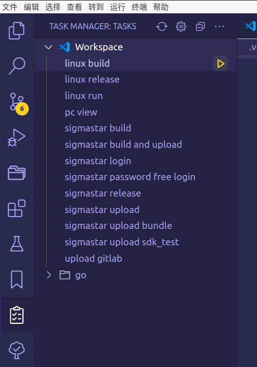
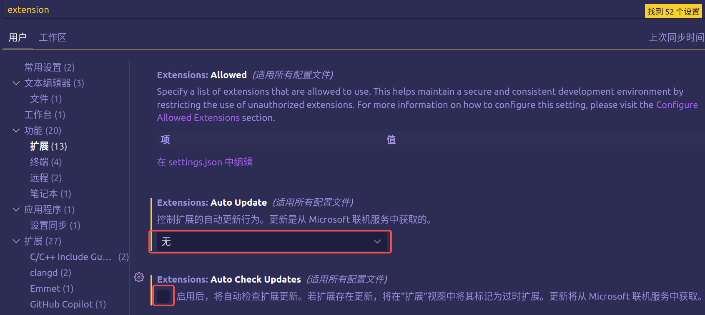
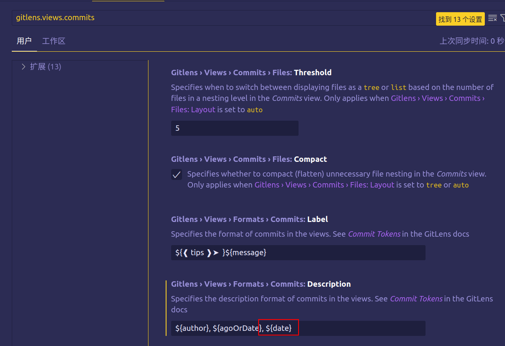
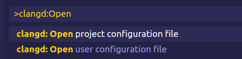
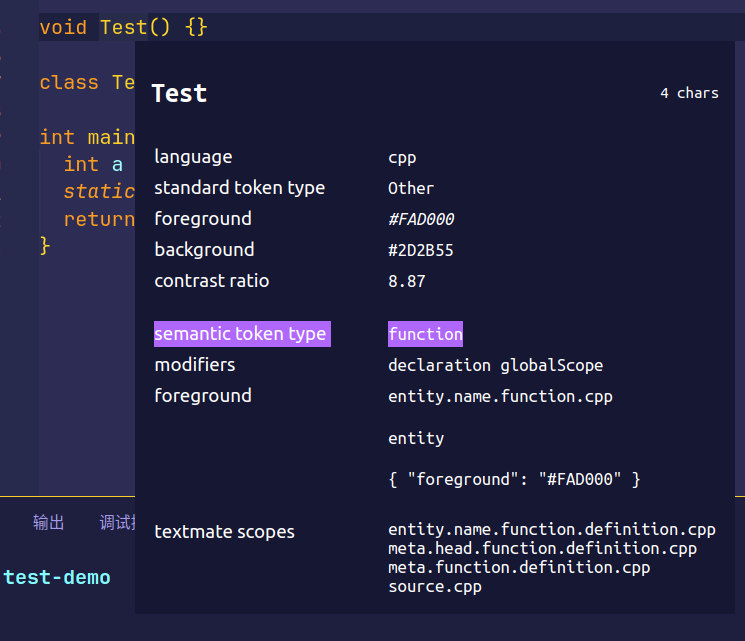

[TOC]

# vscode 入门使用指南

## 配置文件说明

```
.vscode
├── launch.json
├── settings.json
└── tasks.json
```

### setting.json

`settings.json` 是 VS Code 的配置文件，可以对 VS Code 进行页面风格、代码格式、字体颜色大小、插件功能等的编辑设置。

`setting.json` 分【工作区】和【用户】。想象一下你有好几个项目，不同的项目需要不同的配置，所以你可以在每一个项目根路径添加一个 `.vscode/settings.json` 文件来保存对当前工作区的配置。默认使用全局（用户）设置，对每个工作区都会起作用，不过工作区设置会覆盖用户设置，优先级更高。

> Ctrl + P 转到文件，在顶栏输入 `>Open settings`，可以快速打开用户设置(JSON)


### tasks.json

**`tasks.json` 和 `setting.json` 一样，也分「工作区」和「用户」。**

`tasks.json` 文件用于配置任务（Tasks）。任务是自动化执行特定操作的命令序列，可以在开发过程中提高效率。

`tasks.json` 文件定义了一组任务，每个任务包含了命令和配置，用于执行特定的操作，例如编译代码、运行测试、部署应用等。通过配置任务，可以使用快捷键或命令来触发执行这些任务，而无需手动输入命令。

```json
{
    // See https://go.microsoft.com/fwlink/?LinkId=733558
    // for the documentation about the tasks.json format
    "version": "2.0.0",
    "tasks": [
        {
            "label": "linux build",
            "type": "shell",
            "command": "cd recipes/x86_64_u2004 && ./build.sh",
        },
    ]
}
```

- `"label"`：任务的标签，用于在 VS Code 中标识和区分不同的任务。
- `"type"`：任务类型，指定任务的执行方式。常见的类型包括 `"shell"`（使用 shell 命令执行）和 `"process"`（使用外部进程执行）。
- `"command"`：任务的命令，即要执行的具体操作。可以是 shell 命令、外部工具命令、脚本等。

~~我们可以通过安装插件 [Task Manager](https://marketplace.visualstudio.com/items?itemName=cnshenj.vscode-task-manager) 来 Manages tasks in Visual Studio Code in a custom activity view，如下图：~~

~~~~

~~配置好后，我们只需要动动手指点击鼠标就可以执行快速触发这些任务了，非常好用。~~

不再推荐 Task Manager（不支持分组），推荐使用 Task Explorer（支持分组），详情查看后面的插件推荐小节。

#### 设置环境变量

https://stackoverflow.com/questions/52953614/set-environment-variables-in-task-json-in-vscode-for-wsl

## Debug 程序

调试代码需要配置 `launch.json` 文件。

`launch.json` 文件用于配置调试器的行为，以便在调试会话中调试代码。

`launch.json` 文件定义了调试器的配置和调试会话的属性。通过配置该文件，可以指定要调试的程序、命令行参数、环境变量、调试器的类型等。

```json
{
    // 使用 IntelliSense 了解相关属性。
    // 悬停以查看现有属性的描述。
    // 欲了解更多信息，请访问: https://go.microsoft.com/fwlink/?linkid=830387
    "version": "0.2.0",
    "configurations": [
        {
            "name": "Debug",
            "type": "cppdbg",
            "request": "launch",
            "program": "${workspaceFolder}/build/bin/a.out",
            "args": [
                "--flagfile=test.flag",
            ],
            "environment": [
                {
                    "name": "PROJECT",
                    "value": "demo"
                }
            ],
            "cwd": "${workspaceFolder}/build/bin/",
        }
    ]
}
```

- `"configurations"`：定义了一组调试配置的数组。
- `"name"`：调试配置的名称，用于在 VS Code 中标识和区分不同的调试配置。
- `"type"`：指定要使用的调试器类型。根据你的编程语言和工具链不同，可以选择适合的调试器类型，如 `"cppdbg"`（C++ 调试器）、`"node"`（Node.js 调试器）等。
- `"request"`：指定调试器的请求类型。通常为 `"launch"`，表示启动调试会话。
- `"program"`：指定要调试的可执行文件的路径。
- `"args"`：传递给程序的命令行参数。
- `"cwd"`：指定调试器的工作目录，即程序运行的基准目录。

- `"environment"`：指定调试器的环境变量，相当于：`export PROJECT=demo`。

- `${workspaceFolder}`：当前打开的 VS Code 文件夹目录。

配置好运行后相当于：

```bash
cd ${workspaceFolder}/build/bin/
export PROJECT=demo
gdb ${workspaceFolder}/build/bin/a.out
run --flagfile=test.flag
```

> 启动 gdb 调试会话之前我们一般需要首先执行 gcc -g 编译任务。因此，`launch.json` 有一条配置项 `preLaunchTask`，我们可以指向 `tasks.json` 中的编译任务（label）。

## 关闭插件自动升级



## vscode 插件

无论是 golang 还是 c++，一直在用 vscode，可以说 vscode 对于我来说已经无法替代了（主要是**免费**）。记录一些自己用着觉得很好用的插件。

### Go

Rich Go language support for Visual Studio Code

golang 插件，非常非常好用。为什么要用 IDE 写代码，这个插件也许是最好的阐述了。这个插件包括了很多 go 的 tools。静态检查，gofmt 等等，能写出更优雅的代码。

### .gitignore Generator

Lets you easily and quickly generate `.gitignore` file for your project using [gitignore.io](https://gitignore.io/) API.

快速生成 `.gitignore` 文件。

### 翻译(英汉词典)

划词翻译，本地77万词条英汉词典，不依赖任何在线翻译API（速度快），无查询次数限制。

### background

为 vscode 增添一份色彩，Add a lovely background-image to your vscode.

### Fix VSCode Checksums

An extension to to adjust checksums after changes to VSCode core files. Once the checksum changes are applied and VSCode is restarted, all warning about core file modifications will disappear, such as the display of `[Unsupported]` in the title-bar.

因为使用 background 会使得 vscode 显示损坏，强迫症受不了。所以需要用这个插件修复一下。

### Bracket Pair Colorizer

A customizable extension for colorizing matching brackets.

一眼就能看到对应的括号匹配。

**ps：已经被 vscode 官方收编，需要勾选一下启用。**

```json
"editor.guides.bracketPairs": "active"
```

### GitLens

在 vscode 中可视化代码作者身份，还有各种各样 git 相关的功能。

该插件中的 `git commit` 显示的日期格式是相对于今天的，有时候想看具体的日期，可以设置 `git commit` 显示格式

在设置中搜索 `gitlens.views.commits`，如下图添加红色框中的内容即可。



### Git History

查看修改文件的历史版本。

[vscode 的 Git History，GitLens — Git supercharged 插件](http://t.csdn.cn/8eWze)

### ~~MySQL~~

> ~~插件商店中有好几个同名的 MySQL 插件，认准链接：https://marketplace.visualstudio.com/items?itemName=formulahendry.vscode-mysql~~

~~适合轻度使用 mysql 的用户，不用再每次都要在终端中用命令行登录 mysql，相当方便。~~

~~目前无法 rename connections，可以通过改 hosts 的方法去解决：https://github.com/formulahendry/vscode-mysql/issues/16~~

因为查询出来的数据太大的话精度会丢失，不再推荐该插件

### Project Manager

Easily switch between projects.

vscode 每次切换目录都很麻烦，有了这个插件都非常快速的切换不同的项目文件。

右键项目配置标签，可以让项目按照标签分类。

### Todo Tree

Show TODO, FIXME, etc. comment tags in a tree view

### Shades of Purple

好看的一个主题

### Bookmarks

经常在文档几个不同位置跳来跳去的，这个书签插件很实用，右键菜单里直接设置/取消书签，快捷键在不同的书签位置跳转，左边还有当前书签列表，双击立马跳转。

### vscode-icons

丰富 vscode 文件 icons 显示

### Carbon

Carbon 能够轻松地将你的源码生成漂亮的图片并分享

https://github.com/carbon-app/carbon/blob/main/docs/README.cn.zh.md

### clang-format

format C++ 代码格式为 Google Style

### cpplint

cpplint 是 Google 开发的一个 C++ 代码风格检查工具，遵循 google code style。

filter 参数的用法，就是以 `+` 或者 `-` 开头接着写规则名，就表示启用或者屏蔽这些规则。

```json
{
    "cpplint.filters": [
        "-build/include_subdir", // 我们将有自己的头文件路径规范
        "-whitespace/line_length", // 可选项，按个人喜好来
        "-runtime/references", // 不做要求，该要求原为：函数参数列表必须 (const &) 形式 或者 (* 指针) 形式。
        "-build/c++11", // cpp11 不支持的头文件的提示（老是提示 <thread> 等头文件有问题，故屏蔽）
        "-build/header_guard", // 找不到配置 <PROJECT>_<PATH>_<FILE>_ 中 <PROJECT>_ 的方法，故屏蔽
        "-legal/copyright",
    ],
}
```

### clangd

> 参考：https://zhuanlan.zhihu.com/p/364518020

vscode 官方的 cpptools 在大型 C++ 项目中函数跳转很慢，所以改使用 clangd 代替。

clangd 插件下载好后，我们还需要下载 clangd language server，可以使用 vscode 命令直接下载，如下图（也可以去官网手动下载，但是后面注意要手动配置一下 `clangd.path`）。


clangd 是基于 `compile_commands.json` 文件来完成对项目的解析，并支持代码补全和跳转。

我们一般用 cmake，所以生成 `compile_commands.json` 方式就是在 `CMakeLists.txt` 中添加下面的代码即可：

```cmake
set(CMAKE_EXPORT_COMPILE_COMMANDS ON)
if(CMAKE_EXPORT_COMPILE_COMMANDS)
    set(CMAKE_CXX_STANDARD_INCLUDE_DIRECTORIES ${CMAKE_CXX_IMPLICIT_INCLUDE_DIRECTORIES})
endif()
```

生成 `compile_commands.json` 文件后，只需要配置 `--compile-commands-dir` 来指定 `compile_commands.json` 所在的目录即可，建议在【用户】`setting.json` 下配置。

一般 `"clangd.arguments"` 配置项在【工作区】的 `settings.json` 里会再配置一份（`.vscode/settings.json`），因为 `--compile-commands-dir` 指定的路径每个项目可能会不一样。

```json
{
    // clangd 位置，使用 vscode 插件商店下载 language server 会自动配置
    "clangd.path": "/home/tanpanyu/.config/Code/User/globalStorage/llvm-vs-code-extensions.vscode-clangd/install/15.0.6/clangd_15.0.6/bin/clangd",
    "clangd.arguments": [
        // 在后台自动分析文件（基于 complie_commands)
        "--background-index",
        // 标记 compelie_commands.json 文件的目录位置
        "--compile-commands-dir=${workspaceFolder}/build",
        // 同时开启的任务数量
        "-j=12",
        // clang-tidy 功能
        "--clang-tidy",
        // 全局补全（会自动补充头文件）
        "--all-scopes-completion",
        // 更详细的补全内容
        "--completion-style=detailed",
        // 补充头文件的形式
        "--header-insertion=iwyu",
        // pch 优化的位置
        "--pch-storage=disk",
    ],
    // 使用 clangd 会和 vscode 默认推荐的 C/C++ 插件的 IntelliSense 冲突，需要禁止。
    "C_Cpp.intelliSenseEngine": "disabled",
}
```

>clang-tidy 是一个基于 clang 的 C++ 静态分析工具，主要用来检测代码中的常见错误

#### 生成 compile_commands.json 方式

该文件有三种生成方式：

- 使用 cmake 生成 `compile_commands.json`，需要在运行 cmake 时添加参数 `-DCMAKE_EXPORT_COMPILE_COMMANDS=ON` 或者在 `CMakeLists.txt` 中添加 `set(CMAKE_EXPORT_COMPILE_COMMANDS ON)`。这样子我们在 build 目录下就会看到一个 `compelie_commands.json` 文件。

- 如果是基于 make 方式来编译，那么可以先安装 `pip install compiledb`，之后在当前目录下运行

  - `compiledb -n make -C build`
  - `compiledb make -C build`

  这两个命令中的其中一个来生成 `compile_commands.json` 文件，其中前者不会执行真正的 make 编译命令。

- 如果是基于其他方式，可以使用 https://github.com/rizsotto/Bear 项目中的方式来生成对应的 `compile_commands.json` 文件。

#### 交叉编译找不到标准库头文件

使用交叉编译，在 x86 上编译 ARM 程序。然而 clangd 插件会提示找不到标准库的头文件，因为交叉编译使用的是交叉编译器，它有自己的标准库头文件目录。

解决：在 `CMakeLists.txt` 下添加

```cmake
if(CMAKE_EXPORT_COMPILE_COMMANDS)
    set(CMAKE_CXX_STANDARD_INCLUDE_DIRECTORIES ${CMAKE_CXX_IMPLICIT_INCLUDE_DIRECTORIES})
endif()
```

参考文章：[CMAKE_EXPORT_COMPILE_COMMANDS: Implicit include directories and compile_commands.json](https://gitlab.kitware.com/cmake/cmake/-/issues/20912)

#### clangd 配置

there are two ways to change the [clangd config options](https://clangd.llvm.org/config.html):

- creating a `~/.config/clangd/config.yaml` text file, which will affect all projects
- creating a `.clangd` in a specific project directory

可以通过 vscode 命令来创建



编辑配置文件文件，如：屏蔽特定告警等。

```yaml
Diagnostics:
  Suppress: 'builtin_definition' # 屏蔽该告警
  # 配置 ClangTidy
  ClangTidy:
    Add:
      [
        performance-*,
        bugprone-*,
        portability-*,
        modernize-*,
        google-*,
      ]
    Remove: modernize-use-trailing-return-type
    CheckOptions:
      WarnOnFloatingPointNarrowingConversion: false

CompileFlags:
# -ferror-limit=0, Too many errors emitted, stopping now  [clang: fatal_too_many_errors] 消除这个告警
  Add: [-ferror-limit=0, -Wunused-variable]
```

参考文章：

- [Clangd config](https://ahmadsamir.github.io/posts/12-clangd-config-tweaks.html)
- [Too many errors emitted, stopping now [clang: fatal_too_many_errors]](https://github.com/clangd/coc-clangd/issues/255)

#### clangd 其他设置

安装 clangd 默认打开内联提示（Inlay Hints），可以选择关闭。

[vscode 关闭函数调用时的形参显示](https://blog.csdn.net/airhcoaz/article/details/124850316)

### highlight

该插件可将选中的单词进行高亮

https://marketplace.visualstudio.com/items?itemName=debugpig.highlight

### plantuml

配置 vscode+plantuml 绘制时序图和类图环境

1、vscode 安装 plantuml 插件

2、安装依赖

```bash
sudo apt install graphviz
sudo apt-get install openjdk-8-jdk
```

### ~~Task Manager~~

~~可视化管理我们的的 `tasks.json` 中的 task~~

~~Manages tasks in Visual Studio Code in a custom activity view.~~

~~https://marketplace.visualstudio.com/items?itemName=cnshenj.vscode-task-manager~~

不再推荐 Task Manager。因为 Task Manager 不支持分组，所以当项目多的时候，使用和管理起来就特别麻烦。

### Task Explorer

可视化管理和执行我们的的 `tasks.json` 中的 task

>该插件默认关闭 Enable Side Bar，需要手动打开，方便操作

该插件弥补了 Task Manager 缺少的分组功能：https://github.com/spmeesseman/vscode-taskexplorer#using-groups-with-a-separator

- 其他问题

Q：右键对某个 task 执行了 Add to excludes list 操作后如何恢复？

A：在当前工作区的 `.vscode/settings.json` 中，删除 `"taskExplorer.excludeTask"` 即可

## 操作技巧

### 重命名符号

我们重命名一个变量、函数或者类名，一般操作方式是进行全局搜索替换。我们可以使用「重命名符号」这个操作，来简单快速替换所有相关的代码。操作步骤：选中类名或变量名，然后右键选择「重命名符号」。

### 正则表达式

https://docs.pingcode.com/ask/ask-ask/108395.html

`$n`：n 是个数字，这个是替换时使用括号 `()` 将匹配的 pattern 分割成了几个元素，然后在替换的 pattern 里面使用，类似于变量。如果查找 pattern 是 `(\w+)(\s)(\w+)`，那么 `$1`就是 `(\w+)`，`$2` 是 `(\s)`，`$3` 是 `(\w+)`。

## 其他问题

### 右键弹出菜单然后立即消失

> 发生的问题出现在 Ubuntu 系统下

解决方法：[the popup menu coming on right click disappears instantly in vscode](https://stackoverflow.com/questions/66419930/the-popup-menu-coming-on-right-click-disappears-instantly-in-vscode)

1. Install "Easystroke Gesture Recognition" from repository.

   ```
   sudo apt-get install easystroke
   ```

2. Open Easystroke and go to the preferences tab, click on "Gesture Button", and right click on the rectangular area to select the right mouse button.

3. In the "Timeout Profile" dropdown list pick up "Timeout Off".

4. 设置开机启动，然后再弹出的窗口中设置 easystroke 安装路径即可（通过 which easystroke 查看） 。

   ```
   gnome-session-properties
   ```

### 设置代码颜色

https://code.visualstudio.com/docs/cpp/colorization-cpp

```json
{
    // 设置代码颜色（局部变量、全局变量、函数、宏、属性）
    "editor.semanticTokenColorCustomizations": {
        "enabled": true, // enable for all themes
        "rules": {
            "property": {   // Semantic Token name：成员变量（属性）
                "foreground": "#ff9ce4",
                // "fontStyle": "bold"
            },
        }
    }
}
```

但是有时候，我们不知道代码对应的 Semantic Token name，我们可以通过 vscode 中的【检查编辑器标记和作用域】功能来查看。


```
>Developer: inspect editor tokens and scopes
```



### vscode ssh 远程报错

vscode 连接到远程服务器后，会自动服务器上下载对应版本的 vscode-server。这个 server 默认会下载在 `~/.vscode-server/bin/{commit-id}/` 文件夹下。

这个 commit-id 对应的是本机执行 `code --version` 命令的打印输出。

```bash
1.83.0
e7e037083ff4455cf320e344325dacb480062c3c
x64
```

下载过程可能会有如下报错：

```bash
错误: 无法验证 update.code.visualstudio.com 的由 “CN=ZeroSSL RSA Domain Secure Site CA,O=ZeroSSL,C=AT” 颁发的证书: 无法本地校验颁发者的权限。 错误: 没有匹配的证书主体别名 (Subject Alternative Name)。 请求的主机名为 “update.code.visualstudio.com”。 要以不安全的方式连接至 update.code.visualstudio.com，使用“--no-check-certificate”。
```

解决方案：

在远程终端手动下载 vscode-server，解压后把文件夹里的内容复制到对应的目录下。

```sh
wget --no-check-certificate https://update.code.visualstudio.com/commit:e7e037083ff4455cf320e344325dacb480062c3c/server-linux-x64/stable -O vscode-server.tar.gz
```

最终结果

```bash
ls ~/.vscode-server/bin/e7e037083ff4455cf320e344325dacb480062c3c
bin  extensions  LICENSE  node  node_modules  out  package.json  product.json
```

### 搜索 .gitignore 忽略的文件

vscode 默认不会搜索 `.gitignore` 忽略的文件和文件夹。解决方式：

go to Preferences > Settings, uncheck the option **search:Use Ignore Files**, then it works

https://stackoverflow.com/a/65672683/24490421
