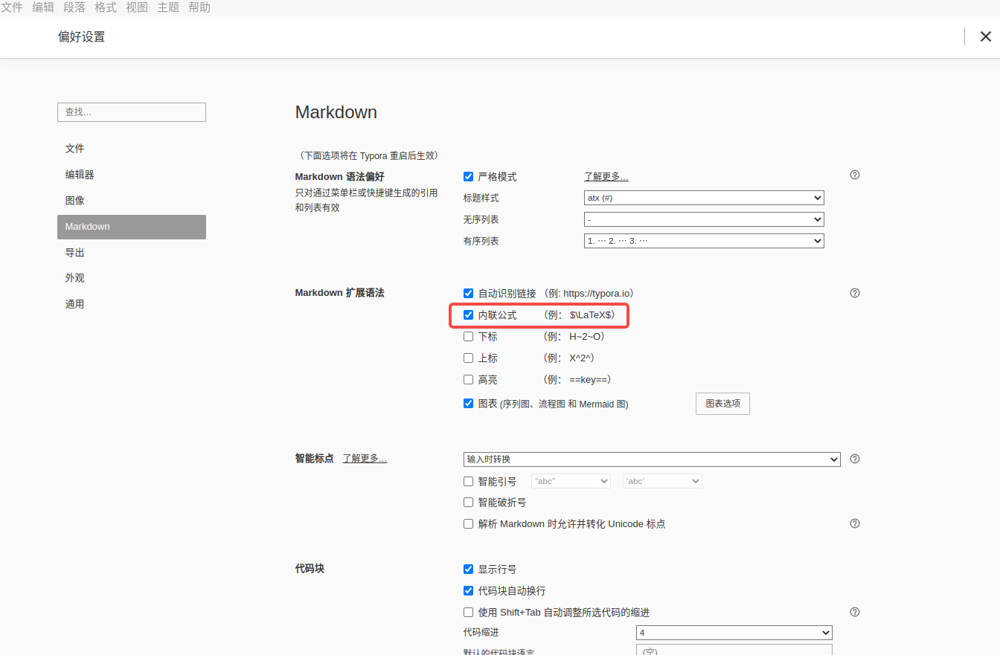

[TOC]

# 使用 Python 生成 Latex 数学公式

## 快速上手

- Github 地址

https://github.com/google/latexify_py

- 支持的 Python 版本

Syntaxes on **Pythons 3.7 to 3.11** are officially supported, or will be supported.

- 安装模块

```shell
pip install latexify-py
```

- 编写代码

```python
import math  # Optional
import numpy as np  # Optional
import latexify

@latexify.function
def solve(a, b, c):
  return (-b + math.sqrt(b**2 - 4*a*c)) / (2*a)

print(solve)

# latexify.expression works similarly, but does not output the signature.
@latexify.expression
def solve(a, b, c):
  return (-b + math.sqrt(b**2 - 4*a*c)) / (2*a)

print(solve)

```

- 输出

```bash
\mathrm{solve}(a, b, c) = \frac{-b + \sqrt{ b^{2} - 4 a c }}{2 a}
\frac{-b + \sqrt{ b^{2} - 4 a c }}{2 a}
```

$$
\mathrm{solve}(a, b, c) = \frac{-b + \sqrt{ b^{2} - 4 a c }}{2 a}
$$

$$
\frac{-b + \sqrt{ b^{2} - 4 a c }}{2 a}
$$

## 在 Typroa 中输入数学公式

### 公式块

在文中输入 `$$`，再按下回车。

### 将公式嵌入文字内

前提条件：勾选「内联公式」选项。

在 `$$` 的中间加入需要的公式。

