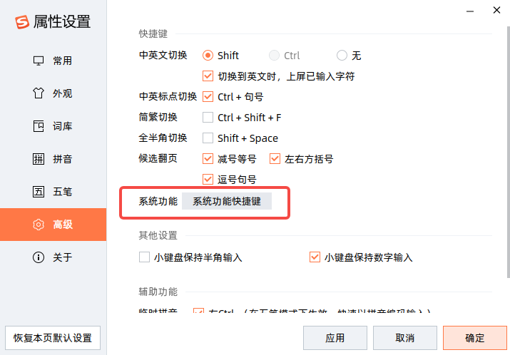
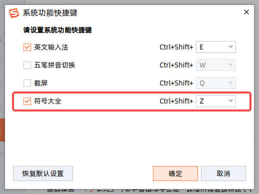
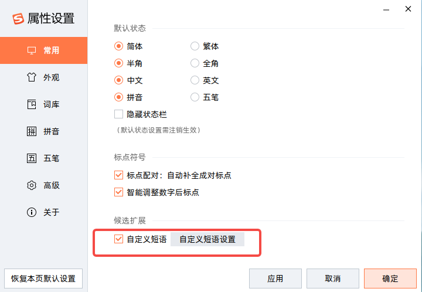
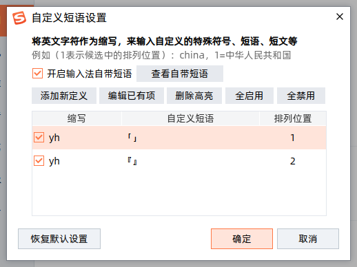
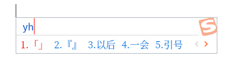

[TOC]

# 如何输入直角引号

## 为什么要用直角引号

用法：

> 「老师，『有条不紊』的『紊』是什么意思？」

对比用法：

> “老师，‘有条不紊’的‘紊’是什么意思？”

可以看到，直角引号更容易分辨，也更美观。

## 如何输入直角引号

如果是 Mac 或者 Windows 系统，那么可以参考知乎：[如何输入直角引号（「」和『』 ）？](https://www.zhihu.com/question/19755746)

如果是 Linux，可以参考：[linux 下，fcitx 输入法的直角引号设置](https://www.xianmin.org/post/linux-fcitx-punc/)

## Ubuntu 下搜狗输入法输入直角引号

但是我发现这个方式并不适用于我，我使用的系统是 Ubuntu 20.04，输入法是 [搜狗输入法](https://shurufa.sogou.com/)。以下是我的解决方法。

### 符号大全

搜狗输入法有一个功能：「符号大全」，快捷键为 `Ctrl + Shift + Z`

- 快捷键效果

### 自定义短语

如果每次使用「符号大全」这样子输入的话，效率还是太慢了，所以我们用到了该输入法的另外一个功能：「自定义短语」。结合「符号大全」功能，我们就可以快速输入直角符号了。

- 输入效果

