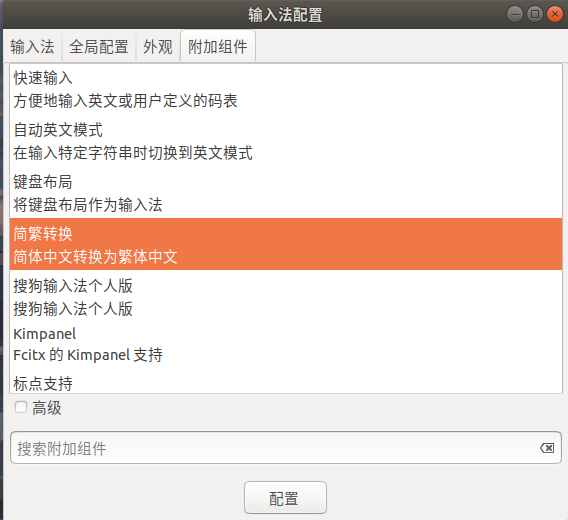
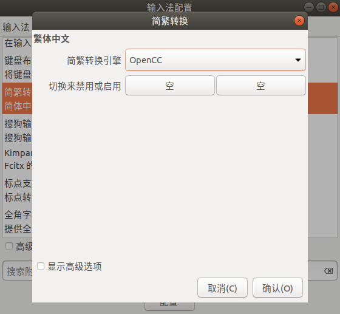
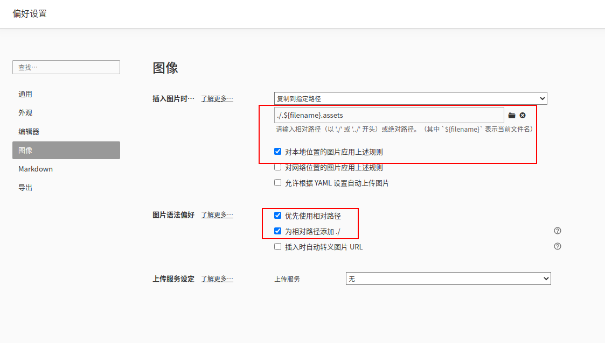
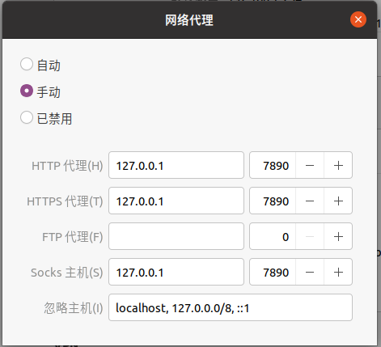

# Linux 新系统配置

> 除特殊说明，该配置都是基于 Ubuntu 18.04
>
> 使用 cat /etc/issue 查看 Linux 发型版本

## 说明

### apt 和 apt-get 区别

在终端中使用的时候，直接 apt install 即可。对于语法而言，apt 和 apt-get 在大多数情况下都是一样的。

apt 是一个命令行工具，是用来和用户进行交互的，可以简单理解为不能在脚本中使用。

apt-get 命令应该用在脚本中。

## 软件下载和安装

### ssh

```bash
ssh-keygen
```

### pip 和 pip3

```
sudo apt install python-pip
sudo apt-get install --reinstall python3-pip
```

### python

[在 Ubuntu20.04 上安装 python2 并设置为默认方式](https://blog.csdn.net/My_CSDN_IT/article/details/114323834)

### vim

```
sudo apt-get install vim
```

### 设置 sudo 免密码

```bash
sudo chmod 744 /etc/sudoers
sudo vi /etc/sudoers
# 在文件最后一行添加 yourusername ALL=(ALL) NOPASSWD:ALL
sudo chmod 400 /etc/sudoer
```

### git

```
sudo apt-get install git
```

配置 git，`vim ~/.gitconfig`

```bash
[user]
	name = xxx
	email = xxx
[alias]
	st = status 
   	br = branch
	ci = commit
	plr = pull --rebase
	co = checkout
	bd = branch -D
	pd = push --delete origin
	lg = log --color --graph --pretty=format:'%Cred%h%Creset -%C(yellow)%d%Creset %s %Cgreen(%cr) %C(bold blue)<%an>%Creset' --abbrev-commit --no-merges
	aa = add .
	can = commit --amend --no-edit
	ca = commit --amend
[core]
	quotepath = false
```

### 安装 JetBrains Mono 字体

https://www.jetbrains.com/lp/mono/#how-to-install

### gcc 和 g++

```
sudo apt install gcc
sudo apt install g++
```

### oy-my-zsh

先安装 zsh

```
sudo apt install zsh
```

再安装 oy-my-zsh

```
sh -c "$(curl -fsSL https://raw.githubusercontent.com/robbyrussell/oh-my-zsh/master/tools/install.sh)"
```

#### 安装 oy-my-zsh 插件

历史命令（zsh-autosuggestions），命令高亮（zsh-syntax-highlighting）

```bash
git clone https://github.com/zsh-users/zsh-autosuggestions
git clone https://github.com/zsh-users/zsh-syntax-highlighting
```

下载好后移动到 `/usr/local/share/`，

```bash
sudo mv zsh-autosuggestions zsh-syntax-highlighting /usr/local/share/
```

在文件 `~/.zshrc` 最后写入：

```bash
source /usr/local/share/zsh-autosuggestions/zsh-autosuggestions.zsh
source /usr/local/share/zsh-syntax-highlighting/zsh-syntax-highlighting.zsh
```

保存后终端输入 `source ~/.zshrc` 并重启终端。

- 修改默认 shell 为 zsh，输入命令后需要重启电脑。

```bash
chsh -s /bin/zsh
```

### cmake

手动下载最新版本的 cmake，https://cmake.org/download/

安装步骤：

```bash
# 解压
tar -xzvf cmake-3.25.2-linux-x86_64.tar.gz
# 解压出来的包，将其放在 /opt 目录下，其他目录也可以，主要别以后不小心删了
sudo mv cmake-3.25.2-linux-x86_64 /opt/
# 建立软链接
sudo ln -sf /opt/cmake-3.25.2-linux-x86_64/bin/*  /usr/bin/
# 查看 cmake 版本
cmake --version
```

### docker

```
sudo apt update && sudo apt install docker.io
```

[Docker 启动 Get Permission Denied ](https://www.cnblogs.com/informatics/p/8276172.html)，然后需要再重启电脑。

- 换源备份

```bash
cp /etc/apt/sources.list /etc/apt/sources.list.bak
```

全部覆盖 sources.list

````
deb http://mirrors.aliyun.com/ubuntu/ bionic main restricted universe multiverse
deb http://mirrors.aliyun.com/ubuntu/ bionic-security main restricted universe multiverse
deb http://mirrors.aliyun.com/ubuntu/ bionic-updates main restricted universe multiverse
deb http://mirrors.aliyun.com/ubuntu/ bionic-proposed main restricted universe multiverse
deb http://mirrors.aliyun.com/ubuntu/ bionic-backports main restricted universe multiverse
deb-src http://mirrors.aliyun.com/ubuntu/ bionic main restricted universe multiverse
deb-src http://mirrors.aliyun.com/ubuntu/ bionic-security main restricted universe multiverse
deb-src http://mirrors.aliyun.com/ubuntu/ bionic-updates main restricted universe multiverse
deb-src http://mirrors.aliyun.com/ubuntu/ bionic-proposed main restricted universe multiverse
deb-src http://mirrors.aliyun.com/ubuntu/ bionic-backports main restricted universe multiverse
````

然后更新缓存

```bash
apt-get clean all
apt-get update
```

### 搜狗输入法

https://shurufa.sogou.com/linux/guide

使用第一种方法安装完后发现不能输入中文，输入第二种方法 Ubuntu20.04 安装搜狗输入法步骤中的命令：

```bash
sudo apt install libqt5qml5 libqt5quick5 libqt5quickwidgets5 qml-module-qtquick2
sudo apt install libgsettings-qt1
```

- 关闭系统输入法简繁体转换（因为 Ctrl + Shift + F 快捷键会和其他程序冲突）

在右上角图标点击打开输入法配置



点击配置附件组件的简繁体转换，然后把“切换来禁用或启用”的 `Ctrl + Shift + F` 设置为空（回车）。



### qq

https://im.qq.com/download

### 钉钉

https://page.dingtalk.com/wow/z/dingtalk/simple/ddhomedownlaod#/

### WPS

https://www.wps.cn/

打开文档软件会提示系统缺失 windows 的字体，解决方法：https://github.com/pengphei/wps-font-symbols/

### Typora

设置插入图片规则：`./.${filename}.assets`



### vscode

https://code.visualstudio.com/

#### 右键单击时弹出的菜单在 vscode 中立即消失

解决方法：[the popup menu coming on right click disappears instantly in vscode](https://stackoverflow.com/questions/66419930/the-popup-menu-coming-on-right-click-disappears-instantly-in-vscode)

1. Install "Easystroke Gesture Recognition" from repository

   ```
   sudo apt-get install easystroke
   ```

2. Open Easystroke and go to the preferences tab, click on "Gesture Button", and right click on the rectangular area to select the right mouse button.

3. In the "Timeout Profile" dropdown list pick up "Timeout Off"

4. 设置开机启动，然后再弹出的窗口中设置 easystroke 安装路径即可（通过 which easystroke 查看） 。

   ```
   gnome-session-properties
   ```

#### 配置 plantuml 环境

配置 vscode+plantuml 绘制时序图和类图环境

1、vscode 安装 plantuml 插件

2、安装

```bash
sudo apt install graphviz
sudo apt-get install openjdk-8-jdk
```

#### 安装 cpplint

```
pip install cpplint
```

### conan

```bash
sudo pip3 install conan
```

https://docs.conan.io/en/latest/getting_started.html

### 安装 clash

github 地址：[Clash for Windows](https://github.com/Fndroid/clash-win-docs-new)

安装参考：[在 Linux 下使用 Clash For Windows 管理 Clash 订阅](https://einverne.github.io/post/2021/10/linux-use-clash-for-windows.html)

下载 0.20.16 版本出现所有节点 timeout 不可用，下载 0.18.5 可以使用。

安装好后，开启软件，还需要设置网络代理模式为手动，并配置代理地址和端口。



关闭软件后需要禁用网络代理来保证正常上网。

我们也可以通过命令快快速设置网络代理的模式，参考：[如何在桌面版 Ubuntu 中用命令行更改系统代理设置](https://linux.cn/article-5673-1.html)

```bash
gsettings set org.gnome.system.proxy mode 'manual' # 设置网络代理模式为手动
gsettings set org.gnome.system.proxy mode 'none' # 紧用网络代理模式
```

### 微信

https://github.com/huan/docker-wechat

```bash
curl -sL https://gitee.com/mirrors/dochat/raw/main/dochat.sh | bash
```

运行脚本后报错

```bash
[DoChat] 盒装微信 v0.15.0 Disabling patch for /home/user/.wine/drive_c/users/user/AppData/Roaming/Tencent/WeChat ... Disabling patch for /home/user/.wine/drive_c/users/user/Application Data/Tencent/WeChat ... mkdir: 无法创建目录 “/home/user/.wine/drive_c/users/user/Application Data/Tencent”: 权限不够 
```

原因：`$HOME/DoChat` 目录没有写权限。执行 `chown -R $USER $HOME/DoChat`

https://github.com/huan/docker-wechat/issues/178

### 配置 alias 快捷命令

```bash
alias vpnrun="gsettings set org.gnome.system.proxy mode 'manual' && /opt/'Clash for Windows-0.18.5-x64-linux'/cfw"
alias vpnstop="gsettings set org.gnome.system.proxy mode 'none'"
alias wechatrun="/opt/dochat.sh"
alias wechatstop="docker stop DoChat"
```

