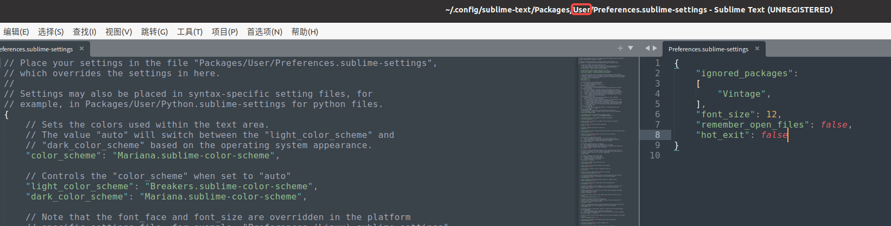

[TOC]

# Linux 新系统配置

> 除特殊说明，该配置都是基于 Ubuntu 18.04
>
> 使用 cat /etc/issue 查看 Linux 发型版本

## 说明

### apt 和 apt-get 区别

在终端中使用的时候，直接 apt install 即可。对于语法而言，apt 和 apt-get 在大多数情况下都是一样的。

apt 是一个命令行工具，是用来和用户进行交互的，可以简单理解为不能在脚本中使用。

apt-get 命令应该用在脚本中。

## 更换源

1. 备份源

```bash
sudo cp /etc/apt/sources.list /etc/apt/sources.list.bak
```

2. 打开文件

```bash
sudo vim /etc/apt/sources.list
```

3. 替换内容

```bash
deb https://repo.huaweicloud.com/ubuntu/ focal main restricted
deb https://repo.huaweicloud.com/ubuntu/ focal-updates main restricted
deb https://repo.huaweicloud.com/ubuntu/ focal universe
deb https://repo.huaweicloud.com/ubuntu/ focal-updates universe
deb https://repo.huaweicloud.com/ubuntu/ focal-backports main restricted universe
deb https://repo.huaweicloud.com/ubuntu/ focal-security main restricted
deb https://repo.huaweicloud.com/ubuntu/ focal-security universe
```

4. 保存退出，更新软件列表

```bash
sudo apt-get update
sudo apt-get upgrade
```

## 软件下载和安装

### ssh

```bash
ssh-keygen
```

把公钥上传到远程机器上，实现免密登录。

```bash
ssh-copy-id username@ip
```

### pip 和 pip3

```
sudo apt install python-pip
sudo apt-get install --reinstall python3-pip
```

### python

[在 Ubuntu20.04 上安装 python2 并设置为默认方式](https://blog.csdn.net/My_CSDN_IT/article/details/114323834)

#### ubuntu 1804 中 python 错误

```bash
File "/usr/lib/python3.6/encodings/ascii.py", line 26, in decode
return codecs.ascii_decode(input, self.errors)[0]
UnicodeDecodeError: 'ascii' codec can't decode byte 0xe8 in position 1342: ordinal not in range(128)
```

[UnicodeDecodeError: 'ascii' codec can't decode byte 0xd1 in position 2: ordinal not in range(128)](https://stackoverflow.com/questions/10406135/unicodedecodeerror-ascii-codec-cant-decode-byte-0xd1-in-position-2-ordinal)

参考回答

https://stackoverflow.com/a/59292909/24490421

```bash
sudo apt install locales
sudo locale-gen en_US en_US.UTF-8
sudo dpkg-reconfigure locales
```

通过 `locale` 命令查看是否设置成 UTF-8，如果不行尝试设置环境变量：

```bash
echo "export LC_ALL=en_US.UTF-8" >> ~/.bashrc
echo "export LANG=en_US.UTF-8" >> ~/.bashrc
echo "export LANGUAGE=en_US.UTF-8" >> ~/.bashrc
```

### vim

```
sudo apt-get install vim
```

### 设置 sudo 免密码

```bash
sudo chmod 744 /etc/sudoers
sudo vi /etc/sudoers
# 在文件最后一行添加 yourusername ALL=(ALL) NOPASSWD:ALL
sudo chmod 400 /etc/sudoers
```

### git

```
sudo apt-get install git
```

具体配置查看之前写的 git 文档

### 安装 JetBrains Mono 字体

https://www.jetbrains.com/lp/mono/#how-to-install

### gcc 和 g++

```
sudo apt install gcc
sudo apt install g++
```

### cmake

手动下载最新版本的 cmake，https://cmake.org/download/

安装步骤：

```bash
# 解压
tar -xzvf cmake-3.25.2-linux-x86_64.tar.gz
# 解压出来的包，将其放在 /opt 目录下，其他目录也可以，主要别以后不小心删了
sudo mv cmake-3.25.2-linux-x86_64 /opt/
# 建立软链接
sudo ln -sf /opt/cmake-3.25.2-linux-x86_64/bin/*  /usr/bin/
# 查看 cmake 版本
cmake --version
```

### docker

```
sudo apt update && sudo apt install docker.io
```

[Docker 启动 Get Permission Denied ](https://www.cnblogs.com/informatics/p/8276172.html)，然后需要再重启电脑。

- 换源备份

```bash
cp /etc/apt/sources.list /etc/apt/sources.list.bak
```

全部覆盖 sources.list

````
deb http://mirrors.aliyun.com/ubuntu/ bionic main restricted universe multiverse
deb http://mirrors.aliyun.com/ubuntu/ bionic-security main restricted universe multiverse
deb http://mirrors.aliyun.com/ubuntu/ bionic-updates main restricted universe multiverse
deb http://mirrors.aliyun.com/ubuntu/ bionic-proposed main restricted universe multiverse
deb http://mirrors.aliyun.com/ubuntu/ bionic-backports main restricted universe multiverse
deb-src http://mirrors.aliyun.com/ubuntu/ bionic main restricted universe multiverse
deb-src http://mirrors.aliyun.com/ubuntu/ bionic-security main restricted universe multiverse
deb-src http://mirrors.aliyun.com/ubuntu/ bionic-updates main restricted universe multiverse
deb-src http://mirrors.aliyun.com/ubuntu/ bionic-proposed main restricted universe multiverse
deb-src http://mirrors.aliyun.com/ubuntu/ bionic-backports main restricted universe multiverse
````

**然后更新缓存**

```bash
apt-get clean all
apt-get update
```

### 搜狗输入法

https://shurufa.sogou.com/linux/guide

使用第一种方法安装完后发现不能输入中文，输入第二种方法 Ubuntu20.04 安装搜狗输入法步骤中的命令：

```bash
sudo apt install libqt5qml5 libqt5quick5 libqt5quickwidgets5 qml-module-qtquick2
sudo apt install libgsettings-qt1
```

- 关闭系统输入法简繁体转换（因为 Ctrl + Shift + F 快捷键会和其他程序冲突）

在右上角图标点击打开输入法配置


点击配置附件组件的简繁体转换，然后把“切换来禁用或启用”的 `Ctrl + Shift + F` 设置为空（回车）。


关闭完这个后可能还不能生效，还需要关闭应用内的设置


### qq

https://im.qq.com/download

### 钉钉

https://page.dingtalk.com/wow/z/dingtalk/simple/ddhomedownlaod#/

### WPS

https://www.wps.cn/

打开文档软件会提示系统缺失 windows 的字体，解决方法：https://github.com/pengphei/wps-font-symbols/

### Typora

- 设置插入图片规则：`./.${filename}.assets`


- 设置换行


- 设置内联公式


### vscode

https://code.visualstudio.com/

### conan

```bash
sudo pip3 install conan
```

https://docs.conan.io/en/latest/getting_started.html

### 安装 clash

github 地址：[Clash for Windows](https://github.com/Fndroid/clash-win-docs-new)

安装参考：[在 Linux 下使用 Clash For Windows 管理 Clash 订阅](https://einverne.github.io/post/2021/10/linux-use-clash-for-windows.html)

下载 0.20.16 版本出现所有节点 timeout 不可用，下载 0.18.5 可以使用。

安装好后，开启软件，还需要设置网络代理模式为手动，并配置代理地址和端口。


关闭软件后需要禁用网络代理来保证正常上网。

我们也可以通过命令快快速设置网络代理的模式，参考：[如何在桌面版 Ubuntu 中用命令行更改系统代理设置](https://linux.cn/article-5673-1.html)

```bash
gsettings set org.gnome.system.proxy mode 'manual' # 设置网络代理模式为手动
gsettings set org.gnome.system.proxy mode 'none' # 禁用网络代理模式
```

### 微信

https://github.com/lovechoudoufu/wechat_for_linux/releases

~~https://github.com/huan/docker-wechat~~

```bash
curl -sL https://gitee.com/mirrors/dochat/raw/main/dochat.sh | bash
```

~~运行脚本后报错~~

```bash
[DoChat] 盒装微信 v0.15.0 Disabling patch for /home/user/.wine/drive_c/users/user/AppData/Roaming/Tencent/WeChat ... Disabling patch for /home/user/.wine/drive_c/users/user/Application Data/Tencent/WeChat ... mkdir: 无法创建目录 “/home/user/.wine/drive_c/users/user/Application Data/Tencent”: 权限不够
```

~~原因：`$HOME/DoChat` 目录没有写权限。执行 `chown -R $USER $HOME/DoChat`~~

~~https://github.com/huan/docker-wechat/issues/178~~

### 配置 alias 快捷命令

```bash
alias vpnrun="gsettings set org.gnome.system.proxy mode 'manual' && /opt/'Clash for Windows-0.18.5-x64-linux'/cfw"
alias vpnstop="gsettings set org.gnome.system.proxy mode 'none'"
alias wechatrun="/opt/dochat.sh"
alias wechatstop="docker stop DoChat"
```

### ~~notepad--~~

~~查看日志不错的软件~~

~~https://gitee.com/cxasm/notepad--~~

### Sublime Text

https://www.sublimetext.com/

不再推荐使用 `notepad--`。因为在 Linux 下无法打开比较大的日志（300 MB 左右的日志）。测试发现该软件打开文本非常快。需要安装插件：Filter Lines

```
Package Control Messages
========================

Filter Lines
------------

  Quickly find lines that match a string or regular expression.

  To filter your file to lines that contain a string or match a regex:

    Edit > Line > Filter With Regex  (cmd + K  cmd + R)
    Edit > Line > Filter With String  (cmd + K  cmd + S)

  To fold your file to lines that contain a string or match a regex:

    Edit > Code Folding > Fold With Regex
    Edit > Code Folding > Fold With String

  On Windows and Linux, use ctrl instead of cmd.


  For feedback, bugs, and source code:

  https://github.com/davidpeckham/sublimetext-filterlines
```

#### 设置不记忆之前打开的文件

> 如果之前打开了多个大型日志文件，关闭软件前没有手动去关闭这些文件。那么下一次打开 sublime 就会重新打开加载这些文件，导致非常卡。

在 user 的 `Preferences.sublime-settings` 最后添加这两行：

```
"remember_open_files": false,
"hot_exit": false
```


设置左边是 default 配置，右边是 user 配置。user 会覆盖 default 配置。



### 视频播放器 MPV

```
sudo apt install mpv
```

- 快捷键

向前一帧：`,`

向后一帧：`.`

- 设置视频默认应用程序


#### 自定义快捷键

配置文件路径：`~/.config/mpv/input.conf`

https://mpv.io/manual/stable/#command-interface

https://github.com/mpv-player/mpv/blob/master/etc/input.conf

- 设置播放倍数

```bash
[ multiply speed 1/1.1                 # decrease the playback speed
] multiply speed 1.1                   # increase the playback speed
{ multiply speed 0.5                   # halve the playback speed
} multiply speed 2.0                   # double the playback speed
BS set speed 1.0                       # reset the speed to normal
```

> BS 为退格键 Backspace

- 画面旋转

https://askubuntu.com/questions/1212733/rotate-video-by-a-keyboard-shortcut-in-mpv

### FFmpeg

FFmpeg 是一套可以用来记录、转换数字音频、视频，并能将其转化为流的开源计算机程序。

```bash
sudo apt install ffmpeg
```

- 裁剪视频

```bash
ffmpeg -i input.mp4 -ss 00:07:05 -to 00:07:40 -c:v copy -c:a copy output.mp4
```

`input.mp4`：要裁剪的视频文件的名称。

`-ss 00:07:05`：指定开始裁剪的时间戳，即 7 分 05 秒。

`-to 00:07:40`：指定裁剪结束的时间戳，即 7 分 40 秒。这里如果省略就表示到视频的结尾。

`-c:v copy` 和 `-c:a copy` 表示将视频和音频流以原始格式复制到输出文件，以避免重新编码。

等待 FFmpeg 处理完毕，裁剪的视频将保存为 `output.mp4` 文件，出现在您的当前工作目录中。

### 终端复用器 Tmux

**感觉 WindTerm 更好用，功能更多**

Tmux: https://docs.hpc.sjtu.edu.cn/login/tmux.html

配置文件 `~/.tmux.conf`

```bash
bind-key -n C-Up select-pane -U
bind-key -n C-Down select-pane -D
bind-key -n C-Left select-pane -L
bind-key -n C-Right select-pane -R

#bind-key -n % split-window -h
#bind-key -n '"' split-window -v

# List of plugins
set -g @plugin 'tmux-plugins/tpm'
set -g @plugin 'tmux-plugins/tmux-sensible'
set -g @plugin 'tmux-plugins/tmux-resurrect'
set -g @plugin 'tmux-plugins/tmux-yank' # 需要安装依赖 sudo apt-get install xsel
# Other examples:
set -g @resurrect-save-bash-history 'on'
set -g @resurrect-capture-pane-contents 'on'

# Initialize TMUX plugin manager (keep this line at the very bottom of tmux.conf)
set -g @resurrect-dir '~/.tmux/sessions'
set -g history-limit 20000
set -g set-clipboard on
run '~/.tmux/plugins/tpm/tpm'

set -g mouse on
unbind -T copy-mode MouseDragEnd1Pane
```

安装插件需要先安装 TPM：用于管理其他 tmux 插件（安装、更新、卸载）

```bash
git clone https://github.com/tmux-plugins/tpm ~/.tmux/plugins/tpm
```

在 tmux 中按 `Ctrl+ b + I` 安装其他插件

重新加载配置文件：`tmux source-file ~/.tmux.conf`

### WindTerm

> 跨平台终端工具，替代 Tmux

- 简单的使用教程：https://zhuanlan.zhihu.com/p/468501270
- 其他补充：`Ctrl +` 放大字体

#### 拷贝文字

- 鼠标选中文字，按 `y` 复制，按 `ESC` 退出复制

### gimp 方便查看像素坐标的图像处理程序

https://www.gimp.org/

## Windows 文件名中文乱码

问题：Windows 的 zip 压缩包里面的文件名在 Linux 下是乱码。

推荐使用指定编码解压：`unzip -O CP936 windows.zip`

```python
import os
import sys

# 文件名在内存中的表示：
# 文件名在内存中是以字节串（byte string）的形式存储的。
# 当我们从文件系统读取文件名时，Python 会尝试用系统默认编码（在 Linux 下通常是 UTF-8）将字节串解码为字符串（string）。
# 乱码的产生：
# 如果文件名实际是用 GBK 编码的，而 Python 试图用 UTF-8 解码，那么解码出来的字符串会是乱码，因为 UTF-8 和 GBK 是不同的编码标准。
# 解决思路：
# 我们需要将这个错误解码的字符串重新编码回原始的字节串，然后再用正确的编码（GBK）解码。
# 具体步骤
# itemname.encode('iso-8859-1')：
# 假设 itemname 是一个已经被错误解码的字符串（即乱码字符串）。
# 我们将这个乱码字符串用 iso-8859-1 编码，这个编码不会改变字节的值，只是简单地将字符串中的每个字符转换为其对应的字节值。
# 结果是我们得到了原始的字节串。
def rename_item(item_path):
    try:
        itemname = os.path.basename(item_path)

        # 用 GBK 解码文件名，并再用 UTF-8 编码
        new_itemname = itemname.encode('iso-8859-1').decode('gbk')
        new_itemname = new_itemname.encode('utf-8').decode('utf-8')

        old_item_path = os.path.join(os.path.dirname(item_path), itemname)
        new_item_path = os.path.join(os.path.dirname(item_path), new_itemname)

        os.rename(old_item_path, new_item_path)
        print(f'Renamed: {itemname} -> {new_itemname}')
    except (UnicodeEncodeError, UnicodeDecodeError):
        print(f'Failed to rename: {itemname}')

def rename_items_in_directory(directory):
    for item in os.listdir(directory):
        item_path = os.path.join(directory, item)
        rename_item(item_path)
    rename_item(directory)

if __name__ == "__main__":
    if len(sys.argv) < 2:
        print("Usage: python convert_gbk_to_utf8.py <argument>")
        sys.exit(1)
    argument = sys.argv[1]

    if os.path.isfile(argument):
        rename_item(argument)
    elif os.path.isdir(argument):
        rename_items_in_directory(argument)
    else:
        print(f'Invalid path: {argument}')

```

因为 Windows 下使用的是 GBK 编码，Linux 是 UTF-8，所以文件名显示会有问题

## 通过 SSH 远程打开 GUI 应用程序

要通过 SSH 远程打开 GUI 应用程序，可以使用 X11 转发。

### 在服务器端（远程机器）

安装 `xauth` 和 `x11-apps`：

```bash
sudo apt update
sudo apt install xauth x11-apps
```

配置 SSH 服务：

```bash
sudo vi /etc/ssh/sshd_config
```

确保以下行存在并且没有被注释掉：

```bash
X11Forwarding yes
```

保存并关闭文件，然后重新启动 SSH 服务：

```bash
sudo systemctl restart ssh
```

### 在客户端（本地机器）

确保本地计算机上有 X11 服务器在运行。Ubuntu 通常会默认运行 X11 服务器。使用 `-X` 选项来启用 X11 转发：

```bash
ssh -X username@remote_host
```

### 运行 GUI 应用程序

连接到远程机器后，可以直接运行想要的 GUI 应用程序。例如：

```bash
xclock
```

如果一切正常，会在本地机器上看到一个时钟窗口。

## 设置 HTTP 代理

```bash
export https_proxy=http://127.0.0.1:7897
export http_proxy=http://127.0.0.1:7897
```

设置这个变量后，许多命令行工具和网络应用程序会自动使用这个代理进行 HTTP 请求。例如，`curl`、`wget`、`apt-get`、`git` 等工具。

```bash
unset https_proxy
unset http_proxy
```

### 局域网代理

代理工具需要开启局域网选项。同一局域网的机器可以通过访问这台机器的 IP 和软件的端口实现网络转发。


