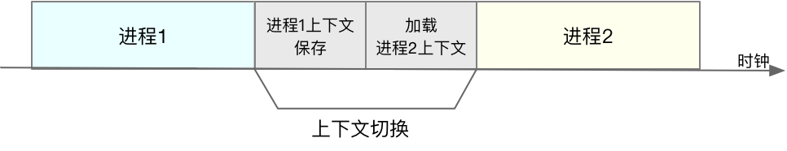

[TOC]

# CPU 上下文切换

Linux 是一个多**任务**操作系统，它支持远大于 CPU 数量的任务同时运行。当然，这些任务实际上并不是真的在同时运行，而是因为系统在很短的时间内，将 CPU 轮流分配给它们，造成多任务同时运行的错觉。

而在每个任务运行前，CPU 都需要知道任务从哪里加载、又从哪里开始运行，也就是说，需要系统事先帮它设置好 **CPU 寄存器和程序计数器**（Program Counter，PC）。

- CPU 寄存器，是 CPU 内置的容量小、但速度极快的内存。

- 程序计数器（**也是一个 CPU 寄存器**），则是用来存储 CPU 正在执行的指令位置（地址）、或者即将执行的下一条指令位置。

它们都是 CPU 在运行任何任务前，必须的依赖环境，因此也被叫做 **CPU 上下文**。

CPU 上下文切换，就是先把前一个任务的 CPU 上下文（也就是 CPU 寄存器和程序计数器）保存起来，然后加载新任务的上下文到这些寄存器和程序计数器，最后再跳转到程序计数器所指的新位置，运行新任务。

而这些保存下来的上下文，会存储在系统内核中，并在任务重新调度执行时再次加载进来。这样就能保证任务原来的状态不受影响，让任务看起来还是连续运行。

不知道你有没有想过，操作系统管理的这些 “任务” 到底是什么呢？也许你会说，任务就是进程，或者说任务就是线程。是的，进程和线程正是最常见的任务。但是除此之外，还有没有其他的任务呢？不要忘了，硬件通过触发信号，会导致中断处理程序的调用，也是一种常见的任务。

所以，根据任务的不同，CPU 的上下文切换就可以分为几个不同的场景，也就是**进程上下文切换、线程上下文切换以及中断上下文切换**。

## 进程上下文切换

Linux 按照特权等级，把进程的运行空间分为内核空间和用户空间。进程在用户空间运行时，被称为进程的用户态，而陷入内核空间的时候，被称为进程的内核态。从用户态到内核态的转变，需要通过**系统调用**来完成。

而系统调用就会发生 CPU 的上下文切换：

1. CPU 寄存器里原来用户态的指令位置，需要先保存起来。接着，为了执行内核态代码，CPU 寄存器需要更新为内核态指令的新位置。最后才是跳转到内核态运行内核任务。

2. 而系统调用结束后，CPU 寄存器需要恢复原来保存的用户态，然后再切换到用户空间，继续运行进程。

**所以，一次系统调用的过程，其实是发生了两次 CPU 上下文切换**。

不过，需要注意的是，系统调用过程中，并不会涉及到虚拟内存等进程用户态的资源，也不会切换进程。这跟我们通常所说的进程上下文切换是不一样的：

- 进程上下文切换，是指从一个进程切换到另一个进程运行。

- 而系统调用过程中一直是同一个进程在运行。

系统调用过程通常称为特权模式切换。

那么，进程上下文切换跟系统调用又有什么区别呢？

首先，你需要知道，**进程是由内核来管理和调度的，进程的切换只能发生在内核态**。所以，进程的上下文不仅包括了虚拟内存、栈、全局变量等用户空间的资源，还包括了内核堆栈、寄存器等内核空间的状态。

因此，进程的上下文切换就比系统调用时多了一步：**在保存当前进程的内核状态和 CPU 寄存器之前，需要先把该进程的虚拟内存、栈等保存下来；而加载了下一进程的内核态后，还需要刷新进程的虚拟内存和用户栈**。

每次上下文切换都需要几十纳秒到数微秒的 CPU 时间。这个时间还是相当可观的，特别是在进程上下文切换次数较多的情况下，很容易导致 CPU 将大量时间耗费在寄存器、内核栈以及虚拟内存等资源的保存和恢复上，进而大大缩短了真正运行进程的时间。

另外，我们知道， Linux 通过 TLB（Translation Lookaside Buffer）来管理虚拟内存到物理内存的映射关系。当**虚拟内存更新后，TLB 也需要刷新，内存的访问也会随之变慢。**特别是在多处理器系统上，缓存是被多个处理器共享的，刷新缓存不仅会影响当前处理器的进程，还会影响共享缓存的其他处理器的进程。

> 什么时候会发生上下文切换？

在进程调度的时候，才需要切换上下文。Linux 为每个 CPU 都维护了一个就绪队列，将活跃进程（即正在运行和正在等待 CPU 的进程）按照优先级和等待 CPU 的时间排序，然后选择最需要 CPU 的进程，也就是优先级最高和等待 CPU 时间最长的进程来运行。

那么，进程在什么时候才会被调度到 CPU 上运行呢？

1. 为了保证所有进程可以得到公平调度，CPU 时间被划分为一段段的时间片，这些时间片再被轮流分配给各个进程。这样，当某个进程的时间片耗尽了，就会被系统挂起，切换到其它正在等待 CPU 的进程运行。

2. 进程在系统资源不足（比如内存不足）时，要等到资源满足后才可以运行，这个时候进程也会被挂起，并由系统调度其他进程运行。

3. 当进程通过睡眠函数 sleep 这样的方法将自己主动挂起时，自然也会重新调度。

4. 当有优先级更高的进程运行时，为了保证高优先级进程的运行，当前进程会被挂起，由高优先级进程来运行。

5. 发生硬件中断时，CPU 上的进程会被中断挂起，转而执行内核中的中断服务程序。

## 线程上下文切换

线程与进程最大的区别在于，线程是调度的基本单位，而进程则是资源拥有的基本单位。说白了，**所谓内核中的任务调度，实际上的调度对象是线程**；而进程只是给线程提供了**虚拟内存、全局变量**等资源。所以，对于线程和进程，我们可以这么理解：

- 当进程只有一个线程时，可以认为进程就等于线程。

- 当进程拥有多个线程时，这些线程会共享相同的虚拟内存和全局变量等资源。这些资源在上下文切换时是不需要修改的。

- 另外，线程也有自己的私有数据，比如栈和寄存器等，这些在上下文切换时也是需要保存的。

这么一来，线程的上下文切换其实就可以分为两种情况：

第一种， 前后两个线程属于不同进程。此时，因为资源不共享，所以切换过程就跟进程上下文切换是一样。

第二种，前后两个线程属于同一个进程。此时，因为虚拟内存是共享的，所以在切换时，虚拟内存这些资源就保持不动，只需要切换线程的**私有数据、寄存器等不共享的数据**。

到这里你应该也发现了，虽然同为上下文切换，但同进程内的线程切换，要比多进程间的切换消耗更少的资源，而这，也正是多线程代替多进程的一个优势。

## 中断上下文切换

为了快速响应硬件的事件，**中断处理会打断进程的正常调度和执行**，转而调用中断处理程序，响应设备事件。

而在打断其他进程时，就需要将进程当前的状态保存下来，这样在中断结束后，进程仍然可以从原来的状态恢复运行。但跟进程上下文不同，**中断上下文切换并不涉及到进程的用户态**。所以，即便中断过程打断了一个正处在用户态的进程，也**不需要保存和恢复这个进程的虚拟内存、全局变量等用户态资源**。中断上下文，其实只包括内核态中断服务程序执行所必需的状态，包括 CPU 寄存器、内核堆栈、硬件中断参数等。

另外，跟进程上下文切换一样，中断上下文切换也需要消耗 CPU，切换次数过多也会耗费大量的 CPU，甚至严重降低系统的整体性能。

## 参考文章

- [03 | 基础篇：经常说的 CPU 上下文切换是什么意思？（上）](https://time.geekbang.org/column/article/69859)