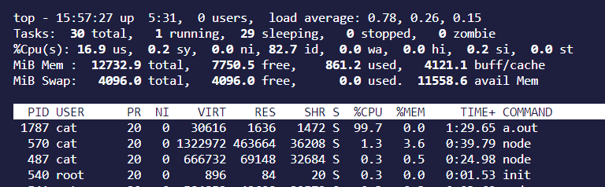
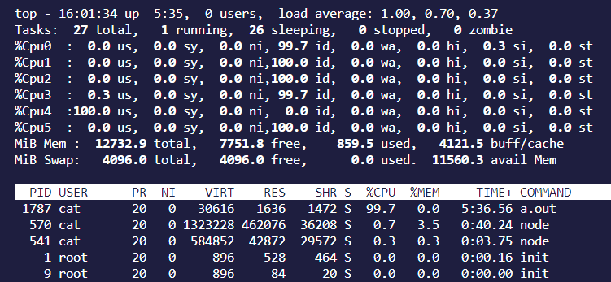
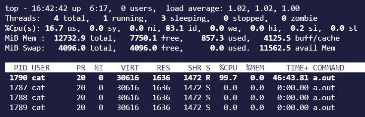

[TOC]

# CPU 使用率过高如何查询

## 模拟一个 CPU 高的场景

- test.cpp

```c++
#include <iostream>
#include <map>
#include <string>
#include <string.h>
#include <mutex>
#include <vector>
#include <unordered_map>
#include <stack>
#include <set>
#include <queue>
#include <unistd.h>

using namespace std;

// 线程函数 A
void *threadA(void *data)
{
    sleep(30 * 60 * 1000);
    return (void *)0;
}

void *threadB(void *data)
{
    sleep(30 * 60 * 1000);
    return (void *)0;
}

void *hightCpuThread(void *data)
{
    int i = 0;
    while (true)
    {
        i++;
    }
    return (void *)0;
}

int main()
{
    pthread_t tidA, tidB, tidC;

    //创建线程
    pthread_create(&tidA, NULL, threadA, NULL);
    pthread_create(&tidB, NULL, threadB, NULL);
    pthread_create(&tidC, NULL, hightCpuThread, NULL);

    pthread_join(tidA, NULL);
    pthread_join(tidB, NULL);
    pthread_join(tidC, NULL);

    printf("exit\n");

    return 0;
}
```

- 编译并运行

```bash
g++ test.cpp -pthread -g && ./a.out
```

## 排查步骤

### top 找到占用 CPU 最高的进程

`top` 命令能够实时显示系统各个**进程**的资源占用情。



这里重点讲一下第三行 `%Cpu(s)` 和进程 `%CPU` 的区别和联系。更多详细信息参考：[linux之top命令](https://blog.csdn.net/yuangan1529/article/details/118295564)。

在 `top` 界面按 1。会显示出每个 Cpu 核的占用率情况。



通过上面的显示我们发现 `Cpu(s): 16.9 us` 表示的是所有用户进程（us，user system，用户空间）占用整个 Cpu 的平均值。由于每个核心占用的百分比不同，所以按平均值来算比较有参考意义（100  + 0.3 / 6 * 100 = 16.9）。

而 `%CPU` 显示的是**进程占用一个核的百分比**，而不是整个 Cpu（6 核）的百分比（上图可以看到 %Cpu4 被占满了 ）。有时候可能大于 100，那是因为该进程启用了多线程占用了多个核心，所以有时候我们看该值会超过 100%，但不会超过`总核数*100`。

补充：如果我们想要 Cpu 占用率从大到小排序话，在 top 界面按下大写 `H` 即可。

### top -Hp 命令查看占用 CPU 最高的线程

`top` 只能看到进程的 Cpu 占用率，多线程的程序我们需要加上选项 H。`top -Hp PID` 查看某个进程内部线程占用情况（也写做 `top -H -p PID`）

这里我们查看 a.out 这个进程的内部线程情况 `top -Hp 1787`。



可以看到 PID 为 1790 这个线程占用的 Cpu 最高。

### pstack 查看线程堆栈信息

我们使用 `pstack 1790` 打印该线程的堆栈信息。

补充：pstack 只能打印 C/C++ 的程序，不同的程序有不同的打印堆栈工具，如 JAVA 下的 jstack。

```bash
% pstack 1790                                               
Thread 1 (Thread 0x7f291a16e700 (LWP 1790)):
#0  0x000056118d395262 in hightCpuThread (data=0x0) at test.cpp:33
#1  0x00007f291b4db609 in start_thread (arg=<optimized out>) at pthread_create.c:477
#2  0x00007f291b402293 in clone () at ../sysdeps/unix/sysv/linux/x86_64/clone.S:95
```

多次敲命令 `pstack 1790`，发现最后的堆栈调用信息都是在 `in hightCpuThread (data=0x0) at test.cpp:33` 这里。所以我们可以大概推断是这里的代码有问题。根据输出的信息，检查业务代码 test.cpp 的 33 行，根据上下文，可以确认是死循环导致。

### 进阶：使用 gdb 查看更多详细信息

我们可以使用 gdb attach 到该进程（线程）上去调试去获取更多详细信息（如一些变量的值等）：`gdb -p 1787`（注意这里 attach 的是 a.out 这个进程（包括所有的线程），而不是 hightCpuThread 这单个线程）。但是这会产生一个问题，gdb attatch 到进程（线程）上时，**会停止该进程**（线程）。如果是线上环境，那就不能这样子做，毕竟线上环境可不能停止。

所以我们这里是用 `gcore PID` 这个命令。`gcore 1787` 生成 a.out 这个进程 core 文件。

`gcore` 也是 GDB 的一个 shell 脚本。

```bash
% ps aux | grep a.out                                                     
cat       1787 99.8  0.0  30616  1720 pts/5    Sl+  15:55  92:46 ./a.out

% gcore 1787                                                         
[New LWP 1788]
[New LWP 1789]
[New LWP 1790]
[Thread debugging using libthread_db enabled]
Using host libthread_db library "/lib/x86_64-linux-gnu/libthread_db.so.1".
0x00007f291b4dccd7 in __pthread_clockjoin_ex () from /lib/x86_64-linux-gnu/libpthread.so.0
Saved corefile core.1787
[Inferior 1 (process 1787) detached]

% ls                                                          
a.out  core.1787  test.cpp
```

- 什么是 core 文件？

应用程序运行出错或异常退出时（或者手动生成），在满足一定条件下产生一个 core 文件，例如程序收到 SIGABRT、SIGEMT 等信号时都会出现 core dump（同时需要打开core dump设置），我们平时见到最多的应该就是段错误。

core 文件包含了程序运行时内存、寄存器状态、堆栈指针、内存管理信息以及函数调用堆栈信息。我们通过分析 core 文件可以找到应用程序崩溃的地方。

可以简单认为，普通 gdb 调试是在线调试（停止进程），使用 gdb core 文件调试是离线调试。

- 使用方法：`gdb [可执行源文件] [core 文件]`

```bash
% ls                                                        
a.out  core.1787  test.cpp

% gdb a.out core.1787

(gdb) info thread
  Id   Target Id                        Frame 
* 1    Thread 0x7f291b171740 (LWP 1787) __pthread_clockjoin_ex (threadid=139814524880640, thread_return=0x0, clockid=<optimized out>, 
    abstime=<optimized out>, block=<optimized out>) at pthread_join_common.c:145
  2    Thread 0x7f291b170700 (LWP 1788) 0x00007f291b3c03bf in __GI___clock_nanosleep (clock_id=clock_id@entry=0, flags=flags@entry=0, 
    req=req@entry=0x7f291b16fea0, rem=rem@entry=0x7f291b16fea0) at ../sysdeps/unix/sysv/linux/clock_nanosleep.c:78
  3    Thread 0x7f291a96f700 (LWP 1789) 0x00007f291b3c03bf in __GI___clock_nanosleep (clock_id=clock_id@entry=0, flags=flags@entry=0, 
    req=req@entry=0x7f291a96eea0, rem=rem@entry=0x7f291a96eea0) at ../sysdeps/unix/sysv/linux/clock_nanosleep.c:78
  4    Thread 0x7f291a16e700 (LWP 1790) 0x000056118d395262 in hightCpuThread (data=0x0) at test.cpp:33
(gdb) t 4
[Switching to thread 4 (Thread 0x7f291a16e700 (LWP 1790))]
#0  0x000056118d395262 in hightCpuThread (data=0x0) at test.cpp:33
33              i++;
(gdb) bt
#0  0x000056118d395262 in hightCpuThread (data=0x0) at test.cpp:33
#1  0x00007f291b4db609 in start_thread (arg=<optimized out>) at pthread_create.c:477
#2  0x00007f291b402293 in clone () at ../sysdeps/unix/sysv/linux/x86_64/clone.S:95
(gdb) l
28      void *hightCpuThread(void *data)
29      {
30          int i = 0;
31          while (true)
32          {
33              i++;
34          }
35          return (void *)0;
36      }
37
```

## 参考文章

- [linux 之 top 命令](https://blog.csdn.net/yuangan1529/article/details/118295564)
- [面试官问：平时碰到系统CPU飙高和频繁GC，你会怎么排查？ - 古时的风筝的回答 - 知乎](https://www.zhihu.com/question/344856364/answer/2521220496)
- [请教运维大佬， strace -p [pid] 没有任何输出，但是该 pid 占用 CPU 百分百](https://www.v2ex.com/t/782818)