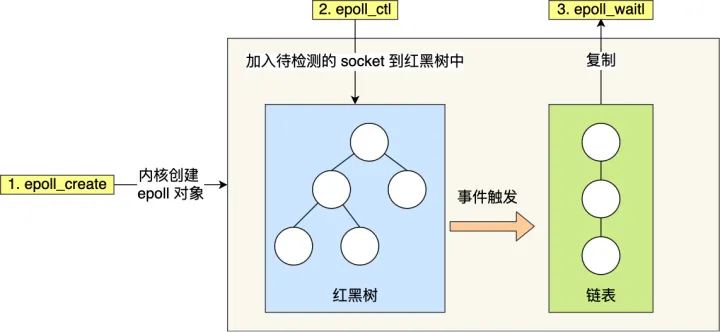

[TOC]

# I/O 多路复用

## 最基本的 Socket 模型

最基础的 TCP 的 Socket 编程，它是阻塞 I/O 模型，基本上只能一对一通信，那为了服务更多的客户端，我们需要改进网络 I/O 模型。

比较传统的方式是使用多进程/线程模型，每来一个客户端连接，就分配一个进程/线程，然后后续的读写都在对应的进程/线程，这种方式处理 100 个客户端没问题，但是当客户端增大到 10000 个时，10000 个进程/线程的调度、上下文切换以及它们占用的内存，都会成为瓶颈。

既然为每个请求分配一个进程/线程的方式不合适，那有没有可能只使用一个进程来维护多个 Socket 呢？答案是有的，那就是 **I/O 多路复用**技术。


## 核心思想

我有非常多的连接（socket），我希望通过一个线程或少量线程同时「监听」这些连接，看哪些连接有数据（读/写/异常）发生，然后再处理它们。

### 为什么要这么做

1. 有成千上万个连接，不可能每个都分配一个线程（太浪费资源，线程上下文切换开销大）。
2. 大多数连接在大多数时间其实是「空闲的」——没有数据可读写。
3. 所以我们希望只在「有事发生」的连接上花时间处理，这就是 IO 多路复用要解决的问题。

### 举例说明

假设你是一个客服（服务器），客户（客户端）非常多。

- 你不会每个客户安排一个专门的客服代表（线程）全天盯着。
- 而是用一个「耳机广播系统」（epoll/select），
  - 监听所有客户谁在喊「喂」。
  - 有人说话（有数据到达），你再过去接待。

这个「监听谁说话」的功能就是 IO 多路复用。

## 常见的 IO 多路复用技术

### select

select 设计思想：假如能够预先传入一个 socket 列表，**如果列表中的 socket 都没有数据，挂起进程，直到有一个 socket 收到数据，唤醒进程**。

在如下的代码中，先准备一个数组（下面代码中的 fds），让 fds 存放着所有需要监视的 socket。然后调用 select，如果 fds 中的所有 socket 都没有数据，select 会阻塞，直到有一个 socket 接收到数据，select 返回，唤醒进程。用户可以遍历 fds，通过 FD_ISSET 判断具体哪个 socket 收到数据，然后做出处理。

```c++
int s = socket(AF_INET, SOCK_STREAM, 0);  
bind(s, ...)
listen(s, ...)

int fds[] =  存放需要监听的socket

while(1){
    int n = select(..., fds, ...)
    for(int i=0; i < fds.count; i++){
        if(FD_ISSET(fds[i], ...)){
            //fds[i]的数据处理
        }
    }
}
```

- **具体细节**

select 实现多路复用的方式是，将已连接的 Socket 都放到一个**文件描述符集合**，然后调用 select 函数将文件描述符集合**拷贝**到内核里，让内核来检查是否有网络事件产生，检查的方式很粗暴，就是通过**遍历**文件描述符集合的方式，当检查到有事件产生后，将此 Socket 标记为可读或可写， 接着再把整个文件描述符集合**拷贝**回用户态里，然后用户态还需要再通过**遍历**的方法找到可读或可写的 Socket，然后再对其处理。

所以，对于 select 这种方式，需要进行 **2 次「遍历」文件描述符集合**，一次是在内核态里，一个次是在用户态里 ，而且还会发生 **2 次「拷贝」文件描述符集合**，先从用户空间传入内核空间，由内核修改后，再传出到用户空间中。

select 使用固定长度的 BitsMap，表示文件描述符集合，而且所支持的文件描述符的个数是有限制的，在 Linux 系统中，由内核中的 FD_SETSIZE 限制， 默认最大值为 `1024`，只能监听 0~1023 的文件描述符。

### poll

poll 不再用 BitsMap 来存储所关注的文件描述符，取而代之用动态数组，以链表形式来组织，突破了 select 的文件描述符个数限制，当然还会受到系统文件描述符限制。

但是 poll 和 select 并没有太大的本质区别，**都是使用「线性结构」存储进程关注的 Socket 集合，因此都需要遍历文件描述符集合来找到可读或可写的 Socket，时间复杂度为 O(n)，而且也需要在用户态与内核态之间拷贝文件描述符集合**，这种方式随着并发数上来，性能的损耗会呈指数级增长。

### epoll

epoll 通过两个方面，很好解决了 select/poll 的问题。

第一点，epoll 在内核里使用**红黑树来跟踪进程所有待检测的文件描述字**，把需要监控的 socket 通过 `epoll_ctl()` 函数加入内核中的红黑树里，红黑树是个高效的数据结构，增删查一般时间复杂度是 `O(logn)`，通过对这棵黑红树进行操作，这样就不需要像 select/poll 每次操作时都传入整个 socket 集合，只需要传入一个待检测的 socket，减少了内核和用户空间大量的数据拷贝和内存分配。

第二点， epoll 使用事件驱动的机制，内核里**维护了一个链表来记录就绪事件**，当某个 socket 有事件发生时，通过回调函数，内核会将其加入到这个就绪事件列表中，当用户调用 `epoll_wait()` 函数时，只会返回有事件发生的文件描述符的个数，所以时间复杂度为 O(1)，不需要像 select/poll 那样轮询扫描整个 socket 集合，大大提高了检测的效率。

从下图你可以看到 epoll 相关的接口作用：



## 其他

需要指出的是，**IO 复用虽然能同时监听多个文件描述符，但它本身是阻塞的**。并且当多个文件描述符同时就绪时，如果不采取额外的措施，程序就只能按顺序依次处理其中的每一个文件描述符，这使得服务器程序看起来像是事行工作的。**如果要实现并发，只能使用多进程或多线程等编程手段**。

## 参考文章

- https://zhuanlan.zhihu.com/p/64138532
- https://www.zhihu.com/question/32163005/answer/1802684879