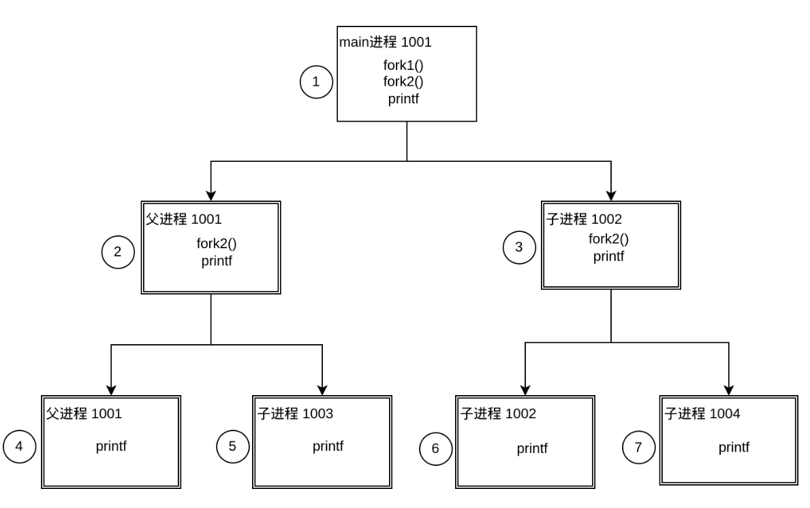

[TOC]

# fork

在 Linux 系统中，`fork()` 是一个非常常见的系统调用。它的作用是复制一个进程，创建一个新的进程作为原始进程的子进程。

当一个进程调用 `fork()` 时，操作系统会复制原始进程的所有代码段、数据段和堆栈等信息，然后在内核中创建一个新的进程，称为子进程。这个新进程和原始进程几乎完全相同，唯一的区别是它有一个新的进程 ID 和一个新的父进程 ID，即原始进程的 ID。

子进程会从 `fork()` 函数返回，返回值是一个整数，如果它是 0，则表示当前进程是子进程，否则它是父进程，并返回子进程的 PID。这种复制进程的机制使得一个进程可以在自己的地址空间中运行独立的代码，不会影响原始进程。

## 代码示例

在 fork 函数执行完毕后，如果创建新进程成功，则出现两个进程，一个是子进程，一个是父进程。

在子进程中，fork 函数返回 0，在父进程中，fork 返回新创建子进程的进程 ID。我们可以通过 fork 返回的值来判断当前进程是子进程还是父进程。

`getppid()`：得到一个进程的父进程的 PID。

`getpid()`：得到当前进程的 PID。

一次调用，两次返回。在调用 fork 后，fork 函数后面的所有代码会执行两遍。

一个简单的例子：

```c++
#include <stdio.h>
#include <stdlib.h>
#include <unistd.h>

int main() {
  int cnt = 0;
  pid_t pid;
  pid = fork();
  if (pid < 0) {
    perror("fork error");
  } else if (pid == 0) {
    // 子进程
    printf("child pid = %d\n", getpid());
    cnt++;
  } else {  // pid > 0
    // 父进程
    printf("parent pid = %d\n", getpid());
    cnt++;
  }
  // 退出 if 语句后，父子进程都会执行到这行代码
  printf("cnt = %d, pid = %d\n", cnt, getpid());

  getchar();
  return 0;
}
```

打印输出：

```shell
➜  test-demo g++ main.cpp -o fork_test  
➜  test-demo ./fork_test              
parent pid = 133921
cnt = 1, pid = 133921
child pid = 133922
cnt = 1, pid = 133922
```

`ps` 查看进程：

```bash
➜  test-demo ps -ef | grep fork_test
jinx      133921   29933  0 11:56 pts/3    00:00:00 ./fork_test
jinx      133922  133921  0 11:56 pts/3    00:00:00 ./fork_test
```

我们看另一个稍微复杂点的例子：

```c++
int main() {
  printf("main pid = %d\n", getpid());
  fork();  // fork1
  fork();  // fork2
  printf("pid = %d, love\n", getpid());
  return 0;
}
```

打印结果输出：

```bash
main pid = 134500
pid = 134500, love
pid = 134502, love
pid = 134501, love
pid = 134503, love
```

图解上面的代码：



## 参考文章

- [fork 函数详解 - CSDN](https://blog.csdn.net/weixin_51609435/article/details/124849719)

