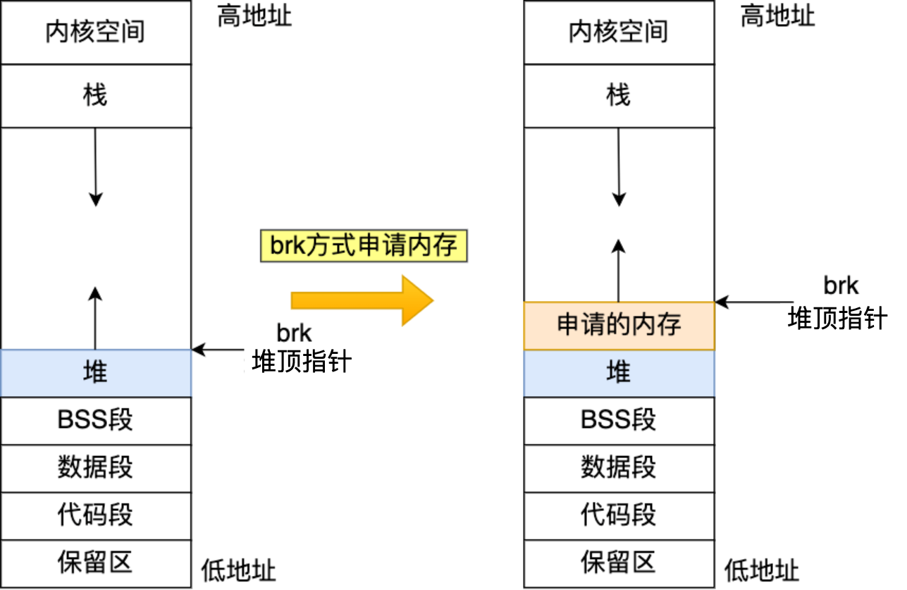
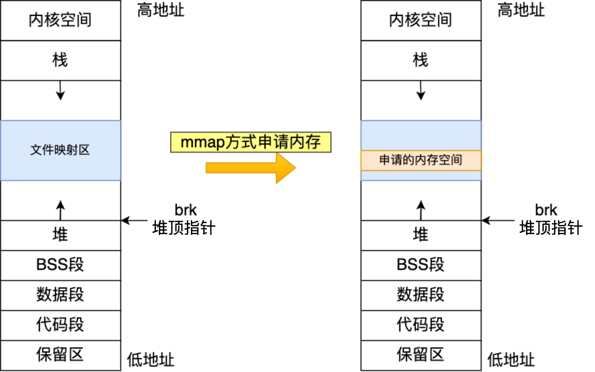

[TOC]

# malloc 是如何分配内存的

实际上，malloc 并不是系统调用，而是 C 库里的函数，用于动态分配内存。

malloc 申请内存的时候，会有两种方式向操作系统申请堆内存。

- 方式一：通过 brk 系统调用从堆分配内存。
- 方式二：通过 mmap 系统调用在文件映射区域分配内存。

方式一实现的方式很简单，就是通过 brk 函数将「堆顶」指针向高地址移动，获得新的内存空间。如下图：

方式二通过 mmap 系统调用中「私有匿名映射」的方式，在文件映射区分配一块内存，也就是从文件映射区 “偷” 了一块内存。如下图：

> mmap 系统调用的另一个用途就是进行文件映射。
>
> 文件一般都是通过一系列文件 IO 操作系统调用来访问，用 open 打开文件，讲磁盘文件加载到内存中，然后通过 read，write 进行读写，最后 close 关闭文件。
>
> 如果读写次数比较多的话会频繁的发生系统调用，因此为了提升性能，可以在 open 打开文件后使用 mmap 将磁盘文件直接映射到虚拟内存，然后只要对这段映射的虚拟内存进行读写访问，CPU 就会触发缺页中断，把磁盘文件加载到主存上并与虚拟内存建立映射。之后，无论文件是否已被 close，只要读写这段内存，系统会自动把脏页回写到磁盘中，相当于完成了 read，write 等文件操作，不再需要通过系统调用的状态切换这个过程。

那什么场景下 malloc 会通过 brk 分配内存？又是什么场景下通过 mmap 分配内存？

malloc 源码里默认定义了一个阈值：

- 如果用户分配的内存小于 128 KB，则通过 brk 申请内存；
- 如果用户分配的内存大于 128 KB，则通过 mmap 申请内存；

注意，不同的 glibc 版本定义的阈值也是不同的。

## malloc 分配的是物理内存吗？

不是的，**malloc 分配的是虚拟内存**。如果分配后的虚拟内存没有被访问的话，虚拟内存是不会映射到物理内存的，这样就不会占用物理内存了。

只有在访问已分配的虚拟地址空间的时候，操作系统通过查找页表，发现虚拟内存对应的页没有在物理内存中，就会触发缺页中断，然后操作系统会建立虚拟内存和物理内存之间的映射关系。

## malloc(1) 会分配多大的虚拟内存？

malloc 在分配内存的时候，并不是老老实实按用户预期申请的字节数来分配内存空间大小，而是**会预分配更大的空间作为内存池**。

具体会预分配多大的空间，跟 malloc 使用的内存管理器有关系，我们就以 malloc 默认的内存管理器（Ptmalloc2）来分析。

假设当前堆上已有的空闲内存不足以提供 `malloc(1)` 申请的大小时，此时 brk 堆顶指针移动一段大于 1 的空间。一方面，需要在这部分内存的前面**添加大小为 0x10（16 Bytes）的内存作为控制信息（提供给 free 要释放的内存范围）**；另一方面，因为 brk 的机制，操作系统会**预留更多的内存**提供给后续的 malloc 申请使用，从而减少系统调用的次数，提高效率。

在 32 位 Linux 环境下 malloc 小于 128K 的内存**总是会划分出 132K 的 heap 空间**。132K 的由来如下：132K = 128K + 4K 组成。

原因是：当堆上已有的空闲内存不足以提供 malloc 申请的大小时，brk 系统调用会将 brk 堆顶指针一次性上移 128K，同时还要留出保存控制信息的内存大小（16 字节），因此会略大于 128K，再加上**内存分页按 4K 对齐**，因此 brk 堆顶指针是向上移动了 132K。

## free 函数只传入一个内存地址，为什么能知道要释放多大的内存？

前面提到过，malloc 申请的内存会添加 16 字节的内存块的描述信息，比如有该内存块的大小。

这样当执行 free 函数时，free 会对传入进来的内存地址向左偏移 16 字节，然后从这个 16 字节的分析出当前的内存块的大小，自然就知道要释放多大的内存了。

## malloc 申请的内存，free 释放内存会归还给操作系统吗？

- malloc 通过 **brk** 方式申请的内存，free 释放内存的时候，如果不是释放堆顶的内存，**并不会把内存归还给操作系统，而是缓存在 malloc 的内存池中，待下次使用**；如果释放的是堆顶内存，同时堆顶总连续空闲空间大于 128k 才会触发内存紧缩回收内存，真正归还 OS。
- malloc 通过 **mmap** 方式申请的内存，free 释放内存的时候，free 会调用 munmap 系统调用**把内存马上归还给操作系统，内存得到真正的释放**。

## 为什么不全部使用 mmap 来分配内存？

因为向操作系统申请内存，是要通过系统调用的，执行系统调用是要进入内核态的，然后在回到用户态，运行态的切换会耗费不少时间。

所以，申请内存的操作应该避免频繁的系统调用，如果都用 mmap 来分配内存，等于每次都要执行系统调用。

另外，因为 mmap 分配的内存每次释放的时候，都会归还给操作系统（取消已建立的内存映射），于是每次 mmap 分配的虚拟地址都是缺页状态的，然后在第一次访问该虚拟地址的时候，就会触发缺页中断。

也就是说，**频繁通过 mmap 分配的内存话，不仅每次都会发生运行态的切换，还会发生缺页中断（在第一次访问虚拟地址后），这样会导致 CPU 消耗较大**。

为了改进这两个问题，malloc 通过 brk 系统调用在堆空间申请内存的时候，由于堆空间是连续的，所以直接预分配更大的内存来作为内存池，当内存释放的时候，就缓存在内存池中。

**等下次在申请内存的时候，就直接从内存池取出对应的内存块就行了，而且可能这个内存块的虚拟地址与物理地址的映射关系还存在，这样不仅减少了系统调用的次数，也减少了缺页中断的次数，这将大大降低 CPU 的消耗。**

## 为什么不全部使用 brk 来分配？

前面我们提到通过 brk 从堆空间分配的内存，并不会归还给操作系统，那么我们那考虑这样一个场景。

如果我们连续申请了 10k，20k，30k 这三片内存，如果 10k 和 20k 这两片释放了，变为了空闲内存空间，也不会取消已经建立好的内存映射。如果下次申请的内存小于 30k，那么就可以重用这个空闲内存空间，从而减少系统调用次数。

但是如果下次申请的内存大于 30k，没有可用的空闲内存空间，必须向 OS 申请，实际使用内存继续增大。

因此，随着程序频繁地 malloc 和 free ，尤其对于小块内存，堆内将产生越来越多不可用的碎片，导致 “内存泄露”。而这种 “泄露” 现象使用 valgrind 是无法检测出来的。

所以，malloc 实现中，充分考虑了 brk 和 mmap 行为上的差异及优缺点，默认分配大块内存 (128KB) 才使用 mmap 分配内存空间。申请低于 128KB 时才会采用 brk 系统调用，**以免产生太大的内存碎片**。

## 参考文章

- [4.2 malloc 是如何分配内存的？ | 小林coding](https://xiaolincoding.com/os/3_memory/malloc.html)
- [内存管理——malloc 的内存分配](https://www.cnblogs.com/Ethan-Code/p/16618880.html)
- [十问 Linux 虚拟内存管理（glibc）](http://t.zoukankan.com/dream397-p-14629331.html)