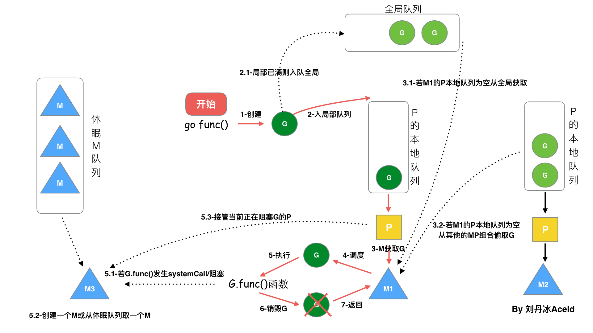

[TOC]

# 协程

协程说白了就是用户级线程，通常我们把内核级线程叫**线程（thread）**，用户级线程叫**协程（co-routine）**。

## 协程和线程的映射关系模型

> 1:1 关系

1 个协程绑定 1 个线程，这种最容易实现。协程的调度都由 CPU 完成了。

缺点：

- 协程的创建、删除和切换的代价都由 CPU 完成，有点略显昂贵了。

> N:1 关系

N 个协程绑定 1 个线程，优点就是**协程在用户态线程即完成切换，不会陷入到内核态，这种切换非常的轻量快速**。但也有很大的缺点，1 个进程的所有协程都绑定在 1 个线程上。

缺点：

- 某个程序用不了硬件的多核加速能力
- 一旦某协程阻塞，造成线程阻塞，本进程的其他协程都无法执行了，根本就没有并发的能力了。

> M:N 关系

M 个协程绑定 N 个线程，一旦某协程阻塞，造成线程阻塞，其余的协程可以切换到其他的线程中继续执行，但实现起来最为复杂。

## Go 语言的协程 goroutine

**Go 为了提供更容易使用的并发方法，使用了 goroutine 和 channel**。goroutine 来自协程的概念，让一组可复用的函数运行在一组线程之上，即使有协程阻塞，该线程的其他协程也可以被 `runtime` 调度，转移到其他可运行的线程上。

Go 中，协程被称为 goroutine，它非常轻量，一个 goroutine 只占几 KB，并且这几 KB 就足够 goroutine 运行完，这就能在有限的内存空间内支持大量 goroutine，支持了更多的并发。虽然一个 goroutine 的栈只占几 KB，但实际是可伸缩的，如果需要更多内容，`runtime` 会自动为 goroutine 分配。

Goroutine 特点：

- 占用内存更小（几 KB）
- 调度更灵活（runtime 调度）

## Goroutine 调度器的 GMP 模型

协程和线程的关系，那么最关键的一点就是调度协程的调度器的实现了。

> G（goroutine 协程），M（thread 线程），P（Processor 处理器）

**Processor，它包含了运行 goroutine 的资源**，如果线程想运行 goroutine，必须先获取 P，P 中还包含了可运行的 G 队列。

在 Go 中，**线程是运行 goroutine 的实体，调度器的功能是把可运行的 goroutine 分配到工作线程上（G 被调度到 M 上运行）**。

1. **全局队列**（Global Queue）：存放等待运行的 G。
2. **P 的本地队列**：同全局队列类似，存放的也是等待运行的 G。存的数量有限，不超过 256 个。新建 G 时，G 优先加入到 P 的本地队列，如果队列满了，则会把本地队列中一半的 G 移动到全局队列。
3. **P 列表**：所有的 P 都在程序启动时创建，并保存在数组中，最多有 `GOMAXPROCS` 个（可配置）。
4. **M**：线程想运行任务就得获取 P，从 P 的本地队列获取 G，P 队列为空时，M 也会尝试从全局队列**拿**一批 G 放到 P 的本地队列，或从其他 P 的本地队列**偷**一半放到自己 P 的本地队列。M 运行 G，G 执行之后，M 会从 P 获取下一个 G，不断重复下去。

> P 和 M 的个数问题

1、P 的数量：

- 由启动时环境变量 `$GOMAXPROCS` 或者是由 `runtime` 的方法 `GOMAXPROCS()` 决定。这意味着在程序执行的任意时刻都只有 `$GOMAXPROCS` 个 goroutine 在同时运行。

2、M 的数量：

- go 语言本身的限制：go 程序启动时，会设置 M 的最大数量，默认10000。但是内核很难支持这么多的线程数，所以这个限制可以忽略。
- runtime/debug 中的 SetMaxThreads 函数，设置 M 的最大数量。
- 一个 M 阻塞了，会创建新的 M。

M 与 P 的数量没有绝对关系，一个 M 阻塞，P 就会去创建或者切换另一个 M，所以，即使 P 的默认数量是 1，也有可能会创建很多个 M 出来。

> P 和 M 何时会被创建

1、P 何时创建：在确定了 P 的最大数量 n 后，运行时系统会根据这个数量创建 n 个 P。

2、M 何时创建：没有足够的 M 来关联 P 并运行其中的可运行的 G。比如所有的 M 此时都阻塞住了，而 P 中还有很多就绪任务，就会去寻找空闲的 M，而没有空闲的，就会去创建新的 M。

### 调度器的设计策略

> 复用线程

避免频繁的创建、销毁线程，而是对线程的复用。

（1）work stealing 机制

当本线程无可运行的 G 时，尝试从其他线程绑定的 P 偷取 G，而不是销毁线程。

（2）hand off 机制

**当本线程因为 G 进行系统调用阻塞时，线程释放绑定的 P，把 P 转移给其他空闲的线程执行，这样子 P 上其他的 G 就不会被阻塞了。**

> 利用并行

`GOMAXPROCS ` 设置 P 的数量，最多有 `GOMAXPROCS` 个线程分布在多个 CPU 上同时运行。`GOMAXPROCS `也限制了并发的程度，比如设置 `GOMAXPROCS = 核数/2`，则最多利用了一半的 CPU 核进行并行。

> 抢占

**在 coroutine 中要等待一个协程主动让出 CPU 才执行下一个协程**，在 Go 中（Go1.14 版本及之后），一个 goroutine 最多占用 CPU 10ms，防止其他 goroutine 被饿死，这就是 goroutine 不同于 coroutine 的一个地方。

如果没有抢占这个策略，如果只有一个 P，那么如果有一个 G 发生了死循环，那么其他的 G 永远无法得到调度。

> 全局 G 队列

在新的调度器中依然有全局 G 队列，但功能已经被弱化了，当 M 执行 work stealing 从其他 P 偷不到 G 时，它可以从全局 G 队列获取 G。

### go func() 调度流程

1. 通过 `go func()` 来创建一个 goroutine。
2. 有两个存储 G 的队列，一个是**局部调度器 P 的本地队列**、一个是**全局 G 队列**。新创建的 G 会先保存在 P 的本地队列中，如果 P 的本地队列已经满了就会保存在全局的队列中。
3. G 只能运行在 M 中，一个 M 必须持有一个 P，M 与 P 是 1:1 的关系。M 会从 P 的本地队列弹出一个可执行状态的 G 来执行，如果 P 的本地队列为空，M 会尝试从全局队列**拿**一批 G 放到 P 的本地队列，或从其他 P 的本地队列**偷**一半放到自己 P 的本地队列。
4. 一个 M 调度 G 执行的过程是一个循环机制。
5. 当 M 执行某一个 G 时候如果发生了 syscall 或则其它阻塞操作，M 会阻塞，如果当前还有 G 要执行，runtime 会把这个线程 M 从 P 中摘除（detach），然后再创建一个新的操作系统的线程（如果有空闲的线程可用就复用空闲线程）来服务于这个 P。
6. 当 M 系统调用结束时候，这个 G 会尝试获取一个空闲的 P 执行，并放入到这个 P 的本地队列。如果获取不到 P，那么这个线程 M 变成休眠状态， 加入到空闲线程中，然后这个 G 会被放入全局队列中。

## Go 协程适合 IO 密集型？

Go 适合 IO 密集型的场景。但其实这里并不准确。更准确的是 **Go 适合的是网络 IO 密集型的场景**，而非磁盘 IO 密集型。

根本原因：在于**网络 socket 句柄和文件句柄**的不同。网络 IO 能够用异步化的事件驱动的方式来管理（IO 多路复用），磁盘 IO 则不行。socket 句柄可以设置为 non-blocking（非阻塞的方式），这样当网络 IO 还未就绪的时候就可以在 Go 代码里把调度权切走，去执行其他协程，这样就实现了**网络 IO 的并发**。

但是磁盘 IO 则不行，文件 IO 的 read/write 都是同步的 IO，用不了 epoll 池来监控读写事件。所以磁盘 IO 的完成只能同步等待。

## 参考文章

- [Golang的协程调度器原理及GMP设计思想？](https://github.com/aceld/golang/blob/main/2%E3%80%81Golang%E7%9A%84%E5%8D%8F%E7%A8%8B%E8%B0%83%E5%BA%A6%E5%99%A8%E5%8E%9F%E7%90%86%E5%8F%8AGMP%E8%AE%BE%E8%AE%A1%E6%80%9D%E6%83%B3%EF%BC%9F.md)
- [Go 适合 IO 密集型？并不准确！](https://mp.weixin.qq.com/s/0nwe-YrMGrl2futS5wkT6A)

- [单核 CPU，开两个 Goroutine，其中一个死循环，会怎么样？](https://mp.weixin.qq.com/s/h27GXmfGYVLHRG3Mu_8axw#at)