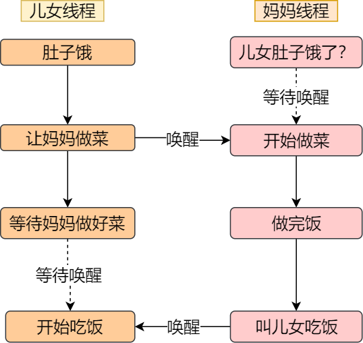
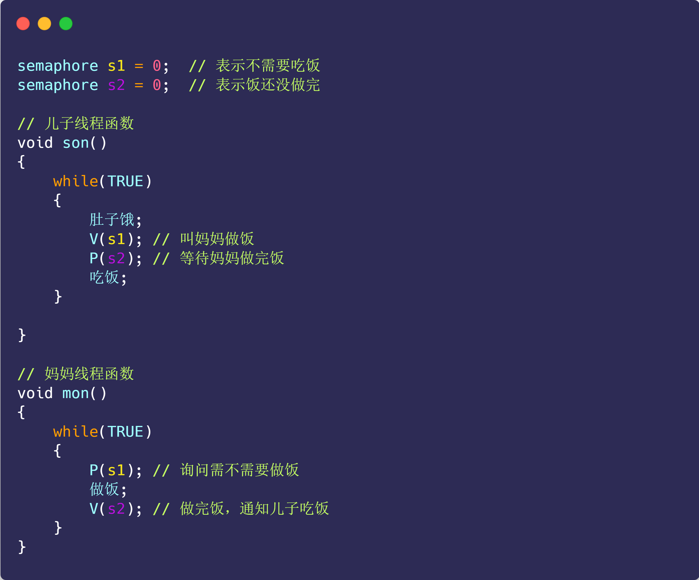

[TOC]

# 多线程互斥和同步

- 同步就好比：「操作 A 应在操作 B 之前执行」，「操作 C 必须在操作 A 和操作 B 都完成之后才能执行」等；
- 互斥就好比：「操作 A 和操作 B 不能在同一时刻执行」；

## 互斥与同步的实现和使用

在进程/线程并发执行的过程中，进程/线程之间存在协作的关系，例如有互斥、同步的关系。

为了实现进程/线程间正确的协作，操作系统必须提供实现进程协作的措施和方法，主要的方法有两种：

- **锁**：加锁、解锁操作；
- **信号量**：P、V 操作；

## 锁

使用加锁操作和解锁操作可以解决并发线程/进程的**互斥**问题。

## 信号量

信号量是操作系统提供的一种协调共享资源访问的方法。

### 信号量实现互斥

当信号量为 1 的时候，通过 P、V 操作就可以实现互斥的操作。

### 信号量实现同步

以上面吃饭的例子，使用信号量 P、V 操作实现同步

## 参考文章

- [5.3 多线程冲突了怎么办？ | 小林coding](https://xiaolincoding.com/os/4_process/multithread_sync.html)