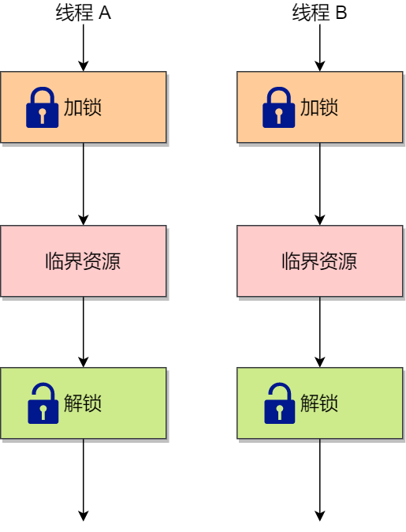
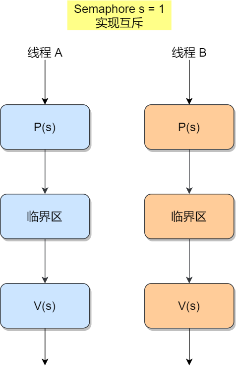

[TOC]

# 多线程互斥和同步

- 同步就好比：「操作 A 应在操作 B 之前执行」，「操作 C 必须在操作 A 和操作 B 都完成之后才能执行」等；

例子，线程 1 是负责读入数据的，而线程 2 是负责处理数据的，这两个线程是相互合作、相互依赖的。线程 2 在没有收到线程 1 的唤醒通知时，就会一直阻塞等待，当线程 1 读完数据需要把数据传给线程 2 时，线程 1 会唤醒线程 2，并把数据交给线程 2 处理。

**所谓同步，就是并发进程/线程在一些关键点上可能需要互相等待与互通消息，这种相互制约的等待与互通信息称为进程/线程同步**。

- 互斥就好比：「操作 A 和操作 B 不能在同一时刻执行」；

## 互斥与同步的实现和使用

在进程/线程并发执行的过程中，进程/线程之间存在协作的关系，例如有互斥、同步的关系。

为了实现进程/线程间正确的协作，操作系统必须提供实现进程协作的措施和方法，主要的方法有两种：

- **锁**：加锁、解锁操作；
- **信号量**：P、V 操作；

这两个都可以方便地实现进程/线程互斥，而信号量比锁的功能更强一些，**它还可以方便地实现进程/线程同步**。

## 锁

使用加锁操作和解锁操作可以解决并发线程/进程的**互斥**问题。

任何想进入临界区的线程，必须先执行加锁操作。若加锁操作顺利通过，则线程可进入临界区；在完成对临界资源的访问后再执行解锁操作，以释放该临界资源。



## 信号量

信号量是操作系统提供的一种协调共享资源访问的方法。

通常**信号量表示资源的数量**，对应的变量是一个整型（`sem`）变量。

另外，还有**两个原子操作的系统调用函数来控制信号量的**，分别是：

- P 操作：将 `sem` 减 `1`，相减后，如果 `sem < 0`，则进程/线程进入阻塞等待，否则继续，表明 P 操作可能会阻塞；
- V 操作：将 `sem` 加 `1`，相加后，如果 `sem <= 0`，唤醒一个等待中的进程/线程，表明 V 操作不会阻塞；如果 `sem > 0`，说明没有等待中的进程/线程。

例如：如果 sem = 1，有三个线程进行了 P 操作：

- 第一个线程 P 操作后，sem = 0；
- 第二个线程 P 操作后，sem = -1；
- 第三个线程 P 操作后，sem = -2；

这时，第一个线程执行 V 操作后， sem 是 -1，因为 sem <= 0，所以要唤醒第二或第三个线程（谁先进入等待队列就先唤起谁）。

### 信号量实现互斥

为每类共享资源设置一个信号量 `s`，其初值为 `1`，表示该临界资源未被占用。

只要把进入临界区的操作置于 `P(s)` 和 `V(s)` 之间，即可实现进程/线程互斥：



此时，任何想进入临界区的线程，必先在互斥信号量上执行 P 操作，在完成对临界资源的访问后再执行 V 操作。由于互斥信号量的初始值为 1，故在第一个线程执行 P 操作后 s 值变为 0，表示临界资源为空闲，可分配给该线程，使之进入临界区。

若此时又有第二个线程想进入临界区，也应先执行 P 操作，结果使 s 变为负值，这就意味着临界资源已被占用，因此，第二个线程被阻塞。

并且，直到第一个线程执行 V 操作，释放临界资源而恢复 s 值为 0 后，才唤醒第二个线程，使之进入临界区，待它完成临界资源的访问后，又执行 V 操作，使 s 恢复到初始值 1。

对于两个并发线程，互斥信号量的值仅取 1、0 和 -1 三个值，分别表示：

- 如果互斥信号量为 1，表示没有线程进入临界区；
- 如果互斥信号量为 0，表示有一个线程进入临界区；
- 如果互斥信号量为 -1，表示一个线程进入临界区，另一个线程等待进入。

通过互斥信号量的方式，就能保证临界区任何时刻只有一个线程在执行，就达到了互斥的效果。

### 信号量实现同步

1. 分析什么地方需要实现 “同步关系”，即必须保证 “一前一后” 执行的两个操作（或两句代码)。
2. 设置同步信号量 S，**初始为 0**。
3. 在 “前操作” 之后执行 V(S)。
4. 在 “后操作” 之前执行 P(S)。

```c++
semaphore S = 0;

P1() 
{
    code1;
    code2;
    V(S); // 生产资源
    code3;
}

P2()
{
    P(S); // 使用资源
    code4;
    code5;
    code6;
}
```

信号量 S 代表 ”某种资源“，刚开始是没有这种资源的。P2 需要使用这种资源，而又只能由 P1 产生这种资源。以上的代码保证了 code4 一定是在 code2 之后执行。

若先执行到 `V(S)` 操作，则 `S++` 后 `S=1`。之后当执行到 `P(S)` 操作时，由于 `S=1`，表示有可用资源，会执行 `S--`，S 的值变回 0，P2 进程不会执行 block 原语，而是继续往下执行 code4。

若先执行到 `P(S)` 操作，由于 `S=0`，`S--` 后 `S=-1`，表示此时没有可用资源，因此 P 操作中会执行 block 原语，主动请求阻塞。之后当执行完代码 2，继而执行 `V(S)` 操作，`S++`，使 S 变回 0,由于此时有进程在该信号量对应的阻塞队列中，因此会在 V 操作中执行 wakeup 原语，唤醒 P2 进程。这样 P2 就可以继续执行 code4 了。

#### 生产者消费者问题

我们通过 PV 操作可以简单实现生产者消费者问题。初始资源 S 为 0，生产者通过 V 操作往消息队列（缓冲区）放入数据 `S++` 并唤醒等待的消费者（如果消费者先执行了 P 操作阻塞）。消费者通过 P 操作进行取出数据 `S--`。


## 参考文章

- [5.3 多线程冲突了怎么办？ | 小林coding](https://xiaolincoding.com/os/4_process/multithread_sync.html)
- [操作系统——信号量机制（PV 操作）](https://blog.csdn.net/weixin_51995229/article/details/125130678)