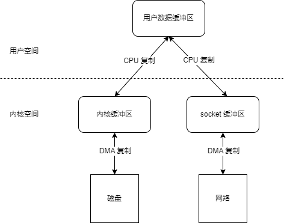

[TOC]

# 磁盘 IO

> 为什么磁盘 IO 不消耗 CPU 资源？

当我们把程序里的数据写入到磁盘或者网络的时候，就需要先将数据从用户空间拷贝到内核空间，如下图：

1. 数据从用户缓冲区到内核缓冲区是由 CPU 来操作的（这里操作的还是内存，速度是 ns 级别）。
2. 从内核缓冲区到磁盘。是交给了DMA（Direct Memory Access 直接内存访问）复制到磁盘或者网络（速度是 ms 级别）。
3. 当 DMA 刷盘结束，会产生中断，通知 CPU 继续执行。

所以，磁盘 IO 并不消耗 CPU 资源。

## DMA

DMA（Direct Memory Access），直译为直接内存访问，是一种无需 CPU 的参与就可以让外设与系统内存之间进行双向数据传输的硬件机制。

使用 DMA 可以使系统 CPU 从实际的 I/O 数据传输过程中摆脱出来，从而大大提高系统的吞吐率。

- DMA工作过程

DMA 方式的数据传输由 DMA 控制器（DMAC）控制，在传输期间，CPU 可以并发的执行其他任务。当 DMA 结束后，DMAC 通过中断通知 CPU 数据传输已经结束，由 CPU 执行相应的中断服务程序进行后续处理。