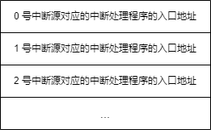
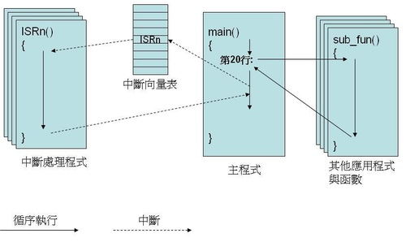
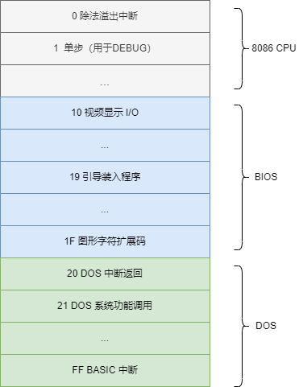
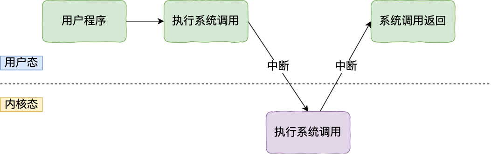
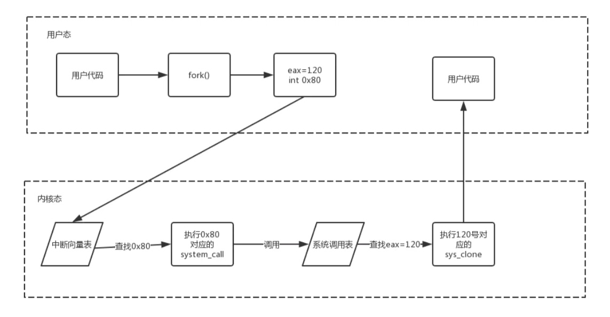

[TOC]

# 系统调用

【系统调用】是操作系统提供给应用程序（程序员/编程人员）使用的接口，可以理解为一种可供应用程序调用的特殊函数，**应用程序可以通过系统调用来请求获得操作系统内核的服务**。

应用程序通过**系统调用**请求操作系统的服务，而系统中的各种共享资源都由操作系统内核统一掌管，因此凡是**与共享资源有关的操作（如存储分配、I/O操作、文件管理等），都必须通过系统调用的方式向操作系统内核提出服务请求**，由操作系统内核代为完成。这样**可以保证系统的稳定性和安全性**，防止用户进行非法操作。

## 中断

要了解系统调用过程，首先我们要先了解一个概念——**中断**。

任何一个通用的 CPU，比如 8086，都具备一种能力，可以在执行完当前正在执行的指令之后，检测到从 CPU **外部**发送过来的或**内部**产生的一种特殊信息，并且可以立即对所接收到的信息进行处理。这种特殊的信息，我们可以称其为：中断信息。中断的意思是指，CPU 不再接着（刚执行完的指令）向下执行，而是转去处理这个特殊信息。

### 中断的产生

#### 内部中断

当 CPU 内部有下面的情况发生时候，将产生相应的中断信息。

1. 除法错误，比如，执行 div 指令产生的除法溢出。
2. 单步执行。
3. 执行 into 指令。
4. **执行 int 指令**，该指令的格式为 `int n`，n 为中断类型码，相当于引发一个 n 号中断的中断过程。

##### int 指令

int 指令的最终功能和 call 指令相似，都是调用一段程序。

一般情况下，系统将一些具有一定功能的子程序，以中断处理程序的方式提供给应用程序调用。我们在编程的时候，可以用 int 指令调用这些子程序。当然，也可以自己编写些中断处理程序供别人使用。以后，我们可以将中断处理程序序简称为**中断例程**。

#### 外部中断

还有一种中断信息，来自于 CPU 外部，当 CPU 外部有需要处理的事情发生的时候，比如说，外设的输入到达（如键盘的输入），相关芯片将向 CPU 发出相应的中断信息。CPU 在执行完当前指令后，可以检测到发送过来的中断信息，引发中断过程，处理外设的输入。

### 中断处理程序

CPU 收到中断信息后，需要对中断信息进行处理。而如何对中断信息进行处理，可以由我们编程决定。我们编写的，用来处理中断信息的程序被称为中断处理程序。一般来说，需要对不同的中断信息编写不同的处理程序。

CPU 在收到中断信息后，应该转去执行该中断信息的处理程序。我们知道，若要 8086CPU 执行某处的程序，就要将 `CS:IP` 指向它的入口（即程序第一条指令的地址）。可见首要的问题是，CPU 在收到中断信息后，如何根据中断信息确定其处理程序的入口。

我们知道，中断信息中包含有标识中断类型码，而**中断类型码的作用就是用来定位中断处理程序**。

### 中断向量表

> 中断向量表就是中断向量的列表。所谓的中断向量就是中断处理程序的入口地址。展开来说，中断向量表，就是中断处理程序入口地址的列表。

中断向量表在内存中保存，其中存放着 256 个中断源所对应的中断处理程序的入口，如下图所示。

- 中断向量表

可以看到，CPU 只要知道了中断类型码，就可以将中断类型码作为中断向量表的表项号，定位相应的表项，从而得到中断处理程序的入口地址。

### 中断过程

一般程序都是循序执行的，以上图为例，CPU 一定要执行到 `main()` 的第 20 行，才有可能去调用 `fun()`。

而中断可能在任何的时间点产生。例如使用者可以在任何时候按下键盘的某个键，此时不论 CPU 下个要执行的指令是什么，CPU 都会先记录目前的状态，然后参考中断向量表，接着去执行键盘中断的处理程序（keyboard ISR）。等 ISR（Interrupt Service Routine） 执行完后，CPU 会取回中断之前的状态，然后返回被中断的位置继续循序执行。

## BIOS 和 DOS 所提供的中断例程

在系统板的 ROM 中存放着一套程序，称为 BIOS（基本输入输出系统），BIOS 中主要包含以下几部分内容。

1. 硬件系统的检测和初始化程序。
2. 外部中断和内部中断的中断例程。
3. 用于对硬件设备进行 I/O 操作的中断例程。
4. 其他和硬件系统相关的中断例程。

操作系统 DOS 也提供了中断例程，从操作系统的角度来看，DOS 的中断例程就是操作系统向程序员提供的编程资源。

BIOS 和 DOS 在所提供的中断例程中包含了许多子程序，这些子程序实现了程序员在编程的时候经常需要用到的功能。程序员在编程的时候，可以用 int 指令直接调用 BIOS 和 DOS 提供的中断例程，来完成某些工作。

和硬件设备相关的 DOS 中断例程中，一般都调用了 BIOS 的中断例程。

## BIOS 和 DOS 中断例程的安装

1. 开机后，CPU 一加电，初始化 `CS=0FFFH`，`IP=0`，自动从 `FFFF:0` 单元开始执行程序。`FFFF:0` 处有一条转跳指令，CPU 执行该指令后，转去执行 BIOS 中的硬件系统检测和初始化程序。
2. 初始化程序将建立 BIOS 所支持的中断向量，即将 BIOS 提供的中断例程的入口地址登记在中断向量表中。注意，对于 BIOS 所提供的中断例程，只需将入口地址登记在中断向量表中即可，因为它们是固化到 ROM 中的程序，一直在内存中存在。
3. 硬件系统检测和初始化完成后，调用 `int 19h` 进行操作系统的引导。从此将计算机交由操作系统控制。
4. DOS 启动后，除完成其他工作外，还将它所提供的中断例程装入内存，并建立相应的中断向量。

由于中断向量表可以在操作系统层面灵活修改，因此，**不同的系统的中断向量表可能是不同的**。此外，intel 在 CPU 的保护模式下，占用了 0x00 ~ 0x1F 共 32 个中断号，在 Linux 下，是从 0x20 开始用于系统自身的中断的。

**所以在 DOS 系统中，0x21 中断码是系统调用，而在 Linux 中 0x21 是其他的中断例程码，0x80 中断码才是 Linux 的系统调用。**

## 系统调用与 int 0x80

**操作系统给上层的应用留一共进入操作系统的入口，中断就是这个入口。操作系统给上层应用提供了 0x80 号中断。应用程序可以通过 `int 0x80` 指令进入对应的中断处理程序，用这个唯一的入口进入内核**。

Linux 提供了 200 多个系统调用，通过汇编指令 `int 0x80` 进入内核，用系统调用号来区分入口函数（内核通过检查寄存器 EAX 中的值。来通知程序要进行哪个系统调用）。

> 64 位的 Linux 系统调用表（号）：/usr/include/x86_64-linux-gnu/asm/unistd_64.h

## 参考文章

- 《汇编语言（第 4 版）》王爽

- https://lfool.gitbook.io/operating-system/untitled-1/6.-xi-tong-tiao-yong
- https://blog.csdn.net/qq_43142509/article/details/124600228

- [What does "int 0x80" mean in assembly code?](https://stackoverflow.com/questions/1817577/what-does-int-0x80-mean-in-assembly-code)

- [中斷向量表淺談](https://blog.xuite.net/embeddedsystem_book/twblog/174144583)
- [中断向量表](https://baike.baidu.com/item/%E4%B8%AD%E6%96%AD%E5%90%91%E9%87%8F%E8%A1%A8/4947137)