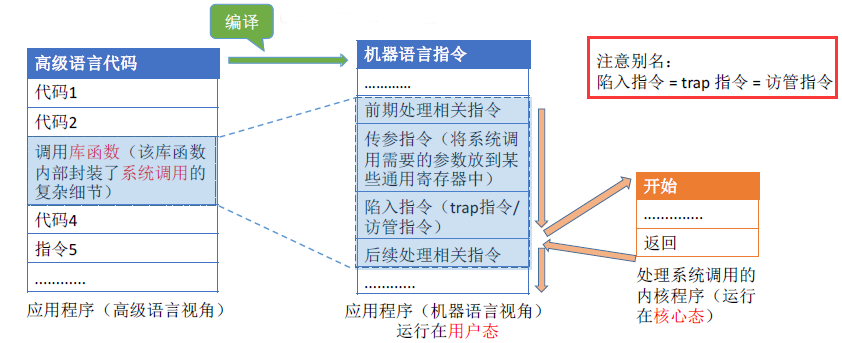

[TOC]

# 系统调用

【系统调用】是操作系统提供给应用程序（程序员/编程人员）使用的接口，可以理解为一种可供应用程序调用的特殊函数，**应用程序可以通过系统调用来请求获得操作系统内核的服务**。

应用程序通过**系统调用**请求操作系统的服务，而系统中的各种共享资源都由操作系统内核统一掌管，因此凡是**与共享资源有关的操作（如存储分配、I/O操作、文件管理等），都必须通过系统调用的方式向操作系统内核提出服务请求**，由操作系统内核代为完成。这样**可以保证系统的稳定性和安全性**，防止用户进行非法操作。

## 系统调用的过程

要了解系统调用过程，首先我们要先了解一个概念——**中断**。

硬中断

CPU 提供两种机制来中断程序的执行：中断（interrupt）和异常（exception）。

中断是一个异步事件，通常由 IO 设备触发。比如点击鼠标、敲击键盘等。

异常是一个同步事件，是 CPU 在执行指令时检测到一些预先定义的条件时发生的。比如除法异常、错误指令异常和缺页异常等。

这两种机制的目的都是让 CPU 收到一个中断号。

软中断

INT 指令后面跟一个数字，就相当于直接用指令的形式，告诉 CPU 一个中断号（中断类型码）。比如 `INT 0x80`，就是告诉 CPU 中断号是 0x80，Linux 内核提供的系统调用，就是用了 `INT 0x80` 这种指令。

传递系统参数 -> 执行陷入指令（**用户态**）-> 执行相应的请求内核程序处理的系统调用（**内核态**）-> 返回应用程序

**Tip：**

1. **陷入指令**是在**用户态**执行的，执行陷入指令之后立即引发一个**内中断**，使 CPU **进入核心态**。
2. **发出系统调用请求**是在**用户态**，而**对系统调用的相应处理**在**核心态**下进行。

## 参考文章

- https://lfool.gitbook.io/operating-system/untitled-1/6.-xi-tong-tiao-yong
- https://blog.csdn.net/weixin_43215305/article/details/120027555
- https://blog.csdn.net/qq_43142509/article/details/124600228
- https://blog.csdn.net/qq_29343201/article/details/52209588
- https://blog.csdn.net/hq815601489/article/details/80009791?spm=1001.2101.3001.6650.3&utm_medium=distribute.pc_relevant.none-task-blog-2%7Edefault%7ECTRLIST%7ERate-3-80009791-blog-52235329.pc_relevant_3mothn_strategy_and_data_recovery&depth_1-utm_source=distribute.pc_relevant.none-task-blog-2%7Edefault%7ECTRLIST%7ERate-3-80009791-blog-52235329.pc_relevant_3mothn_strategy_and_data_recovery&utm_relevant_index=4