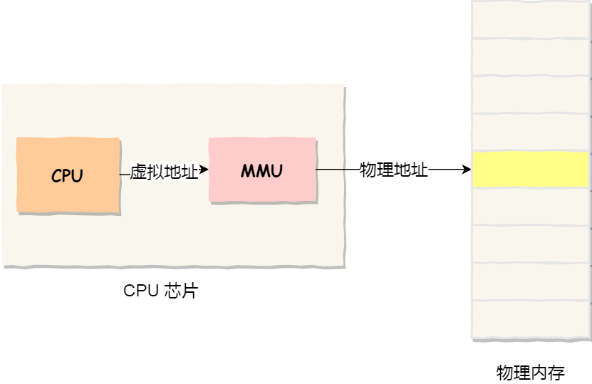

[TOC]

# 虚拟内存

为了在多进程环境下，使得进程之间的内存地址不受影响，相互隔离，于是操作系统就为每个进程独立分配一套**虚拟地址空间**，每个程序只关心自己的虚拟地址就可以，实际上大家的虚拟地址都是一样的，但分布到物理地址内存是不一样的。

- 我们程序所使用的内存地址叫做**虚拟内存地址**（*Virtual Memory Address*）。
- 实际存在硬件里面的空间地址叫**物理内存地址**（*Physical Memory Address*）。

操作系统引入了虚拟内存，进程持有的虚拟地址会通过 CPU 芯片中的内存管理单元（MMU）的映射关系，来转换变成物理地址，然后再通过物理地址访问内存，如下图所示：

操作系统是如何管理虚拟地址与物理地址之间的关系主要有两种方式，分别是**内存分段和内存分页**。

## 内存分段

参考：[内存分段](https://xiaolincoding.com/os/3_memory/vmem.html#%E5%86%85%E5%AD%98%E5%88%86%E6%AE%B5)

## 内存分页

**分页是把整个虚拟和物理内存空间切成一段段固定尺寸的大小**。这样一个连续并且尺寸固定的内存空间，我们叫**页**（*Page*）。在 Linux 采用的是内存分页方式管理内存，每一页的大小为 `4KB`。

虚拟地址与物理地址之间通过**页表**来映射，如下图：

页表是存储在内存里的，**内存管理单元** （*MMU*）就做将虚拟内存地址转换成物理地址的工作。

而当进程访问的虚拟地址在页表中查不到时，系统会产生一个**缺页异常**，进入系统内核空间分配物理内存、更新进程页表，最后再返回用户空间，恢复进程的运行。

因为内存分页机制分配内存的最小单位是一页，即使程序不足一页大小，我们最少只能分配一个页，所以页内会出现内存浪费，所以针对内存分页机制会有**内部内存碎片**的现象。

如果内存空间不够，操作系统会把其他正在运行的进程中的「最近没被使用」的内存页面给释放掉，也就是暂时写在硬盘上，称为**换出**（*Swap Out*）。一旦需要的时候，再加载进来，称为**换入**（*Swap In*）。所以，一次性写入磁盘的也只有少数的一个页或者几个页，不会花太多时间，**内存交换的效率就相对比较高。**

更进一步地，分页的方式使得我们在加载程序的时候，不再需要一次性都把程序加载到物理内存中。我们完全可以在进行虚拟内存和物理内存的页之间的映射之后，并不真的把页加载到物理内存里，而是**只有在程序运行中，需要用到对应虚拟内存页里面的指令和数据时，再加载到物理内存里面去。**

> 虚拟地址和物理地址是如何映射的？

在分页机制下，虚拟地址分为两部分，**页号**和**页内偏移**。页号作为页表的索引，**页表**包含物理页每页所在**物理内存的基地址**，这个基地址与页内偏移的组合就形成了物理内存地址，见下图。

1. 把虚拟内存地址，切分成页号和偏移量；
2. 根据页号，从页表里面，查询对应的物理页号；
3. 直接拿物理页号，加上前面的偏移量，就得到了物理内存地址。

> 简单的分页有什么缺陷吗？

有空间上的缺陷。因为操作系统是可以同时运行非常多的进程的，那这不就意味着页表会非常的庞大。

在 32 位的环境下，虚拟地址空间共有 4GB，假设一个页的大小是 4KB（2^12），那么就需要大约 100 万 （2^20） 个页，每个「页表项」需要 4 个字节大小来存储，那么整个 4GB 空间的映射就需要有 `4MB` 的内存来存储页表。

这 4MB 大小的页表，看起来也不是很大。但是要知道每个进程都是有自己的虚拟地址空间的，也就说都有自己的页表。

那么，`100` 个进程的话，就需要 `400MB` 的内存来存储页表，这是非常大的内存了，更别说 64 位的环境了。

### 多级页表

100 多万个「页表项」的单级页表再分页，将页表（一级页表）分为 `1024` 个页表（二级页表），每个表（二级页表）中包含 `1024` 个「页表项」，形成**二级分页**。如下图所示：

**简单来说就是一级索引变成变成了二级索引**。

> 分了二级表，映射 4GB 地址空间就需要 4KB（一级页表）+ 4MB（二级页表）的内存，这样占用空间不是更大了吗？

当然如果 4GB 的虚拟地址全部都映射到了物理内存上的话，二级分页占用空间确实是更大了，但是，我们往往不会为一个进程分配那么多内存。

其实我们应该换个角度来看问题，还记得计算机组成原理里面无处不在的**局部性原理**么？

每个进程都有 4GB 的虚拟地址空间，而显然对于大多数程序来说，其使用到的空间远未达到 4GB，因为会存在部分对应的页表项都是空的，根本没有分配，**对于已分配的页表项，如果存在最近一定时间未访问的页表，在物理内存紧张的情况下，操作系统会将页面换出到硬盘**，也就是说不会占用物理内存。

如果使用了二级分页，一级页表就可以覆盖整个 4GB 虚拟地址空间，但**如果某个一级页表的页表项没有被用到，也就不需要创建这个页表项对应的二级页表了，即可以在需要时才创建二级页表**。做个简单的计算，假设只有 20% 的一级页表项被用到了，那么页表占用的内存空间就只有 4KB（一级页表） + 20% * 4MB（二级页表）= `0.804MB`，这对比单级页表的 `4MB` 是不是一个巨大的节约？

> 那么为什么不分级的页表就做不到这样节约内存呢？

我们从页表的性质来看，保存在内存中的页表承担的职责是将虚拟地址翻译成物理地址。假如虚拟地址在页表中找不到对应的页表项，计算机系统就不能工作了。所以**页表一定要覆盖全部虚拟地址空间，不分级的页表就需要有 100 多万个页表项来映射，而二级分页则只需要 1024 个页表项**（此时一级页表覆盖到了全部虚拟地址空间，二级页表在需要时创建）。

我们把二级分页再推广到多级页表，就会发现页表占用的内存空间更少了，这一切都要归功于对局部性原理的充分应用。

### TLB

多级页表虽然解决了空间上的问题，但是虚拟地址到物理地址的转换就多了几道转换的工序，这显然就降低了这俩地址转换的速度，也就是带来了时间上的开销。

我们就可以利用这一特性，把最常访问的几个页表项存储到访问速度更快的硬件，于是计算机科学家们，就在 CPU 芯片中，加入了一个专门存放程序最常访问的页表项的 Cache，这个 Cache 就是 TLB（*Translation Lookaside Buffer*） ，通常称为页表缓存、转址旁路缓存、**快表**等。

在 CPU 芯片里面，封装了内存管理单元（*Memory Management Unit*）芯片，它用来完成地址转换和 TLB 的访问与交互。

有了 TLB 后，那么 CPU 在寻址时，会先查 TLB，如果没找到，才会继续查常规的页表。

## 段页式内存管理

参考：[段页式内存管理](https://xiaolincoding.com/os/3_memory/vmem.html#%E6%AE%B5%E9%A1%B5%E5%BC%8F%E5%86%85%E5%AD%98%E7%AE%A1%E7%90%86)

## 参考文章

- https://xiaolincoding.com/os/3_memory/vmem.html