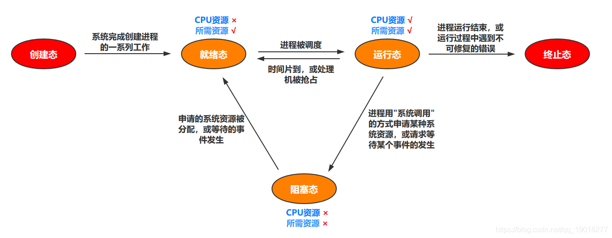
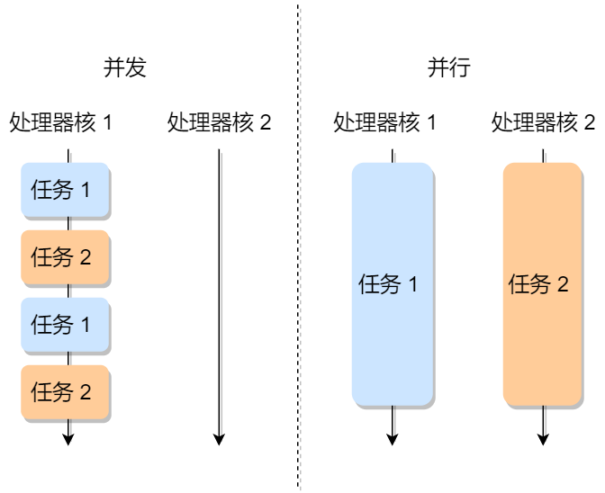
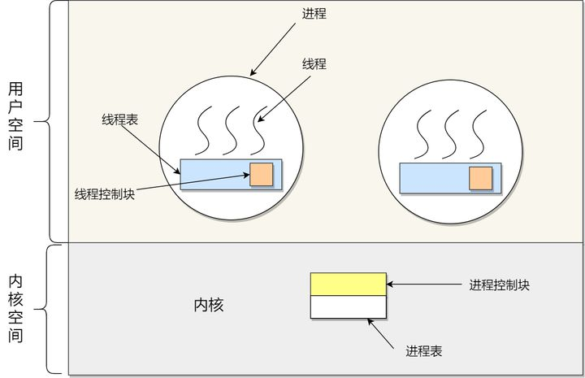
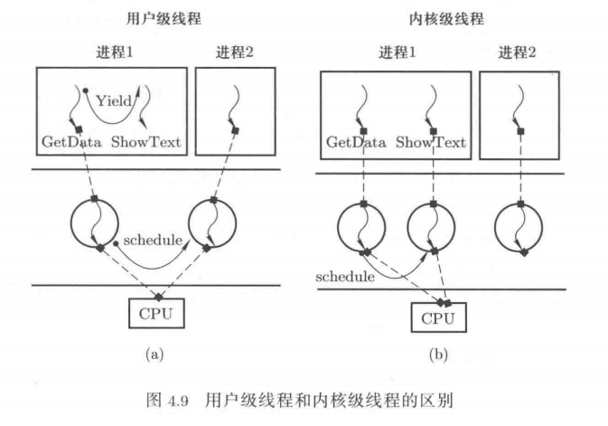
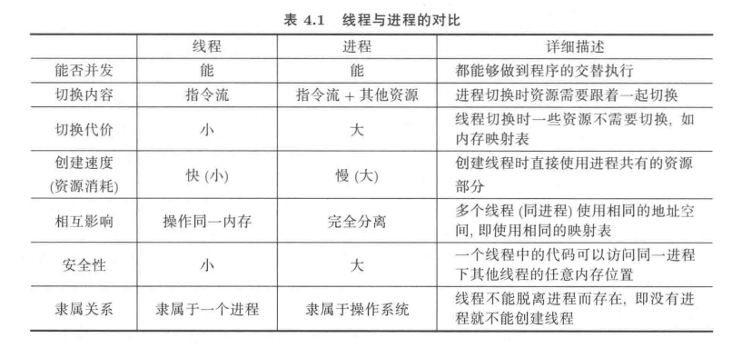
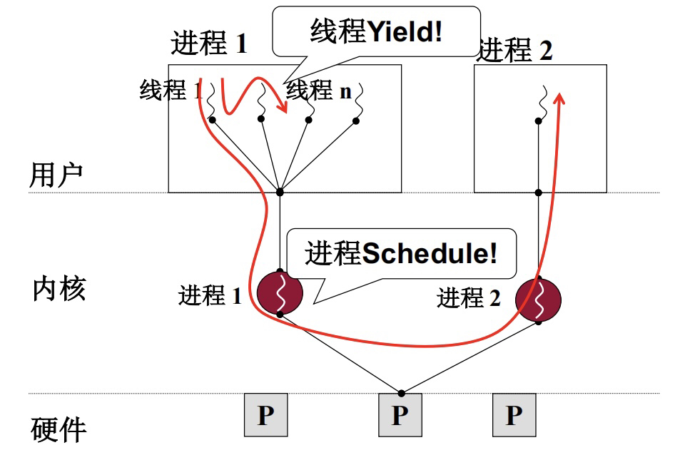
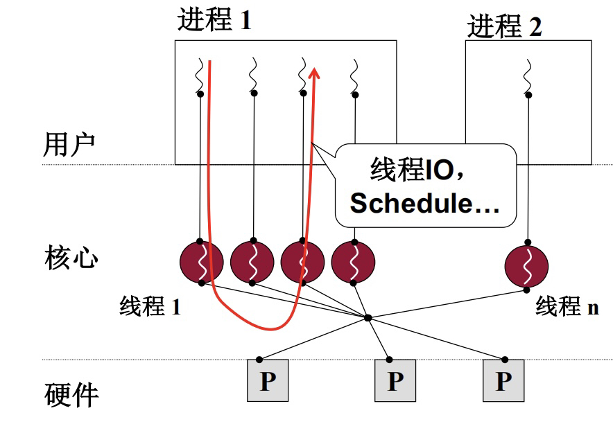

# 进程、线程和协程

> 进程是资源分配的基本单位，线程是资源调度的基本单位。

简单来说就是：

1、进程是执行起来的程序，操作系统给进程分配内存，CPU 时间片等资源。

2、线程是进程中的一条执行流程，共享同一个进程中的资源，使用这些资源。

## 进程

我们编写的代码只是一个存储在硬盘的静态文件，通过编译后就会生成二进制可执行文件，当我们运行这个可执行文件后，它会被装载到内存中，接着 CPU 会执行程序中的每一条指令，那么这个运行中的程序，就被称为进程。

进程用来描述一个程序及其执行过程的信息，即进行中的程序。对比程序和进程的概念，程序是静态的指令、数据等，而进程是执行起来的程序。

**PCB**

描述控制进程的运行，系统中存放进程的管理和控制信息的数据结构称为[进程控制块](https://baike.baidu.com/item/进程控制块/7205297?fromModule=lemma_inlink)（PCB Process Control Block），它是进程实体的一部分，是操作系统中最重要的记录性数据结构。它是进程管理和控制的最重要的数据结构，每一个进程均有一个 PCB，在创建进程时，建立 PCB，伴随进程运行的全过程，直到进程撤消而撤消。

### 进程的状态



如果有大量处于阻塞状态的进程，进程可能会占用着物理内存空间，显然不是我们所希望的，毕竟物理内存空间是有限的，被阻塞状态的进程占用着物理内存就一种浪费物理内存的行为。

所以，在虚拟内存管理的操作系统中，通常会把阻塞状态的进程的物理内存空间换出到硬盘，等需要再次运行的时候，再从硬盘换入到物理内存。

### 进程创建

1. 申请一个空白的 PCB，并向 PCB 中填写一些控制和管理进程的信息，比如进程的唯一标识等；
2. 为该进程分配运行时所必需的资源，比如内存资源；
3. 将 PCB 插入到就绪队列，等待被调度运行；

### 进程上下文切换

> 进程切换和 CPU 上下文切换有的很大的关系，强烈建议先看这篇极客时间的文章：[03 | 基础篇：经常说的 CPU 上下文切换是什么意思？（上）](https://time.geekbang.org/column/article/69859)

**进程上下文切换，是指从一个进程切换到另一个进程运行**。

进程是由内核来管理和调度的，进程的切换只能发生在内核态。所以，进程的上下文不仅**包括了虚拟内存、栈、全局变量等用户空间的资源，还包括了内核堆栈、寄存器等内核空间的状态**。

切换过程：

1. 接收到切换信号，挂起进程，记录当前进程的虚拟内存、栈等资源存储;   
2. 将这个进程在 CPU 中的上下文状态存储于起来;  
3. 然后在内存中检索下一个进程的上下文，并将其加载到 CPU 的寄存器中恢复; 
4. 还需要刷新进程的虚拟内存和用户栈; 
5. 最后跳转到程序计数器所指向的位置（即跳转到进程被中断时的代码行），以恢复该进程。

另外，Linux 通过 TLB（Translation Lookaside Buffer）来管理虚拟内存到物理内存的映射关系。当**虚拟内存更新后，TLB 也需要刷新**，内存的访问也会随之变慢。特别是在多处理器系统上，缓存是被多个处理器共享的，刷新缓存不仅会影响当前处理器的进程，还会影响共享缓存的其他处理器的进程。


**发生进程上下文切换有哪些场景？**

1、为了保证所有进程可以得到公平调度，CPU 时间被划分为一段段的时间片，这些时间片再被轮流分配给各个进程。这样，当某个进程的时间片耗尽了，进程就从运行状态变为就绪状态，系统从就绪队列选择另外一个进程运行。

2、进程在系统资源不足（比如内存不足）时，要等到资源满足后才可以运行，这个时候进程也会被挂起，并由系统调度其他进程运行。

3、当进程通过睡眠函数 sleep 这样的方法将自己主动挂起时，自然也会重新调度。

4、当有优先级更高的进程运行时，为了保证高优先级进程的运行，当前进程会被挂起，由高优先级进程来运行。

5、发生硬件中断时，CPU 上的进程会被中断挂起，转而执行内核中的中断服务程序。

### 并发和并行的区别



## 线程

线程是进程中的一条执行流程，是程序执行流的最小单元，是处理器调度和分派的基本单位。一个进程可以有一个或多个线程，各个线程之间共享程序的内存空间（也就是所在进程的内存空间）。

一个标准的线程由线程 ID、当前指令指针（PC）、寄存器和堆栈组成。而进程由内存空间（代码、数据、进程空间、打开的文件）和一个或多个线程组成。

> 补充：PC 是 Program Counter 的缩写，通常是用它来指向当前运行指令的下一条指令的指针。计算机取指令也就是根据 PC 指针所指向的那条指令来进行取指的，接着就是译码等操作。

线程的实现方式：

1. **用户级线程（User Thread）**：在用户空间实现的线程，是由用户程序自己来管理的线程；
2. **内核级线程（Kernel Thread）**：在内核中实现的线程，是由操作系统管理的线程；

### 用户级线程

**用户级线程是基于用户态的线程管理库来实现**的，那么线程控制块（Thread Control Block，TCB） 也是在库里面来实现的，**对于操作系统而言是看不到这个 TCB 的，它只能看到整个进程的 PCB**。用户级线程对操作系统完全透明。



> 上图我们可以看到，用户级线程的线程控制块是在用户空间，线程切换由用户控制。

所以，用户级线程的整个线程管理和调度，操作系统是不直接参与的，而是由用户级线程库函数来完成线程的管理，包括线程的创建、终止、同步和调度等。

**用户级线程之间的切换**

我们以一个多线程的浏览器为例子。如下图所示，假设启动了两个用户级线程 GetData 和 ShowText，当 GetData 下载了网页文本数据时，GetData 可以调用用户态函数 Yield 让出 CPU，切换到 ShowText 线程。在 ShowText 线程将内容数据显示到屏幕上以后，再调用用户态函数 Yield 让出 CPU，从而切换回 GetData 继续执行。


**伪代码如下**

```c++
void GetData() {
	....
	Yield();
};

void ShowText() {
	...
	Yield();
};

void Yield() {
    ...
};
```

既然是用户级线程，**Yield 也是一个普通的用户态函数，由用户自己编写**。

**用户级线程的优点**

1. 每个进程都需要有它私有的线程控制块（TCB）列表，用来跟踪记录它各个线程状态信息（PC、栈指针、寄存器），TCB 由用户级线程库函数来维护，创建代价小，**可用于不支持线程技术的操作系统**；
2. 用户级线程的切换也是由线程库函数（YieId）来完成的，无需用户态与内核态的切换，所以速度特别快；

**用户级线程的缺点**

1. 由于操作系统不参与线程的调度，如果一个线程发起了系统调用而阻塞，那进程所包含的用户级线程都不能执行了。

2. 当一个线程开始运行后，除非它主动地交出 CPU 的使用权，否则它所在的进程当中的其他线程无法运行，因为用户态的线程没法打断当前运行中的线程，它没有这个特权，只有操作系统才有，但是用户级线程不是由操作系统管理的。

3. 由于时间片分配给进程，故与其他进程比，在多线程执行时，每个线程得到的时间片较少，执行会比较慢。

### 内核级线程

一个用户级线程在执行过程中可能会进人内核态，如上面例子中线程 GetData 会通过网卡向网站发出数据下载请求，网卡是由操作系统负责驱动、管理的，所以 GetData 发出数据下载请求要借助系统调用进人操作系统内核才能完成。用户级线程进人操作系统内核以后，很可能要发生 CPU 切换，例如 GetData 要等待网络连接成功，在这段等待过程中，CPU 完全可以切换出去执行其他程序来实现 CPU 的高效利用。

此时就会出现下图（a）所示的情况：即使用户级线程 ShowText 可以执行，但由于操作系统无法感知到用户级线程 ShowText 的存在（因为线程 ShowText 对应的 TCB 等信息都处在用户态），所以操作系统此时不可能切换到线程 ShowText 去执行。也就是说，**如果一个用户级线程在内核中阻塞，则这个进程的所有用户级线程将全部阻塞**。这就限制了用户级线程的并发程度，从而限制了由并发性带来的计算机硬件工作效率的提升。

内核级线程就是让内核态内存和用户态内存合作创建一个指令执行序列，**内核级线程的 TCB 等信息是创建在操作系统内核中的**，操作系统通过这些数据结构可以感知和操作内核级线程，如下图（b）所示。



根据前面用户级的线程实例 GetData 的分析结果不难得出这样子的结论：内核级线程较用户级线程而言具有更好的并发性，硬件工作效率也会更高一些。

**内核级线程切换**

内核级线程也有用户态和内核态，对比我们之前说的用户级线程通过 YieId 主动由用户切换，而内核级线程必须进入到内核才能进行切换，所以内核级线程的切换则是系统发生了中断，因为**中断会导致从用户态到内核态的切换**。

**内核级线程的优点**

1. 在一个进程当中，如果某个内核级线程发起系统调用而被阻塞，并不会影响其他内核级线程的运行；

2. 分配给线程，多线程的进程获得更多的 CPU 运行时间；

**内核级线程的缺点**

1. 在支持内核级线程的操作系统中，由内核来维护进程和线程的上下问信息，如 PCB 和 TCB。线程的创建、终止和切换都是通过系统调用的方式来进行，因此对于系统来说，系统开销比较大。

#### 内核级线程创建

初始化 TCB，分配栈和寄存器。共享进程的资源（虚拟内存，全局变量等）。

#### 内核级线程上下文切换

线程的上下文切换其实可以分为两种情况：

第一种， 前后两个线程属于不同进程。此时，因为资源不共享，所以切换过程就跟进程上下文切换是一样。

第二种，前后两个线程属于同一个进程。此时，因为虚拟内存是共享的，所以在切换时，虚拟内存这些资源就保持不动，只需要切换线程的**私有数据、寄存器（CPU 的上下文）等不共享的数据**。

## 进程和线程的对比



## 用户级线程、内核级线程和进程的关系

我们再通过下面两张图来回顾一下之前说的用户级线程、内核级线程和进程的关系。

**用户级线程**



**内核级线程**



**它们之间的关系**

1. 引出进程的目标是为了管理 CPU，即通过执行程序来使用 CPU。进程、内核级线程、用户级线程都是执行一个指令序列，没有本质区别，所以这三者都属于 CPU 管理范畴。
2. 要执行一个指令序列，除了通过分配栈、创建数据结构记录执行位置等以外，还要分配内存等资源，这就是进程的概念。
3. 将进程中的资源和执行序列分离以后引出了线程概念，进程必须在操作系统内核中创建，这是因为进程创建要涉及计算机硬件资源的分配。因此**进程中的那个执行序列实际上就是一个内核级线程**。
4. 内核级线程是操作系统在一套进程资源下创建的、可以并发执行的多个执行序列，操作系统为每个这样的执行序列创建了相应的数据结构来实现对这些内核级线程控制，如切换、调度等。
5. 同样地，上层应用程序也可以创建并交替执行多个指令执行序列，因为执行程序所需要的资源已经在创建进程时分配好了。此时启动多个执行序列所需要的 TCB 和用户栈等信息完全可以由应用程序自己编程实现，由应用程序负责操控多个执行序列，对操作系统而言完全透明。

## 协程

协程说白了就是用户级线程，通常我们把内核级线程叫**线程（thread）**，用户级线程叫**协程（co-routine）**。

### 协程和线程的映射关系模型

> 1:1 关系

1 个协程绑定 1 个线程，这种最容易实现。协程的调度都由 CPU 完成了。

缺点：

- 协程的创建、删除和切换的代价都由 CPU 完成，有点略显昂贵了。


> N:1 关系

N 个协程绑定 1 个线程，优点就是**协程在用户态线程即完成切换，不会陷入到内核态，这种切换非常的轻量快速**。但也有很大的缺点，1 个进程的所有协程都绑定在 1 个线程上。

缺点：

- 某个程序用不了硬件的多核加速能力
- 一旦某协程阻塞，造成线程阻塞，本进程的其他协程都无法执行了，根本就没有并发的能力了。


> M:N 关系

M 个协程绑定 N 个线程，一旦某协程阻塞，造成线程阻塞，其余的协程可以切换到其他的线程中继续执行，但实现起来最为复杂。


### Go 语言的协程 goroutine

**Go 为了提供更容易使用的并发方法，使用了 goroutine 和 channel**。goroutine 来自协程的概念，让一组可复用的函数运行在一组线程之上，即使有协程阻塞，该线程的其他协程也可以被 `runtime` 调度，转移到其他可运行的线程上。

Go 中，协程被称为 goroutine，它非常轻量，一个 goroutine 只占几 KB，并且这几 KB 就足够 goroutine 运行完，这就能在有限的内存空间内支持大量 goroutine，支持了更多的并发。虽然一个 goroutine 的栈只占几 KB，但实际是可伸缩的，如果需要更多内容，`runtime` 会自动为 goroutine 分配。

Goroutine 特点：

- 占用内存更小（几 KB）
- 调度更灵活（runtime 调度）

#### Goroutine 调度器的 GMP 模型

协程和线程的关系，那么最关键的一点就是调度协程的调度器的实现了。

> G（goroutine 协程），M（thread 线程），P（Processor 处理器）

**Processor，它包含了运行 goroutine 的资源**，如果线程想运行 goroutine，必须先获取 P，P 中还包含了可运行的 G 队列。

在 Go 中，**线程是运行 goroutine 的实体，调度器的功能是把可运行的 goroutine 分配到工作线程上**。


1. **全局队列**（Global Queue）：存放等待运行的 G。
2. **P 的本地队列**：同全局队列类似，存放的也是等待运行的 G。存的数量有限，不超过 256 个。新建 G 时，G 优先加入到 P 的本地队列，如果队列满了，则会把本地队列中一半的 G 移动到全局队列。
3. **P 列表**：所有的 P 都在程序启动时创建，并保存在数组中，最多有 `GOMAXPROCS` 个（可配置）。
4. **M**：线程想运行任务就得获取 P，从 P 的本地队列获取 G，P 队列为空时，M 也会尝试从全局队列**拿**一批 G 放到 P 的本地队列，或从其他 P 的本地队列**偷**一半放到自己 P 的本地队列。M 运行 G，G 执行之后，M 会从 P 获取下一个 G，不断重复下去。

**P 和 M 的个数问题**

1、P 的数量：

- 由启动时环境变量 `$GOMAXPROCS` 或者是由 `runtime` 的方法 `GOMAXPROCS()` 决定。这意味着在程序执行的任意时刻都只有 `$GOMAXPROCS` 个 goroutine 在同时运行。

2、M 的数量：

- go 语言本身的限制：go 程序启动时，会设置 M 的最大数量，默认10000。但是内核很难支持这么多的线程数，所以这个限制可以忽略。
- runtime/debug 中的 SetMaxThreads 函数，设置 M 的最大数量。
- 一个 M 阻塞了，会创建新的 M。

M 与 P 的数量没有绝对关系，一个 M 阻塞，P 就会去创建或者切换另一个 M，所以，即使 P 的默认数量是 1，也有可能会创建很多个 M 出来。

**P 和 M 何时会被创建**

1、P 何时创建：在确定了 P 的最大数量 n 后，运行时系统会根据这个数量创建 n 个 P。

2、M 何时创建：没有足够的 M 来关联 P 并运行其中的可运行的 G。比如所有的 M 此时都阻塞住了，而 P 中还有很多就绪任务，就会去寻找空闲的 M，而没有空闲的，就会去创建新的 M。

#### 调度器的设计策略

- **复用线程**

避免频繁的创建、销毁线程，而是对线程的复用。

1）work stealing 机制

当本线程无可运行的 G 时，尝试从其他线程绑定的 P 偷取 G，而不是销毁线程。

2）hand off 机制

**当本线程因为 G 进行系统调用阻塞时，线程释放绑定的 P，把 P 转移给其他空闲的线程执行，这样子 P 上其他的 G 就不会被阻塞了。**

- **利用并行**

`GOMAXPROCS ` 设置 P 的数量，最多有 `GOMAXPROCS` 个线程分布在多个 CPU 上同时运行。`GOMAXPROCS `也限制了并发的程度，比如设置 `GOMAXPROCS = 核数/2`，则最多利用了一半的 CPU 核进行并行。

- **抢占**

在 coroutine 中要等待一个协程主动让出 CPU 才执行下一个协程，在 Go 中，一个 goroutine 最多占用 CPU 10ms，防止其他 goroutine 被饿死，这就是 goroutine 不同于 coroutine 的一个地方。

- **全局 G 队列**

在新的调度器中依然有全局 G 队列，但功能已经被弱化了，当 M 执行 work stealing 从其他 P 偷不到 G 时，它可以从全局 G 队列获取 G。

#### Go 协程适合 IO 密集型？

Go 适合 IO 密集型的场景。但其实这里并不准确。更准确的是 **Go 适合的是网络 IO 密集型的场景**，而非磁盘 IO 密集型。

根本原因：在于**网络 socket 句柄和文件句柄**的不同。网络 IO 能够用异步化的事件驱动的方式来管理（IO 多路复用），磁盘 IO 则不行。socket 句柄可以设置为 non-blocking（非阻塞的方式），这样当网络 IO 还未就绪的时候就可以在 Go 代码里把调度权切走，去执行其他协程，这样就实现了**网络 IO 的并发**。

但是磁盘 IO 则不行，文件 IO 的 read/write 都是同步的 IO，用不了 epoll 池来监控读写事件。所以磁盘 IO 的完成只能同步等待。

## 参考文章

- [Golang的协程调度器原理及GMP设计思想？](https://github.com/aceld/golang/blob/main/2%E3%80%81Golang%E7%9A%84%E5%8D%8F%E7%A8%8B%E8%B0%83%E5%BA%A6%E5%99%A8%E5%8E%9F%E7%90%86%E5%8F%8AGMP%E8%AE%BE%E8%AE%A1%E6%80%9D%E6%83%B3%EF%BC%9F.md)
- [Go 适合 IO 密集型？并不准确！](https://mp.weixin.qq.com/s/0nwe-YrMGrl2futS5wkT6A)
- 《操作系统原理、实现与实践》