[TOC]

# 进程和线程

> 进程是资源分配的基本单位，线程是资源调度的基本单位。

简单来说就是：

1、进程是执行起来的程序，操作系统给进程分配内存，CPU 时间片等资源。

2、线程是进程中的一条执行流程，共享同一个进程中的资源，使用这些资源。

## 进程

我们编写的代码只是一个存储在硬盘的静态文件，通过编译后就会生成二进制可执行文件，当我们运行这个可执行文件后，它会被装载到内存中，接着 CPU 会执行程序中的每一条指令，那么这个运行中的程序，就被称为进程。

进程用来描述一个程序及其执行过程的信息，即进行中的程序。对比程序和进程的概念，程序是静态的指令、数据等，而进程是执行起来的程序。

### 进程内存布局

程序进程获得的内存分布如下：


- 编译器是怎么影响栈区的分配和释放的？

可以看到栈区由编译器自动分配释放，存放局部变量，函数参数。但是编译器是在源代码到汇编代码这个过程中起作用的，在程序运行过程中为何还会涉及编译器呢？

因为编译器在编译时根据源代码生成入栈（分配），出栈（释放）的机器码，程序运行时根据机器码进行入栈出栈操作。虽然这个入栈和出栈过程是由编译器设计的，但在编译后就不再受编译器影响了。

### 进程的状态

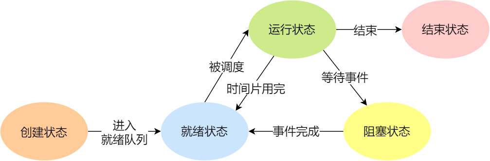

- **NULL -> 创建状态**：一个新进程被创建时的第一个状态；
- **创建状态 -> 就绪状态**：当进程被创建完成并初始化后，一切就绪准备运行时，变为就绪状态，这个过程是很快的；
- **就绪态 -> 运行状态**：处于就绪状态的进程被操作系统的进程调度器选中后，就分配给 CPU 正式运行该进程；
- **运行状态 -> 结束状态**：当进程已经运行完成或出错时，会被操作系统作结束状态处理；
- **运行状态 -> 就绪状态**：处于运行状态的进程在运行过程中，由于分配给它的运行时间片用完，操作系统会把该进程变为就绪态，接着从就绪态选中另外一个进程运行；
- **运行状态 -> 阻塞状态**：当进程请求某个事件且必须等待时，例如请求 I/O 事件；
- **阻塞状态 -> 就绪状态**：当进程要等待的事件完成时，它从阻塞状态变到就绪状态；

如果有大量处于阻塞状态的进程，进程可能会占用着物理内存空间，显然不是我们所希望的，毕竟物理内存空间是有限的，被阻塞状态的进程占用着物理内存就一种浪费物理内存的行为。

所以，在虚拟内存管理的操作系统中，**通常会把阻塞状态的进程的物理内存空间换出到硬盘，等需要再次运行的时候，再从硬盘换入到物理内存**。

那么，就需要一个新的状态，来**描述进程没有占用实际的物理内存空间的情况，这个状态就是挂起状态**。这跟阻塞状态是不一样，阻塞状态是等待某个事件的返回。

另外，挂起状态可以分为两种：

- 阻塞挂起状态：进程在外存（硬盘）并等待某个事件的出现；
- 就绪挂起状态：进程在外存（硬盘），但只要进入内存，即刻立刻运行；

这两种挂起状态加上前面的五种状态，就变成了七种状态变迁，见如下图：

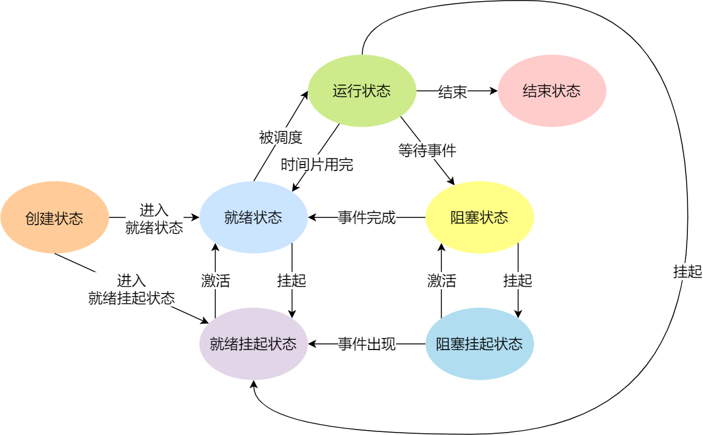

导致进程挂起的原因不只是因为进程所使用的内存空间不在物理内存，还包括如下情况：

- 通过 sleep 让进程间歇性挂起，其工作原理是设置一个定时器，到期后唤醒进程。
- 用户希望挂起一个程序的执行，比如在 Linux 中用 `Ctrl+Z` 挂起进程；

#### 孤儿进程和僵尸进程

- 孤儿进程：一个父进程退出，而它的一个或多个子进程还在运行，那么那些子进程将成为孤儿进程。孤儿进程将被 init 进程（进程号为 1）所收养，并由 init 进程对它们完成状态收集工作。
- 僵尸进程：一个进程使用 fork 创建子进程，如果子进程退出，而父进程并没有调用 wait 或 waitpid 获取子进程的状态信息，回收已经退出的子进程的资源，那么子进程的进程描述符仍然保存在系统中。这种进程称之为僵尸进程。

### 进程的控制结构

在操作系统中，是用**进程控制块**（*process control block，PCB*）数据结构来描述进程的。

**PCB 是进程存在的唯一标识**，这意味着一个进程的存在，必然会有一个 PCB，如果进程消失了，那么 PCB 也会随之消失。

>PCB 具体包含什么信息呢？

**进程描述信息：**

- 进程标识符：标识各个进程，每个进程都有一个并且唯一的标识符；
- 用户标识符：进程归属的用户，用户标识符主要为共享和保护服务；

**进程控制和管理信息：**

- 进程当前状态，如 new、ready、running、waiting 或 blocked 等；
- 进程优先级：进程抢占 CPU 时的优先级；

**资源分配清单：**

- 有关内存地址空间或虚拟地址空间的信息，所打开文件的列表和所使用的 I/O 设备信息。

**CPU 相关信息：**

- CPU 中各个寄存器的值，当进程被切换时，CPU 的状态信息都会被保存在相应的 PCB 中，以便进程重新执行时，能从断点处继续执行。

> 每个 PCB 是如何组织的呢？

通常是通过**链表**的方式进行组织，把具有**相同状态的进程链在一起，组成各种队列**。比如：

- 将所有处于就绪状态的进程链在一起，称为**就绪队列**；
- 把所有因等待某事件而处于等待状态的进程链在一起就组成各种**阻塞队列**；

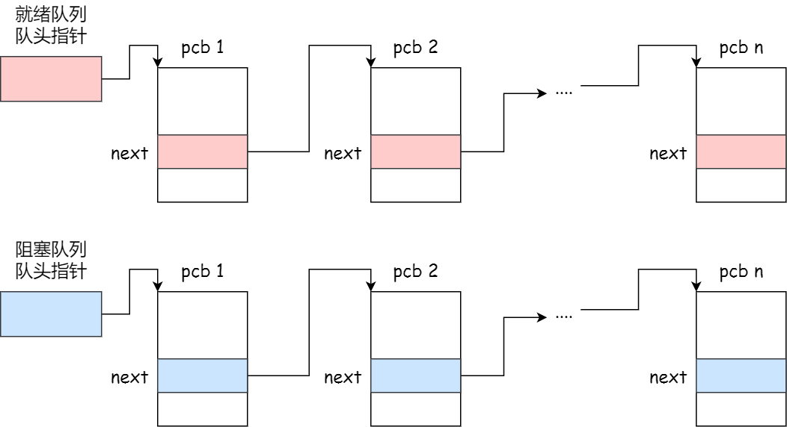

### 进程控制

我们熟知了进程的状态变迁和进程的数据结构 PCB 后，再来看看进程的**创建、终止、阻塞、唤醒**的过程，这些过程也就是进程的控制。

#### 创建进程

操作系统允许一个进程创建另一个进程，而且允许子进程继承父进程所拥有的资源。

创建进程的过程如下：

- 申请一个空白的 PCB，并向 PCB 中填写一些控制和管理进程的信息，比如进程的唯一标识等；
- 为该进程分配运行时所必需的资源，比如内存资源；
- 将 PCB 插入到就绪队列，等待被调度运行；

#### 终止进程

进程可以有 3 种终止方式：正常结束、异常结束以及外界干预（信号 `kill` 掉）。

当子进程被终止时，其在父进程处继承的资源应当还给父进程。而当父进程被终止时，该父进程的子进程就变为孤儿进程，会被 1 号进程收养，并由 1 号进程对它们完成状态收集工作。

终止进程的过程如下：

- 查找需要终止的进程的 PCB；
- 如果处于执行状态，则立即终止该进程的执行，然后将 CPU 资源分配给其他进程；
- 如果其还有子进程，则应将该进程的子进程交给 1 号进程接管；
- 将该进程所拥有的全部资源都归还给操作系统；
- 将其从 PCB 所在队列中删除；

#### 阻塞进程

当进程需要等待某一事件完成时，它可以调用阻塞语句把自己阻塞等待。而一旦被阻塞等待，它只能由另一个进程唤醒。

阻塞进程的过程如下：

- 找到将要被阻塞进程标识号对应的 PCB；
- 如果该进程为运行状态，则保护其现场，将其状态转为阻塞状态，停止运行；
- 将该 PCB 插入到阻塞队列中去；

#### 唤醒进程

进程由「运行」转变为「阻塞」状态是由于进程必须等待某一事件的完成，所以处于阻塞状态的进程是绝对不可能叫醒自己的。

如果某进程正在等待 I/O 事件，需由别的进程发消息给它，则只有当该进程所期待的事件出现时，才由发现者进程用唤醒语句叫醒它。

唤醒进程的过程如下：

- 在该事件的阻塞队列中找到相应进程的 PCB；
- 将其从阻塞队列中移出，并置其状态为就绪状态；
- 把该 PCB 插入到就绪队列中，等待调度程序调度；

### 进程上下文切换

> 进程切换和 CPU 上下文切换有的很大的关系，强烈建议先看这篇极客时间的文章：[03 | 基础篇：经常说的 CPU 上下文切换是什么意思？（上）](https://time.geekbang.org/column/article/69859)

**进程上下文切换，是指从一个进程切换到另一个进程运行**。

进程是由内核来管理和调度的，进程的切换只能发生在内核态。所以，进程的上下文不仅**包括了虚拟内存、栈、全局变量等用户空间的资源，还包括了内核堆栈、寄存器等内核空间的状态**。

切换过程：

1. 接收到切换信号，挂起进程，记录当前进程的虚拟内存、栈等资源存储;   
2. 将这个进程在 CPU 中的上下文状态存储于起来;  
3. 然后在内存中检索下一个进程的上下文，并将其加载到 CPU 的寄存器中恢复; 
4. 还需要刷新进程的虚拟内存和用户栈; 
5. 最后跳转到程序计数器所指向的位置（即跳转到进程被中断时的代码行），以恢复该进程。

另外，Linux 通过 TLB（Translation Lookaside Buffer）来管理虚拟内存到物理内存的映射关系。当**虚拟内存更新后，TLB 也需要刷新**，内存的访问也会随之变慢。特别是在多处理器系统上，缓存是被多个处理器共享的，刷新缓存不仅会影响当前处理器的进程，还会影响共享缓存的其他处理器的进程。

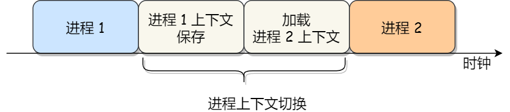

**发生进程上下文切换有哪些场景？**

1、为了保证所有进程可以得到公平调度，CPU 时间被划分为一段段的时间片，这些时间片再被轮流分配给各个进程。这样，当某个进程的时间片耗尽了，进程就从运行状态变为就绪状态，系统从就绪队列选择另外一个进程运行。

2、进程在系统资源不足（比如内存不足）时，要等到资源满足后才可以运行，这个时候进程也会被挂起，并由系统调度其他进程运行。

3、当进程通过睡眠函数 sleep 这样的方法将自己主动挂起时，自然也会重新调度。

4、当有优先级更高的进程运行时，为了保证高优先级进程的运行，当前进程会被挂起，由高优先级进程来运行。

5、发生硬件中断时，CPU 上的进程会被中断挂起，转而执行内核中的中断服务程序。

### 并发和并行的区别

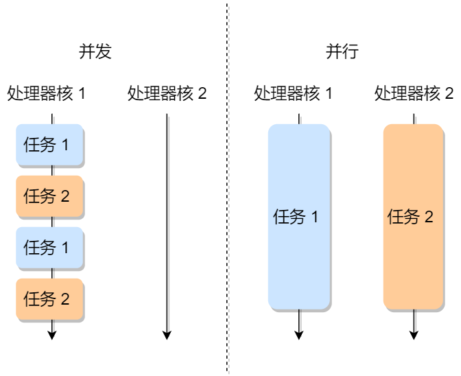

## 线程

**线程是进程中的一条执行流程，是程序执行流的最小单元，是处理器调度和分派的基本单位**。同一个进程内多个线程之间可以共享代码段、数据段、打开的文件等资源，但**每个线程各自都有一套独立的寄存器和栈**，这样可以确保线程的控制流是相对独立的。

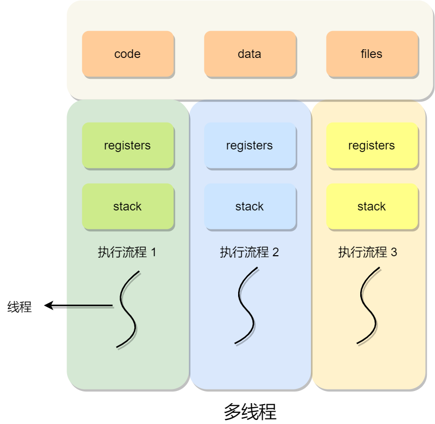

### 进程和线程的对比

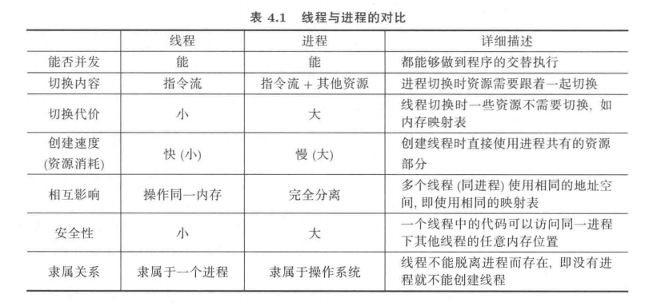

### 线程的控制结构

线程控制块（TCB）用来保持运行时线程状态的数据结构，在线程切换时用来保持线程信息。和 PCB 表一样，每个 TCB 是**通过链表的方式来组织**的。

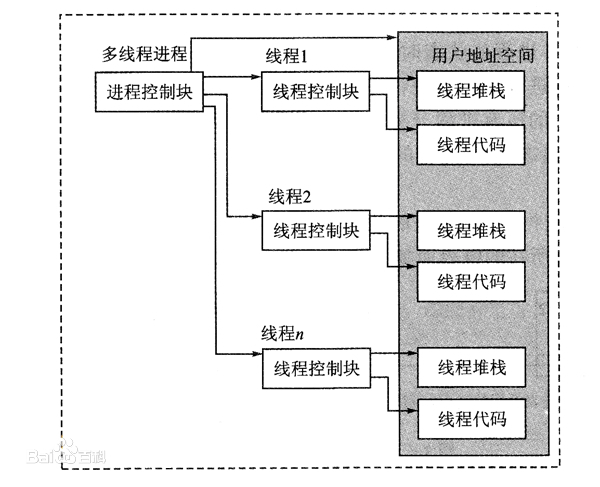

### 线程的创建

初始化 TCB，分配栈和寄存器。共享进程的资源（虚拟内存，全局变量等）。

### 线程的上下文切换

线程与进程最大的区别在于，线程是调度的基本单位，而进程则是资源拥有的基本单位。说白了，**所谓内核中的任务调度，实际上的调度对象是线程**；而进程只是给线程提供了**虚拟内存、全局变量**等资源。所以，对于线程和进程，我们可以这么理解：

- 当进程只有一个线程时，可以认为进程就等于线程。

- 当进程拥有多个线程时，这些线程会共享相同的虚拟内存和全局变量等资源。这些资源在上下文切换时是不需要修改的。

- 另外，线程也有自己的私有数据，比如栈和寄存器等，这些在上下文切换时也是需要保存的。

这么一来，**线程的上下文切换其实就可以分为两种情况**：

- 第一种， 前后两个线程属于不同进程。此时，因为资源不共享，所以切换过程就跟进程上下文切换是一样。

- 第二种，前后两个线程属于同一个进程。此时，因为虚拟内存是共享的，所以在切换时，虚拟内存这些资源就保持不动，只需要切换线程的**私有数据、寄存器（CPU 上下文）等不共享的数据**。

到这里你应该也发现了，虽然同为上下文切换，但同进程内的线程切换，要比多进程间的切换消耗更少的资源，而这，也正是多线程代替多进程的一个优势。

### 线程的实现

线程的实现方式：

1. **用户级线程（User Thread）**：在用户空间实现的线程，是由用户程序自己来管理的线程。
2. **内核级线程（Kernel Thread）**：在内核中实现的线程，是由操作系统管理的线程。

#### 用户级线程

**用户级线程是基于用户态的线程管理库来实现**的，那么**线程控制块（Thread Control Block，TCB）** 也是在库里面来实现的，**对于操作系统而言是看不到这个 TCB 的，它只能看到整个进程的 PCB**。用户级线程对操作系统完全透明。

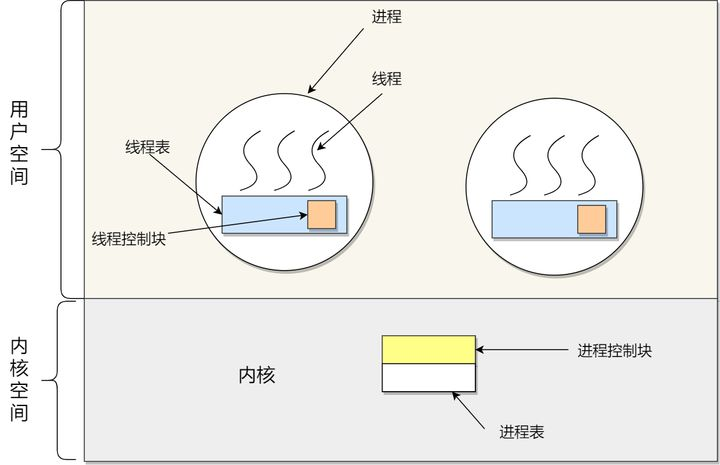

> 用户级线程创建

上图我们可以看到，用户级线程的线程控制块是在用户空间，线程切换由用户控制。

所以，用户级线程的整个线程管理和调度，操作系统是不直接参与的，而是**由用户级线程库函数来完成线程的管理**，包括线程的创建、终止、同步和调度等。

> 用户级线程切换

我们以一个多线程的浏览器为例子。如下图所示，假设启动了两个用户级线程 GetData 和 ShowText，当 GetData 下载了网页文本数据时，GetData 可以调用用户态函数 `Yield` 让出 CPU，切换到 ShowText 线程。在 ShowText 线程将内容数据显示到屏幕上以后，再调用用户态函数 `Yield` 让出 CPU，从而切换回 GetData 继续执行。


- 伪代码如下

```c++
void GetData() {
	....
	Yield();
};

void ShowText() {
	...
	Yield();
};

void Yield() {
    ...
};
```

既然是用户级线程，**Yield 也是一个普通的用户态函数，由用户自己编写**。

> 用户级线程优点

1. 每个进程都需要有它私有的线程控制块（TCB）列表，用来跟踪记录它各个线程状态信息（PC、栈指针、寄存器），TCB 由用户级线程库函数来维护，创建代价小，**可用于不支持线程技术的操作系统**；
2. 用户级线程的切换也是由线程库函数（YieId）来完成的，无需用户态与内核态的切换，所以速度特别快；

> 用户级线程缺点

1. 由于操作系统不参与线程的调度，如果一个线程发起了系统调用而阻塞，那进程所包含的用户级线程都不能执行了。

2. 当一个线程开始运行后，除非它主动地交出 CPU 的使用权，否则它所在的进程当中的其他线程无法运行，因为用户态的线程没法打断当前运行中的线程，它没有这个特权，只有操作系统才有，但是用户级线程不是由操作系统管理的。

3. 由于时间片分配给进程，故与其他进程比，在多线程执行时，每个线程得到的时间片较少，执行会比较慢。

#### 内核级线程

一个用户级线程在执行过程中可能会进人内核态，如上面例子中线程 GetData 会通过网卡向网站发出数据下载请求，网卡是由操作系统负责驱动、管理的，所以 GetData 发出数据下载请求要借助系统调用进人操作系统内核才能完成。用户级线程进人操作系统内核以后，很可能要发生 CPU 切换，例如 GetData 要等待网络连接成功，在这段等待过程中，CPU 完全可以切换出去执行其他程序来实现 CPU 的高效利用。

此时就会出现下图（a）所示的情况：即使用户级线程 ShowText 可以执行，但由于操作系统无法感知到用户级线程 ShowText 的存在（因为线程 ShowText 对应的 TCB 等信息都处在用户态），所以操作系统此时不可能切换到线程 ShowText 去执行。也就是说，**如果一个用户级线程在内核中阻塞，则这个进程的所有用户级线程将全部阻塞**。这就限制了用户级线程的并发程度，从而限制了由并发性带来的计算机硬件工作效率的提升。

> 内核级线程创建

内核级线程就是让内核态内存和用户态内存合作创建一个指令执行序列，**内核级线程的 TCB 等信息是创建在操作系统内核中的**，操作系统通过这些数据结构可以感知和操作内核级线程，如下图（b）所示。

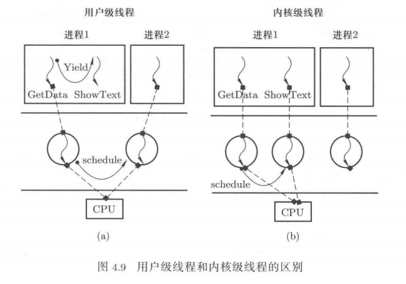

根据前面用户级的线程实例 GetData 的分析结果不难得出这样子的结论：**内核级线程较用户级线程而言具有更好的并发性，硬件工作效率也会更高一些**。

> 内核级线程切换

内核级线程也有用户态和内核态，对比我们之前说的用户级线程通过 YieId 主动由用户切换，而内核级线程必须进入到内核才能进行切换，所以内核级线程的切换则是系统发生了中断，因为**中断会导致从用户态到内核态的切换**。

> 内核级线程优点

1. 在一个进程当中，如果某个内核级线程发起系统调用而被阻塞，并不会影响其他内核级线程的运行；

2. 分配给线程，多线程的进程获得更多的 CPU 运行时间；

> 内核级线程缺点

在支持内核级线程的操作系统中，由内核来维护进程和线程的上下问信息，如 PCB 和 TCB。线程的创建、终止和切换都是通过系统调用的方式来进行，因此对于系统来说，系统开销比较大。

## Linux 中进程和线程区别

进程线程创建的时候，使用的函数看起来不一样。但实际在底层实现上，最终都是使用同一个函数来实现的。

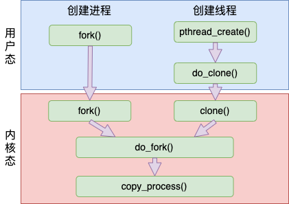

进程和线程的相同点要远远大于不同点。主要依据就是**在 Linux 中，无论进程还是线程，都是抽象成了 task 任务**，在源码里都是用 task_struct 结构来实现的。

Linux 线程和进程的区别是会和创建它的父进程**共享打开文件列表、目录信息、虚拟地址空间等数据结构**，会更轻量一些。所以在 Linux 下的线程也叫**轻量级进程**。

在打开文件列表、目录信息、内存虚拟地址空间中，内存虚拟地址空间是最重要的。因此区分一个 Task 任务该叫线程还是该叫进程，一般习惯上就看它**是否有独立的地址空间**。如果有，就叫做进程，没有，就叫做线程。

对于内核任务来说，无论有多少个任务，其使用地址空间都是同一个。所以一般都叫**内核线程**，而不是内核进程。

**推荐阅读**：[聊聊Linux中线程和进程的联系与区别！](https://mp.weixin.qq.com/s/--S94B3RswMdBKBh6uxt0w)

## 参考文章

- [5.1 进程、线程基础知识 | 小林coding](https://xiaolincoding.com/os/4_process/process_base.html)
- 《操作系统原理、实现与实践》
- [聊聊Linux中线程和进程的联系与区别！](https://mp.weixin.qq.com/s/--S94B3RswMdBKBh6uxt0w)