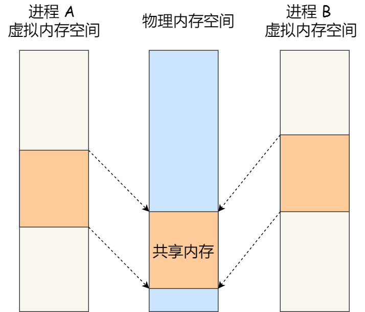

[TOC]

# 进程间通信

每个进程的用户地址空间都是独立的，一般而言是不能互相访问的。

## 管道

### 匿名管道

**匿名管道**顾名思义，它没有名字标识，匿名管道是特殊文件只存在于内存，没有存在于文件系统中，shell 命令中的「`|`」竖线就是匿名管道，通信的数据是**无格式的流并且大小受限**，通信的方式是**单向**的，数据只能在一个方向上流动，如果要双向通信，需要创建两个管道，再来**匿名管道是只能用于存在父子关系的进程间通信**，匿名管道的生命周期随着进程创建而建立，随着进程终止而消失。

### 命名管道

**命名管道**突破了匿名管道只能在亲缘关系进程间的通信限制，因为使用命名管道的前提，需要在文件系统创建一个类型为 p 的设备文件，那么毫无关系的进程就可以通过这个设备文件进行通信。另外，不管是匿名管道还是命名管道，进程写入的数据都是**缓存在内核**中，另一个进程读取数据时候自然也是从内核中获取，同时通信数据都遵循**先进先出**原则，不支持 lseek 之类的文件定位操作。

## 消息队列

**消息队列**克服了管道通信的数据是无格式的字节流的问题，消息队列实际上是保存在内核的「消息链表」，消息队列的消息体是可以用户自定义的数据类型，发送数据时，会被分成一个一个独立的消息体，当然接收数据时，也要与发送方发送的消息体的数据类型保持一致，这样才能保证读取的数据是正确的。消息队列通信的速度不是最及时的，毕竟**每次数据的写入和读取都需要经过用户态与内核态之间的拷贝过程。**

## 共享内存

**共享内存**可以解决消息队列通信中用户态与内核态之间数据拷贝过程带来的开销，**它直接分配一个共享空间，每个进程都可以直接访问**，就像访问进程自己的空间一样快捷方便，不需要陷入内核态或者系统调用，大大提高了通信的速度，享有**最快**的进程间通信方式之名。但是便捷高效的共享内存通信，**带来新的问题，多进程竞争同个共享资源会造成数据的错乱。**



## 信号量

用了共享内存通信方式，带来新的问题，那就是如果多个进程同时修改同一个共享内存，很有可能就冲突了。例如两个进程都同时写一个地址，那先写的那个进程会发现内容被别人覆盖了。

**信号量**来保护共享资源，以确保任何时刻只能有一个进程访问共享资源，这种方式就是互斥访问。**信号量不仅可以实现访问的互斥性，还可以实现进程间的同步**，信号量其实是一个计数器，表示的是资源个数，其值可以通过两个原子操作来控制，分别是 **P 操作和 V 操作**。

- P 操作，这个操作会把信号量减去 1，相减后如果信号量 < 0，则表明资源已被占用，进程需阻塞等待；相减后如果信号量 >= 0，则表明还有资源可使用，进程可正常继续执行。
- V 操作，这个操作会把信号量加上 1，相加后如果信号量 <= 0，则表明当前有阻塞中的进程，于是会将该进程唤醒运行；相加后如果信号量 > 0，则表明当前没有阻塞中的进程。

## 信号

与信号量名字很相似，它俩名字虽然相似，但功能一点儿都不一样。上面说的进程间通信，都是常规状态下的工作模式。**对于异常情况下的工作模式，就需要用「信号」的方式来通知进程。**

在 Linux 操作系统中， 为了响应各种各样的事件，提供了几十种信号，分别代表不同的意义。我们可以通过 `kill -l` 命令，查看所有的信号：

```shell
$ kill -l
 1) SIGHUP       2) SIGINT       3) SIGQUIT      4) SIGILL       5) SIGTRAP
 6) SIGABRT      7) SIGBUS       8) SIGFPE       9) SIGKILL     10) SIGUSR1
11) SIGSEGV     12) SIGUSR2     13) SIGPIPE     14) SIGALRM     15) SIGTERM
16) SIGSTKFLT   17) SIGCHLD     18) SIGCONT     19) SIGSTOP     20) SIGTSTP
21) SIGTTIN     22) SIGTTOU     23) SIGURG      24) SIGXCPU     25) SIGXFSZ
26) SIGVTALRM   27) SIGPROF     28) SIGWINCH    29) SIGIO       30) SIGPWR
31) SIGSYS      34) SIGRTMIN    35) SIGRTMIN+1  36) SIGRTMIN+2  37) SIGRTMIN+3
38) SIGRTMIN+4  39) SIGRTMIN+5  40) SIGRTMIN+6  41) SIGRTMIN+7  42) SIGRTMIN+8
43) SIGRTMIN+9  44) SIGRTMIN+10 45) SIGRTMIN+11 46) SIGRTMIN+12 47) SIGRTMIN+13
48) SIGRTMIN+14 49) SIGRTMIN+15 50) SIGRTMAX-14 51) SIGRTMAX-13 52) SIGRTMAX-12
53) SIGRTMAX-11 54) SIGRTMAX-10 55) SIGRTMAX-9  56) SIGRTMAX-8  57) SIGRTMAX-7
58) SIGRTMAX-6  59) SIGRTMAX-5  60) SIGRTMAX-4  61) SIGRTMAX-3  62) SIGRTMAX-2
63) SIGRTMAX-1  64) SIGRTMAX
```

信号是进程间通信机制中**唯一的异步通信机制**，因为可以在任何时候发送信号给某一进程，一旦有信号产生，我们就有下面这几种，用户进程对信号的处理方式。

**1.执行默认操作**。Linux 对每种信号都规定了默认操作，例如，上面列表中的 SIGTERM 信号，就是终止进程的意思。

**2.捕捉信号**。我们可以为信号定义一个信号处理函数。当信号发生时，我们就执行相应的信号处理函数。

**3.忽略信号**。当我们不希望处理某些信号的时候，就可以忽略该信号，不做任何处理。有两个信号是应用进程无法捕捉和忽略的，即 `SIGKILL` 和 `SEGSTOP`，它们用于在任何时候中断或结束某一进程。

## socket

前面提到的管道、消息队列、共享内存、信号量和信号都是在同一台主机上进行进程间通信，那要想**跨网络与不同主机上的进程之间通信，就需要 Socket 通信了。**

实际上，Socket 通信不仅可以跨网络与不同主机的进程间通信，还可以在同主机上进程间通信。

## 参考文章

- [5.2 进程间有哪些通信方式？ | 小林coding](https://xiaolincoding.com/os/4_process/process_commu.html)