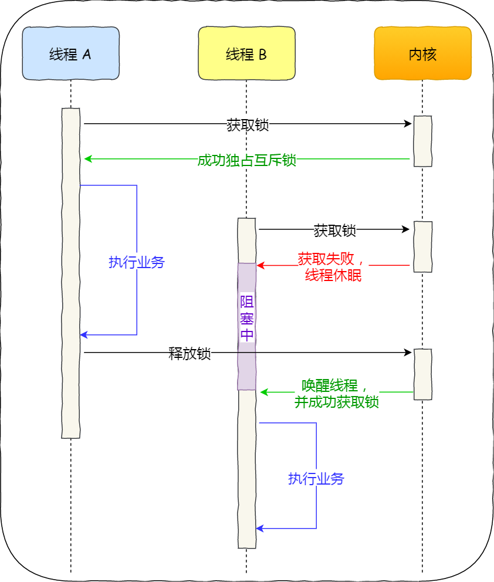

[TOC]

# 锁

多线程访问共享资源的时候，避免不了资源竞争而导致数据错乱的问题，所以我们通常为了解决这一问题，都会在访问共享资源之前加锁。加锁的目的就是保证共享资源在任意时间里，只有一个线程访问，这样就可以避免多线程导致共享数据错乱的问题。

## 互斥锁与自旋锁

最底层的两种就是会「互斥锁和自旋锁」，有很多高级的锁都是基于它们实现的，你可以认为它们是各种锁的地基，所以我们必须清楚它俩之间的区别和应用。

当已经有一个线程加锁后，其他线程加锁则就会失败，互斥锁和自旋锁对于加锁失败后的处理方式是不一样的：

- **互斥锁**加锁失败后，线程会**释放 CPU** ，给其他线程；
- **自旋锁**加锁失败后，线程会**忙等待**，直到它拿到锁；

互斥锁是一种「独占锁」，比如当线程 A 加锁成功后，此时互斥锁已经被线程 A 独占了，只要线程 A 没有释放手中的锁，线程 B 加锁就会失败，于是就会释放 CPU 让给其他线程，**既然线程 B 释放掉了 CPU，自然线程 B 加锁的代码就会被阻塞**。

**对于互斥锁加锁失败而阻塞的现象，是由操作系统内核实现的**。当加锁失败时，内核会将线程置为「睡眠」状态，等到锁被释放后，内核会在合适的时机唤醒线程，当这个线程成功获取到锁后，于是就可以继续执行。如下图：

所以，互斥锁加锁失败时，会从用户态陷入到内核态，让内核帮我们切换线程，虽然简化了使用锁的难度，但是存在一定的性能开销成本。

那这个开销成本是什么呢？会有**两次线程上下文切换的成本**：

- 当线程加锁失败时，内核会把线程的状态从「运行」状态设置为「睡眠」状态，然后把 CPU 切换给其他线程运行；
- 接着，当锁被释放时，之前「睡眠」状态的线程会变为「就绪」状态，然后内核会在合适的时间，把 CPU 切换给该线程运行。

自旋锁是通过 CPU 提供的 `CAS` 函数（*Compare And Swap*），**在「用户态」完成加锁和解锁操作**，不会主动产生线程上下文切换，所以相比互斥锁来说，会快一些，开销也小一些。

一般加锁的过程，包含两个步骤：

- 第一步，查看锁的状态，如果锁是空闲的，则执行第二步；
- 第二步，将锁设置为当前线程持有；

CAS 函数就把这两个步骤合并成一条硬件级指令，形成**原子指令**，这样就保证了这两个步骤是不可分割的，要么一次性执行完两个步骤，要么两个步骤都不执行。

自旋锁是最比较简单的一种锁，一直自旋（while 循环），利用 CPU 周期，直到锁可用。

自旋锁与互斥锁使用层面比较相似，但实现层面上完全不同：**当加锁失败时，互斥锁用「线程切换」来应对，自旋锁则用「忙等待」来应对**。

它俩是锁的最基本处理方式，更高级的锁都会选择其中一个来实现，比如读写锁既可以选择互斥锁实现，也可以基于自旋锁实现。

## 读写锁

读写锁从字面意思我们也可以知道，它由「读锁」和「写锁」两部分构成，如果只读取共享资源用「读锁」加锁，如果要修改共享资源则用「写锁」加锁。

先说结论：读写锁在读多写少的场景，能发挥出优势。

读锁是允许同时执行的，但写锁是互斥的。一般来说，有如下几种情况：

- 读锁之间不互斥，没有写锁的情况下，读锁是无阻塞的，多个线程可以同时获得读锁，这样提高了对共享资源的访问效率。
- 写锁之间是互斥的，存在写锁，其他写锁阻塞。
- 写锁与读锁是互斥的，如果存在读锁，写锁阻塞，如果存在写锁，读锁阻塞。

**简单来说，就是写的过程中不允许读，读的过程中不允许写。避免读到的是写操作的中间状态。**

## 乐观锁和悲观锁

- 乐观锁是先修改同步资源，再验证有没有发生冲突。

- 悲观锁是修改共享数据前，都要先加锁，防止竞争。

前面提到的互斥锁、自旋锁、读写锁，都是属于悲观锁。

乐观锁的心态是，不管三七二十一，先改了资源再说。另外，你会发现**乐观锁全程并没有加锁，所以它也叫无锁编程**。

这里举一个场景例子：在线文档。

我们都知道在线文档可以同时多人编辑的，如果使用了悲观锁，那么只要有一个用户正在编辑文档，此时其他用户就无法打开相同的文档了，这用户体验当然不好了。

那实现多人同时编辑，实际上是用了乐观锁，它允许多个用户打开同一个文档进行编辑，编辑完提交之后才验证修改的内容是否有冲突。

怎么样才算发生冲突？这里举个例子，比如用户 A 先在浏览器编辑文档，之后用户 B 在浏览器也打开了相同的文档进行编辑，但是用户 B 比用户 A 提交早，这一过程用户 A 是不知道的，当 A 提交修改完的内容时，那么 A 和 B 之间并行修改的地方就会发生冲突。

服务端要怎么验证是否冲突了呢？通常方案如下：

- 由于发生冲突的概率比较低，所以先让用户编辑文档，但是浏览器在下载文档时会记录下服务端返回的文档版本号；
- 当用户提交修改时，发给服务端的请求会带上原始文档版本号，服务器收到后将它与当前版本号进行比较，如果版本号不一致则提交失败，如果版本号一致则修改成功，然后服务端版本号更新到最新的版本号（**提交和修改版本的原子性在代码里可以用互斥锁来保证**）。

实际上，我们常见的 SVN 和 Git 也是用了乐观锁的思想，先让用户编辑代码，然后提交的时候，通过版本号来判断是否产生了冲突，发生了冲突的地方，需要我们自己修改后，再重新提交。

乐观锁虽然去除了加锁解锁的操作，但是一旦发生冲突，重试的成本非常高，所以**只有在冲突概率非常低，且加锁成本非常高的场景时，才考虑使用乐观锁。**

## 参考文章

- [5.5 什么是悲观锁、乐观锁？ | 小林coding](https://xiaolincoding.com/os/4_process/pessim_and_optimi_lock.html)
- [读写锁和互斥锁的性能比较](https://geektutu.com/post/hpg-mutex.html)