[TOC]

# 堆

## 堆的概念

首先它是一颗完全二叉树（从上到下，从左往右依次来生成节点），并且所有父节点的值大于（小于）子节点的值。

> 父节点大于子节点的叫大顶堆，小于则叫小顶堆。

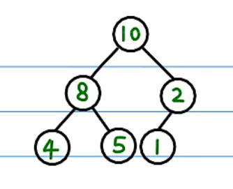

## heapify

假设我们有这么一个完全二叉树：

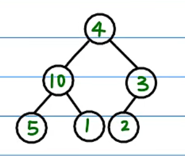

我们可以看到，唯一只有 4 这个节点的值不大于它的子节点。如何把这颗树调整为一个堆呢？

把父节点和最大的子节点作为交换，我们把调整的过程叫做 `heapfiy`。

第一次 `heapfiy`，把父节点 4 的值和最大的子节点 10 进行交换。

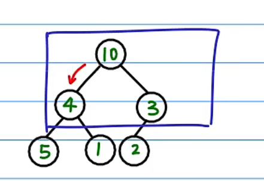

因为交换下来的节点还不满足堆的条件，所以我们需要继续对 4 做 `heapfiy`，4 和 5 节点交换。

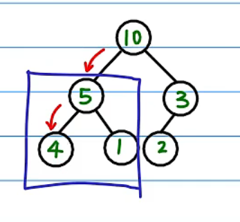

第二次 `heapify` 完成后，由于 4 这个值已经到达叶子节点了，此时就调整成了一个大顶堆。是完全二叉树，而且所有的父节点都大于它的子节点。

- 时间复杂度

`heapify` 时间复杂度为 `O(logN)`。怎么推断的出来的呢？N 为所有节点的数量，`logN` 就是层数，所以 `heapify` 最多移动 `logN` 层。

## 构建堆

如果这些数字非常乱呢，该怎么做 `heapfiy` 才能树重新构建成堆？答案是：自底向上，从右往左进行 `heapify`。

从倒数第二层开始，往上的每个节点都做 `heapfiy`。我们对倒数第二层右边的节点做 `heapify`，那么我们就可以保证这个右子树是一个堆了。

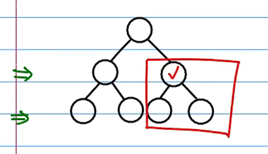

同理我们对左边的子树的节点做 `heapify`。当该层的节点都调整完后，继续调整上一层的节点。这样子就能构建好一个堆了。

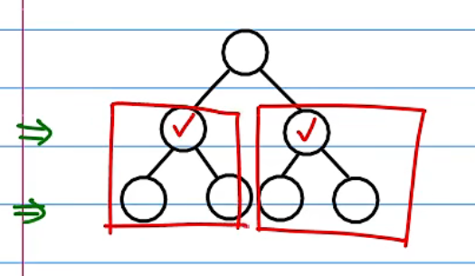

如果以层序遍历方式给完全二叉树节点标号

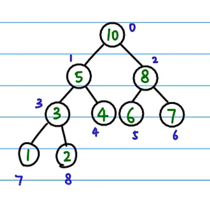

那么可以用一个一维数组表示这颗二叉树：`int arr[] = {10, 5, 8, 3, 4, 6, 7, 1, 2}`。

为什么可以用一维数组表示呢？因为我们可以保证这些点的序号是可以连着的，中间不会出现断开的这种情况，因为这是一颗完全二叉树。

用数组来表示完全二叉树还有一个好处，就是从任何一个节点出发，我都可以计算这个节点的父节点和子节点。

假设当前节点的 index 为 i，那么：

```bash
parent = (i - 1) / 2 // 父节点下标
c1 = 2i + 1          // 左孩子下标
c2 = 2i + 2          // 右孩子下标
```

所以把这一颗无序的树调整为堆，我们只需要按照 `3 --> 2 --> 1 --> 0` 的顺序倒着做 `heapify` 就可以了。

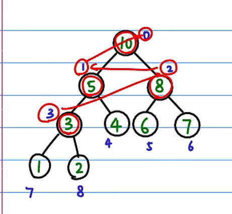

那如何确定 `heapify` 的起始节点的 index 呢？

根据上图，很明显起始做 `heapify` 的节点是最后一个节点的 parent。所以根据总的节点数为 9，很容易知道最后一个节点的 index 为 8，所以起始节点 index 为 `(8 - 1) / 2 = 3`。

- 时间复杂度

建堆时间复杂度为 `O(N)`

## 堆排序

构建好一个堆后，我们就很容易进行排序了（我们这里进行的是原地排序）。

>原地排序就是指在排序过程中不申请多余的存储空间，只利用原来存储待排数据的存储空间进行比较和交换的数据排序

下面对 `int arr = {10, 5, 4, 1, 2, 3}` 这个堆进行排序：

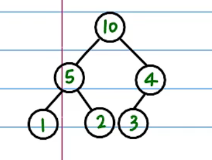

首先第一个节点（根节点）肯定是最大（最小）的节点。所以先把根节点和最后一个节点进行交换，这样子我们最大的节点就跑到最后一位去了，然后我们把最后节点单独领出来。

因为刚才 3 和 10 做了交换，所以破坏了这个堆结构，交换后已经不是一个堆了。

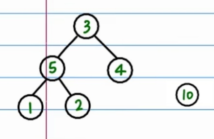

所以我们需要对交换后的根节点进行 `heapify`，把剩余的节点一起重新构建成一个堆。

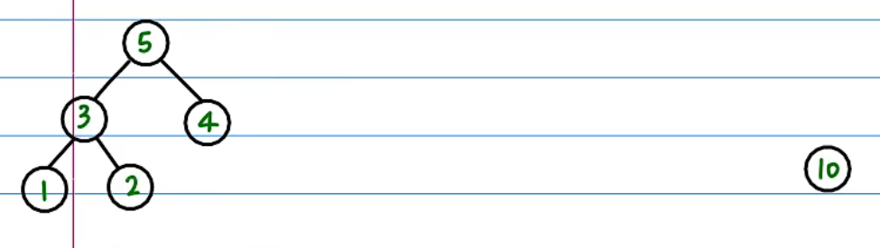

继续重复执行这个过程，直到堆中剩下最后一个数字为止。就排序完毕了。

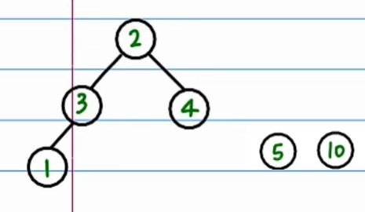

最后的一维数组就变为：`int arr[] = {1, 2, 3, 4, 5, 10}`

问题：为什么要和最后一个节点进行交换吗？其他的节点不行吗？

因为我们要始终保证这个树为一个完全二叉树，所以只能和最后一个节点交换。

- 时间复杂度

堆排序时间复杂度为 `O(NlogN)`

## 代码示例

```C++
#include <iostream>
#include <vector>

using namespace std;

// n 表示节点数，i 表示节点的 index
void heapify(vector<int>& arr, int n, int i)
{
    if (i >= n)
    {
        return;
    }
    int c1 = 2 * i + 1;
    int c2 = 2 * i + 2;
    int maxIdx = i;
    if (c1 < n && arr[c1] > arr[maxIdx])
    {
        maxIdx = c1;
    }
    if (c2 < n && arr[c2] > arr[maxIdx])
    {
        maxIdx = c2;
    }
    if (maxIdx != i) // 如果需要调整，就交换后递归，否则直接结束
    {
        swap(arr[i], arr[maxIdx]);
        heapify(arr, n, maxIdx);
    }
}

void buildHeap(vector<int>& arr)
{
    int lastIndex = arr.size() - 1;
    int parentIndex = (lastIndex - 1) / 2;
    for (int i = parentIndex; i >= 0; i--)
    {
        heapify(arr, arr.size(), i);
    }
}

void heapSort(vector<int>& arr)
{
    // 先构建一个堆
    buildHeap(arr);
    for (int i = arr.size() - 1; i >= 0; i--)
    {
        // 根节点和最后一个节点做交换
        swap(arr[0], arr[i]);
        // 每次交换 n 的节点数都要减 1（因为最后一个节点已经从堆中移出去了）
        heapify(arr, i, 0);
    }
}

void testHeapify()
{
    vector<int> arr = {4, 10, 3, 5, 1, 2};
    heapify(arr, arr.size(), 0);
    for (auto a : arr)
    {
        printf("%d ", a);
    }
    cout << endl;
}

void testBuildHeap()
{
    vector<int> arr = {4, 3, 5, 10, 2, 1};
    buildHeap(arr);
    for (auto a : arr)
    {
        printf("%d ", a);
    }
    cout << endl;
}

void testHeapSort()
{
    vector<int> arr = {4, 3, 5, 10, 2, 1};
    heapSort(arr);
    for (auto a : arr)
    {
        printf("%d ", a);
    }
    cout << endl;
}

int main()
{
    testHeapify();
    testBuildHeap();
    testHeapSort();
    return 0;
}
```

## 上滤

节点向下调整我们称为下滤（我们上面所说的 `heapify` 就是下滤），节点向上调整我们称为上滤。

假设我已经有一个堆了，但是现在我需要插入一个元素。我们把这个元素插入到尾部（因为要保持完全二叉树）。

假设插入元素 8，如下图。

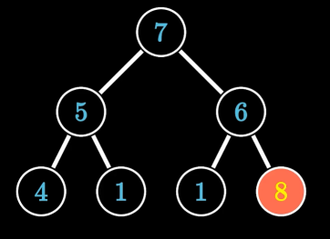

插入元素 8 后破坏了堆结构，所以要做上滤操作，和节点 6 互换。交换后如果还没有满足堆序性，需要继续上滤。

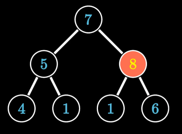

和 7 互换后，满足了堆序性，操作结束。

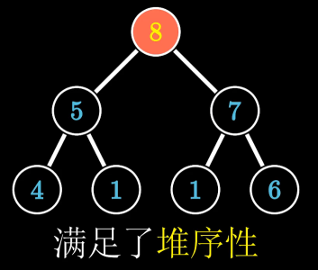

具体的应用就是 C++ 的优先队列元素的插入。

上滤的时间复杂度为 `O(logN)`。

## 参考文章

- [堆排序（heapsort）](https://www.bilibili.com/video/BV1Eb41147dK/?spm_id_from=333.788.recommend_more_video.-1&vd_source=51260d25382c5147c8b23cc6581c2b75)
- [从堆的定义到优先队列、堆排序](https://www.bilibili.com/video/BV1AF411G7cA/?spm_id_from=333.880.my_history.page.click&vd_source=51260d25382c5147c8b23cc6581c2b75)