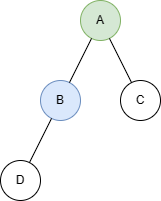
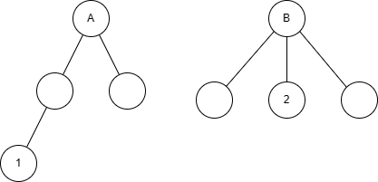
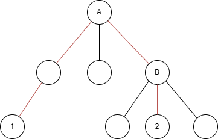
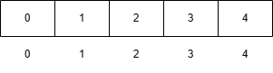
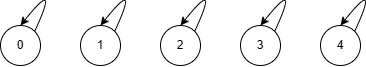
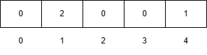
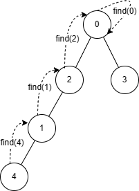
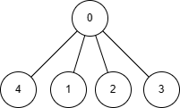

[TOC]

# 并查集

并查集是一种树形数据结构，用于维护一组集合，支持两个操作：

- 合并两个集合。
- 查询两个元素是否在同一个集合中。

并查集常常用于解决动态连通性问题，即维护一张图中连通的边。

- 父节点和祖先节点（根节点）区别

如下图，B 是 D 的父亲节点，A 是 D 的祖先（根节点）。



- 并查集查询和合并思想

假设我们有两个集合，如下图，1 和 2 分别在不同的集合中，我们要如何让把 1 和 2 关联起来（合并为同一个集合）。



首先先找到 1 的根节点 A，2 的根节点 B。进行合并操作，让 B 成为 A 的子树（当然也可以让 A 成为 B 的子树）。



此时 1 和 2 就是在同一个集合了（因为它们的根节点都是同一个）。另外一种说法就是节点 1 和 2 连通起来了。

## 初始化

```c++
int fa[MAXN];
void init(int n)
{
	for (int i = 0; i < n; i++)
	{
		fa[i] = i;
	}
}
```

假如有编号为 0, 1, 2, ..., n-1 的 n 个元素，我们用一个数组 `fa[]` 来存储每个元素的父亲节点。

**fa 的含义：`fa[i] = j` 表示 i 的父亲节点为 j。**

一开始我们先将它们的父节点设为自己。

- 初始化数组



- 树结构表示



## 查询

- 如何查询两个元素是否在同一个集合？

在并查集中，每个元素都有一个祖先节点（根节点）。从该元素开始访问父节点（一般用递归查找）直到一步步访问到根节点。如果两个元素的根节点相同，则说明这两个元素在同一个集合中。

- `find` 函数代码

```c++
// 查询点 x 的根节点
int find(int x)
{
    // 当前 x 的父亲节点是自己，说明找到头了，返回
    // 因为根节点的父节点是它本身
    if(x == fa[x]) 
    {
    	return x;
    }
    return find(fa[x]); // 递归查询
}
```

假设我们有这么个并查集：

`fa[0] = 0; fa[1] = 2; fa[2] = 0; fa[3] = 0; fa[4] = 1;`

所以 fa 数组如下图：


所以根据 fa 数组我们可以画出以下的树结构：



假设我们要查询 4 和 3 是否在同一个集合，通过 `find` 函数不断递归，最终查询到 4 的根节点为 0（`find(4) = 0`）。而 3 的根节点也为 0（`find(3) = 0`），所以它们是同一个集合。

### 路径压缩

我们发现如果树越高，`find` 函数递归的次数也就越多，所以查询效率就越低。既然判断两个元素是否是同一个集合看的是他们的根结点是否一样，那么还不如直接把每个元素的父结点改为这个集合的根结点，如下图：



这样一来就方便多了，就不用一层一层往上找自己的根节点是谁了，就直接向上找一层就行了。

那么应该要怎么实现呢？只要在查找的过程中，把沿途的每个节点的父节点都设为根结点即可，下一次查找的时候就可以省去很多查找步骤。

```c++
// 查找点 x 的根节点
int find(int x)
{
    // 当前 x 的父亲节点是自己，说明找到头了，返回
    // 因为根节点的父节点是它本身
    if(x == fa[x]) 
    {
        return x;
    }
    // return find(fa[x]); // 非路径压缩
    fa[x] = find(fa[x]);   // 路径压缩，把沿途每个节点的父节点设为根节点
    return fa[x];          // 返回 x 的根节点
}
```

## 合并

注意：为了画图简单，这里我们先不考虑 `find` 的路径压缩。

```c++
// 将点 x 和点 y 合并到一个集合中（合并两棵树）
void unite(int x, int y)
{
    int xFa = find(x); // 找到 x 的根节点
    int yFa = find(y); // 找到 y 的根节点
    fa[xFa] = yFa;     // 让 x 的根节点指向 y 的根节点
}
```

假设我们有以下这两个集合：


执行 `unite(2, 1)`，首先我们先通过 `find(2)` 找到 2 的根节点 B，然后 `find(1)` 找到 1 的根节点为 A。最后执行 `fa[A] = B` 让 B 成为 A 的父节点。合并后如下图：


## 并查集类模板代码

```cpp
class UnionFindSet
{
public:
    // 初始化并查集
    UnionFindSet(int n)
    {
        for (int i = 0; i < n; i++)
        {
            fa.resize(n);
            fa[i] = i; // 初始化父亲节点指向自己
        }
    }

    // 查找点 x 的根节点
    int find(int x)
    {
        // 当前 x 的父亲节点是自己，说明找到头了，返回
        // 因为根节点的父节点是它本身
        if(x == fa[x]) 
        {
            return x;
        }
        // return find(fa[x]); // 非路径压缩
        fa[x] = find(fa[x]);   // 路径压缩，把沿途每个节点的父节点设为根节点
        return fa[x];          // 返回 x 的根节点
    }

    // 将点 x 和点 y 合并到一个集合中（合并两棵树）
    void unite(int x, int y)
    {
        int xFa = find(x); // 找到 x 的根节点
        int yFa = find(y); // 找到 y 的根节点
        fa[xFa] = yFa;     // 让 x 的根节点指向 y 的根节点
    }

private:
    // 假如有编号为 0,1,2...n-1 的 n 个元素，我们用一个数组 fa[] 来存储每个元素的父亲节点
    // fa[i] = j 表示 i 的父亲节点为 j
    vector<int> fa;
};
```

## 按秩合并

// TO

## 参考文章

- [并查集 - CSDN](https://blog.csdn.net/weixin_38279101/article/details/112546053)
- [图论——并查集 - B 站](https://www.bilibili.com/video/BV1jv411a7LK/?spm_id_from=333.788.top_right_bar_window_default_collection.content.click)