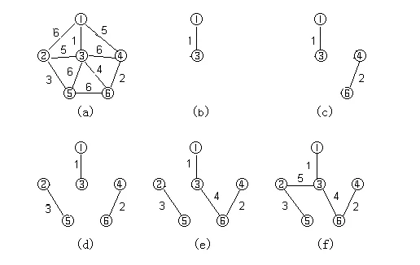

[TOC]

# 最小生成树

最小生成树问题是指，给定一个带权的无向连通图，要找出一棵生成树，使得这棵生成树的边权之和最小。

换句话说，一个有 N 个点的图，边一定是大于等于 N-1 条的。图的最小生成树，就是在这些边中选择 N-1 条出来，**连接所有的 N 个点**。这 N-1 条边的边权之和是所有方案中最小的。

最小生成树算法的常见实现方式有两种：克鲁斯卡尔算法（Kruskal's algorithm）和最小生成树算法（Prim's algorithm）。

- 克鲁斯卡尔算法是一种基于排序的贪心算法，它将图中的所有边按照权值从小到大排序，然后依次将每条边加入生成树中，如果加入后不会形成环，则保留这条边，否则舍弃。这样，就可以得到一棵最小生成树。

- 最小生成树算法是一种基于贪心的算法，它每次选择与当前生成树相连的最短边，并将这条边加入生成树中。这样，就可以得到一棵最小生成树。

## 应用场景

要在n个城市之间铺设光缆，主要目标是要使这 n 个城市的任意两个之间都可以通信（两个之间通信并不需要直连。比如 A 和 C 通信，可以先从 A 到 B 再到 C），但铺设光缆的费用很高，且各个城市之间铺设光缆的费用不同，因此另一个目标是要使铺设光缆的总费用最低。这就需要找到带权的最小生成树。

## 克鲁斯卡尔算法

首先将边按照权值从小到大排序，然后依次加入边，并判断加入该边是否会形成环，如果会形成环（边的两点是否连通）就舍弃该边，否则就加入该边。这样，在所有边都被加入之后，就可以得到最小生成树。



根据上图的步骤，最终我们求得最小生成树的边权值为 `1 + 5 + 4 + 3 + 2 = 15`，具体的实现代码如下：

```cpp
#include <algorithm>
#include <vector>
#include <iostream>

using namespace std;

// 并查集类
class UnionFindSet
{
public:
    // 初始化并查集
    UnionFindSet(int n)
    {
        for (int i = 0; i < n; i++)
        {
            fa.resize(n);
            fa[i] = i; // 初始化父亲节点指向自己
        }
    }

    // 查找点 x 的根节点
    int find(int x)
    {
        // 当前 x 的父亲节点是自己，说明找到头了，返回
        // 因为根节点的父节点是它本身
        if(x == fa[x])
        {
            return x;
        }
        // return find(fa[x]); // 非路径压缩
        fa[x] = find(fa[x]);   // 路径压缩，把沿途每个节点的父节点设为根节点
        return fa[x];          // 返回 x 的根节点
    }

    // 将点 x 和点 y 合并到一个集合中（合并两棵树）
    void unite(int x, int y)
    {
        int xFa = find(x); // 找到 x 的根节点
        int yFa = find(y); // 找到 y 的根节点
        fa[xFa] = yFa;     // 让 x 的根节点指向 y 的根节点
    }

private:
    // 假如有编号为 0,1,2...n-1 的 n 个元素，我们用一个数组 fa[] 来存储每个元素的父亲节点
    // fa[i] = j 表示 i 的父亲节点为 j
    vector<int> fa;
};

// 定义边结构体，包含边的起点 u、终点 v 和边权 w
struct Edge
{
    int u, v, w;
};

// 自定义 Edge 通过 w 排序，从小到大
struct cmp
{
    bool operator() (const Edge& x, const Edge& y)
    {
        return x.w < y.w;
    }
};

int kruskal(vector<Edge>& edges)
{
    // 初始化并查集
    UnionFindSet ufs(edges.size());

    // 按边权排序
    sort(edges.begin(), edges.end(), cmp());

    // 最小生成树的边权值总和
    int cost = 0;
    for (const Edge& e : edges) {
        int u = e.u;
        int v = e.v;
        int w = e.w;

        // 如果 u 和 v 不在同一个连通块中，则将它们合并
        // 这里之前我有一些疑惑，一条边的起点 u 和终点 v 肯定是连通的啊，为什么还要判断
        // 因为并查集里并不知道点 u 和点 v 连通。
        if (ufs.find(u) != ufs.find(v)) {
            ufs.unite(u, v);
            cost += w;
        }
    }

    return cost;
}

int main()
{
    // 构建图
    vector<Edge> edges =
    {
        {1, 2, 6},
        {1, 3, 1},
        {1, 4, 5},
        {2, 3, 5},
        {2, 5, 3},
        {3, 4, 6},
        {3, 5, 6},
        {3, 6, 4},
        {4, 6, 2},
        {5, 6, 6},
    };

    int cost = kruskal(edges);
    cout << cost << endl;
}
```

- 时间复杂度

对 N 条边各扫描一次，每次选择最小代价的边仅需要 `O(logN)` 的时间（并查集 `find` 函数递归）。因此，克鲁斯卡尔算法的时间复杂度为 `O(NlogN)`。

## 最小生成树算法（普里姆算法）

- 时间复杂度

最小生成树算法的时间复杂度通常为 `O(n^2)`

## 两大算法区别

Prim 算法注重于点，Kruskal 算法注重边。

Prim 算法适用于点少边多（稠密）的情况。

Kruskal 算法适用于点多边少（稀疏）的情况。

## 题目练习

- [连接所有点的最小费用](https://leetcode.cn/problems/min-cost-to-connect-all-points/)

## 参考文章

