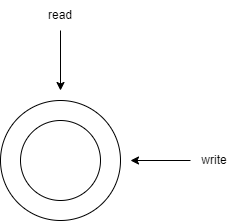
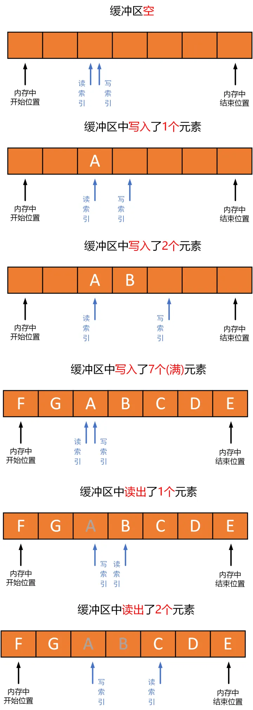
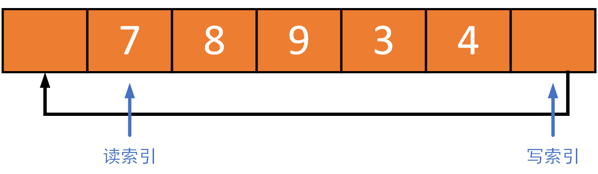
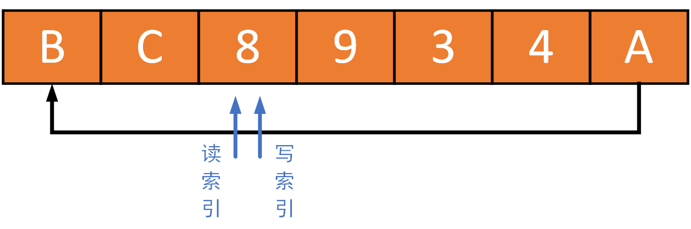
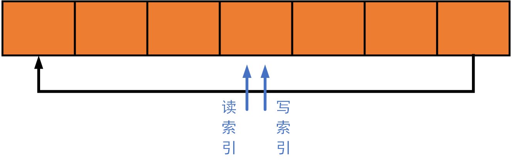
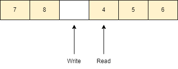
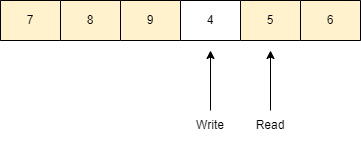

[TOC]

# 环形缓冲区

> 一个固定尺寸、头尾相连的缓冲区的数据结构。

环形缓冲区是队列的一个应用，让某一段内存形成环形，使他们首尾相连。

简单来说，就是一个数组，有两个指针，一个指向列队头，一个指向列队尾。指向列队头的指针（Head/Read）是缓冲区可读的数据，指向列队尾的指针（Tail/Write）是缓冲区可写的数据，通过移动这两个指针（Head/Read & Tail/Write）即可对缓冲区的数据进行读写操作了，直到缓冲区已满（头尾相接）。缓冲区变满后，一般会有两种处理策略：第一覆盖掉老数据；第二抛出 “异常”。

环形缓冲区比线性缓冲区的好处：可以重用内存，不会出现动态内存不断分配和销毁的情况。减少内存管理的成本。

为什么说环形缓冲区是一个特殊队列？因为环形缓冲区有一个特点：数据都是先进先出（队列），每次读取的数据都是缓冲区中最旧的数据。

## 具体实现

对一个环形缓冲区进行读写操作，最少需要 **4** 个信息：

- 在内存中的实际**开始位置**（例如：一片内存的头指针，数组的第一个元素指针）；
- 在内存中的实际**结束位置**（也可以是缓冲区实际空间大小，结合开始位置，可以算出结束位置）；
- 在缓冲区中进行写操作时的**写索引**值；
- 在缓冲区中进行读操作时的**读索引**值。

**缓冲区开始位置**和**缓冲区结束位置（或空间大小）**实际上定义了环形缓冲区的实际逻辑空间和大小。**读索引**和**写索引**标记了缓冲区进行读操作和写操作时的具体位置。如下图所示，为环形缓冲区的典型读写过程：

1. 当环形缓冲区为空时，读索引和写索引指向相同的位置（因为是环形缓冲区，可以出现在任何位置）。
2. 当向缓冲区写入一个元素时，元素 `A` 被写入**写索引**当前所指向位置，然后写索引加 1，指向下一个位置。
3. 当再写如一个元素 `B` 时，元素 `B` 继续被写入**写索引**当前所指向位置，然后写索引加 1，指向下一个位置。
4. 当接着写入 `C`、`D`、`E`、`F`、`G` 五个元素后，缓冲区就满了，这时**写索引**和**写索引**指向同一个位置（和缓冲区为空时一样）。
5. 当从缓冲区中读出一个元素 `A` 时，**读索引**当前所在位置的元素被读出，然后**读索引**加 1，指向下一个位置。
6. 继续读出元素 `B` 时，还是**读索引**当前所在位置的元素被读出，然后**读索引**加 1，指向下一个位置。

## 缓冲区满操作

一般会有两种处理策略，第一覆盖掉老数据；第二抛出 “异常”。这两种策略该如何选择要结合具体的应用场景。如音/视频流中，丢掉一些数据不要紧，可以选择第一种策略；在任务间通信的时候，要严格保证数据正确传输，这个时候就要选择第二种策略。

**注意**：我们这里说的缓冲区满或者空并不是简单认为缓冲区数组存满数据，或者没有数据。而是说我写了这么多数据，这些数据是否已经被读取。当未读的数据总大小为缓冲区的 size 的时候，缓冲区已经满。当所有写入的数据都被读取后，此时缓冲区为空。读取后的数据虽然还在缓冲区中，但是我们可以认为被读取后的位置逻辑上是空的。

### 覆盖老数据

环形缓冲区也是 `FIFO` 类型的数据结构，需要满足先进先出的原则。写就相当于进，读就相当于出。所以读数据时，一定要保证读最老的数据。

如下图所示环形缓冲区的大小为 7，缓冲区中已经存储了 `7`，`8`，`9`，`3`，`4` 五个元素。

如果再向缓冲区中写入三个元素 `A`，`B`，`C`，因为剩余空间为 2 了，所以要想写入这三个元素肯定会覆盖掉一个元素。此时，读/写索引变为如下图所示。读索引不再停留在元素 `7` 处，而是在元素 `8` 处，因为元素 `7` 已经被覆盖掉，而元素 `8` 变为最老的元素。

所以当缓冲区是满的时候，继续写入元素（覆盖），除了写索引要变，读索引也要跟着变，**保证读索引一定是指向缓冲区中最老的元素。**

## 如何判断缓冲区为满

缓冲区是满、或是空，都有可能出现读指针与写指针指向同一位置。

### 总是保持一个存储单元为空

缓冲区中总是有一个存储单元保持未使用状态。缓冲区最多存入 `(size - 1)` 个数据。

- 如果读写指针指向同一位置，则缓冲区为空。

- 如果写指针下一个位置就是读指针，则缓冲区为满。

如下图所示，当前缓冲区数据为 `size - 1`，缓冲区已满。

继续写 `9`，那么最旧的数据 `4` 被覆盖。

这种策略的优点是简单、鲁棒。缺点是语义上实际可存数据量与缓冲区容量不一致，判断缓冲区是否满需要做取余数计算。

### 使用数据计数

这种策略保持着缓冲区内存储的数据的计数。因此判断缓冲区是空是满非常简单，对性能影响可以忽略。缺点是读写操作都需要修改这个存储数据计数，对于多线程访问缓冲区需要并发控制。

### 镜像指示位

参考：https://zhuanlan.zhihu.com/p/534098236

### 读/写计数

用两个有符号整型变量分别保存写入、读出缓冲区的数据数量。其差值就是缓冲区中尚未被处理的有效数据的数量。这种方法的优点是**读线程、写线程互不干扰**。缺点是需要额外两个变量。

### 记录最后的操作

使用标志位记录最后一次操作是读还是写。读写指针值相等情况下，如果最后一次操作为写入，那么缓冲区是满的。如果最后一次操作为读出，那么缓冲区是空。 这种策略的缺点是读写操作共享一个标志位，多线程时需要并发控制。

## 参考文章

- ring buffer，一篇文章讲透它？ - Qzhang.c的文章 - 知乎 https://zhuanlan.zhihu.com/p/534098236

- [图解 RingBuffer 数据结构](https://blog.csdn.net/u014029783/article/details/107622792)
- [简书 - 环形缓冲区](https://www.jianshu.com/p/0f6b91d3063e?utm_content=note&utm_medium=seo_notes)