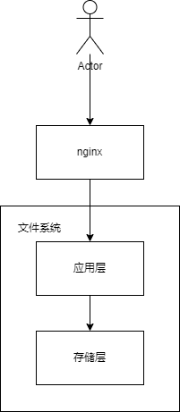
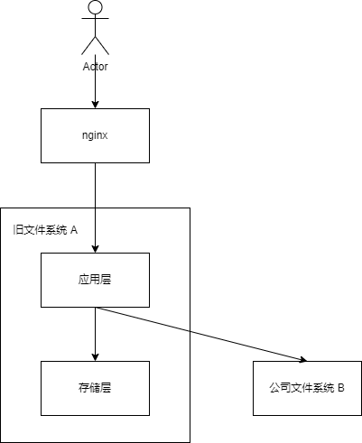
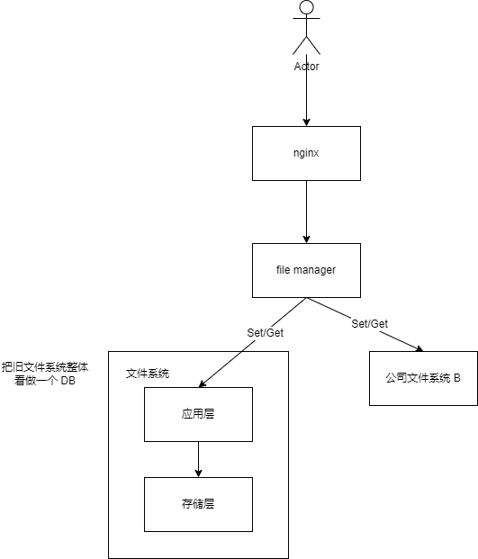
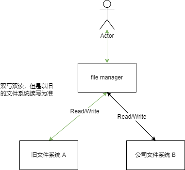
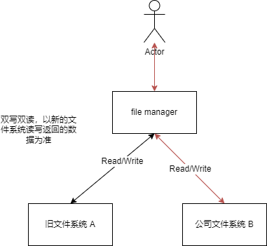

[TOC]

# 文件系统迁移项目

## 背景

我们做的产品是一个即时通讯软件，我们团队负责后台服务器开发。

公司旧文件系统 A 存储层代码需要我们后台自己维护，对于日益增长的用户量，我们决定将存储层迁移到公司级别的文件系统 B。这样子我们后台只需要专注于业务的代码开发和维护，迁移后系统的稳定性和可用性将会大大提高。

## 如何迁移

下面我将介绍一下在线如何对数据进行迁移，以及迁移中需要注意的事项和问题。

因为作为公司的即时通讯软件，停服迁移的代价比较大，为了不影响用户的体验，我们将按步骤有序地进行在线迁移。

### 确定新系统架构

- 旧架构



- 迁移架构，方案一



复用原来服务的应用层，在应用层下接入新的存储系统。

优点：架构简单，易理解，且现有的链路已经打通，只需要打通和新的存储链路即可。

缺点：旧服务已经运行较为稳定，而且代码历史原因结构混乱，代码耦合严重，引入新的存储需要修改的代码比较多，风险较大。

- 方案二

把应用层独立成一个新的服务。在新的服务下面接入新的存储系统。



优点：应用和存储解耦，新代码可以抛弃历史包袱，可读性可维护性更高，可以更方便做新功能的扩展。

缺点：需要搭建新的服务，新服务需要适配客户端和文件系统服务器接口，一条全新的链路，需要协调大量人力去调试。

- 迁移完架构图


### 灰度

灰度发布是指在黑与白之间，能够平滑过渡的一种发布方式。在其上可以进行 A/B testing，即让一部分用户继续用产品特性 A，一部分用户开始用产品特性 B，如果用户对 B 没有什么反对意见，那么逐步扩大范围，把所有用户都迁移到 B 上面来。灰度发布可以保证整体系统的稳定，在初始灰度的时候就可以发现、调整问题，以保证其影响度。

因为新的存储系统我们是未知的，所以全部流量一下子放开双写双读可能会影响到新的存储系统以及用户，所以我们要去做灰度慢慢放开双写双读，减少万一真出问题对线上的影响。

我们按照白名单进行灰度（组内人员等），按照业务维度用户百分比进行灰度（业务：比如单聊图片，群聊图片，单聊文件，群聊文件，头像等）。

通过业务代码和修改配置中心配置实现。

```c++
oldDB.DoHandle();
if (isPassed(uid, from))
{
	newDB.DoHandle();
}

bool isPassed(int uid, int from) // from 表示来自哪个业务
{
    if (whiteList[uid]) // whiteList 在配置中心可配
    {
        return true;
    }
    if (rates[from] > 0 && uid % 100 < rates[from]) // 不同业务百分比可以在配置中心配置
    {
        return true;
    }
    return false;
}
```

### 监控

如何快速发现问题？我们在关键的代码加上监控上报，待服务上线后，通过观察监控面板来确认服务是否正常运行。

### 双写双读

迁移开始需要先灰度双写。我们最终需要把新增的数据写入新和旧数据库。之后再把旧的数据库的旧数据同步到新数据库。



- 双写双读的返回值以哪个数据库为准？

开启双写双读后我们还是需要默认返回旧数据库读写返回。

- 双写失败怎么办？

记录失败日志和上报监控

- 双读失败怎么办？

新的数据库读取不到数据，旧的数据可读取到数据，记录日志和上报监控。

- 两边的数据库读取的数据内容可能不一致，如何解决？

我们把读取到的内容再进行 MD5 比较。如果 MD5 相同，我们上报 same（说明新旧数据库读取到的内容一样），否则上报 MD5-no-same。记录日志等待后续决定是否手动进行补偿。

> 每个文件对应的 md5 值是固定的，文件内容发生变化时，md5 值也会发生变化。文件内容相同时，md5 值相同。所以，md5 值可以作为文件的唯一标识符

- 双写双读后，对内存，CPU，打开的文件描述符，线程可能会带来成倍的压力。根据之前的系统运行状况，估算出系统资源还非常足够，这个方面不需要担心。
- 双写，双读操作串行进行的话会使用户响应时间变长，如何解决？

使用多协程异步读写。

### 切换读写返回值

一开始我们以旧数据库的读写返回为准，切换后就是使用后新的数据库读写返回。

到这里我们还要再细分一下数据类型：永久数据和非永久数据（14 天过期）。

对于非永久数据，我们双写双读 14 天后，旧的存储系统的存量数据就会过期自动删除，那么剩下的数据理论上来说就和新的存储系统的数据一致了。

对于永久数据，我们额外开发了一个工具来做存量数据的迁移。对于失败的的操作，我们会记录迁移失败文件的 key，后面再用额外的工具来进行补偿。

```c++
keys = oldDB.SelectAll();
for (auto key : keys)
{
    if (newDB.Exist(key))
    {
        continue;
    }

	data, err = oldDB.Read(key);
    if (err != nil)
    {
        log.Error(key);
        continue;
    }
	err = newDB.Write(data);
    if (err != nil)
    {
        log.Error(key);
        continue;
    }
}
```

下面我们以非永久数据迁移来举例子。

什么时候去切换呢？如何确定两边的数据库的数据真的基本一致？

非永久数据迁移等 14 天双写过后（旧数据过期），理论上来说，新旧系统两边的存量和增量都完全一致了，但是实际情况我们还需要观察监控。

我们之前每次双写双读都会上报监控，所以我们可以通过监控去观察。当请求的读和写都为成功后，我们就可以确定两边的数据一致了。这个时候我们就可以切换使用新文件系统的返回值（按业务用户百分比，白名单来灰度）。



### 停读停写

当永久数据和非永久数据迁移完毕后，我们逐步停止对旧文件系统的读和写，至此，文件存储系统完全迁移了过来。

## 有效性验证

- 迁移的每一步动作都会在测试环境中自测，还有 QA 人员的对功能和性能的压测。

- 新服务上线后，QA 人员同时也进行回归测试，保证功能正常。

- 线上环境我们通过配置中心动态配置白名单，灰度读写，观察监控面板来保证有效性。

## 总结

- 进行编码前要做好方案评估，好的方案能够提高系统稳定性可靠性，以及开发难度，维护难度等。

- 大规模的架构改动和功能修改需要做灰度来进行容错，减少带来的风险。并且要思考可能出现的问题，最重要的是，出现问题，如何快速回滚。
- 迁移的过程关键步骤监控告警和日志需要添加到位，监控告警能够快速响应线上可能或者已经出现的问题，日志能够让我们快速定位问题。
- 大规模的架构调整和功能修改需要协调多方的人员，可能还要面临交付时间紧张等因素，所以有风险和问题要及时反馈。
