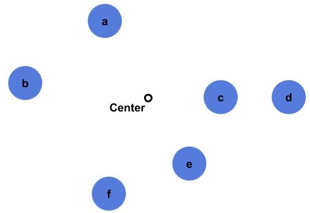
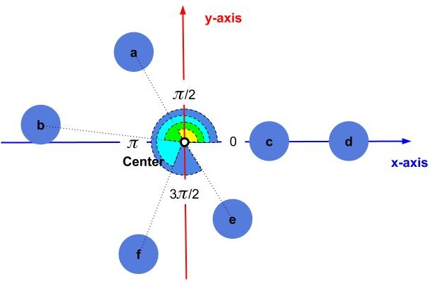
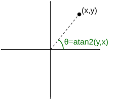
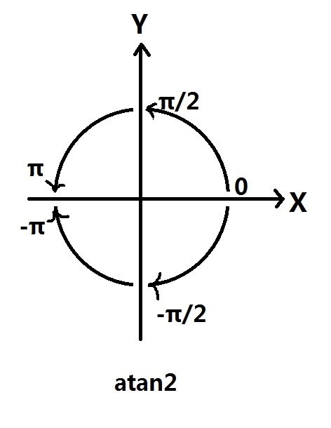
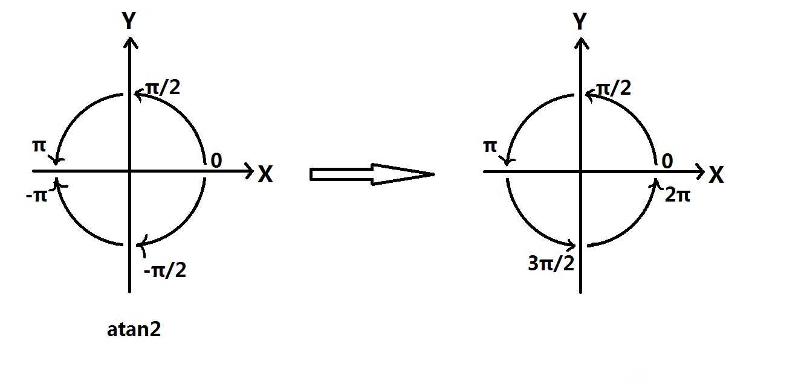

[TOC]

# 顺时针排序

假设我们在 2D 平面上有一组点，我们想连接这些点来绘制一个闭合的形状。首先，我们需要对这些点进行排序。

## 算法思想

我们的第一件事就是要找到这些点的中心点。



然后我们要计算每个点和中心点之间的角度，然后根据角度去排序。

> 角度相同的点的排序暂不考虑，比如 c、d 两点。当然我们可以通过比较它们和中心点的距离来决定先后顺序



## atan2

许多编程语言中存在的函数 `atan2`。在 C++ 中，`atan2`是一个数学函数，用于计算给定坐标点 `(x, y)` 的反正切值（arctan）。

>正切：对边 / 临边；反正切：临边 / 对边
>



它的函数原型如下：

```c++
#include <cmath>

double atan2(double y, double x);
```

参数 `y` 是点的 y 坐标，参数 `x` 是点的 x 坐标。`atan2` 函数返回值是一个介于 `-π` 到 `π` 之间的角度，单位为弧度。

> 这里有点绕，返回值是角度，单位又是弧度。换种说法，这里返回值是弧度，但是转换为角度之后，这个角度介于 `-π` 到 `π` 之间



- 角度转换 `0` 到 `2π`

当 `atan2` 小于 `0` 的时候，我们加上 `2π`，可以把角度的范围转换在 `0` 到 `2π` 的范围内。



- 以下是一个使用 `atan2` 的示例

```c++
#include <iostream>
#include <cmath>

int main() {
    double x = 1.0;
    double y = 1.0;

    double angle_rad = std::atan2(y, x);
    double angle_deg = angle_rad * 180.0 / M_PI;

    std::cout << "Point (" << x << ", " << y << ") is at angle: " << angle_deg << " degrees." << std::endl;

    return 0;
}
```

## 排序代码示例

```c++
#include <algorithm>
#include <math.h>
#include <vector>

struct Point {
  double x, y;
};

// Function to calculate the polar angle of a point with respect to the centroid
double PolarAngle(Point point, Point centroid) {
  return atan2(point.y - centroid.y, point.x - centroid.x);
}

// Function to calculate the centroid of a set of points
Point CalculateCentroid(const std::vector<Point>& points) {
  double totalX = 0.0, totalY = 0.0;
  int numPoints = points.size();

  for (const Point& point : points) {
    totalX += point.x;
    totalY += point.y;
  }

  return {totalX / numPoints, totalY / numPoints};
}

// Function to sort points in clockwise order around their centroid
void SortPointsClockwise(std::vector<Point>& points) {
  Point centroid = CalculateCentroid(points);

  // Sort the points based on their polar angles
  std::sort(points.begin(), points.end(), [centroid](const Point& a, const Point& b) {
    return PolarAngle(a, centroid) > PolarAngle(b, centroid);  // 调整比较符号来决定是顺时针还是逆时针
  });
}

int main() {
  // Sample input points
  std::vector<Point> points = {{1, 1}, {-1, 2}, {-2, -1}, {3, -3}};

  // Sort the points in clockwise order
  SortPointsClockwise(points);

  // Display the sorted points
  for (const Point& point : points) {
    std::cout << "(" << point.x << ", " << point.y << ")" << std::endl;
  }

  return 0;
}

```

结果输出：

```bash
(-1, 2)
(1, 1)
(3, -3)
(-2, -1)
```


## 参考链接

- https://en.wikipedia.org/wiki/Atan2
- [Sort Points in Clockwise Order](https://www.baeldung.com/cs/sort-points-clockwise)

