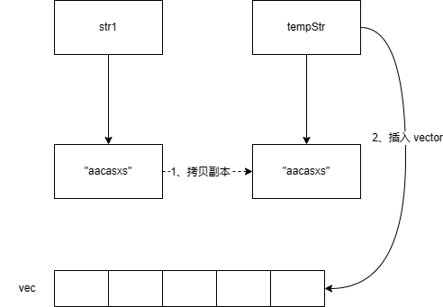
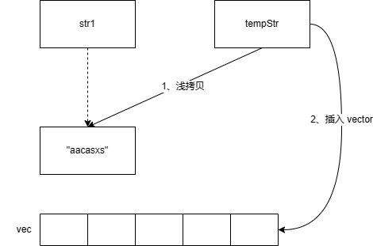

# 右值和右值引用

**右值和右值引用本质上是C++语言设计的一种约定（协议）**，**C++ 并不自动移动任何数据**，它只是提供了一套机制，让开发者可以**显式地**、**可控地**转移资源。

- **编译器**负责识别哪些表达式是右值（临时对象、字面量、`std::move` 转换后的对象）。
- **开发者**负责实现移动构造函数和移动赋值运算符，按照约定「窃取」资源并置空源对象。
- `std::move` 只是一个类型转换工具（`static_cast<T&&>`），把左值强制转化为右值，真正的移动逻辑仍然由开发者实现。

## 左值和右值

### 类型

类型是 C++ 中最基本的概念之一，它定义了：

1. 变量或表达式所代表的数据种类
2. 数据的大小和内存布局
3. 可以对数据执行的操作

#### 主要类型分类

1. **基本类型**：`int`, `float`, `char`, `bool`等
2. **复合类型**：数组、指针、引用、结构体、类等
3. **用户定义类型**：类、枚举等

### 值类别

值类别描述的是表达式在求值后的特性，描述的是表达式的「值的使用方式」：是**左值、右值**哪一种（右值还有更加详细的分类）。

右值引用是 C++11 引入的一种新的引用类型，用 `&&` 表示。它专门用于绑定到右值。

```c++
int a = 10;         // a 的类型是 int，值类别是「左值」
int&& b = 20;       // b 的类型是 int 的右值引用，值类别是「左值」（有名称）
int foo();          // foo() 返回 int，值类别是「右值」
std::string s = "hello";
std::string&& s2 = std::move(s); // std::move(s) 的类型是 std::string&&，值类别是「右值」。s2 是左值
```

`std::move` 只是一个类型转换工具（`static_cast<T&&>`），**把左值强制转化为右值**。

#### 左值和右值的区别

| **特性**   | **左值**                 | **右值**                  |
| ---------- | ------------------------ | ------------------------- |
| 能否取地址 | 能                       | 不能                      |
| 能否被赋值 | 除常量外可以             | 不可以                    |
| 典型示例   | 变量名、数组元素         | 字面值、临时对象          |
| 引用绑定   | 可被`T&`和`const T&`绑定 | 可被`T&&`和`const T&`绑定 |
| 是否有名称 | 有名称的变量             | 没有名称                  |

## 左值引用和右值引用

### 左值引用

左值引用大家都很熟悉，**能指向左值，不能指向右值的就是左值引用**。

```cpp
int a = 5;
int &ref_a = a; // 左值引用指向左值，编译通过
int &ref_a = 5; // 左值引用指向了右值，会编译失败
```

**引用是变量的别名，由于右值没有地址，没法被修改，所以左值引用无法指向右值。**

但是，const 左值引用是可以指向右值的：

```cpp
const int &ref_a = 5;  // 编译通过
```

const 左值引用不会修改指向值，因此可以指向右值，这也是为什么要使用 `const &` 作为函数参数的原因之一，如 `std::vector` 的 `push_back`：

```cpp
void push_back (const value_type& val);
```

如果没有 `const`，`vec.push_back(5)` 这样的代码就无法编译通过了。

### 右值引用

再看下右值引用，右值引用的标志是 `&&`，顾名思义，右值引用专门为右值而生，**可以指向右值，不能指向左值**：

```cpp
int &&ref_a_right = 5; // ok

int a = 5;
int &&ref_a_left = a; // 编译不过，右值引用不可以指向左值

ref_a_right = 6; // 右值引用的用途：可以指向并修改右值
```

## 使用右值引用来实现移动语义

```c++
std::string a = "hello world";
std::string b(std::move(a)); // 通过 std::move 把 a 转换成右值，触发移动构造，所有权转移。被移动后原来的 a 的值为空。
```

- `std::string` 移动构造原理代码示例

````c++
#include <cstring>

class string {
private:
    char* data;     // 指向堆内存的指针
    size_t length;  // 字符串长度
    size_t capacity; // 容量

public:
    // 默认构造函数
    string() : data(nullptr), length(0), capacity(0) {}

    // 带参构造函数
    string(const char* str) {
        if (!str) {
            data = nullptr;
            length = capacity = 0;
        } else {
            length = std::strlen(str);
            capacity = length + 1;
            data = new char[capacity];
            std::memcpy(data, str, length + 1);
        }
    }

    // 析构函数
    ~string() {
        delete[] data;
    }

    // 拷贝构造函数
    string(const string& other) {
        length = other.length;
        capacity = other.capacity;
        data = new char[capacity];
        std::memcpy(data, other.data, length + 1);
    }

	// 也可以通过传入左值来实现移动构造（不推荐）
    string(string& other, bool move)
        : data(other.data), length(other.length), capacity(other.capacity) {
        other.data = nullptr;     // 关键：防止 other 析构时释放已转移的内存
        other.length = 0;
        other.capacity = 0;
    }

    // 移动构造函数
    string(string&& other)
        : data(other.data), length(other.length), capacity(other.capacity) {
        other.data = nullptr;     // 关键：为防止 other 析构时 delete data，提前置空其 data
        other.length = 0;
        other.capacity = 0;
    }
};
````

## vector::push_back 使用 std::move 提高性能

```cpp
// std::vector 方法定义
// void push_back (const value_type& val);
// void push_back (value_type&& val);
// void emplace_back (Args&&... args);

// 例：std::vector 和 std::string 的实际例子
int main() {
    std::string str1 = "aacasxs";
    std::vector<std::string> vec;

    vec.push_back(str1); // 传统方法 copy
    vec.push_back(std::move(str1)); // 调用移动语义的 push_back 方法，避免拷贝，str1 会失去原有值，变成空字符串。参数为右值意味着移动，原来的 str1 的值的 data 被移动到的 vector 中，str1 的 data 被置为空。
    vec.emplace_back(std::move(str1)); // emplace_back 效果相同，str1 会失去原有值
    vec.emplace_back("axcsddcas"); // 当然可以直接接右值
    vec.emplace_back(str1); // emplace_back (Args&&... args) 为什么这里的右值引用可以接收左值。emplace_back 内部模板使用到了 std::forward（完美转发）的特性
}
```

在 vector 和 string 这个场景，加个 `std::move` 会调用到 vector 内部实现的移动语义函数（先使用 `move` 转成右值引用，再调用右值引用的相关移动语义函数），避免了深拷贝。

- 深拷贝



- 移动语义函数



## std::forward

- 普通转发

```cpp
void foo(int& x) { std::cout << "左值引用" << std::endl; }
void foo(const int& x) { std::cout << "常量左值引用" << std::endl; }
void foo(int&& x) { std::cout << "右值引用" << std::endl; }

// 普通转发（无法保持参数的值类别）
template<typename T>
void wrapper(T x) {
    foo(x);  // 无论传入左值还是右值，x 都是左值
}

int main() {
    int a = 42;
    wrapper(a);      // 输出：左值引用（正确）
    wrapper(100);    // 输出：左值引用（错误！期望右值引用）
}
```

- 完美转发 `std::forward`

```c++
template<typename T>
void wrapper(T&& arg) {
    foo(std::forward<T>(arg));  // 完美转发参数
}

int main() {
    int a = 42;
    wrapper(a);      // 转发为左值，调用 foo(int&)
    wrapper(100);    // 转发为右值，调用 foo(int&&)
    const int b = 99;
    wrapper(b);      // 转发为 const 左值，调用 foo(const int&)
}
```

