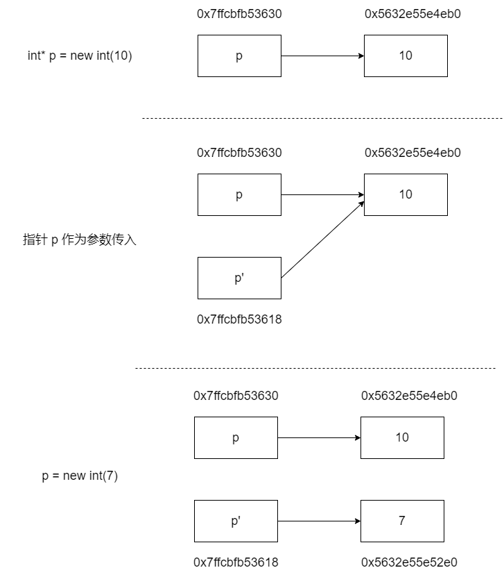
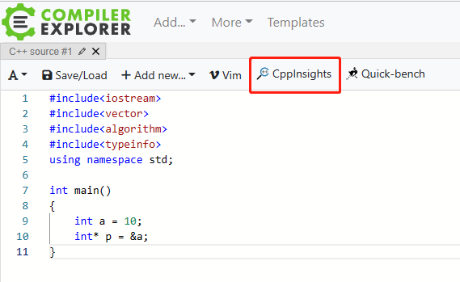
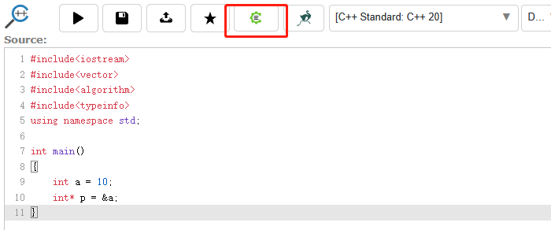
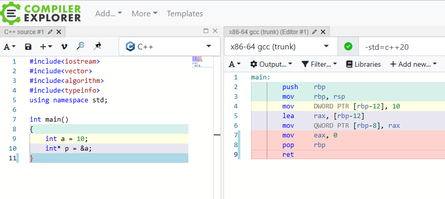
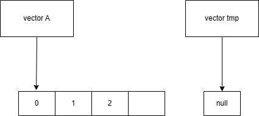
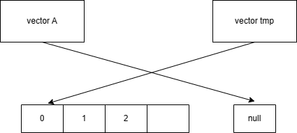

[TOC]

# C/C++

## 结构体对齐

- 为什么要字节对齐？

例如，假设计算机总是从内存中取 8 个字节，如果一个 double 数据的地址对齐成 8 的倍数，那么一个内存操作就可以读或者写，但是如果这个 double 数据的地址没有对齐，数据就可能被放在两个 8 字节块中，那么我们可能需要执行两次内存访问，才能读写完成。显然在这样的情况下，是低效的。所以需要字节对齐来**提高内存系统性能**。

```c++
// 默认 4 字节对齐
// sizeof(A) = 12
struct A
{
    char a;
    int c;
    char b;
};
// sizeof(B) = 8
struct B
{
    char a;
    char b;
    int c;
};
// sizeof(C) = 16
struct C
{
    char a;
    char b;
    double c; // double 为 8 字节。字节对齐是根据最大的成员 size 来对齐
};
```

- 嵌套结构体

```c++
struct D
{
    int a;
    double b;
};
// sizeof(E) = 24
struct E
{
    char a;
    char b;
    D d;
    // 注意嵌套结构体不是直接将结构体 D 的成员直接移动到结构体 E 中。
    // 字节对齐根据最大结构体成员的最大 size（包括嵌套结构体里的成员）。
};
// sizeof(F) = 16
struct F
{
    char a;
    char b;
    int a;
    double b;
};
```

## 指针传递变量为什么无法修改变量值

```c++
void change(int* p)
{
    printf("指针 p' 的地址: %p\n", &p); // p' 表示指针 p 的副本
    printf("指针 p' 指向的地址: %p 的值为: %d\n", &(*p), *p);

    p = new int(7);

    cout << "=============================" << endl;
    printf("指针 p' 的地址: %p\n", &p);
    printf("指针 p' 指向的地址: %p 的值为: %d\n", &(*p), *p);
}

void Test()
{
    int* p = new int(10);
    printf("指针 p 的地址: %p\n", &p);
    printf("指针 p 指向的地址: %p 的值为: %d\n", &(*p), *p);

    change(p);

    printf("指针 p 的地址: %p\n", &p);
    printf("指针 p 指向的地址: %p 的值为: %d\n", &(*p), *p);
}


/* 结果打印
指针 p 的地址: 0x7ffcbfb53630
指针 p 指向的地址: 0x5632e55e4eb0 的值为: 10
指针 p' 的地址: 0x7ffcbfb53618
指针 p' 指向的地址: 0x5632e55e4eb0 的值为: 10
=============================
指针 p' 的地址: 0x7ffcbfb53618
指针 p' 指向的地址: 0x5632e55e52e0 的值为: 7
指针 p 的地址: 0x7ffcbfb53630
指针 p 指向的地址: 0x5632e55e4eb0 的值为: 10
*/
```

这里为啥最终得结果输出是 10，而不是 7。

**先说结论**

1. 函数的形参都是原数据的【副本】，因此在函数内无法改变原数据。
2. 函数中参数都是传值，传指针本质上也是传值（指针有自己的内存地址，也就是说指针本身是占用内存的）。
3. 如果想要改变入参内容，则需要传该入参的地址（指针和引用都是类似的作用），通过解引用修改其指向的内容。

> 一图胜千言



## 指针和引用的区别

指针是一个变量，存储的是一个地址，指向内存的一个存储单元；可以为空；sizeof 是指针大小。

引用是原变量的一个别名，与对象绑定后，就不可改变；定义的时候必须初始化；sizeof 是所引用的对象大小

本质上，指针和引用其实是同一个东西，因为它们汇编后的代码是一样的。

- 指针 C++ 代码

```c++
int main()
{
    int a = 10;
    int* p = &a;
}
```

- 指针代码汇编后

```assembly
main:
        push    rbp
        mov     rbp, rsp
        mov     DWORD PTR [rbp-12], 10
        lea     rax, [rbp-12]
        mov     QWORD PTR [rbp-8], rax
        mov     eax, 0
        pop     rbp
        ret
```

- 引用 C++ 代码

```
int main()
{
    int a = 10;
    int& b = a;
}
```

- 引用代码汇编后

```assembly
main:
        push    rbp
        mov     rbp, rsp
        mov     DWORD PTR [rbp-12], 10
        lea     rax, [rbp-12]
        mov     QWORD PTR [rbp-8], rax
        mov     eax, 0
        pop     rbp
        ret
```

这里推荐在线工具：https://godbolt.org/，可以方便查看 C++ 汇编后的代码。

使用方法：依次点击红色框框按钮，调出汇编代码界面

- 步骤一



- 步骤二



- 步骤三



## 构造函数和析构函数可以是虚函数吗

构造函数不能是虚函数，析构函数可以且常常是虚函数。

### 构造函数不能是虚函数

答案：不能。

如果构造函数是虚函数，那么一定有一个已经存在的类对象 obj，obj 中的虚指针来指向虚表的构造函数地址（通过 obj 的虚指针来调用）。可是构造函数又是用来创建并初始化对象的，虚指针也是存储在对象的内存空间的。所以构造函数是虚函数的前提是它要有类的对象存在，但在这之前又没有其他可以创建并初始化类对象的函数，所以矛盾。

### 析构函数常常是虚函数

```c++
class BaseClass
{
};

class SubClass : BaseClass
{
};
```

如果我们以这种方式创建对象：

```c++
SubClass* pObj = new SubClass();
delete pObj;
```


不管析构函数是否是虚函数（即是否加 virtual 关键词），delete 时基类和子类都会被释放；

如果我们以这种方式创建对象：

```c++
BaseClass* pObj = new SubClass();
delete pObj;
```

若析构函数是虚函数（即加上 virtual 关键词），delete 时基类和子类都会被释放；

若析构函数不是虚函数（即不加 virtual 关键词），delete 时只释放基类，不释放子类；

## string 的存储位置

数据小于等于 16 字节，在当前栈区；大于 16 在堆区。

## 读取文件遇到的问题

- 需要读取的文件 test.txt

```bash
CATTGAGTTATCAGTACTTTCATGTCTTGATAC
（注：这个文件结尾有一行空行，所以说这个文件是有两行）
```

- 读取代码

```c++
#include <fstream>
#include <iostream>
#include <string>

using namespace std;

int main()
{
    ifstream fin;
    fin.open("test.txt", ios::in);
    if (!fin.is_open())
    {
        return 0;
    }

    string line;
    while (getline(fin, line))
    {
        cout << line << endl;
        string a = line + "123456"; // 在读取的行结尾拼接字符串
        cout << a << endl;
    }
	fin.close();
    return 0;
}
```

- 结果输出

```bash
CATTGAGTTATCAGTACTTTCATGTCTTGATAC
123456GTTATCAGTACTTTCATGTCTTGATAC
```

可以看到这个结果输出很奇怪，明明 line 打印正确，为什么在 line 后面添加 "123456" 字符串的时候没有拼接到后面，理论上来说应该打印输出：

```bash
CATTGAGTTATCAGTACTTTCATGTCTTGATAC123456
```

## 写文件

- 写文本文件

```c++
#include <fstream>
#include <string>

int main() {
  std::string str = "hello world";
  std::ofstream out_file("data.txt");
  if (!out_file.is_open()) {
    exit(-1);
  }
  out_file << str;
  out_file.close();
}

```

### 回车换行符

- `\r` 回车（CR），将当前位置移到本行开头。

- `\n` 换行（LF），将当前位置移到下一行开头。

**在 Linux 系统下执行换行操作为 `\n`，在 Windows 操作做系统下执行换行操作为 `\r\n`，在 Mac 操作系统下执行换行操作为 `\r`。**

而 `getline` 函数会读取文件中的一行，遇到 `\n` 停止（不会把 `\n` 读取进来）。

所以回过头来看 test.txt 文件内容（这个文件是 Windows 下的文件，但是我在 Linux 系统操作读取的）

```
CATTGAGTTATCAGTACTTTCATGTCTTGATAC
（注：这个文件结尾有一行空行，所以说这个文件有两行）
```

其实结尾还有 `\r\n`（回车换行），只是没有显示而已。所以实际上字符串是这样子的：

```
CATTGAGTTATCAGTACTTTCATGTCTTGATAC\r\n
（注：这个文件结尾有一行空行，所以说这个文件有两行）
```

当 `getline` 读取一行时候遇到 `\n` 停止，但是把 `\r` 读取了进来，所以实际上读取到的是：

```c++
CATTGAGTTATCAGTACTTTCATGTCTTGATAC\r
```

因为 `\r` 是将当前位置移到本行开头，所以在读取到的字符串后面添加 "123456" 的操作就变成了——指针偏移量从字符串末尾移动到字符串开头，然后在该指针位置开始添加新增的字符串。所以就会出现开头被覆盖的现象，最终输出的结果为：

```
123456GTTATCAGTACTTTCATGTCTTGATAC
```

- 优化后的代码

要解决这个问题，我们只需要把读取到的 `\r` 字符删除即可。

```c++
#include <fstream>
#include <iostream>
#include <string>

using namespace std;

int main()
{
    ifstream fin;
    fin.open("test.txt", ios::in);
    if (!fin.is_open())
    {
        return 0;
    }

    string line;
    while (getline(fin, line))
    {
        if (line.back() == '\n') // 删除结尾的 \n
        {
            line.pop_back();
        }
        if (line.back() == '\r') // 删除结尾的 \r
        {
            line.pop_back();
        }
        cout << line << endl;
        string a = line + "123456";
        cout << a << endl;
    }
	fin.close();
    return 0;
}
```

结果输出：

```
CATTGAGTTATCAGTACTTTCATGTCTTGATAC
CATTGAGTTATCAGTACTTTCATGTCTTGATAC123456
```

## 释放容器内存

- 容器中的删除操作

`erase()`：删除容器中指定的键值对；

`clear()`：删除容器中所有的键值对，即清空容器。

STL 容器调用 `clear()` 方法，通常只是使得容器内部的对象通通析构，但容器本身的内存无法得到释放（`erase()` 同理）。即篮子里面东西拿走了，篮子占的空间还在，这样是为了方便下次存放新的对象时，不需要再次申请空间。

- 释放 "篮子" 占用的空间

要想释放 "篮子" 占用的空间，可以通过 `swap()` 和 `shrink_to_fit()` 来解决（只适合 vector 和 string）。

只有含 `reserve()`/`capacity()` 成员函数的容器才需要用 `swap()` 来释放空间，而 C++ 里只有 vector 和 string 这两个符合条件。这两个容器在 C++11 中可以直接使用 `shrink_to_fit()`。

- 使用 swap

```c++
int main()
{
    vector<int> vec(10, 1); // capacity = 10;
    vector<int>().swap(vec); // capacity = 0;vector<int>()是个临时对象
    return 0;
}
```

上面的代码等价于：

```c++
int main()
{
    vector<int> vec(10, 1);
    // 大括号指明了变量的作用域，在大括号内声明的局部变量其作用域自变量声明开始，到大括号之后终结。
    // 所以 tmp 出了大括号后会析构
    {
        std::vector<int> tmp;
        vec.swap(tmp);
    }
    return 0;
}
```

vector 的 `swap()` 方法释放内存实际是用了一个小技巧，`swap()` 方法功能是交换对象，即将当前对象内容与传进的同类型 vector 对象交换。这里就是通过将当前 vec 对象和一个空临时 vector 对象交换，交换之后，vec 对象的空间变为 0，临时对象占用的内存空间变为 vec 之前占用的内存空间。临时对象的作用域就是该语句，随着生命周期结束，该对象在被析构的时候会释放内存。这样就达到了释放 vec 占用内存空间的目的。

- vector swap 源码

```c++
void swap(vector<T, Alloc>& x) {
    __STD::swap(start, x.start);
    __STD::swap(finish, x.finish);
    __STD::swap(end_of_storage, x.end_of_storage);
}
```

可以看到 vector swap 仅仅是交换了指向的首尾指针和容量指针。

首先创建 tmp 临时对象。



通过 swap 交换指针指向的对象地址，vector A 指向了空的内存，tmp 指向了原来的 A 的内存。



因为 tmp 是临时对象，所以 tmp 接着会析构释放掉指向的内存，这样子就达到了释放 vector A 的内存。

- 使用 shrink_to_fit

```c++
int main()
{
    vector<int> vec(10, 1);
    vec.shrink_to_fit(); // capacity = 0;
    return 0;
}
```

- 其他容器

list/deque/set/map 等容器是没有 `reserve()` 和 `capacity()` 这两个成员函数的，因此 `swap` 是无用功（除非用户代码使用了定制的 per-object allocator）。

- reserve 和 resize 区别

reserve 是设置了 capacity 的值，比如 `reserve(20)`，表示该容器最大容量为 20，但此时容器内还没有任何对象，也**不能通过下标访问**。

resize 既分配了空间，也创建了对象，可以通过下标访问。

reserve 只修改 capacity 大小，不修改 size 大小，resize 既修改 capacity 大小，也修改 size 大小。

- reserve/resize 重新分配内存注意事项

```c++
vector<int> vec(10, 1); // capacity = 10;
vec.resize(0);  // resize 后的 capacity 比之前的 cap 小，但是结果还是 capacity = 10
vec.reserve(0); // 同上，capacity = 10
```

## const

### const 函数

- 函数开头的 const 用来修饰函数的返回值，表示返回值是 const 类型，也就是不能被修改，例如 `const char * getname()`。

- 函数头部的结尾加上 const 表示常成员函数，这种函数只能读取成员变量的值，而不能修改成员变量的值，例如 `char * getname() const`。

### const 指针

当用 const 进行修饰时，根据 const 位置的不同有三种效果。原则是：修饰谁，谁的内容就不可变，其他的都可变。

- `const int *p=&a;`

同样 const 和 int 可以互换位置，二者是等价的。我们以放在最前面时进行描述。当把 const 放最前面的时候，它修饰的就是 `*p`，那么 `*p` 就不可变。

- `int* const p=&a;`

此时 const 修饰的是 `p`，所以 `p` 中存放的内存单元的地址不可变，而内存单元中的内容可变。即 `p` 的指向不可变，`p` 所指向的内存单元的内容可变（`*p` 可变）。

- `const int* const p=&a;`

此时 `*p` 和 `p` 都被修饰了，那么 `p` 中存放的内存单元的地址和内存单元中的内容都不可变。

#### 代码示例

- 指针常量：不能修改指针所指向的地址。在定义的同时必须初始化。

```cpp
int main() {
  char a = 'a';
  char b = 'b';

  char* const p = &a;  // 指针常量
  *p = 'p';            // 操作成功
  p = &b;  // 操作失败，Variable 'p' declared const here。指针指向的地址不能改变

  return 0;
}
```

- 常量指针：不能修改指针所指向地址的内容。但可以改变指针所指向的地址。

```cpp
int main() {
  char a = 'a';
  char b = 'b';

  char const *p = &a;  // 指针常量
  *p = 'p';            // 操作失败，指针所指的值不能改变
  p = &b;              // 操作成功

  return 0;
}
```

## 访问空指针为什么程序会崩溃

在 C/C++ 程序中，我们访问空指针，产生不可预料的错误，导致程序崩溃，在 Linux 系统中访问空指针会产生 Segmentation fault 的错误。那为什么程序会崩溃呢？

1. Linux 中，每个进程空间的 0x0 虚拟地址开始的线性区（memory region）都会被映射到一个用户态没有访问权限的页上。通过这样的映射，内核可以保证没有别的页会映射到这个区域。
2. **编译器把空指针当做 0 对待**。
3. 当你去访问空指针，缺页异常处理程序被调用，因为在 0x0 的页没有在物理内存里面。
4. 缺页异常处理程序发现你没有访问的权限。
5. 内核发送 SIGSEGV 信号给进程，在一个程序接收到 SIGSEGV 时的默认动作是异常终止。

## include 头文件

- `#include<>` 一般用于包含系统头文件，诸如 stdlib.h、stdio.h、iostream 等。
- `#include""` 一般用于包含自定义头文件，比如我们自定义的 test.h 等。

## 回调函数

回调函数就是一个函数，形式上和其他函数没有半点区别。只不过这个所谓的回调函数是将要被当做参数传递给另一个函数，并被其调用。区别就在这，一般函数的形参，接收的是一个基本类型的变量，而这个函数，接受的参数是一个"函数"，这个**作为参数的函数，就叫回调函数**。

- 一般函数：`func a(int a, string b)`，接收的参数是一般类型。

- 特殊函数：`func b(func c)`，接收的参数是一个函数，c 这个函数就叫回调函数。

> 回调函数有点像头等函数。支持头等函数（First Class Function）的编程语言，可以把函数赋值给变量，也可以把函数作为其它函数的参数或者返回值。比如说 Go 语言就支持头等函数的机制。

回调有两种方式：直接调用和延迟回调。直接调用，相当于阻塞同步调用；延迟回调就是异步，没有阻塞，不等返回执行下去（会涉及到多线程）。

## char 和 unsigned char

在 C++ 中，`char` 和 `unsigned char` 都是整数类型，但是它们之间的差别在于：

1. `char` 可以表示有符号整数（取值范围为 [-128, 127]），也可以表示字符类型；而 `unsigned char` 只能表示无符号整数（取值范围为 [0, 255]），一般用于存储二进制数据。
2. `char` 的默认符号性是实现定义的，这意味着不同的编译器可能会把 `char` 定义为有符号类型或无符号类型；而 `unsigned char` 的符号性总是无符号的。

因此，在处理二进制数据时，通常使用 `unsigned char` 类型，以避免符号位对二进制数据造成的影响。另外，可以使用 `reinterpret_cast` 将 `char*` 转换为 `unsigned char*`，以便对数据进行更精确的处理，例如：

```cpp
char* data = ...;  // 某个二进制数据
size_t size = ...; // 数据大小
unsigned char* udata = reinterpret_cast<unsigned char*>(data);
for (size_t i = 0; i < size; i++) {
    unsigned char ch = udata[i];
    // 处理二进制数据
}
```

上述代码中，使用 `reinterpret_cast` 将 `char*` 指针转换为 `unsigned char*` 指针，然后逐个读取数据并进行处理。

> 读取二进制数据时通常会使用 `std::istream` 或 `std::ifstream` 类的 `read` 函数，该函数可以读取指定长度的二进制数据，并将其存储到字符数组（`char*`）中。在这种情况下，存储到字符数组中的二进制数据类型是 `char`，因为这是 `read` 函数返回的数据类型。

## 读取二进制文件

`std::istreambuf_iterator` 是 C++ 标准库中的一个迭代器，用于迭代输入流（`std::istream`）中的字符。

使用 `std::istreambuf_iterator` 时，我们可以将其初始化为一个输入流，然后通过解引用迭代器来获取输入流中的字符。例如，下面的代码将输入流中的字符输出到标准输出：

```cpp
std::istreambuf_iterator<char> iter(std::cin);
std::istreambuf_iterator<char> end;
while (iter != end) {
    std::cout << *iter++;
}
```

上述代码中，`std::istreambuf_iterator<char>` 的第一个参数是输入流，这里是 `std::cin`，表示从标准输入流中读取字符。迭代器初始化后，我们使用 `*iter++` 来获取输入流中的字符，同时将迭代器后移一个位置。当迭代器到达流的结尾时，它就等于默认构造的 `end` 迭代器，此时循环结束。

需要注意的是，`std::istreambuf_iterator` 可以迭代输入流中的字符，但不能使用 `operator[]` 运算符或指针算术运算。此外，由于 `std::istreambuf_iterator` 是输入迭代器，它只能遍历一遍输入流中的字符。

`std::istreambuf_iterator` 还有其他一些用法，比如可以用来读取文件到内存中，例如：

```c++
std::ifstream file("example.txt");
std::vector<unsigned char> buffer(std::istreambuf_iterator<char>(file), std::istreambuf_iterator<char>());
```

上述代码将文件 "example.txt" 中的内容读取到 `std::vector<unsigned char>` 中，其中 `std::istreambuf_iterator<char>(file)` 是迭代器的起始位置，`std::istreambuf_iterator<char>()` 是迭代器的结束位置。由于 `std::vector` 的构造函数接受迭代器范围作为参数，因此可以使用这种方式读取文件并将其存储到内存中。注意这里 `vector` 的类型是 `unsigned char`，当然你也可以用 `vector<char>`。

## switch case

以下的代码编译时会报错：

```
error: jump to case label
crosses initialization of ‘int b’
```

示例代码：

```cpp
int main() {
  int a = 0;
  switch (a) {
    case 0:
      int b = 0;
      break;
    case 1:
      break;
    default:
      break;
  }
  return 0;
}
```

出现异常的原因变量的生命周期的问题。在 case1 中定义了变量 `b`，在 case2 也能使用，但如果在程序运行中直接跳入 case2 分支就会出现没有初始化的异常。程序编译时为了防止出现上述情况，就会报编译失败。

解决方法：把 变量 `b` 定义在 switch 外面，或者在 case 中加入花括号（推荐）。

## 空指针调用

C++ 空指针调用也会进入到函数的内部，然后才从函数内部抛出异常

```c++
#include <iostream>

class A {
 public:
  A() : age_(10) {}

  void Test() {
    std::cout << "Test..." << std::endl;
    std::cout << "age: " << age_ << std::endl;
  }

 private:
  int age_;
};

int main() {
  A* a = nullptr;
  a->Test();
  return 0;
}

// 测试结果：
// Test...
// [1]    817309 segmentation fault (core dumped)  ./a.out
```

## 模板实例化

```c++
template <typename T>
class Singleton {
 public:
  static T &GetInstance() { return instance; }

 protected:
  Singleton() = default;

 private:
  static T instance;
  Singleton(const Singleton &) = delete;
  Singleton &operator=(const Singleton &) = delete;
  Singleton(Singleton &&) = delete;
  Singleton &operator=(Singleton &&) = delete;
};

template <typename T>
T Singleton<T>::instance;

// 快速定义一个饿汉式单例类
#define DEF_SINGLETON(object) class object : public Singleton<object>

// 注意：因为 Singleton 是一个模板类，
// 所以如果只是 DEF_SINGLETON(A) 但不去调用 A::GetInstance()，
// 那么 A 实际上并没有被实例化
#define INIT_SINGLETON_AFTER_DEF(object) \
  static void object##SingletonInitAfterDef() { object::GetInstance(); }
```

虽然 `Singleton` 是一个饿汉式的单例（类加载时就初始化），但是由于该类是一个模板，所以需要手动初始化。

```c++
DEF_SINGLETON(A) {
 public:
  A();
};

A::A() { std::cout << "A init" << std::endl; }

int main() { return 0; }
```

输出结果：没有任何打印

```c++
DEF_SINGLETON(A) {
 public:
  A();
};

A::A() { std::cout << "A init" << std::endl; }

// 手动调用 A::GetInstance
void Test() { A::GetInstance(); }

int main() { return 0; }
```

输出结果：`A init`

## double free

对同一块动态分配的内存进行了两次释放操作。

```c++
int* ptr = new int;
delete ptr;
delete ptr; // 这里会触发 double free

// 不会触发 double free 错误
int* ptr1 = new int;
delete ptr1;
ptr1 = nullptr;
delete ptr1; // delete nullptr 操作是安全的
```

### 内存层面的变化

- **内存已释放**：`delete ptr` 会释放指针 `ptr` 所指向的**动态分配的内存**（即堆上的内存）。这块内存会被标记为「可重新分配」，其内容可能会被后续的内存分配覆盖。
- **指针值未改变**：`delete` 操作**不会修改指针变量 `ptr` 本身的值**。`ptr` 仍然存储着之前分配的内存地址，但这块内存已经无效。此时的 `ptr` 被称为**野指针**。

### 指针的状态

- **野指针风险**：`delete` 后，`ptr` 指向的内存已释放，若再次通过 `ptr` 访问该内存会导致**未定义行为**（可能崩溃、输出随机值或破坏数据）。
- **重复释放风险**：若再次执行`delete ptr;`（未将`ptr`置为`nullptr`），会触发 **double free 错误**，因为同一块内存被释放两次，这通常会导致程序崩溃。

## 参考文章

- C 指针传递变量为什么无法修改变量值？ - 蓝色的回答 - 知乎 https://www.zhihu.com/question/41476387/answer/91566794
- [一文读懂 C++ 右值引用和 std::move](https://zhuanlan.zhihu.com/p/335994370)
- 为什么调用 std::map::clear() 后内存占用率没有降低？ - 陈硕的回答 - 知乎 https://www.zhihu.com/question/19752706/answer/23215549