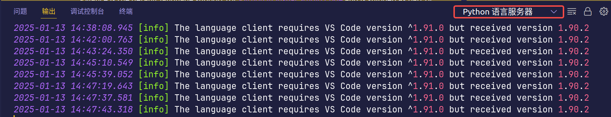

# Python

## 创建虚拟环境

https://realpython.com/python-virtual-environments-a-primer/

```bash
python3 -m venv venv
source venv/bin/activate
```

## vscode 配置环境

- 安装 `Python` 插件

- 配置代码跳转 `Pylance` 插件

选择 Python 语言服务器


配置好后如果没有正常跳转，查看输出日志



