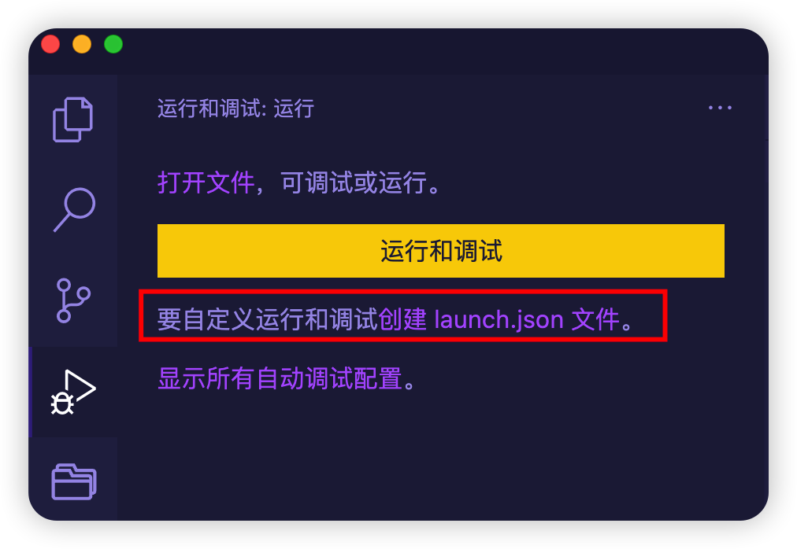

[TOC]

# go debug

## vscode 调试 golang

1、配置 vscode launch.json

点击创建 launch.json 文件，根据提示选择 go 和 launch package 调试模式。



> 生成的配置文件如下

```
{
    // 使用 IntelliSense 了解相关属性。 
    // 悬停以查看现有属性的描述。
    // 欲了解更多信息，请访问: https://go.microsoft.com/fwlink/?linkid=830387
    "version": "0.2.0",
    "configurations": [
        {
            "name": "Launch Package",
            "type": "go",
            "request": "launch",
            "mode": "auto",
            "program": "${fileDirname}"
        }
    ]
}
```

2、打断点启动调试