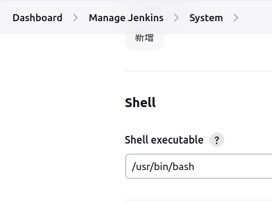

# Jenkins

## Pipeline 中变量在其他 stage 中使用

```groovy
pipeline {
    agent any

    stages {
        stage('Extract Conan Pkg Name') {
            steps {
                script { // 使用 script 块来编写 Groovy 代码
                    // 提取 build.log 倒数第二行
                    def secondLastLine = sh(script: "tail -n 2 build.log | head -n 1", returnStdout: true).trim()
                    echo "SECOND_LAST_LINE: ${secondLastLine}"

                    // 提取 : 前面的内容
                    def conanPkgName = sh(script: "echo ${secondLastLine} | awk -F':' '{print \$1}'", returnStdout: true).trim()
                    echo "CONAN_PKG_NAME: ${conanPkgName}"

                    // 将 CONAN_PKG_NAME 存储在环境变量中
                    env.CONAN_PKG_NAME = conanPkgName
                }
            }
        }
        stage('Echo') {
            steps {
                // 使用 CONAN_PKG_NAME
                sh "echo ${env.CONAN_PKG_NAME}"
            }
        }
    }
}

```

或者使用读写文件的方式解决：https://www.reddit.com/r/devops/comments/18d04wh/jenkins_using_a_bash_script_in_which_variables/

## 默认使用 bash 执行



