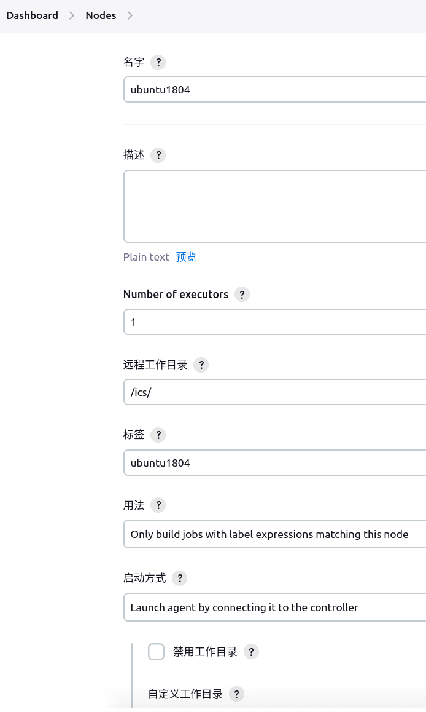
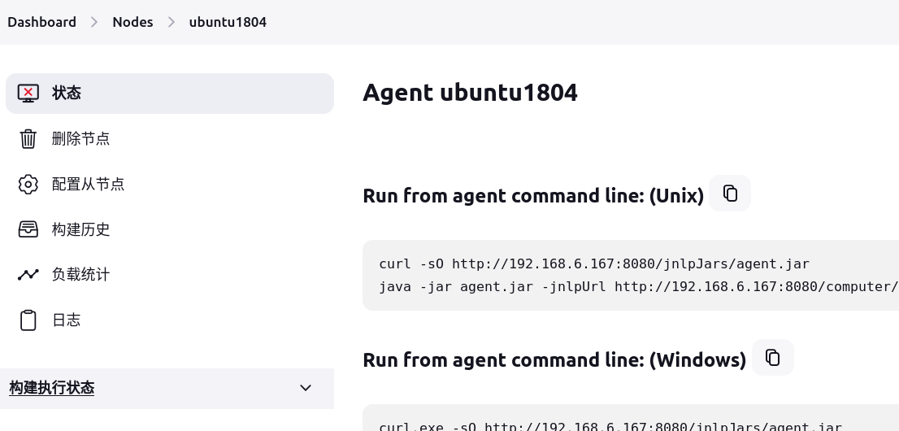

# Jenkins

## Pipeline 中变量在其他 stage 中使用

```groovy
pipeline {
    agent any

    stages {
        stage('Extract Conan Pkg Name') {
            steps {
                script { // 使用 script 块来编写 Groovy 代码
                    // 提取 build.log 倒数第二行
                    def secondLastLine = sh(script: "tail -n 2 build.log | head -n 1", returnStdout: true).trim()
                    echo "SECOND_LAST_LINE: ${secondLastLine}"

                    // 提取 : 前面的内容
                    def conanPkgName = sh(script: "echo ${secondLastLine} | awk -F':' '{print \$1}'", returnStdout: true).trim()
                    echo "CONAN_PKG_NAME: ${conanPkgName}"

                    // 将 CONAN_PKG_NAME 存储在环境变量中
                    env.CONAN_PKG_NAME = conanPkgName
                }
            }
        }
        stage('Echo') {
            steps {
                // 使用 CONAN_PKG_NAME
                sh "echo ${env.CONAN_PKG_NAME}"
            }
        }
    }
}

```

或者使用读写文件的方式解决：https://www.reddit.com/r/devops/comments/18d04wh/jenkins_using_a_bash_script_in_which_variables/

## 默认使用 bash 执行

> 有些系统是 `/bin/bash`


## 分布式构建

### 配置 Node



根据上图对 Node 进行配置。

- 远程工作目录：上图配置的目录为 `/ics/`，最终 jenkins 运行时候拉取的代码在 `/ics/workspace` 目录下。

保存配置，此时节点是离线状态：



拷贝 Unix 命令到目标机器中运行，成功运行日志会打印 Connected，并且在 Jenkins 界面节点状态显示为在线 。

- git 第一次拉取代码需要手动输入 yes

```bash
Are you sure you want to continue connecting (yes/no)?
```

### 使用 Node

通过 label 来使用指定的 Node

```groovy
AGENT_LABEL="master"
node {
    if (params.target=="test01")
        AGENT_LABEL="ubuntu1804"
    if (params.target=="test02")
        AGENT_LABEL="ubuntu2204"
}

pipeline {
    agent {
        label "${AGENT_LABEL}"
    }

    parameters {
        choice(name: 'target', choices: ['test01', 'test02'], description: '')
    }

    stages {
        stage('echo') {
            steps {
                sh "echo hello world"
            }
        }
    }
}

```

