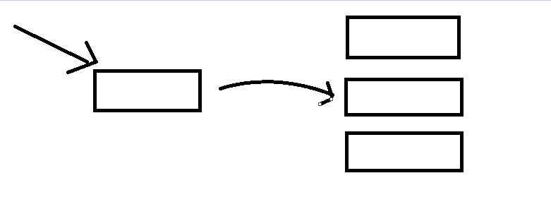
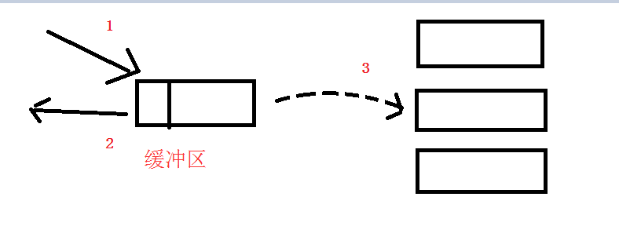

[TOC]

# Kafka

- kafka 架构图

## Kafka 所使用的基本术语

- **Producer**

Producer 即生产者，消息的产生者，是消息的入口。

- **Broker**

Broker 是 kafka 实例，每个服务器上有一个或多个 kafka 的实例，我们姑且认为每一台服务器只有一个 broker。每个 kafka 集群内的 broker 都有一个**不重复**的编号，如图中的 broker 0、broker1 等。

- **Topic**

消息的主题，可以理解为消息的分类，kafka 的数据就保存在 topic。在每个 broker 上都可以创建多个 topic。

- **Partition**

Topic 的分区，每个 topic 可以有多个分区，分区的作用是做负载，提高 kafka 的吞吐量。同一个 topic 在不同的分区的数据是不重复的，partition 的表现形式就是一个一个的文件夹。

- **Replication**

每一个 Partition 都有多个副本，分布在不同到 broker 上（一个 leader 和多个 follower）。

leader 副本：响应客户端的读写请求。所有的读写操作都在 leader上完成。

follower 副本：备份leader的数据，不进行读写操作。

当主分区（Leader）故障的时候会选择一个 Follower 上位，成为 Leader。默认情况下，Kafka 的 replica 数量为 1。副本的数量不能大于 Broker 的数量。follower 和 leader 绝对是在不同的机器，同一机器对同一个分区也只可能存放一个副本。

- **Message**

每一条发送的消息主体。

- **Consumer**

消费者，即消息的消费方，是消息的出口。

- **Consumer Group**

我们可以将多个消费者组成一个消费者组，在 kafka 的设计中**同一个分区的数据只能被消费者组中的某一个消费者消费**。同一个消费者组的消费者可以消费同一个 topic 的不同分区的数据，这也是为了提高 kafka 的吞吐量。

- **Zookeeper**

ZooKeeper 是一个分布式协调服务，它的主要作用是为分布式系统提供一致性服务。kafka 集群依赖 zookeeper 来保存集群的的元信息，来保证系统的可用性。

## 生产和消费消息

简单来说就是 Producer 生产一条 Message 给 kafka，然后 Consumer 从 kafka 消费这条消息。

- **produce message**

- **consume message**

- **举个例子**

以上图为例，首先 `Producer 0` 生产一条 `Topic A` 的 `Message`，这条 `Message` 被写入到 `Topic A` 的 `partition 0` 中。`Consumer Group A` 中有两个 `Consumer`，分别为 `Consumer 0` 和 `Consumer 1`。`Consumer Group A` 订阅了 `Topic A` 的消息。最后 `Consumer 0` 消费了 `partition 0` 中的消息。

## partition 的作用

若没有分区，一个 topic 对应的消息集在分布式集群服务组中，就会分布不均匀，即可能导致某台服务器 A 记录当前 topic 的消息集很多，若此 topic 的消息压力很大的情况下，服务器 A 就可能导致压力很大，吞吐也容易导致瓶颈。

有了分区后，假设一个 topic 可能分为 10 个分区，kafka 内部会根据一定的算法把 10 分区尽可能均匀分布到不同的服务器上，比如：A 服务器负责 topic 的分区 1，B 服务器负责 topic 的分区 2，在此情况下，Producer 发消息时若没指定发送到哪个分区的时候，kafka 就会根据一定算法上个消息可能分区 1，下个消息可能在分区 2。

一句话总结：**分区对于 Kafka 集群的好处是：实现负载均衡。分区对于消费者来说，可以提高并发度，提高效率。**

## topic 和 partition

每个 topic 可以有多个 partition。简单来说 topic 是存放消息的逻辑队列，partition 是物理队列。

假如我的一个 topic 有三个分区，那么生产者生产一条消息后会放到**其中的一个分区**（<u>注意这里不是一条消息存到三个分区中</u>）。

每一个分区都是一个顺序的、不可变的消息队列，并且可以持续的添加。分区中的消息都被分了一个序列号，称之为偏移量（offset），在每个分区中此偏移量都是唯一的。

Kafka 集群保持所有的消息，直到它们过期（无论消息是否被消费）。实际上消费者所持有的仅有的元数据就是这个 offset（偏移量），也就是说 offset 由消费者来控制：正常情况当消费者消费消息的时候，偏移量也线性的的增加。但是实际偏移量由消费者控制，消费者可以将偏移量重置为更早的位置，重新读取消息。

Kafka 中采用分区的设计有几个目的。一是可以处理更多的消息，不受单台服务器的限制。Topic 拥有多个分区意味着它可以不受限的处理更多的数据。第二，分区可以作为并行处理的单元。

**在 kafka 中，如果某个 topic 有多个 partition，producer 又怎么知道该将数据发往哪个 partition 呢？kafka 中有几个原则**：

1. partition 在写入的时候可以指定需要写入的 partition，如果有指定，则写入对应的 partition。
2. 如果没有指定 partition，但是设置了数据的 key，则会根据 key 的值 hash 出一个 partition。
3.  如果既没指定 partition，又没有设置 key，则会轮询选出一个 partition。

### partition 的有序性

**为什么 kafka 是只能在 patition 上面做到有序，而 topic 如果有多个 partition 是不是就不能保证 topic 是有序的**？

网上看到的一个例子：

某一天举办了一次吃鸡蛋大赛，可以以小组的形式参加，报名结束后，一共有两个小组参加：

- A 小组有三个人 A1，A2，A3
- B 小组有两个人 B1，B2

在他们面前各自放着三条流水线，鸡蛋从流水线滚下来（3 个分区），厨师（生产者）在后台不停的往流水线里加鸡蛋，防止参赛选手（消费者）不够吃。

A 小组正巧有三个人，就一人负责一条流水线，按照流水线的上鸡蛋的顺序吃。

B 小组只有两个人，其中 B1 饭量比较大，独自负责两条流水线，这条流水线吃一个，那条流水线吃一个。

这里就对应了一个参赛选择按鸡蛋的生产顺序进行吃鸡蛋，比如 A 小组，那么每个人吃的鸡蛋的顺序都是按照厨师放入流水线的顺序。而 B 小组的 B1 这个人，就一会儿这吃个一会儿吃那个，没有一个顺序性保证了。

比赛的结局就是谁最后吃的鸡蛋最多，谁就获胜。

## 同步生产者和异步生产者

- kafka 同步生产者：这个生产者写一条消息的时候，它就立马发送到某个分区去。

- kafka 异步生产者：这个生产者写一条消息的时候，先是写到某个缓冲区，这个缓冲区里的数据还没写到 broker 集群里的某个分区的时候，它就返回到 client 去了。

## Controller Broker

在分布式系统中，通常需要有一个协调者，该协调者会在分布式系统发生异常时发挥特殊的作用。在 Kafka 中该协调者称之为控制器（Controller），其实该控制器并没有什么特殊之处，它本身也是一个普通的 Broker，只不过需要负责一些额外的工作（追踪集群中的其他 Broker，并在合适的时候处理新加入的和失败的 Broker 节点、Rebalance 分区、分配新的 leader 分区等）。值得注意的是：**Kafka 集群中始终只有一个 Controller Broker。**

### Controller Broker 是如何被选出来的

Broker 在启动时，会尝试去 ZooKeeper 中创建 /controller 节点。Kafka 当前选举控制器的规则是：**第一个成功创建 /controller 节点的 Broker 会被指定为控制器**。

### Controller Broker 的具体作用是什么

Controller Broker 的主要职责有很多，主要是一些管理行为，主要包括以下几个方面：

- 创建、删除主题，增加分区并分配 leader 分区
- 集群 Broker 管理（新增 Broker、Broker 主动关闭、Broker 故障)
- 分区重分配

## 参考文章

- [再过半小时，你就能明白 kafka 的工作原理了](https://www.cnblogs.com/sujing/p/10960832.html)
- [Kafka 的 Controller Broker 是什么](https://zhuanlan.zhihu.com/p/165989024)

