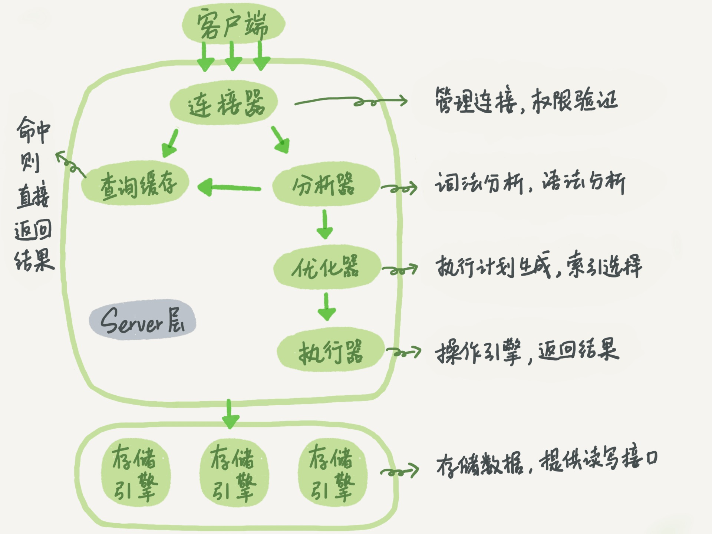

[TOC]

# MySQL 基础

## MySQL 架构

## 存储引擎

>什么是存储引擎：MySQL中的数据用各种不同的技术存储在文件（或者内存）中。这些技术中的每一种技术都使用不同的存储机制、索引技巧、锁定水平并且最终提供广泛的不同的功能和能力。通过选择不同的技术，你能够获得额外的速度或者功能，从而改善你的应用的整体功能。下面是常见的存储引擎。

- MyISAM： 拥有较高的插入，查询速度，但不支持[事务](https://baike.baidu.com/item/事务?fromModule=lemma_inlink)。
- **InnoDB**：5.5 版本后 Mysql 的默认数据库，事务型数据库的首选引擎，支持 ACID 事务（Atomicity 原子性、Consistency 一致性、Isolation 隔离性、Durability 持久性），支持行级锁定。
- Memory ：所有数据置于内存的存储引擎，拥有极高的插入，更新和查询效率。但是会占用和数据量成正比的内存空间。并且其内容会在 Mysql 重新启动时丢失。

## 参考链接