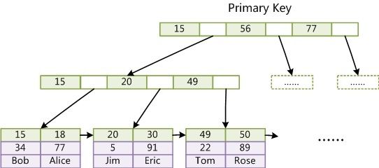
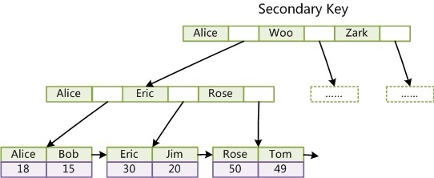

[TOC]

# MySQL 索引

什么是索引？一句话简单来说，索引的出现其实就是为了提高数据查询的效率，就像书的目录一样。一本 500 页的书，如果你想快速找到其中的某一个知识点，在不借助目录的情况下，那我估计你可得找一会儿。同样，对于数据库的表而言，索引其实就是它的“目录”。下面介绍 MySQL 默认存储引擎 InnoDB 的索引结构。

## InnoDB 索引

在 InnoDB 中，表数据文件本身就是按 B+Tree 组织的一个索引结构，这棵树的叶节点 data 域保存了完整的数据记录。这个索引的 key 是数据表的主键，因此 InnoDB 表数据文件本身就是主键索引。

- 索引分类

**主键索引(PRIMARY)，单值索引(INDEX)，唯一索引(UNIQUE)，联合索引。**

总体划分为两大类：**主键索引称为聚簇索引(clustered index)，其余非主键索引都称为辅助索引/二级索引(secondary index)**。

> 备注：唯一索引和主键索引唯一的区别：主键索引不能为 null

## 聚簇索引(clustered index)



可以看到叶节点 data 域保存了完整的数据记录。因为 InnoDB 的数据文件本身要按主键聚集，所以 InnoDB 要求表必须有主键。如果没有显式指定，则 MySQL 系统会自动选择一个可以唯一标识数据记录的列作为主键。如果不存在这种列，则 MySQ L自动为 InnoDB 表生成一个隐含字段作为主键，这个字段长度为 6 个字节，类型为长整形。

## 辅助索引/二级索引(secondary index)



InnoDB 的所有辅助索引都引用主键作为 data 域。

## 回表

>所谓的回表查询，先从辅助索引定位主键值，再从聚簇索引定位行记录，它的性能比扫一遍辅助索引树低。使用聚簇索引就不会回表，普通索引可能会回表。

在下面这个表 T 中，如果我执行 `select * from T where k between 3 and 5`，需要执行几次树的搜索操作，会扫描多少行？下面是这个表的初始化语句。

```mysql
mysql> create table T (
ID int primary key,
k int NOT NULL DEFAULT 0, 
s varchar(16) NOT NULL DEFAULT '',
index k(k))
engine=InnoDB;

insert into T values(100,1, 'aa'),(200,2,'bb'),(300,3,'cc'),(500,5,'ee'),(600,6,'ff'),(700,7,'gg');
```


> Rn 表示第 n 行

一起来看看这条 SQL 查询语句的执行流程：

1. 在 k 索引树上找到 k=3 的记录，取得 ID = 300；

2. 再到 ID 索引树查到 ID=300 对应的 R3；

3. 在 k 索引树取下一个值 k=5，取得 ID=500；
4. 再回到 ID 索引树查到 ID=500 对应的 R4；
5. 在 k 索引树取下一个值 k=6，不满足条件，循环结束。

在这个过程中，**回到主键索引树搜索的过程，我们称为回表**。可以看到，这个查询过程读了 k 索引树的 3 条记录（步骤 1、3 和 5），回表了两次（步骤 2 和 4）。在这个例子中，由于查询结果所需要的数据只在主键索引上有，所以不得不回表。那么，有没有可能经过索引优化，避免回表过程呢？

## 覆盖索引

> 只需要在一棵辅助索引树上就能获取SQL**所需的所有列数据**，无需回表，速度更快。

如果执行的语句是 `select ID from T where k between 3 and 5`，这时只需要查 ID 的值，而 ID 的值已经在 k 索引树上了，因此可以直接提供查询结果，不需要回表。也就是说，在这个查询里面，索引 k 已经“覆盖了”我们的查询需求，我们称为覆盖索引。由于覆盖索引可以减少树的搜索次数，显著提升查询性能，所以使用覆盖索引是一个常用的性能优化手段。

## 联合索引

> 基于多个字段创建的索引我们称为联合索引，比如我们创建索引 `create index idx on table(A,B,C)` 我们称在字段 A,B,C 上创建了一个联合索引。建一个联合索引 `(A,B,C)`，实际相当于建了 `(A)`，`(A,B)`，`(A,B,C)` 三个索引。每多一个索引，都会增加写操作的开销和磁盘空间的开销。对于大量数据的表，使用联合索引会大大的减少开销。 

假设我们有个市民表

```mysql
CREATE TABLE `tuser` (
  `id` int(11) NOT NULL,
  `id_card` varchar(32) DEFAULT NULL,
  `name` varchar(32) DEFAULT NULL,
  `age` int(11) DEFAULT NULL,
  `ismale` tinyint(1) DEFAULT NULL,
  PRIMARY KEY (`id`),
  KEY `id_card` (`id_card`),
  KEY `name_age` (`name`,`age`)
) ENGINE=InnoDB
```

### 最左前缀原则

>最左前缀匹配原则，非常重要的原则，mysql 会一直向右匹配**直到遇到范围查询** (>、<、between、like) 就停止匹配，不会再匹配后面的索引字段

为了直观地说明这个概念，我们用（name，age）这个联合索引来分析。


可以看到，**索引项是按照索引定义里面出现的字段顺序排序的**。

当你的逻辑需求是查到所有名字是“张三”的人时，可以快速定位到 ID4，然后向后遍历得到所有需要的结果。

如果你要查的是所有名字第一个字是“张”的人，你的 SQL 语句的条件是"where name like ‘张 %’"。这时，你也能够用上这个索引，查找到第一个符合条件的记录是 ID3，然后向后遍历，直到不满足条件为止。

可以看到，不只是索引的全部定义，只要满足最左前缀，就可以利用索引来加速检索。**这个最左前缀可以是联合索引的最左 N 个字段，也可以是字符串索引的最左 M 个字符**。

#### 如何安排联合索引内的字段顺序

基于上面对最左前缀索引的说明，我们来讨论一个问题：在建立联合索引的时候，如何安排索引内的字段顺序。

这里我们的评估标准是，**索引的复用能力**。因为可以支持最左前缀，所以当已经有了 (a,b) 这个联合索引后，一般就不需要单独在 a 上建立索引了。因此，第一原则是，如果通过调整顺序，可以少维护一个索引，那么这个顺序往往就是需要优先考虑采用的。

那么，如果既有联合查询，又有基于 a、b 各自的查询呢？查询条件里面只有 b 的语句，是无法使用 (a,b) 这个联合索引的，这时候你不得不维护另外一个索引，也就是说你需要同时维护 (a,b)、(b) 这两个索引。

这时候，我们要**考虑的原则就是空间**了。比如上面这个市民表的情况，name 字段是比 age 字段大的 ，那我就建议你创建一个（name,age) 的联合索引和一个 (age) 的单字段索引。

### 索引下推

我们还是以市民表的联合索引（name, age）为例。如果现在有一个需求：检索出表中“名字第一个字是张，而且年龄是 10 岁的所有男孩”。那么，SQL 语句是这么写的：

```mysql
select * from tuser where name like '张 %' and age=10 and ismale=1;
```

在 MySQL 5.6 之前，只能从 ID3 开始一个个回表。到主键索引上找出数据行，再对比字段值。

而 MySQL 5.6 引入的索引下推优化（index condition pushdown)， 可以在索引遍历过程中，对索引中包含的字段（age）先做判断，直接过滤掉不满足条件的记录，减少回表次数。

- 无索引下推执行流程


在 (name,age) 索引里面特意去掉了 age 的值，因为这个过程 InnoDB 并不会去看 age 的值，只是按顺序把“name 第一个字是’张’”的记录一条条取出来回表。因此，需要回表 4 次。

- 索引下推执行流程


上图 InnoDB 在 (name,age) 索引内部就判断了 age 是否等于 10，对于不等于 10 的记录，直接判断并跳过。在我们的这个例子中，只需要对 ID4、ID5 这两条记录回表取数据判断，就只需要回表 2 次。

## 索引使用例子

使用的索引：`idx_name_age_birthday (name, age, birthday)`

> 全值匹配

```
select * from user where birthday = '1998-01-02' and name = 'jack' and age = 24;
```

> 匹配左边的列

```
select * from user where name = 'jack';
```

> 匹配列前缀

```
select * from user where name like 'ja%';
```

> 匹配范围值

```
select * from user where name > 'jack' and name < 'tom';
```

> 精确匹配某一列并范围匹配另外一列

```
select * from user where name = 'jack' and age > 18 and birthday = 2009-01-02;
```

> 用于排序

```
select * from user where order by name, age, birthday;
```

> 使用联合索引进行排序注意事项

- 对于`联合索引`有个问题需要注意，`ORDER BY` 的子句后边的列的顺序也必须按照索引列的顺序给出，如果给出`ORDER BY age, birthday, name` 的顺序，则无法使用`联合索引`。
- 若联合索引**左列值为常量**，可以使用后边的列进行排序: `select * from user where name = 'jack' order by age, birthday;`

> 不可以使用索引进行排序的几种情况

1. asc、desc 混用

2. 排序列包含非同一个索引的列

   `select * from user order by name, user_id limit 10;`

3. 排序列使用了复杂的表达式

   `select * from person_info order upper(name) LIMIT 10;`

## 建索引的几大原则

1. 最左前缀匹配原则，非常重要的原则，mysql 会一直向右匹配联合索引**直到遇到范围查询** (>、<、between、like) 就停止匹配，不会再匹配后面的索引字段。比如 `where a = 1 and b = 2 and c > 3 and d = 4`，如果建立 (a,b,c,d) 顺序的索引，d 是用不到索引的；如果建立 (a,b,d,c) 顺序的索引则都可以用到，因为优化器会把 sql 语句优化为 `where a = 1 and b = 2 and d = 4 and c > 3`。

> 怎么判断是用到了 3 个字段的索引，而不是只用到前两个字段的索引呢？有个非常简单的方法，看执行计划的索引长度（explain）。

2. = 和 in 可以乱序。比如 `where a = 1 and b = 2 and c = 3` 建立 (a,b,c) 索引可以任意顺序，mysql 的查询优化器会帮你优化成索引可以识别的形式。

3. 尽量选择区分度高的列作为索引，区分度的公式是 `count(distinct col)/count(*)`，**表示字段不重复的比例**，比例越大我们扫描的记录数越少，唯一键的区分度是 1，而一些状态、性别字段可能在大数据面前区分度就是 0。

4. 索引列不能参与计算，保持列“干净”，比如 `from_unixtime(create_time) = ’2014-05-29’` 就不能使用到索引，原因很简单，b+ 树中存的都是数据表中的字段值，但进行检索时，需要把所有元素都应用函数才能比较，显然成本太大。所以语句应该写成 `create_time = unix_timestamp(’2014-05-29’)`。

5. 尽量的扩展索引，不要新建索引。比如表中已经有 a 的索引，现在要加 (a,b) 的索引，那么只需要修改原来的索引即可。
6. 索引列的类型尽量小（占用的存储空间小）
7. 尽量使用【覆盖索引】进行查询，避免【回表】带来的性能损耗。

## QA

- 一个索引节点可以存储多少数据？

InnoDB page size 默认16kb, 一个整数（bigint）字段索引为 8bytes, 另外每个索引有 6bytes 用于指针，则 `16kb / (8+6)b ≈ 1170`。假设层高四，那有 `1170^3 ≈ 16` 亿数据


## 参考链接

- [MySQL索引背后的数据结构及算法原理](http://blog.codinglabs.org/articles/theory-of-mysql-index.html)
- [MySQL 实战 45 讲 04 | 深入浅出索引（下）](https://time.geekbang.org/column/article/69636)
- [联合索引在B+树上的存储结构及数据查找方式](https://juejin.cn/post/6844904073955639304)