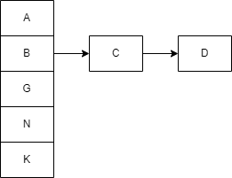
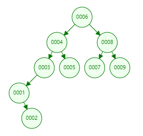
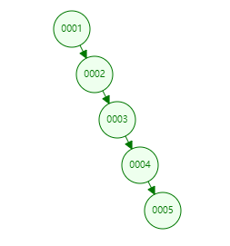
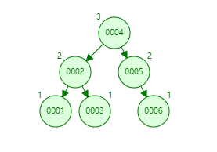
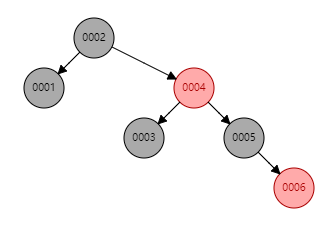
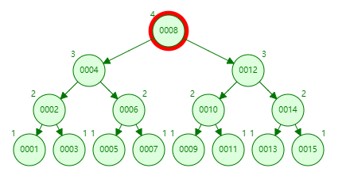
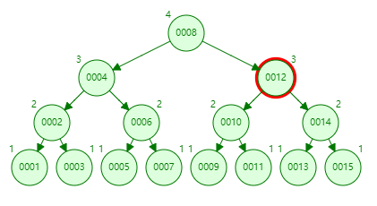
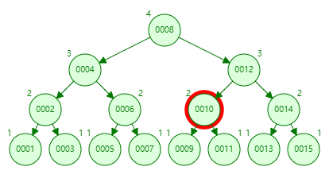
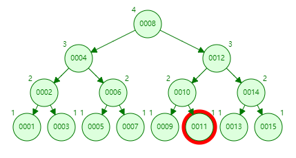

[TOC]

# 为什么 MySQL 使用 B+ 树

> 在 InnoDB 中，表数据文件本身就是按 B+Tree 组织的一个索引结构，这棵树的叶节点 data 域保存了完整的数据记录。这个索引的 key 是数据表的主键，因此 InnoDB 表数据文件本身就是主索引。

MySQL 默认的存储引擎 InnoDB 无论是表中的数据（主键索引）还是辅助索引最终都会使用 B+ 树来存储数据，其中前者在表中会以 `<id, row>` 的方式存储，而后者会以 `<index, id>` 的方式进行存储，这其实也比较好理解：

- 在主键索引中，`id` 是主键，我们能够通过 `id` 找到该行的全部列；
- 在辅助索引中，索引中的几个列构成了键，我们能够通过索引中的列找到 `id`，如果有需要的话，可以再通过 `id` 找到当前数据行的全部内容；

对于 InnoDB 来说，所有的数据都是以键值对的方式存储的，主键索引和辅助索引在存储数据时会将 `id` 和 `index` 作为键，将所有列和 `id` 作为键对应的值。

下面通过不同的数据结构，来分析比较 B+ 树的优点。

## 常见的数据结构

### 哈希表

Hash 表是一种查找效率很高的结构，基本可以认为它的插入、查询和删除都是 `O(1)`。

Hash 表的底层是一个`数组`，插入数据时对数据进行 `hashCode`，再对数组长度`取模`，确定它在数组中的位置，放到数组里边。当然这里可能存在要放的位置被占用的情况，这个叫`哈希碰撞`，或者`哈希冲突`，此时可以用`拉链法`解决，具体就是在冲突的位置建一个链表。

**特点**

- 因为插入、查询、删除效率高，适合在内存中使用，如 Redis。

**缺点**

- 哈希虽然能够提供 `O(1)` 的单数据行操作性能，但是对于**范围查询和排序**却无法很好地支持，最终导致全表扫描。

### 二叉搜索树

- 一般二叉搜索树

- 退化成链表的二叉搜索树

**特点**

- 任意节点的左子树上所有节点值不大于根节点的值，任意节点的右子树上所有节点值不小于根节点的值。查询时平均复杂度为 O(logn)。

**缺点**

- 在数据有序时会退化为单链表，查询复杂度降为 O(n)。

### 平衡二叉树

平衡二叉树（AVL 树）为了在符合二叉查找树条件下，还满足任意节点的两颗子树的**最大高度差**为 1，这就保证了查找复杂度为 `O(logn)`。

**缺点**

- 为了保证树的平衡，**在插入和删除时，需要额外的时间，通过旋转 O(logn) 来调整平衡。使得插入和删除的性能下降。**

### 红黑树

一种『近似』的平衡二叉查找树，但在每个节点增加一个存储位表示节点的颜色，可以是 red 或 black。**通过对任何一条从根到叶子的路径上各个节点着色的方式的限制，红黑树确保没有一条路径会比其它路径长出两倍**。它是一种弱平衡二叉树（由于是弱平衡，可以推出，相同的节点情况下，AVL 树的高度低于红黑树）。

- 优点

**相对于要求严格的 AVL 树来说，它的旋转次数变少**，只需要 O(1) 的旋转次数以及变色就能保证基本的平衡，所以对于搜索、**插入、删除**操作多的情况下，我们就用红黑树。

### B-Tree

B-Tree（多路平衡查找树），是为磁盘等辅存设备设计的多路平衡查找树。与二叉树相比，B 树的每个非叶子节点可以有多个子树。

**一棵 m 阶的 B-Tree 有如下定义：**

1. 每个结点最多有 m 个关键字。
2. 除了根节点和叶子节点外，其它每个节点至少有 Ceil(m/2) 个孩子（Ceil 函数返回大于或者等于指定表达式的最小整数）。
3. 每个非叶节点至少有两个孩子。
4. 所有叶子节点都在同一层，且不包含其它关键字信息 。
5. 每个结点中的关键字都按照从小到大的顺序排列，每个关键字的左子树中的所有关键字都小于它，而右子树中的所有关键字都大于它。

**特点：**

1. 所有键值分布在整个树中。
2. 任何关键字出现且只出现在一个节点中。
3. 搜索有可能在非叶子节点结束。
4. 在关键字全集内做一次查找，性能逼近二分查找算法。

**缺点：**

B 树能够在非叶节点中存储数据。

- 导致在查询连续数据时可能会带来更多的随机  I/O（需要不断通过中序遍历，加载不同磁盘块）。

- 节点可存放的数据量较低，会产生更多的内节点（非叶子节点）。

### B+Tree

B+Tree 是在 B-Tree 基础上的一种优化，使其更适合实现外存储索引结构。

从 B-Tree 结构图中可以看到每个节点中不仅包含数据的 key 值，还有 data 值。而每一个页的存储空间是有限的，如果 data 数据较大时将会导致每个节点（即一个页）能存储的 key 的数量很小，当存储的数据量很大时同样会导致 B-Tree 的深度较大，增大查询时的磁盘 I/O 次数，进而影响查询效率。在 B+Tree 中，**所有数据记录节点都是按照键值大小顺序存放在同一层的叶子节点上**，而非叶子节点上只存储 key 值信息，这样可以大大加大每个节点存储的 key 值数量，降低 B+Tree 的高度。

**B+Tree 相对于 B-Tree 有几点不同：**

1. 非叶子节点只存储键值信息——**每个元素不保存数据，只用来索引，所有数据都保存在叶子节点**。
2. 叶子节点之间有指针连接。
3. 数据记录都存放在叶子节点中。

#### 局部性原理

在计算机中磁盘存储数据最小单元是扇区，一个扇区的大小是 512 字节，而文件系统它的最小单元是块，一个块的大小是 4k。考虑到磁盘 I/O 是非常高昂的操作，计算机操作系统做了一些优化，当一次 I/O 时，不光把当前磁盘地址的数据，而是把相邻的数据也都读取到内存缓冲区内，因为局部预读性原理告诉我们，当计算机访问一个地址的数据的时候，与其相邻的数据也会很快被访问到。所以**操作系统一次 I/O 就是读取一个磁盘块**。

而对于我们的 InnoDB 存储引擎也有自己的最小储存单元——页（Page），一个页的大小是 16K（这个页的大小是可以调整的，一般是磁盘块的大小倍数，这里我们为了方便，我们默认设置 mysql 的一个页大小和磁盘块大小一致）。在数据库中，不论读一行，还是读多行，都是将这些行所在的页进行加载。**数据库设计者把 B-/+Tree 一个节点的大小设计成一次 I/O 读取到的 block 大小**。 

## InnoDB 为什么选择 B+Tree

当我们需要在数据库中查询数据时，CPU 会发现当前数据位于磁盘而不是内存中，这时就会触发 I/O 操作将数据加载到内存中进行访问，数据的加载都是以页的维度进行加载的，然而将数据从磁盘读取到内存中所需要的成本是非常大的，普通磁盘（非 SSD）加载数据需要经过队列、寻道、旋转以及传输的这些过程，大概要花费 `10ms` 左右的时间。

> 存储器时延对比

| 存储器   | 硬件介质 | 随机访问延时 |
| -------- | -------- | ------------ |
| L1 Cache | SRAM     | 1ns          |
| L1 Cache | SRAM     | 4ns          |
| Memory   | DRAM     | 100ns        |
| Disk     | SSD      | 150us        |
| Disk     | HDD      | 10ms         |

可以看到磁盘 I/O 是其中一个很大的瓶颈。为什么 InnoDB 会选择 B+Tree，下面我们选择三个数据结构来对比：哈希表、AVL 树/红黑树和 B-Tree。

### 对比哈希表

O(1) 的查询插入删除效率固然高，但适用于只有等值查询的场景。它对于处理范围查询或者排序性能会非常差，只能进行全表扫描并依次判断是否满足条件。

### 对比二叉树

为什么不用 AVL 树？网上千篇一律的说法：**树的层数越高，I/O 次数越多**。

虽然这句话没有问题，但是背后却隐藏着一些细节。我们先来看个例子，假设树的高度是 4，查找值是 11，那么流程如下。

- 第 1 次磁盘 I/O

- 第 2 次磁盘 I/O

- 第 3 次磁盘 I/O

- 第 4 次磁盘 I/O

二叉树的磁盘 I/O 次数最坏的情况下等于树的高度。为了减少磁盘 I/O 的次数，我们需要把原来「瘦高」的树结构变得「矮胖」。

> 思考

相信很多人都会和我一样的疑问：为什么一个磁盘块只能存储至多一个节点？为什么不把二叉树多个节点储存到一个块中，每个节点的指针可以设计为块号+偏移。每次访问一个节点，和它同属一个磁盘块的节点也能一同读出。

我们拿 AVL 树和 B-Tree 做对比。假设 AVL 树的节点也是和 B-Tree 的节点一样存储 key 和 data。既然 B-Tree 的一个节点（一个节点对应一个磁盘块）可以存多个元素，那么一个磁盘块也可以存储多个 AVL 节点，也就是说一次 I/O 就可以读取出多个 AVL 节点，那么就算我 AVL 树比 B-Tree 要高，但是我的 I/O 次数不一定就比你多。

实际上，因为二叉树的节点之间地址不连续，可能导致二叉树的节点分布在不同的磁盘块里。换句话说，多个节点虽然可能在同一个磁盘块上，但是树越高，就需要调用的磁盘块可能就越多，但是一个块中大概率用到的只有一个节点，因此需要多次去磁盘中读取数据。而且就算可以把逻辑相邻（节点之间的距离）的节点存储在同一个磁盘块，但是 AVL 树插入、删除后形态改变会比较频繁。经过多次的插入和删除，要维护节点和块之间的关系，是非常的困难（感觉只会存在理论的可能）。

所以最简单的办法就是**一个 AVL 节点对应一个磁盘块**（当然这会很浪费存储空间）。每访问下一层的节点，就进行一次磁盘 I/O。所以就需要减少树高来减少磁盘 I/O。为了让一个查询尽量少地读磁盘，就必须让查询过程访问尽量少的数据块。那么我们就不应该使用二叉树，而是要使用 N 叉树。

作为对比，B-Tree 每一个节点大小设计为一页，这样一次 I/O 就读取到一个节点的数据。同一个节点中的元素它们在逻辑（同一个 innodb 页）和物理（同一个磁盘块）上都是相邻的，这样我们每次 I/O 读取的页的数据都是对查询有用。因为 B 树每个节点可以存放多个元素，所以在相同的数据量的情况下，一颗 B 树的高度远远小于二叉树的高度，相应的读取时需要磁盘 I/O 次数也少。

### 对比 B-Tree

- B 树能够在非叶节点中存储数据，但是这也导致在查询连续数据时可能会带来更多的随机 I/O（因为当 B 树做范围查询时需要使用中序遍历，那么父节点和子节点也就需要不断的来回切换涉及了多个节点）。而 B+ 树的所有叶节点可以通过指针相互连接，能够减少顺序遍历时产生的额外随机 I/O。

- B+ 树非叶子节点不存储真正的 data，这就意味着中间节点的大小仅依赖于我们索引项的大小，所以每次磁盘 I/O 加载的数据量就比 B-Tree 多，查询效率也会高很多。

- ~~B+ 树的查询效率更加稳定：由于非叶子节点并不是最终指向文件内容的结点，而只是叶子结点中关键字的索引。所以任何关键字的查找必须走一条从根结点到叶子结点的路。所有关键字查询的路径长度相同，导致每一个数据的查询效率相当。~~

## 参考链接

- https://draveness.me/whys-the-design-mysql-b-plus-tree/
- [MySQL 实战 45 讲 04 | 深入浅出索引（上）](https://time.geekbang.org/column/article/69236)