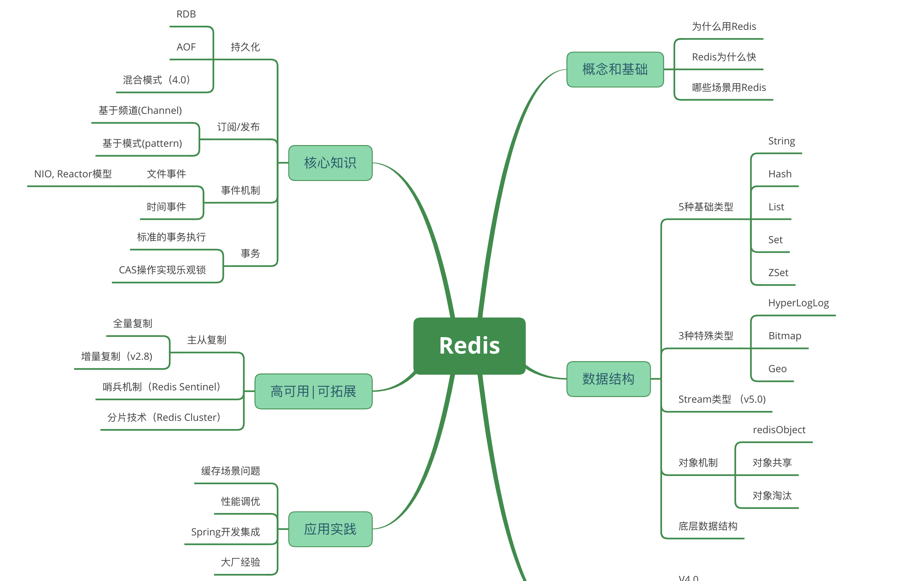

[TOC]

# Redis

Redis 是一种支持 key-value 等多种数据结构的存储系统。可用于缓存，事件发布或订阅，高速队列等场景。基于内存，可持久化

## Redis 的使用场景

### 热点数据的缓存

缓存是 Redis 最常见的应用场景，之所有这么使用，主要是因为 Redis 读写性能优异。而且逐渐有取代 memcached，成为首选服务端缓存的组件。而且，Redis 内部是支持事务的，在使用时候能有效保证数据的一致性。

### 限时业务的运用

redis 中可以使用 expire 命令设置一个键的生存时间，到时间后 redis 会删除它。利用这一特性可以运用在限时的优惠活动信息、手机验证码等业务场景。

### 计数器相关问题

redis 由于 incrby 命令可以实现原子性的递增，所以可以运用于高并发的秒杀活动、分布式序列号的生成、具体业务还体现在比如限制一个手机号发多少条短信、一个接口一分钟限制多少请求、一个接口一天限制调用多少次等等。

### 分布式锁

这个主要利用 redis 的 setnx 命令进行。

在分布式锁的场景中，主要用在比如秒杀系统等。

### 延时操作

补充

### 排行榜相关问题

关系型数据库在排行榜方面查询速度普遍偏慢，所以可以借助 redis 的 SortedSet 进行热点数据的排序。

### 点赞、好友等相互关系的存储

Redis 利用集合的一些命令，比如求交集、并集、差集等。

在微博应用中，每个用户关注的人存在一个集合中，就很容易实现求两个人的共同好友功能。

### 简单队列

由于 Redis 有 list push 和 list pop 这样的命令，所以能够很方便的执行队列操作。

## 参考链接

- https://pdai.tech/md/db/nosql-redis/db-redis-introduce.html
- https://baike.baidu.com/item/Redis/6549233?fr=aladdin
- https://zhuanlan.zhihu.com/p/29665317
- https://www.jianshu.com/p/40dbc78711c8