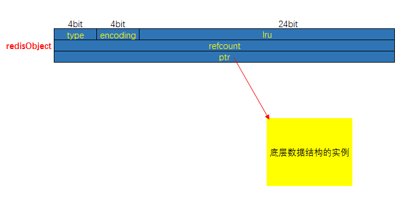

[TOC]

# RedisObject

## 为什么 Redis 会设计 redisObject 对象

在 redis 的命令中，用于对键进行处理的命令占了很大一部分，而对于键所保存的值的类型（键的类型），键能执行的命令又各不相同。如：`LPUSH` 和 `LLEN` 只能用于列表键（List），而 `SADD` 和 `SRANDMEMBER` 只能用于集合键（Set）等等；另外一些命令，比如 `DEL`、 `TTL` 和 `TYPE`，可以用于任何类型的键；但是要正确实现这些命令，必须为不同类型的键设置不同的处理方式：比如说，删除一个列表键和删除一个字符串键的操作过程就不太一样。

以上的描述说明，**Redis 必须让每个键都带有类型信息，使得程序可以检查键的类型，并为它选择合适的处理方式**。

比如说，Zset 就可以由 `ziplist` 和 `zskiplist` 两种不同的数据结构实现。但是，当用户执行 `ZADD` 命令时，他/她应该不必关心集合使用的是什么编码（ziplist 还是 zskiplist），只要 Redis 能按照 `ZADD` 命令的指示，将新元素添加到集合就可以了。

这说明，**操作数据类型的命令除了要对键的类型进行检查之外，还需要根据数据类型的不同编码进行多态处理**。

## redisObject 数据结构

redisObject 是 Redis 类型系统的核心，数据库中的每个键、值以及 Redis 本身处理的参数，都表示为这种数据类型。

```c
/*
 * Redis 对象
 */
typedef struct redisObject {
    // 类型
    unsigned type:4; // :4 表示占用 4 个字节的意思
    
    // 编码方式
    unsigned encoding:4;
    
    // LRU - 24位，记录最末一次访问时间（相对于lru_clock）; 或者 LFU（最少使用的数据：8位频率，16位访问时间）
    unsigned lru:LRU_BITS; // LRU_BITS: 24
    
    // 引用计数
    int refcount;
    
    // 指向底层数据结构实例
    void *ptr;
} robj;
```

下图对应上面的结构



**其中 type、encoding 和 ptr 是最重要的三个属性**。

### type

**记录了对象所保存的值的类型**

```c
/*
* 对象类型
*/
#define OBJ_STRING 0 // 字符串
#define OBJ_LIST 1 // 列表
#define OBJ_SET 2 // 集合
#define OBJ_ZSET 3 // 有序集
#define OBJ_HASH 4 // 哈希表
```

### encoding

**记录了对象所保存的值的编码**

```c
/*
* 对象编码
*/
#define OBJ_ENCODING_RAW 0     /* Raw representation */
#define OBJ_ENCODING_INT 1     /* Encoded as integer */
#define OBJ_ENCODING_HT 2      /* Encoded as hash table */
#define OBJ_ENCODING_ZIPMAP 3  /* 注意：版本 2.6 后不再使用. */
#define OBJ_ENCODING_LINKEDLIST 4 /* 注意：不再使用了，旧版本 2.x 中 String 的底层之一. */
#define OBJ_ENCODING_ZIPLIST 5 /* Encoded as ziplist */
#define OBJ_ENCODING_INTSET 6  /* Encoded as intset */
#define OBJ_ENCODING_SKIPLIST 7  /* Encoded as skiplist */
#define OBJ_ENCODING_EMBSTR 8  /* Embedded sds string encoding */
#define OBJ_ENCODING_QUICKLIST 9 /* Encoded as linked list of ziplists */
#define OBJ_ENCODING_STREAM 10 /* Encoded as a radix tree of listpacks */
```

### ptr

**ptr 是一个指针，指向实际保存值的数据结构**，这个数据结构由 type 和 encoding 属性决定。举个例子，如果一个 redisObject 的 type 属性为 `OBJ_LIST` ，encoding 属性为 `OBJ_ENCODING_QUICKLIST` ，那么这个对象就是一个Redis 列表（List)，它的值保存在一个 QuickList 的数据结构内，而 ptr 指针就指向 quicklist 的对象；

下图展示了 redisObject 、Redis 所有数据类型、Redis 所有编码方式以及底层数据结构之间的关系（从 6.0 版本中梳理而来）：


### lru

**记录了对象最后一次被命令程序访问的时间**

**空转时长**：当前时间减去键的值对象的 lru 时间，就是该键的空转时长。Object idletime 命令可以打印出给定键的空转时长。

如果服务器打开了 maxmemory 选项，并且服务器用于回收内存的算法为 volatile-lru 或者 allkeys-lru，那么当服务器占用的内存数超过了 maxmemory 选项所设置的上限值时，空转时长较高的那部分键会优先被服务器释放，从而回收内存。

### refcount

> 对象的引用计数，计数 0 那么就是可以回收。

- 每个 redisObject 结构都带有一个 refcount 属性，指示这个对象被引用了多少次；
- 当新创建一个对象时，它的 refcount 属性被设置为 1；
- 当对一个对象进行共享时，redis 将这个对象的 refcount 加一；
- 当使用完一个对象后，或者消除对一个对象的引用之后，程序将对象的 refcount 减一；
- 当对象的 refcount 降至 0 时，这个 RedisObject 结构，以及它引用的数据结构的内存都会被释放。

#### 对象共享

除了用于实现引用计数内存回收机制之外，对象的引用计数属性还带有对象共享的作用。

假设键 A 创建了一个包含整数值 100 的字符串对象作为值对象。如果这时键 B 也要创建一个同样保存了整数值 100 的字符串对象作为值对象，那么服务器有以下两种做法：

1. 为键 B 新创建一个包含整数值 100 的字符串对象
2. 让键 A 和键 B 共享同一个字符串对象。

以上两种方法很明显是第二种方法更节约内存。

在 Redis 中，让多个键共享同一个值对象需要执行以下两个步骤：

1. 将数据库键的值指针（ptr）指向一个现有的值对象。
2. 将被共享的值对象的引用计数（refcount）加 1。

当前 Redis 内部维护 0~9999 的整数共享对象池。创建大量的整数类型的 redisObject（type = string，encoding = int） 存在内存开销，每个 redisObject 内部结构至少占 16 字节，甚至超过了整数自身空间消耗。所以 Redis 内存维护一个 0~9999 的整数共享对象，用于节约内存。

除了整数值对象，其他类型如 list，hash，set，zset 内部元素也可以使用整数对象池。因此开发中在满足需求的前提下，尽量使用整数对象以节省内存。

注意：对于 ziplist 编码的值对象，即使内部数据为整数也无法使用共享对象池，因为 ziplist 使用压缩且内存连续的结构，对象共享判断成本过高。

**为什么只有整数的共享对象？**

> 当服务器考虑将一个共享对象设置为键的值对象时，程序需要先检查给定的共享对象和键想创建的目标对象是否完全相同，只有在共享对象和目标对象完全相同的情况下，程序才会将共享对象用作键的值对象，而一个共享对象保存的值越复杂，验证共享对象和目标对象是否相同所需的复杂度就会越高，消耗的 CPU 时间也会越多。

首先整数对象复用的几率最大，其次对象共享的一个关键操作就是判断相等性，Redis 之所以只有整数对象池，是因为整数比较算法时间复杂度为 O(1)，只保留一万个整数为了防止对象池浪费。如果是字符串判断相等性，时间复杂度变为 O(n)，特别是长字符串更消耗性能（浮点数在 Redis 内部使用字符串存储）。对于更复杂的数据结构如 hash，list 等，相等性判断需要 O(n^2)。对于单线程的 Redis 来说，这样的开销显然不合理，因此 Redis 只保留整数共享对象池。

注意：当设置 maxmemory 并启用 LRU 相关淘汰策略如：volatile-lru，allkeys-lru 时，Redis 禁止使用共享对象池。

**为什么开启 maxmemory 和 LRU 淘汰策略后对象池无效?**

LRU 算法需要获取对象最后被访问时间，以便淘汰最长未访问数据，每个对象最后访问时间存储在 redisObject 对象的 lru 字段。对象共享意味着多个引用共享同一个 redisObject，这时 lru 字段也会被共享，导致无法获取每个对象的最后访问时间。如果没有设置 maxmemory，直到内存被用尽 Redis 也不会触发内存回收，所以共享对象池可以正常工作。综上所述，共享对象池与 maxmemory+LRU 策略冲突，使用时需要注意。

## Redis 是如何处理一条命令

**当执行一个处理数据类型命令的时候，redis执行以下步骤**

- 根据给定的 key，在数据库字典中查找和他相对应的 redisObject，如果没找到，就返回 NULL；
- 检查 redisObject 的 type 属性和执行命令所需的类型是否相符，如果不相符，返回类型错误；
- 根据 redisObject 的 encoding 属性所指定的编码，选择合适的操作函数来处理底层的数据结构；
- 返回数据结构的操作结果作为命令的返回值。

比如现在执行 `LPOP` 命令：


## 参考链接

- https://pdai.tech/md/db/nosql-redis/db-redis-x-redis-object.html
- https://www.cnblogs.com/gaopengfirst/p/10072680.html
- https://www.cnblogs.com/neooelric/p/9621736.html
- https://juejin.cn/post/6844904192042074126
