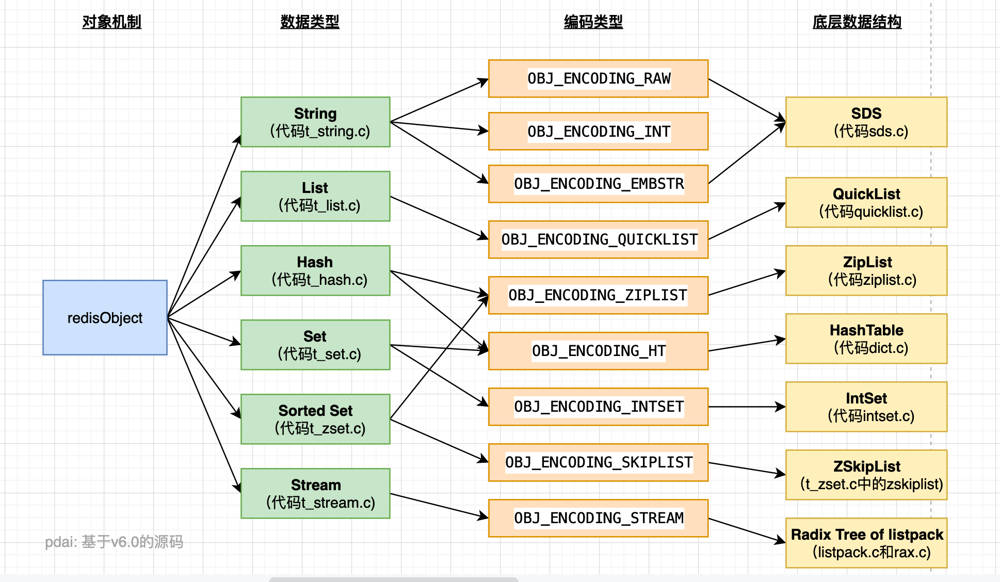
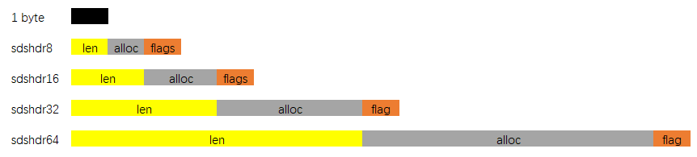

[TOC]

# Redis 底层数据结构



## 简单动态字符串 - SDS

> Redis 是用 C 语言写的，但是对于 Redis 的字符串，却不是 C 语言中的字符串（即以空字符 ’\0’ 结尾的字符数组），它是自己构建了一种名为 **简单动态字符串（simple dynamic string, SDS**）的抽象类型，并将 SDS 作为 Redis 的默认字符串表示。

### SDS 定义

> 这是一种用于存储二进制数据的一种结构，具有动态扩容的特点。其实现位于 src/sds.h 与 src/sds.c 中。

- **SDS的总体概览**如下图：


其中 `sdshdr` 是头部，`buf` 是真实存储用户数据的地方。另外注意，从命名上能看出来，这个数据结构除了能存储二进制数据，显然是用于设计作为字符串使用的，所以在 buf 中，用户数据后总跟着一个 \0。即图中 `"数据" + "\0"` 是为所谓的 buf。

- 如下是 **6.0 源码中 sds 相关的结构**：


通过上图我们可以看到，SDS 有五种不同的头部。其中 sdshdr5 实际并未使用到。所以实际上有四种不同的头部，分别如下：



其中：

- `len`：保存了 SDS 保存字符串的长度。
- `buf[]`：数组用来保存字符串的每个元素。
- `alloc`：分别以 uint8，uint16，uint32，uint64 表示整个 SDS，除过头部与末尾的 \0，剩余的字节数。
- `flags`：始终为一字节，以低三位标示着头部的类型，高5位未使用。

### 为什么使用 SDS

> **为什么不使用 C 语言字符串实现，而是使用 SDS 呢**？这样实现有什么好处？

- **常数复杂度获取字符串长度**

由于 len 属性的存在，我们获取 SDS 字符串的长度只需要读取 len 属性，时间复杂度为 O(1)。而对于 C 语言，获取字符串的长度通常是经过遍历计数来实现的，时间复杂度为 O(n)。通过 `strlen key` 命令可以获取 key 的字符串长度。

- **杜绝缓冲区溢出**

我们知道在 C 语言中使用 `strcat`  函数来进行两个字符串的拼接，一旦没有分配足够长度的内存空间，就会造成缓冲区溢出。而对于 SDS 数据类型，在进行字符修改的时候，**会首先根据记录的 len 属性检查内存空间是否满足需求**，如果不满足，会进行相应的空间扩展，然后在进行修改操作，所以不会出现缓冲区溢出。

- **减少修改字符串的内存重新分配次数**

C 语言由于不记录字符串的长度，所以如果要修改字符串，必须要重新分配内存（先释放再申请），因为如果没有重新分配，字符串长度增大时会造成内存缓冲区溢出，字符串长度减小时会造成内存泄露。

而对于 SDS，由于 `len` 属性和 `alloc` 属性的存在，对于修改字符串 SDS 实现了**空间预分配**和**惰性空间释放**两种策略：

1、`空间预分配`：对字符串进行空间扩展的时候，扩展的内存比实际需要的多，这样可以减少连续执行字符串增长操作所需的内存重分配次数。

2、`惰性空间释放`：对字符串进行缩短操作时，程序不立即使用内存重新分配来回收缩短后多余的字节，而是使用 `alloc` 属性将这些字节的数量记录下来，等待后续使用。（当然SDS也提供了相应的API，当我们有需要时，也可以手动释放这些未使用的空间。）

- **二进制安全**

因为 C 字符串以空字符作为字符串结束的标识，而对于一些二进制文件（如图片等），内容可能包括空字符串，因此 C 字符串无法正确存取；而所有 SDS 的 API 都是以处理二进制的方式来处理 `buf` 里面的元素，并且 SDS 不是以空字符串来判断是否结束，而是以 len 属性表示的长度来判断字符串是否结束。

- **兼容部分 C 字符串函数**

虽然 SDS 是二进制安全的，但是一样遵从每个字符串都是以空字符串结尾的惯例，这样可以重用 C 语言库`<string.h>` 中的一部分函数。

### 小结

redis 的字符串表示为 sds，而不是 C 字符串（以\0结尾的char*），它是 Redis 底层所使用的字符串表示，它被用在几乎所有的 Redis 模块中。可以看如下对比：


## 压缩列表 - ZipList

> ziplist 是为了提高存储效率而设计的一种特殊编码的双向链表。它可以存储字符串或者整数，存储整数时是采用整数的二进制而不是字符串形式存储。它能在 O(1) 的时间复杂度下完成 list 两端的 push 和 pop 操作。但是因为每次操作都需要重新分配 ziplist 的内存，所以实际复杂度和 ziplist 的内存使用量相关。

## 快表 - QuickList

> quicklist 这个结构是 Redis 在 3.2 版本后新加的，之前的版本是 list(即 linkedlist)，用于 String 数据类型中。

它是一种以 ziplist 为结点的双端链表结构。宏观上，quicklist 是一个链表，微观上，链表中的每个结点都是一个 ziplist。

## 字典/哈希表 - Dict/HashTable

> 本质上就是哈希表

## 整数集 - IntSet

> 整数集合（intset）是集合类型的底层实现之一，当一个集合只包含整数值元素，并且这个集合的元素数量不多时，Redis 就会使用整数集合作为集合键的底层实现。

## 跳表 - ZSkipList

> 跳跃表结构在 Redis 中的运用场景只有一个，那就是作为有序列表（Zset）的使用。跳跃表的性能可以保证在查找，删除，添加等操作的时候在对数期望时间内完成，这个性能是可以和平衡树来相比较的，而且在实现方面比平衡树要优雅，这就是跳跃表的长处。跳跃表的缺点就是需要的存储空间比较大，属于利用空间来换取时间的数据结构。

### 什么是跳跃表

对于于一个单链表来讲，即便链表中存储的数据是有序的，如果我们要想在其中查找某个数据，也只能从头到尾遍历链表。这样查找效率就会很低，时间复杂度会很高，是 O(n)。比如查找 12，需要 7 次查找。


如果我们增加如下两级索引，那么它搜索次数就变成了 3 次。


### 为什么不用平衡树或者哈希表

- **为什么不是平衡树，先看下作者的回答**

https://news.ycombinator.com/item?id=1171423

```bash
There are a few reasons：

They are not very memory intensive。It's up to you basically。Changing parameters about the probability of a node to have a given number of levels will make then less memory intensive than btrees.
A sorted set is often target of many ZRANGE or ZREVRANGE operations， that is， traversing the skip list as a linked list。With this operation the cache locality of skip lists is at least as good as with other kind of balanced trees.

They are simpler to implement， debug， and so forth。For instance thanks to the skip list simplicity I received a patch (already in Redis master) with augmented skip lists implementing ZRANK in O(log(N))。It required little changes to the code.

About the Append Only durability & speed， I don't think it is a good idea to optimize Redis at cost of more code and more complexity for a use case that IMHO should be rare for the Redis target (fsync() at every command)。Almost no one is using this feature even with ACID SQL databases， as the performance hint is big anyway.
About threads： our experience shows that Redis is mostly I/O bound。I'm using threads to serve things from Virtual Memory。The long term solution to exploit all the cores， assuming your link is so fast that you can saturate a single core， is running multiple instances of Redis (no locks， almost fully scalable linearly with number of cores)， and using the "Redis Cluster" solution that I plan to develop in the future.
```

简而言之就是实现简单且达到了类似效果。

- **skiplist 与平衡树、哈希表的比较**

skiplist 和各种平衡树（如 AVL、红黑树等）的元素是有序排列的，而哈希表不是有序的。因此，在哈希表上只能做单个 key 的查找，**不适合做范围查找**。所谓范围查找，指的是查找那些大小在指定的两个值之间的所有节点。

在做范围查找的时候，平衡树比 skiplist 操作要复杂。在平衡树上，我们找到指定范围的小值之后，还需要以中序遍历的顺序继续寻找其它不超过大值的节点。如果不对平衡树进行一定的改造，这里的中序遍历并不容易实现。而在 skiplist 上进行范围查找就非常简单，只需要在找到小值之后，对第 1 层链表进行若干步的遍历就可以实现。

平衡树的插入和删除操作可能引发子树的调整，逻辑复杂，而 skiplist 的插入和删除只需要修改相邻节点的指针，操作简单又快速。

查找单个 key，skiplist 和平衡树的时间复杂度都为 `O(log n)`，大体相当；而哈希表在保持较低的哈希值冲突概率的前提下，查找时间复杂度接近 `O(1)`，性能更高一些。所以我们平常使用的各种 Map 或 dictionary 结构，大都是基于哈希表实现的。

从算法实现难度上来比较，skiplist 比平衡树要简单得多。

## 参考文章

- https://pdai.tech/md/db/nosql-redis/db-redis-x-redis-ds.html

- https://www.cnblogs.com/neooelric/p/9621736.html

- https://www.cnblogs.com/hunternet/p/11248192.html

- https://www.jianshu.com/p/8ac45fd01548