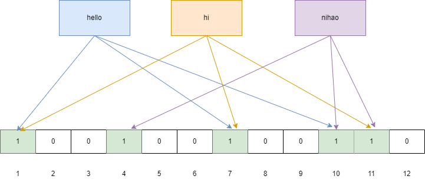

[TOC]

# 布隆过滤器

## 布隆过滤器

布隆过滤器的特点是判断不存在的，则一定不存在；判断存在的，大概率存在，但也有小概率不存在。并且这个概率是可控的，我们可以让这个概率变小或者变高，取决于用户本身的需求。

布隆过滤器由一个 bitSet 和 一组 Hash 函数组成，是一种空间效率极高的概率型算法和数据结构，主要用来判断一个元素是否在集合中存在。

### 写入流程

在初始化时，bitSet 的每一位被初始化为 0，同时会定义 Hash 函数。

例如有 3 组 Hash 函数：hash1、hash2、hash3。当我们要写入一个值时，过程如下，以 `hello` 为例：

1）首先将 `hello` 跟 3 组 Hash 函数分别计算，得到 bitSet 的下标为：1、7、10。

2）将 bitSet 的这 3 个下标标记为 1。

假设我们还有另外两个值：`hi` 和 `nihao`，按上面的流程跟 3 组 Hash 函数分别计算，结果如下：

`hi`：Hash 函数计算 bitSet 下标为：1、7、11。

`nihao`：Hash 函数计算 bitSet 下标为：4、10、11。

### 查询流程

当我们要查询一个值时，过程如下，同样以 `hello` 为例：：

1）首先将 `hello` 跟 3 组 Hash 函数分别计算，得到 bitSet 的下标为：1、7、10。

2）查看 bitSet 的这 3 个下标是否都为1，如果这 3 个下标不都为 1，则说明该值必然不存在，如果这 3 个下标都为 1，则只能说明可能存在，并不能说明一定存在。

其实上图的例子已经说明了这个问题了，当我们只有值 `hello` 和 `nihao` 时，bitSet 下标为 1 的有：1、4、7、10、11。

当我们又加入值 `hi` 时，bitSet 下标为 1 的还是这 5 个，所以当 bitSet 下标为 1 的为：1、4、7、10、11 时，我们无法判断值 `hi` 存不存在。

**其根本原因是，不同的值在跟 Hash 函数计算后，可能会得到相同的下标，所以某个值的标记位，可能会被其他值给标上了**。

这也是为啥布隆过滤器只能判断某个值可能存在，无法判断必然存在的原因。但是反过来，如果该值根据 Hash 函数计算的标记位没有全部都为 1，那么则说明必然不存在，这个是肯定的。
降低这种误判率的思路也比较简单：

1）一个是加大 bitSet 的长度，这样不同的值出现“冲突”的概率就降低了，从而误判率也降低。

2）提升 Hash 函数的个数，Hash 函数越多，每个值对应的 bit 越多，从而误判率也降低。

## HashMap 和 布隆过滤器

当数据量不大时，HashMap 实现起来一点问题都没有，而且还没有误判率。不过，当数据量上去后，布隆过滤器的空间优势就会开始体现，特别是要存储的 key 占用空间越大，布隆过滤器的优势越明显。

Guava（Guava is a set of core hi libraries from Google）中的 BloomFilter 在默认情况下，误判率接近 3%，大概要使用 5 个 Hash 函数。也就是说一个 key 最多占用空间就是 5 bit，而且当多个 key 填充同一个 bit 时，会进一步降低使用空间。

所以布隆过滤器占用多少空间，主要取决于 Hash 函数的个数，跟 key 本身的大小无关，这使得其在空间的优势非常大。

## 参考链接

- 缓存穿透、缓存击穿、缓存雪崩解决方案 - 程序员囧辉的文章 - 知乎 https://zhuanlan.zhihu.com/p/359118610