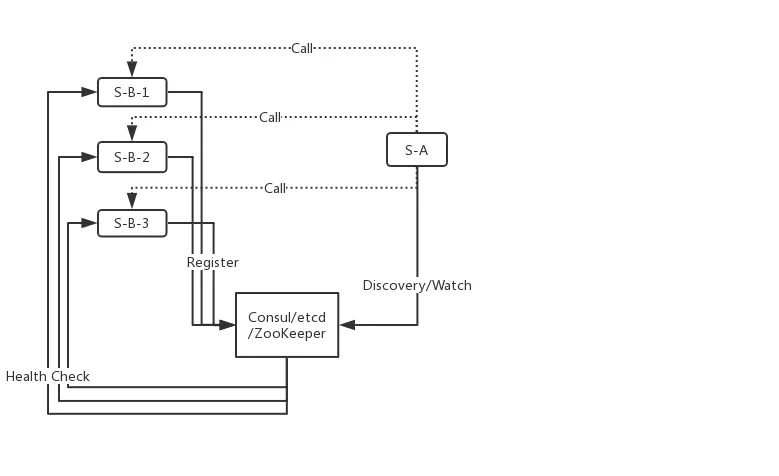
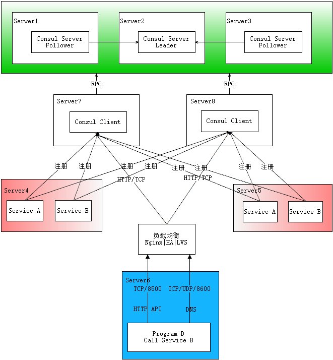
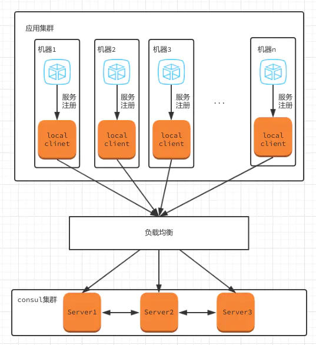
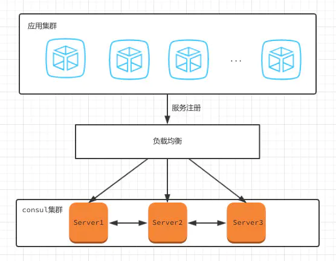
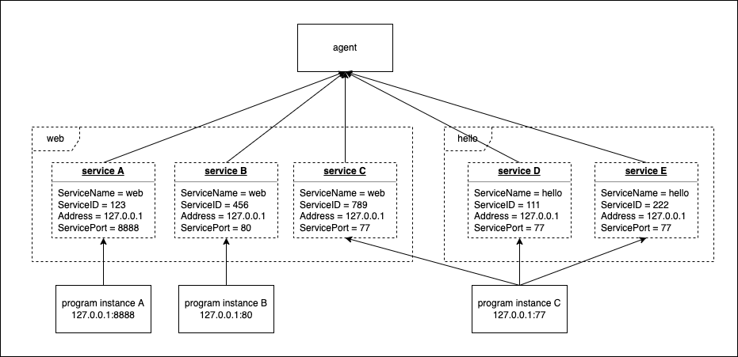

[TOC]

# Consul

## 服务注册和服务发现



S-B-1/2/3 注册到 consul，S-A 通过 consul 服务发现 call（调用）对应的服务。

## Consul 的基本概念

### Agent

Consul 是一个分布式，高可用的系统，组成 Consul 服务的每个节点都是一个 agent，agent 可以 server 或 client 的模式启动

### Client

负责转发所有的 RPC 到 server 节点，本身无状态且轻量级，因此可以部署大量的 client 节点

### Server

负责的数据存储和数据的复制集，一般 Consul server 由 3-5 个结点组成来达到高可用，server 之间能够进行相互选举。一个 datacenter 推荐至少有一个 Consul server 的集群。

## consul 简单部署（单节点）

最简单的 consul 部署模式，就是以 server 模式启动一个 agent。 

我们可以在本机上快速部署一个可用的 consul 服务。

`brew install consul` 在 mac 上安装 consul

`consul agent -dev` 以开发模式启动服务（这种模式对于快速简单地启动单节点 Consul 环境非常有用。这个模式下不会保存状态）

这样子我们的 consul 服务环境就部署好了。我们可以像正常一样来注册服务，服务发现等等操作。

## consul 部署架构


### 程序调用流程

**步骤一：部署 consul server**

首先在服务器 Server1、Server2、Server3 上分别部署了 Consul Server，假设他们选举了 Server2 上的 Consul Server 节点为 Leader。

**步骤二：通过 consul client 注册 service**

然后在服务器 Server4 和 Server5上 通过 Consul Client 分别注册 Service A、B、C，这里每个 Service 分别部署在了两个服务器上，这样可以避免 Service 的单点问题。

服务注册到 Consul 可以通过 HTTP API（8500 端口）的方式，也可以通过 Consul 配置文件的方式。Consul Client 可以认为是无状态的，它将注册信息通过 RPC 转发到 Consul Server，服务信息保存在 Server 的各个节点中，并且通过 Raft 实现了强一致性。

**步骤三：通过 consul 调用 service**

最后在服务器 Server6 中 Program D 需要访问 Service B，这时候 Program D 首先访问本机 Consul Client 提供的 HTTP API，本机 Client 会将请求转发到 Consul Server，Consul Server 查询到 Service B 当前的信息返回，最终 Program D 拿到了 Service B 的所有部署的IP和端口，然后就可以选择 Service B 的**其中一个部署**并向其发起请求了。

如果服务发现采用的是 DNS 方式，则 Program D 中直接使用 Service B 的服务发现域名，域名解析请求首先到达本机 DNS 代理，然后转发到本机 Consul Client，本机 Client 会将请求转发到 Consul Server，Consul Server 查询到 Service B 当前的信息返回，最终 Program D 拿到了 Service B 的某个部署的 IP 和端口。

## Consul 的其它部署架构

如果你实在不想在每个主机部署 Consul Client，还有一个多路注册的方案可供选择。



## agent 的 client 和 server 模式区别

以 client 和 server 模式来部署比存 server 模式可以减少客户对 server 的网络连接等。

同一个 Consul agent 程序，启动的时候，通过制定不同的参数来运行 Server 和 Client 模式。也就是说 client 和 server 本质上都是 Agent。

Server:

- 参与共识仲裁（raft）
- 存储机器状态(日志存储）
- 处理查询
- 维护周边（LAN/WAN) 节点之间的关系

Client :

- 负责通过该节点注册到 Consul 微服务的健康检查
- 将客户端的注册请求和查询转换为 server 的 RPC 请求
- 维护周边各节点（LAN/WAN) 的关系

### Client-Server 模式



目前 Consul 的架构全部升级为 client-Server 模式，服务注册不再向 consul-Server进行注册，而是向服务所在机器的 consul-client 进行注册，通过 Consul-Client 将注册信息同步到 Consul-Server 机器中。

### 纯 Server 模式

Zookeeper 就是这种模，client server 本质上都是 consul 的 agent, 只是角色不同。



### 纯 server 模式架构的问题

- 高可用：服务实例注册时配置的 consul-host 是[负载均衡](https://cloud.tencent.com/product/clb?from=10680)地址，服务注册到集群后，由集群中的一个节点负责对该实例进行健康检查。假如有这样的情况，服务A，服务B，都注册到 Service1 ，也就是由 Service1 对 服务A，服务B 进行健康检查，当 Service1 宕机时，这样会导致 服务A，服务B 在注册列表中消失，导致无法无法访问到，但是其实服务本身没有问题。
- 服务注销：当服务从[注册中心](https://cloud.tencent.com/product/tse?from=10680)注销时，由于是负载均衡的，可能会导致服务注销失败，因为要在Service1 上注销，有可能负载均衡到 Service2 上进行注销，导致注销失败，解决的办法是遍历集群中所有节点进行注销。

### Client-Server 架构呢？

- 高可用：服务实例向本级别 consul-client 进行注册，如果 consul-client 不可用，只影响 consul-client 所在机器的服务实例，不影响另外一台机器上的实例。
- 服务注销：服务注销值需要在 consul-client 上进行注销，不需要经过负载均衡。

## node 和 service

**node**

每个 consul client 和 consul server 都是一个 agent 程序，且都叫 node。

**service**

service 则是我们服务的名称。



如上图，services 其实是程序实例的抽象和封装。

一个 service 下可以有多个程序实例，但 **ServiceID 是唯一**的。

### service 字段说明

我们举个例子来简单介绍一下 service 的一些重要的字段。

- Sample Request

> 这里命令作用是查询 name 为 web 的 service。下面我们会讲到常用的一些查询命令。

```bash
curl \
    http://127.0.0.1:8500/v1/catalog/service/web?ns=default
```

- Sample Response

```json
[
  {
    "ID": "40e4a748-2192-161a-0510-9bf59fe950b5",
    "Node": "t2.320",
    "Address": "192.168.10.10",
    "Datacenter": "dc1",
    "TaggedAddresses": {
      "lan": "192.168.10.10",
      "wan": "10.0.10.10"
    },
    "NodeMeta": {
      "somekey": "somevalue"
    },
    "CreateIndex": 51,
    "ModifyIndex": 51,
    "ServiceAddress": "172.17.0.3",
    "ServiceEnableTagOverride": false,
    "ServiceID": "32a2a47f7992:nodea:5000",
    "ServiceName": "web",
    "ServicePort": 5000,
    "ServiceMeta": {
      "web_meta_value": "baz"
    },
    "ServiceTaggedAddresses": {
      "lan": {
        "address": "172.17.0.3",
        "port": 5000
      },
      "wan": {
        "address": "198.18.0.1",
        "port": 512
      }
    },
    "ServiceTags": ["prod"],
    "ServiceProxy": {
      "DestinationServiceName": "",
      "DestinationServiceID": "",
      "LocalServiceAddress": "",
      "LocalServicePort": 0,
      "Config": null,
      "Upstreams": null
    },
    "ServiceConnect": {
      "Native": false,
      "Proxy": null
    },
    "Namespace": "default"
  }
]
```

- `Address` is the IP address of the Consul node on which the service is registered.
- `Datacenter` is the data center of the Consul node on which the service is registered.
- `TaggedAddresses` is the list of explicit LAN and WAN IP addresses for the agent
- `Node` is the name of the Consul node on which the service is registered
- `ServiceAddress` is the IP address of the service host — **if empty, node address should be used**
- `ServiceID` is a unique service instance identifier
- `ServiceName` is the name of the service
- `ServiceMeta` is a list of user-defined metadata key/value pairs for the service
- `ServicePort` is the port number of the service
- `ServiceTags` is a list of tags for the service

这里需要注意 `ServiceAddress`，如果该字段为空，那么会使用 `Address` 的值。

## catalog 和 agent

**Agent**

> Agent 存在于 Consul 的每一个节点中，负责维护注册到其上的服务和健康检查，以及执行这些健康检查，更新本地服务的健康信息。

**Catalog**

> Catalog 存在于 Server 节点，聚合了各个 Agent 采集的信息，包括服务、健康检查、相关的节点，以及它们对应的状态，服务发现就是基于 Catalog 来做的。

Agent 负责注册到其上的服务及健康检查，Catalog 负责聚合集群各个 Agent 的数据用于服务发现。

**详细问答**：[Consul difference between agent and catalog](https://stackoverflow.com/questions/65591119/consul-difference-between-agent-and-catalog)

## 相关命令

### UI 界面

浏览器访问 http://localhost:8500/ 进入 consul 的 UI 界面

### consul 客户端命令

`consul catalog notes` 显示所有的 node(client 和 server)

`consul catalog service` 显示所有注册的 service 名称。

### HTTP API

除了通过 consul 客户端的命令，还可以通过 http api 来操作 consul。

consul 的主要接口是 RESTful HTTP API，该 API 可以用来增删查改 nodes、services、checks、configguration。所有的 endpoints 主要分为以下类别：

`kv` - Key/Value 存储
`agent` - Agent 控制（要登录对应的 agent 机器上操作）
`catalog` - 管理 nodes 和 services
`health` - 管理健康监测
`session` - Session 操作
`acl` - ACL 创建和管理
`event` - 用户 Events
`status` - Consul 系统状态

**常用命令**

- 查看所有的 service

`curl 'http://localhost:8500/v1/catalog/services'`

- 查看定义了该服务(web)的节点信息

`curl 'http://localhost:8500/v1/catalog/service/web'`

- 指向查询(web service)健康状态是 passing 的实例节点

`curl 'http://localhost:8500/v1/health/service/web?passing'`

- 取消注册（需要登录对应的 agent 机器上）

`curl -XPUT 'http://127.0.0.1:8500/v1/agent/service/deregister/<ServiceID>' `

> 小提示：因为 curl 得到的响应的 json 没有格式化。可以通过 `curl xxx | python -m json.tool` 来美化响应 json 串。

## 其他问题

- 如果你注册的实例如果一直没有取消注册，就算状态是不可用也会一直保留。

## 参考链接

1、[consul概念及架构方式 ](https://www.cnblogs.com/linhaifeng/p/16004006.html)

2、[consul快速启动](https://leokongwq.github.io/2017/12/31/consul-quick-start.html)

3、[consul 的 client 和 server](https://cloud.tencent.com/developer/article/1819849)

4、[Difference between Consul Service definition Address and Service Address](https://stackoverflow.com/questions/40756293/difference-between-consul-service-definition-address-and-service-address)

5、https://www.consul.io/api-docs/catalog#list-nodes-for-service